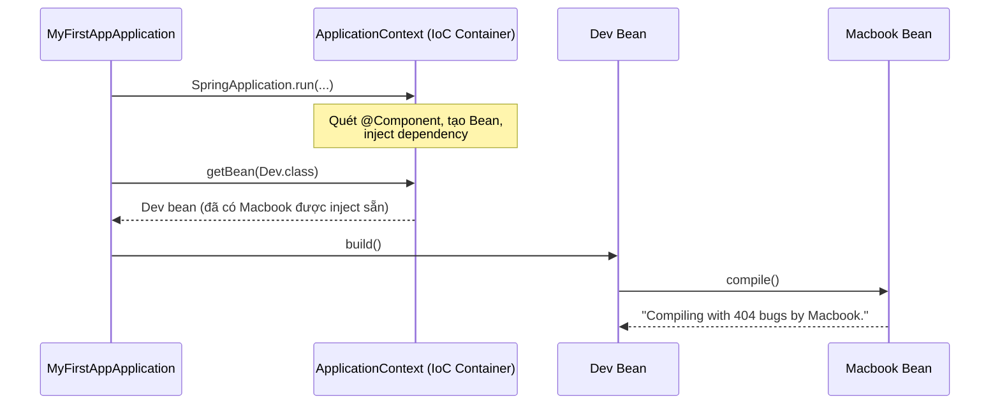
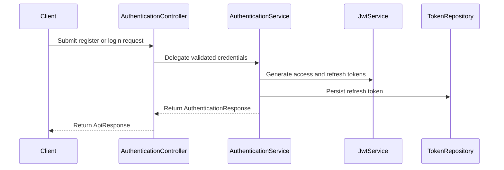

# Java Spring Boot Fundamentals

Repo học và luyện tập **Java Spring Framework + Spring Boot** theo kiểu mono-repo — mỗi sub-project tập trung vào một chủ đề cụ thể, được xây dựng từng bước theo tiến độ học thực tế.

---

## Tech Stack

| Thành phần | Version |
|---|---|
| Java | 21 (LTS) |
| Spring Boot | 4.0.7 |
| Build tool | Maven (Maven Wrapper — không cần cài global) |
| IDE | VS Code + Extension Pack for Java |

---

## Cấu Trúc Mono-repo

```
java-spring-boot-fundamentals/
├── docs/
│   └── notes-raw.txt                  # Ghi chú học tập thô
├── projects/
│   ├── 01-rest-controller/            # Spring MVC — @RestController, HTTP mappings
│   ├── 02-ioc-and-di/                 # Spring Core — IoC Container, Dependency Injection
│   ├── 03-crud-rest-api/              # Spring MVC + JPA — CRUD REST API, layered architecture
│   ├── 04-rest-api-jpa-mysql/         # Spring Data JPA + MySQL
│   ├── 05-mvc-thymeleaf/              # Spring MVC + Thymeleaf template engine
│   └── 06-spring-security-jwt/        # Spring Security — JWT Authentication & Authorization
└── README.md
```

---

## Sub-projects

### 01 · rest-controller — Spring MVC & REST Controller

**Mục tiêu:** Hiểu cách Spring Boot xử lý HTTP request, sự khác biệt giữa `@Controller` và `@RestController`, và các HTTP mapping annotation.

**Concepts đã học:**
- `@RestController` vs `@Controller` — khi nào dùng cái nào
- `@RequestMapping` — map URL vào method
- `@GetMapping`, `@PostMapping`, v.v. — shortcut cho từng HTTP method
- `SpringApplication.run()` — vai trò khởi động toàn bộ Spring context

**Chạy:**
```bash
cd projects/01-rest-controller
./mvnw spring-boot:run
# Truy cập: http://localhost:8081
```

---

### 02 · ioc-and-di — Spring Core: IoC & Dependency Injection

**Mục tiêu:** Nắm vững cơ chế IoC Container, 3 loại Dependency Injection, Loose Coupling qua Interface, và cách Spring resolve Bean khi có conflict.

**Concepts đã học:**

#### IoC — Inversion of Control
> *"Đảo ngược quyền kiểm soát trong việc tạo và quản lý vòng đời của Object."*

Thay vì bạn tự `new Object()`, bạn nhường quyền đó cho Spring. Spring tạo, quản lý và inject dependency giữa các Bean.

```java
// Không IoC — bạn tự kiểm soát
Dev dev = new Dev();

// Có IoC — Spring kiểm soát
Dev dev = context.getBean(Dev.class);
```

#### DI — 3 loại Dependency Injection

```java
// 1. Field Injection — viết ngắn nhưng tránh dùng trong production
@Autowired
private Computer comp;

// 2. Setter Injection — dùng khi dependency là optional
@Autowired
public void setComputer(Computer comp) { this.comp = comp; }

// 3. Constructor Injection — KHUYẾN NGHỊ
public Dev(Computer comp) { this.comp = comp; }
```

| | Field | Setter | Constructor |
|---|---|---|---|
| `@Autowired` cần thiết | Bắt buộc | Bắt buộc | Không cần |
| Dependency sẵn sàng | Sau khi tạo object | Sau khi tạo object | Ngay khi tạo object |
| Có thể `null`? | Có | Có | Không — compile bắt lỗi |
| Dễ test? | Khó | Trung bình | Dễ nhất |

#### Loose Coupling với Interface

```
Tight:   Dev → Macbook          (gắn chặt, khó thay thế)
Loose:   Dev → Computer ← Macbook / Desktop   (dễ swap)
```

```java
public interface Computer { void compile(); }

@Component public class Macbook implements Computer { ... }
@Component public class Desktop implements Computer { ... }

@Component
public class Dev {
    private final Computer comp;  // không biết cụ thể là Macbook hay Desktop
    public Dev(Computer comp) { this.comp = comp; }
}
```

#### Resolve Bean conflict — `@Primary` và `@Qualifier`

Khi có nhiều Bean cùng kiểu, Spring không tự biết chọn cái nào:

```java
// Cách 1: @Primary — đánh dấu Bean mặc định được ưu tiên
@Component @Primary
public class Desktop implements Computer { ... }

// Cách 2: @Qualifier — chỉ đích danh Bean muốn dùng (ưu tiên cao hơn @Primary)
@Autowired
@Qualifier("macbook")
private Computer comp;
```

**Thứ tự ưu tiên:** `@Qualifier` > `@Primary` > tên biến khớp tên Bean

#### Luồng hoạt động IoC



**Chạy:**
```bash
cd projects/02-ioc-and-di
./mvnw spring-boot:run
```

---

### 03 · crud-rest-api — Spring MVC + Spring Data JPA

**Mục tiêu:** Xây dựng REST API CRUD hoàn chỉnh với layered architecture, Spring Data JPA và H2 in-memory database.

**Concepts đã học:**
- Layered architecture: `@RestController` → `@Service` → `@Repository`
- Spring Data JPA — `JpaRepository` tự generate các CRUD method
- `@Entity`, `@Id`, `@GeneratedValue` — JPA entity mapping
- H2 in-memory database — dev/learning không cần cài DB
- `@RequestBody`, `@PathVariable` — extract data từ HTTP request
- Lombok `@Data`, `@AllArgsConstructor`, `@NoArgsConstructor` — giảm boilerplate

**Endpoints:**

| Method | URL | Mô tả |
|---|---|---|
| GET | `/products` | Lấy danh sách tất cả product |
| GET | `/products/{id}` | Lấy product theo ID |
| POST | `/products` | Tạo product mới |
| PUT | `/products` | Cập nhật product |
| DELETE | `/products/{id}` | Xóa product theo ID |

**Chạy:**
```bash
cd projects/03-crud-rest-api
./mvnw spring-boot:run
# API:       http://localhost:8081/products
# H2 Console: http://localhost:8081/h2-console  (JDBC URL: jdbc:h2:mem:maaitlunghau, User: sa)
```

---

### 06 · spring-security-jwt — Spring Security + JWT Authentication

**Mục tiêu:** Xây dựng hệ thống xác thực và phân quyền hoàn chỉnh với Spring Security, JWT stateless authentication, refresh token pattern và Redis-backed token blacklist.

**Concepts đã học:**
- `UserDetails` / `UserDetailsService` — tích hợp Spring Security với User entity
- `UsernamePasswordAuthenticationToken` — xác thực credentials qua `AuthenticationManager`
- `OncePerRequestFilter` — intercept request, validate JWT trước khi vào controller
- Stateless session (`STATELESS`) — không dùng HTTP Session, mỗi request tự mang token
- Access token (15 phút) + Refresh token (7 ngày) — pattern phổ biến trong production
- **Pattern 2 — Redis JTI blacklist:** revoke access token ngay lập tức sau khi logout
- `@RestControllerAdvice` — xử lý exception tập trung, trả về JSON nhất quán
- Custom `AuthenticationEntryPoint` (401) và `AccessDeniedHandler` (403)
- `ApiResponse<T>` wrapper — chuẩn hóa toàn bộ response format
- Constructor injection, Java Records cho DTO, `@Transactional(readOnly = true)`

**Luồng xác thực:**



**Endpoints:**

| Method | URL | Auth | Mô tả |
|---|---|---|---|
| POST | `/api/auth/register` | Public | Đăng ký tài khoản mới |
| POST | `/api/auth/login` | Public | Đăng nhập, nhận token |
| POST | `/api/auth/refresh-token` | Refresh token | Lấy access token mới |
| POST | `/api/auth/logout` | Access token | Đăng xuất, revoke token |
| GET | `/admin/greeting` | ADMIN role | Endpoint bảo vệ theo role |

**Response format chuẩn:**
```json
{
  "status": 200,
  "message": "Login successful",
  "data": {
    "accessToken": "eyJ...",
    "refreshToken": "eyJ..."
  }
}
```

**Chạy:**
```bash
cd projects/06-spring-security-jwt
docker compose up -d        # Start MySQL + Redis + phpMyAdmin
./mvnw spring-boot:run      # App chạy tại http://localhost:8081
```

| Service | URL |
|---|---|
| API | `http://localhost:8081` |
| phpMyAdmin | `http://localhost:8080` (root / 112233) |
| Redis | `localhost:6379` |

---

## Concepts Tổng Quan

### JVM — Java Virtual Machine

```
┌─────────────────────────────────────┐
│  Spring Application (code của bạn)  │
│  ┌─────────────────────────────┐    │
│  │       IoC Container         │    │  ← tầng ứng dụng (Spring quản lý)
│  │   (quản lý bean, DI...)     │    │
│  └─────────────────────────────┘    │
└─────────────────────────────────────┘
              chạy TRÊN
┌─────────────────────────────────────┐
│              JVM                    │  ← tầng runtime
│  (Heap, Stack, Garbage Collector,   │
│   Class Loader, Bytecode Execution) │
└─────────────────────────────────────┘
              chạy TRÊN
┌─────────────────────────────────────┐
│      Hệ điều hành                   │
│      (Windows / Linux / macOS)      │
└─────────────────────────────────────┘
```

### CoC — Convention over Configuration

Spring Boot áp dụng nguyên tắc "quy ước hơn cấu hình" — không config thì dùng mặc định thông minh, chỉ cần config khi muốn override. Không cần XML như Spring thuần.

---

### Spring Boot vs Spring thuần (Spring Framework Core)

> Spring Boot **KHÔNG PHẢI** một framework khác, **KHÔNG** thay thế Spring.
>
> `Spring Boot = Spring Framework + Auto-configuration + Embedded Server + Starter Dependencies`
>
> IoC Container, DI, AOP, ApplicationContext bên trong vẫn y hệt Spring thuần — Spring Boot chỉ là lớp "đóng gói thông minh" giúp giảm config thủ công.

| | Spring thuần | Spring Boot |
|---|---|---|
| Config | XML/Java Config viết tay, khai báo tường minh mọi thứ | Auto-configuration, convention-based (CoC) |
| Server | External — tự cài Tomcat/Jetty riêng | Embedded — đóng gói sẵn trong jar |
| Package output | `.war` — deploy vào server có sẵn | `.jar` — chạy độc lập: `java -jar app.jar` |
| Dependency version | Tự quản lý, dễ conflict | Starter + BOM quản lý version sẵn |
| Boilerplate | Nhiều | Rất ít |
| Production tooling | Tự tích hợp riêng | Có sẵn Spring Boot Actuator |
| Độ linh hoạt | Cao — kiểm soát từng chi tiết | Thấp hơn — phải hiểu auto-config để override đúng |

**Ghi nhớ quan trọng:**
- Spring Boot không "thông minh" tự nhiên — nó chạy dựa trên `@ConditionalOnClass`, `@ConditionalOnMissingBean`... để quyết định có auto-config bean nào hay không
- Khi gặp lỗi lạ (bean conflict, auto-config sai thứ tự) → phải hiểu Spring Core (IoC, Bean lifecycle, ApplicationContext) mới debug được tận gốc, không chỉ "thêm annotation là chạy"

---

## Chạy Bất Kỳ Sub-project

```bash
cd projects/[tên-sub-project]

./mvnw spring-boot:run          # Chạy app
./mvnw test                     # Chạy tất cả tests
./mvnw clean package            # Build JAR
./mvnw clean package -DskipTests  # Build, bỏ qua tests
```

---

## Git Conventions

Branch theo chủ đề: `feature/rest-controller`, `feature/ioc-and-di`...

Commit message theo [Conventional Commits](https://www.conventionalcommits.org/) — được enforce bởi Husky `commit-msg` hook:

```
feat(crud-rest-api): add delete product endpoint
chore(ioc-and-di): configure qualifier for macbook bean
docs: update readme with new project structure
```

---

## Roadmap

- [x] Spring MVC — REST Controller cơ bản (`01-rest-controller`)
- [x] Spring Core — IoC Container, DI, Bean lifecycle, Loose Coupling (`02-ioc-and-di`)
- [x] Spring MVC + JPA — CRUD REST API, layered architecture (`03-crud-rest-api`)
- [x] Spring Data JPA + MySQL (`04-rest-api-jpa-mysql`)
- [x] Spring MVC + Thymeleaf (`05-mvc-thymeleaf`)
- [x] Spring Security — JWT Authentication, Refresh Token, Redis blacklist (`06-spring-security-jwt`)
- [ ] Spring Data JPA — Relationships, JPQL, custom queries, pagination
- [ ] Spring Boot Testing — JUnit 5, Mockito, `@SpringBootTest`
