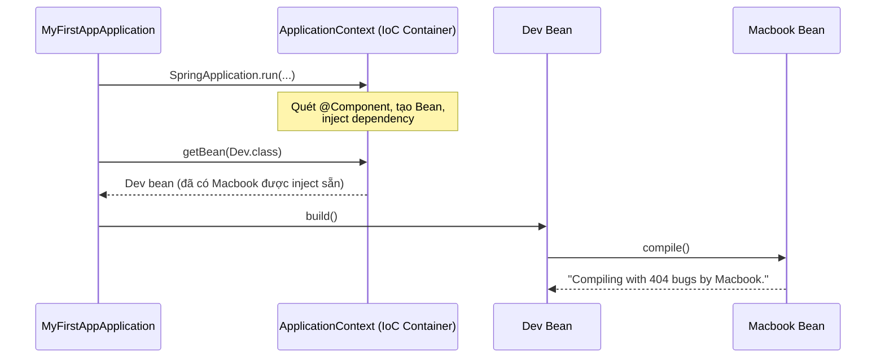
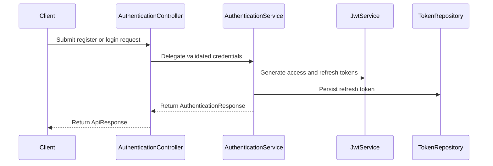
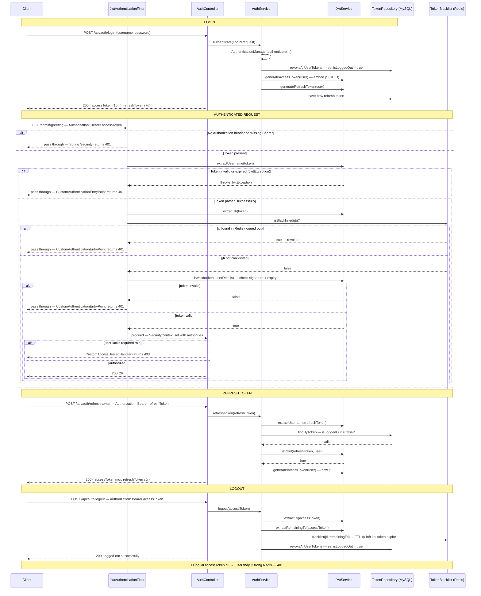
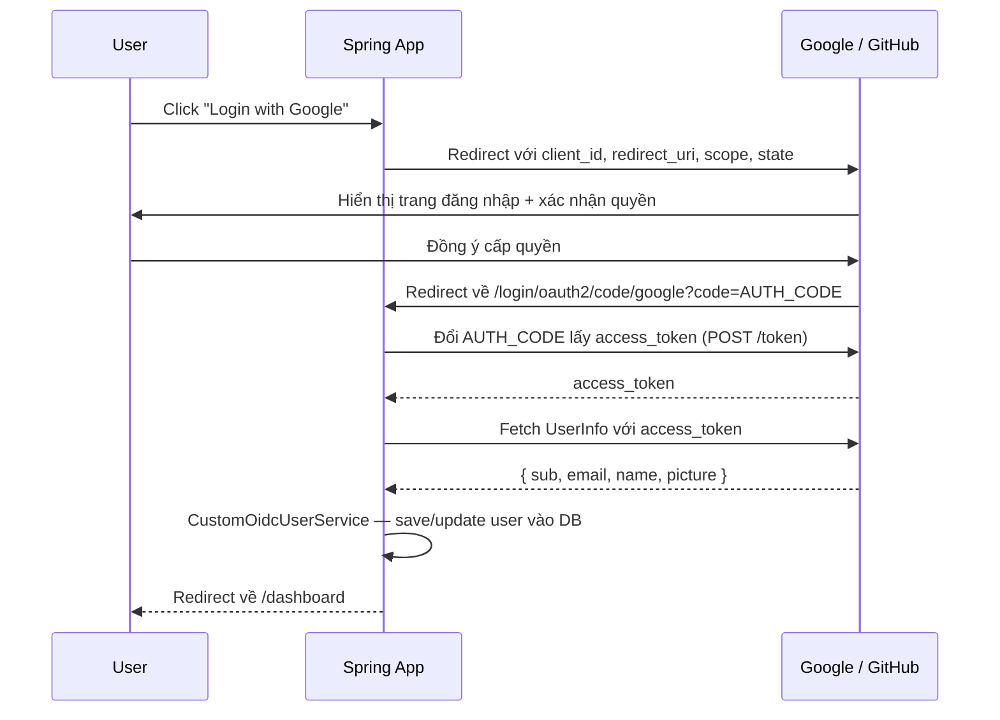
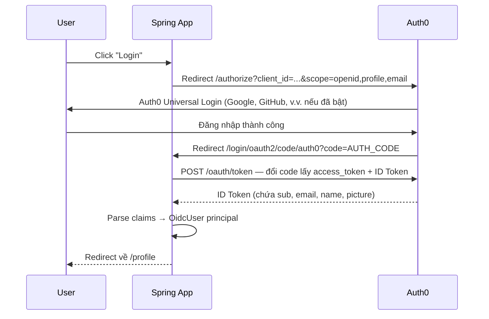
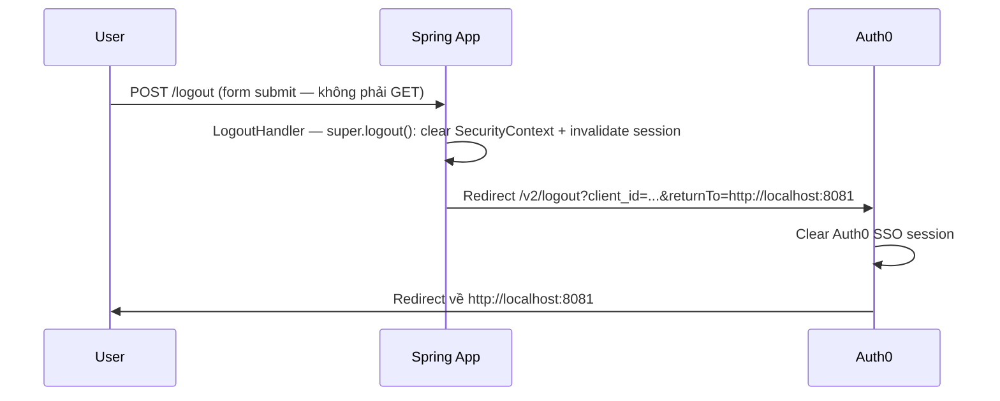

# Java Spring Boot Fundamentals

Repo học và luyện tập **Java Spring Framework + Spring Boot** theo kiểu mono-repo — mỗi sub-project tập trung vào một chủ đề cụ thể, được xây dựng từng bước theo tiến độ học thực tế.

---

## Tech Stack

| Thành phần | Version |
|---|---|
| Java | 21 (LTS) |
| Spring Boot | 4.0.7 |
| Build tool | Maven (Maven Wrapper — không cần cài global) |
| IDE | VS Code + Extension Pack for Java |

---

## Cấu Trúc Mono-repo

```
java-spring-boot-fundamentals/
├── docs/
│   └── notes-raw.txt                  # Ghi chú học tập thô
├── projects/
│   ├── 01-rest-controller/            # Spring MVC — @RestController, HTTP mappings
│   ├── 02-ioc-and-di/                 # Spring Core — IoC Container, Dependency Injection
│   ├── 03-crud-rest-api/              # Spring MVC + JPA — CRUD REST API, layered architecture
│   ├── 04-rest-api-jpa-mysql/         # Spring Data JPA + MySQL
│   ├── 05-mvc-thymeleaf/              # Spring MVC + Thymeleaf template engine
│   ├── 06-spring-security-jwt/        # Spring Security — JWT Authentication & Authorization
│   ├── 07-spring-security-oauth2-mvc/ # Spring Security — OAuth2 Social Login (Google, GitHub)
│   └── 08-spring-security-auth0-mvc/  # Spring Security — Auth0 OIDC Login (Identity Provider)
└── README.md
```

---

## Sub-projects

### 01 · rest-controller — Spring MVC & REST Controller

**Mục tiêu:** Hiểu cách Spring Boot xử lý HTTP request, sự khác biệt giữa `@Controller` và `@RestController`, và các HTTP mapping annotation.

**Concepts đã học:**
- `@RestController` vs `@Controller` — khi nào dùng cái nào
- `@RequestMapping` — map URL vào method
- `@GetMapping`, `@PostMapping`, v.v. — shortcut cho từng HTTP method
- `SpringApplication.run()` — vai trò khởi động toàn bộ Spring context

**Chạy:**
```bash
cd projects/01-rest-controller
./mvnw spring-boot:run
# Truy cập: http://localhost:8081
```

> Chi tiết từng bước implement: [`docs/01-rest-controller.md`](docs/01-rest-controller.md)

---

### 02 · ioc-and-di — Spring Core: IoC & Dependency Injection

**Mục tiêu:** Nắm vững cơ chế IoC Container, 3 loại Dependency Injection, Loose Coupling qua Interface, và cách Spring resolve Bean khi có conflict.

**Concepts đã học:**

#### IoC — Inversion of Control
> *"Đảo ngược quyền kiểm soát trong việc tạo và quản lý vòng đời của Object."*

Thay vì bạn tự `new Object()`, bạn nhường quyền đó cho Spring. Spring tạo, quản lý và inject dependency giữa các Bean.

```java
// Không IoC — bạn tự kiểm soát
Dev dev = new Dev();

// Có IoC — Spring kiểm soát
Dev dev = context.getBean(Dev.class);
```

#### DI — 3 loại Dependency Injection

```java
// 1. Field Injection — viết ngắn nhưng tránh dùng trong production
@Autowired
private Computer comp;

// 2. Setter Injection — dùng khi dependency là optional
@Autowired
public void setComputer(Computer comp) { this.comp = comp; }

// 3. Constructor Injection — KHUYẾN NGHỊ
public Dev(Computer comp) { this.comp = comp; }
```

| | Field | Setter | Constructor |
|---|---|---|---|
| `@Autowired` cần thiết | Bắt buộc | Bắt buộc | Không cần |
| Dependency sẵn sàng | Sau khi tạo object | Sau khi tạo object | Ngay khi tạo object |
| Có thể `null`? | Có | Có | Không — compile bắt lỗi |
| Dễ test? | Khó | Trung bình | Dễ nhất |

#### Loose Coupling với Interface

```
Tight:   Dev → Macbook          (gắn chặt, khó thay thế)
Loose:   Dev → Computer ← Macbook / Desktop   (dễ swap)
```

```java
public interface Computer { void compile(); }

@Component public class Macbook implements Computer { ... }
@Component public class Desktop implements Computer { ... }

@Component
public class Dev {
    private final Computer comp;  // không biết cụ thể là Macbook hay Desktop
    public Dev(Computer comp) { this.comp = comp; }
}
```

#### Resolve Bean conflict — `@Primary` và `@Qualifier`

Khi có nhiều Bean cùng kiểu, Spring không tự biết chọn cái nào:

```java
// Cách 1: @Primary — đánh dấu Bean mặc định được ưu tiên
@Component @Primary
public class Desktop implements Computer { ... }

// Cách 2: @Qualifier — chỉ đích danh Bean muốn dùng (ưu tiên cao hơn @Primary)
@Autowired
@Qualifier("macbook")
private Computer comp;
```

**Thứ tự ưu tiên:** `@Qualifier` > `@Primary` > tên biến khớp tên Bean

#### Luồng hoạt động IoC



**Chạy:**
```bash
cd projects/02-ioc-and-di
./mvnw spring-boot:run
```

> Chi tiết từng bước implement: [`docs/02-ioc-and-di.md`](docs/02-ioc-and-di.md)

---

### 03 · crud-rest-api — Spring MVC + Spring Data JPA

**Mục tiêu:** Xây dựng REST API CRUD hoàn chỉnh với layered architecture, Spring Data JPA và H2 in-memory database.

**Concepts đã học:**
- Layered architecture: `@RestController` → `@Service` → `@Repository`
- Spring Data JPA — `JpaRepository` tự generate các CRUD method
- `@Entity`, `@Id`, `@GeneratedValue` — JPA entity mapping
- H2 in-memory database — dev/learning không cần cài DB
- `@RequestBody`, `@PathVariable` — extract data từ HTTP request
- Lombok `@Data`, `@AllArgsConstructor`, `@NoArgsConstructor` — giảm boilerplate

**Endpoints:**

| Method | URL | Mô tả |
|---|---|---|
| GET | `/products` | Lấy danh sách tất cả product |
| GET | `/products/{id}` | Lấy product theo ID |
| POST | `/products` | Tạo product mới |
| PUT | `/products` | Cập nhật product |
| DELETE | `/products/{id}` | Xóa product theo ID |

**Chạy:**
```bash
cd projects/03-crud-rest-api
./mvnw spring-boot:run
# API:       http://localhost:8081/products
# H2 Console: http://localhost:8081/h2-console  (JDBC URL: jdbc:h2:mem:maaitlunghau, User: sa)
```

> Chi tiết từng bước implement: [`docs/03-crud-rest-api.md`](docs/03-crud-rest-api.md)

---

### 04 · rest-api-jpa-mysql — Spring Data JPA + MySQL

**Mục tiêu:** Xây dựng REST API CRUD hoàn chỉnh với Spring Data JPA kết nối MySQL thực tế, áp dụng đúng layered architecture, DTO pattern, Bean Validation và global exception handling.

**Concepts đã học:**
- Spring Data JPA + MySQL — `JpaRepository` kết nối database thật (không dùng H2)
- `@Transactional(readOnly = true)` ở class level, override `@Transactional` cho write operations
- **Hibernate dirty checking** — update managed entity trực tiếp, không cần gọi `save()` tường minh
- Java Records cho DTO — `CreateProductRequest`, `UpdateProductRequest`, `ProductResponse`
- Bean Validation — `@Valid`, `@NotBlank`, `@Min` trên Request DTO (không phải Entity)
- `@RestControllerAdvice` — `GlobalExceptionHandler` tập trung xử lý mọi exception
- `ResourceNotFoundException` → 404, `MethodArgumentNotValidException` → 400, fallback → 500
- Entity không expose ra ngoài API — tầng Service map Entity → DTO trước khi trả về

**Endpoints:**

| Method | URL | Mô tả |
|---|---|---|
| GET | `/api/products` | Lấy danh sách tất cả product |
| GET | `/api/products/{productId}` | Lấy product theo ID |
| POST | `/api/products` | Tạo product mới |
| PUT | `/api/products/{productId}` | Cập nhật product |
| DELETE | `/api/products/{productId}` | Xóa product |

**Chạy:**
```bash
cd projects/04-rest-api-jpa-mysql
# Cần MySQL đang chạy trên localhost:3306, database: rest-api-jpa-mysql
./mvnw spring-boot:run
# API: http://localhost:8081/api/products
```

> Chi tiết từng bước implement: [`docs/04-rest-api-jpa-mysql.md`](docs/04-rest-api-jpa-mysql.md)

---

### 05 · mvc-thymeleaf — Spring MVC + Thymeleaf (Server-side Rendering)

**Mục tiêu:** Hiểu sự khác biệt giữa REST API và server-side rendering — dùng `@Controller` + Thymeleaf để render HTML trực tiếp từ server thay vì trả JSON.

**Concepts đã học:**
- `@Controller` vs `@RestController` — trả về **view name** (String) thay vì JSON
- `Model` — truyền dữ liệu từ controller vào Thymeleaf template
- `@ModelAttribute` — bind form data vào DTO object tự động
- `BindingResult` — bắt lỗi validation từ `@Valid` ngay trong controller, hiển thị lại form
- Thymeleaf template syntax: `th:each`, `th:text`, `th:href`, `@{...}`, `${...}`
- `redirect:/users` sau khi create/update/delete — **PRG pattern** (Post/Redirect/Get) tránh duplicate submit
- HTML không hỗ trợ `DELETE` method → dùng `POST` form để delete
- `BCryptPasswordEncoder` — hash password trước khi lưu DB
- Duplicate check (username, email) ném `IllegalArgumentException` → hiển thị lỗi trên form

**Sự khác biệt so với REST API:**

| | REST API (project 04) | Thymeleaf (project 05) |
|---|---|---|
| Annotation | `@RestController` | `@Controller` |
| Response | `ResponseEntity<DTO>` (JSON) | `String` — tên view template |
| Form data | `@RequestBody` | `@ModelAttribute` |
| Validation error | 400 JSON | Hiển thị lại form với thông báo |
| Sau mutation | Trả 200/201/204 | `redirect:/users` (PRG) |
| Client | Mobile app, SPA | Browser (render HTML) |

**Pages:**

| Method | URL | Mô tả |
|---|---|---|
| GET | `/users` | Danh sách user |
| GET | `/users/create` | Form tạo user mới |
| POST | `/users/create` | Submit form tạo |
| GET | `/users/{id}/edit` | Form chỉnh sửa |
| POST | `/users/{id}/edit` | Submit form chỉnh sửa |
| POST | `/users/{id}/delete` | Xóa user |

**Chạy:**
```bash
cd projects/05-mvc-thymeleaf
# Cần MySQL đang chạy trên localhost:3306, database: mvc-thymeleaf
./mvnw spring-boot:run
# Web UI: http://localhost:8081/users
```

> Chi tiết từng bước implement: [`docs/05-mvc-thymeleaf.md`](docs/05-mvc-thymeleaf.md)

---

### 06 · spring-security-jwt — Spring Security + JWT Authentication

**Mục tiêu:** Xây dựng hệ thống xác thực và phân quyền hoàn chỉnh với Spring Security, JWT stateless authentication, refresh token pattern và Redis-backed token blacklist.

**Concepts đã học:**
- `UserDetails` / `UserDetailsService` — tích hợp Spring Security với User entity
- `UsernamePasswordAuthenticationToken` — xác thực credentials qua `AuthenticationManager`
- `OncePerRequestFilter` — intercept request, validate JWT trước khi vào controller
- Stateless session (`STATELESS`) — không dùng HTTP Session, mỗi request tự mang token
- Access token (15 phút) + Refresh token (7 ngày) — pattern phổ biến trong production
- **Pattern 2 — Redis JTI blacklist:** revoke access token ngay lập tức sau khi logout
- `@RestControllerAdvice` — xử lý exception tập trung, trả về JSON nhất quán
- Custom `AuthenticationEntryPoint` (401) và `AccessDeniedHandler` (403)
- `ApiResponse<T>` wrapper — chuẩn hóa toàn bộ response format
- Constructor injection, Java Records cho DTO, `@Transactional(readOnly = true)`

**Luồng xác thực:**



**Luồng chi tiết — Login / Refresh / Logout / Authenticated request:**



**Endpoints:**

| Method | URL | Auth | Mô tả |
|---|---|---|---|
| POST | `/api/auth/register` | Public | Đăng ký tài khoản mới |
| POST | `/api/auth/login` | Public | Đăng nhập, nhận token |
| POST | `/api/auth/refresh-token` | Refresh token | Lấy access token mới |
| POST | `/api/auth/logout` | Access token | Đăng xuất, revoke token |
| GET | `/admin/greeting` | ADMIN role | Endpoint bảo vệ theo role |

**Response format chuẩn:**
```json
{
  "status": 200,
  "message": "Login successful",
  "data": {
    "accessToken": "eyJ...",
    "refreshToken": "eyJ..."
  }
}
```

**Chạy:**
```bash
cd projects/06-spring-security-jwt
docker compose up -d        # Start MySQL + Redis + phpMyAdmin
./mvnw spring-boot:run      # App chạy tại http://localhost:8081
```

| Service | URL |
|---|---|
| API | `http://localhost:8081` |
| phpMyAdmin | `http://localhost:8080` (root / 112233) |
| Redis | `localhost:6379` |

> Chi tiết từng bước implement: [`docs/06-spring-security-jwt.md`](docs/06-spring-security-jwt.md)

---

### 07 · spring-security-oauth2-mvc — OAuth2 Social Login

**Mục tiêu:** Hiểu OAuth2 Authorization Code Flow thực sự hoạt động như thế nào bằng cách tích hợp Google và GitHub login vào Spring MVC + Thymeleaf — không dùng thư viện trung gian (Auth0, Okta), làm việc trực tiếp với Spring Security OAuth2 Client.

**Concepts đã học:**
- **OAuth2 Authorization Code Flow** — redirect → provider xác thực → callback → token exchange → UserInfo
- `DefaultOAuth2UserService` — xử lý OAuth2 thuần (GitHub)
- `OidcUserService` — xử lý OIDC (Google dùng OpenID Connect, mở rộng của OAuth2)
- Custom principal: `OAuth2UserPrincipal` (GitHub), `OidcUserPrincipal` (Google) — wrap `User` entity vào security principal
- `UserAware` interface — truy cập `User` entity từ controller mà không cần instanceof check phức tạp
- `SavedRequestAwareAuthenticationSuccessHandler` — redirect về URL user định vào trước khi bị chuyển sang login
- **Session fixation protection** — tạo session mới sau login, tránh session hijacking
- `maximumSessions(1)` — giới hạn mỗi user chỉ login 1 nơi cùng lúc
- **CSRF bật** — MVC app dùng session/form phải bảo vệ CSRF (khác REST API stateless)
- `application-local.properties` (gitignored) — tách credentials khỏi source code
- **Account separation by provider** — cùng email, khác provider = 2 account riêng biệt

**OAuth2 Authorization Code Flow:**



**Cấu trúc package:**
```
src/main/java/.../
├── config/
│   └── SecurityConfig.java
├── controller/
│   ├── HomeController.java
│   └── DashboardController.java
├── handler/
│   └── OAuth2LoginSuccessHandler.java
├── model/
│   ├── AuthProvider.java
│   ├── Role.java
│   └── User.java
├── repository/
│   └── UserRepository.java
├── security/
│   ├── UserAware.java
│   ├── OAuth2UserPrincipal.java
│   └── OidcUserPrincipal.java
└── service/
    ├── CustomOAuth2UserService.java
    └── CustomOidcUserService.java
```

**Providers:**

| Provider | Protocol | Service xử lý | Principal |
|---|---|---|---|
| Google | OIDC (OpenID Connect) | `CustomOidcUserService` | `OidcUserPrincipal` |
| GitHub | OAuth2 thuần | `CustomOAuth2UserService` | `OAuth2UserPrincipal` |

**Chạy:**
```bash
cd projects/07-spring-security-oauth2-mvc
mvn spring-boot:run
# Web UI: http://localhost:8081
```

> Chi tiết từng bước implement: [`docs/07-spring-security-oauth2-mvc.md`](docs/07-spring-security-oauth2-mvc.md)

---

### 08 · spring-security-auth0-mvc — Auth0 OIDC Login

**Mục tiêu:** Tích hợp Auth0 làm Identity Provider (IdP) vào Spring MVC + Thymeleaf — cách tiếp cận thực tế khi không muốn tự quản lý từng OAuth2 provider, cho phép bật Social Login (Google, GitHub, v.v.) chỉ qua Auth0 Dashboard mà không cần thêm code.

**Concepts đã học:**
- **Auth0 là Identity Provider** — tập trung quản lý user store, social connections, MFA, brute-force protection
- **OIDC over Auth0** — Auth0 luôn trả về ID Token chuẩn OIDC dù user login bằng Google hay GitHub bên trong → chỉ cần 1 cấu hình (không cần 2 service như project 07)
- `OidcUser` principal — inject bằng `@AuthenticationPrincipal OidcUser`, `.getClaims()` trả về `Map` các OIDC standard claims (`sub`, `name`, `email`, `picture`)
- **Custom `LogoutHandler`** — extend `SecurityContextLogoutHandler`, clear Spring session *và* redirect sang Auth0 `/v2/logout` để clear Auth0 SSO session (tránh auto re-login)
- **POST logout** — Spring Security yêu cầu POST cho `/logout` (CSRF), logout button phải là form `method="post"` — `<a href>` GET không trigger LogoutHandler
- **Static resource `permitAll`** — `/js/**`, `/css/**` phải permit, nếu không Spring Security save URL static file làm "saved request" và redirect về đó sau khi login
- **`application-local.properties` pattern** — credentials thật trong file gitignored, `${PLACEHOLDER}` trong file committed
- **Spring Security 7 compatibility** — `AntPathRequestMatcher` đã bị xóa → dùng `.logoutUrl()`, `UriComponentsBuilder.fromHttpUrl()` → dùng `.fromUriString()`

**OIDC Authorization Code Flow với Auth0:**



**Luồng logout đầy đủ:**



**So sánh project 07 vs 08:**

| | Project 07 (OAuth2 tự implement) | Project 08 (Auth0 IdP) |
|---|---|---|
| Provider | Google + GitHub (mỗi cái cấu hình riêng) | Auth0 (1 cấu hình duy nhất) |
| Custom service | 2 service (OidcUserService + OAuth2UserService) | Không cần — OIDC mặc định |
| Social login thêm | Phải code thêm service | Bật trong Auth0 Dashboard |
| Logout | Clear Spring session | Clear Spring + Auth0 SSO session |
| Phù hợp | Học sâu, kiểm soát toàn bộ | Production, MVP nhanh |

**Cấu trúc package:**
```
src/main/java/.../
├── config/
│   └── SecurityConfig.java
└── controller/
    ├── HomeController.java
    └── LogoutHandler.java
```

**Chạy:**
```bash
cd projects/08-spring-security-auth0-mvc
# Cần MySQL + file application-local.properties với AUTH0_CLIENT_ID và AUTH0_CLIENT_SECRET
mvn spring-boot:run
# Web UI: http://localhost:8081
```

> Chi tiết từng bước implement: [`docs/08-spring-security-auth0-mvc.md`](docs/08-spring-security-auth0-mvc.md)

---

## Concepts Tổng Quan

### JVM — Java Virtual Machine

```
┌─────────────────────────────────────┐
│  Spring Application (code của bạn)  │
│  ┌─────────────────────────────┐    │
│  │       IoC Container         │    │  ← tầng ứng dụng (Spring quản lý)
│  │   (quản lý bean, DI...)     │    │
│  └─────────────────────────────┘    │
└─────────────────────────────────────┘
              chạy TRÊN
┌─────────────────────────────────────┐
│              JVM                    │  ← tầng runtime
│  (Heap, Stack, Garbage Collector,   │
│   Class Loader, Bytecode Execution) │
└─────────────────────────────────────┘
              chạy TRÊN
┌─────────────────────────────────────┐
│      Hệ điều hành                   │
│      (Windows / Linux / macOS)      │
└─────────────────────────────────────┘
```

### CoC — Convention over Configuration

Spring Boot áp dụng nguyên tắc "quy ước hơn cấu hình" — không config thì dùng mặc định thông minh, chỉ cần config khi muốn override. Không cần XML như Spring thuần.

---

### Spring Boot vs Spring thuần (Spring Framework Core)

> Spring Boot **KHÔNG PHẢI** một framework khác, **KHÔNG** thay thế Spring.
>
> `Spring Boot = Spring Framework + Auto-configuration + Embedded Server + Starter Dependencies`
>
> IoC Container, DI, AOP, ApplicationContext bên trong vẫn y hệt Spring thuần — Spring Boot chỉ là lớp "đóng gói thông minh" giúp giảm config thủ công.

| | Spring thuần | Spring Boot |
|---|---|---|
| Config | XML/Java Config viết tay, khai báo tường minh mọi thứ | Auto-configuration, convention-based (CoC) |
| Server | External — tự cài Tomcat/Jetty riêng | Embedded — đóng gói sẵn trong jar |
| Package output | `.war` — deploy vào server có sẵn | `.jar` — chạy độc lập: `java -jar app.jar` |
| Dependency version | Tự quản lý, dễ conflict | Starter + BOM quản lý version sẵn |
| Boilerplate | Nhiều | Rất ít |
| Production tooling | Tự tích hợp riêng | Có sẵn Spring Boot Actuator |
| Độ linh hoạt | Cao — kiểm soát từng chi tiết | Thấp hơn — phải hiểu auto-config để override đúng |

**Ghi nhớ quan trọng:**
- Spring Boot không "thông minh" tự nhiên — nó chạy dựa trên `@ConditionalOnClass`, `@ConditionalOnMissingBean`... để quyết định có auto-config bean nào hay không
- Khi gặp lỗi lạ (bean conflict, auto-config sai thứ tự) → phải hiểu Spring Core (IoC, Bean lifecycle, ApplicationContext) mới debug được tận gốc, không chỉ "thêm annotation là chạy"

---

## Chạy Bất Kỳ Sub-project

```bash
cd projects/[tên-sub-project]

./mvnw spring-boot:run          # Chạy app
./mvnw test                     # Chạy tất cả tests
./mvnw clean package            # Build JAR
./mvnw clean package -DskipTests  # Build, bỏ qua tests
```

---

## Git Conventions

Branch theo chủ đề: `feature/rest-controller`, `feature/ioc-and-di`...

Commit message theo [Conventional Commits](https://www.conventionalcommits.org/) — được enforce bởi Husky `commit-msg` hook:

```
feat(crud-rest-api): add delete product endpoint
chore(ioc-and-di): configure qualifier for macbook bean
docs: update readme with new project structure
```

---

## Roadmap

- [x] Spring MVC — REST Controller cơ bản (`01-rest-controller`)
- [x] Spring Core — IoC Container, DI, Bean lifecycle, Loose Coupling (`02-ioc-and-di`)
- [x] Spring MVC + JPA — CRUD REST API, layered architecture (`03-crud-rest-api`)
- [x] Spring Data JPA + MySQL (`04-rest-api-jpa-mysql`)
- [x] Spring MVC + Thymeleaf (`05-mvc-thymeleaf`)
- [x] Spring Security — JWT Authentication, Refresh Token, Redis blacklist (`06-spring-security-jwt`)
- [x] Spring Security — OAuth2 Social Login, Google + GitHub (`07-spring-security-oauth2-mvc`)
- [x] Spring Security — Auth0 OIDC Login, custom LogoutHandler (`08-spring-security-auth0-mvc`)
- [ ] Spring Data JPA — Relationships, JPQL, custom queries, pagination
- [ ] Spring Boot Testing — JUnit 5, Mockito, `@SpringBootTest`
