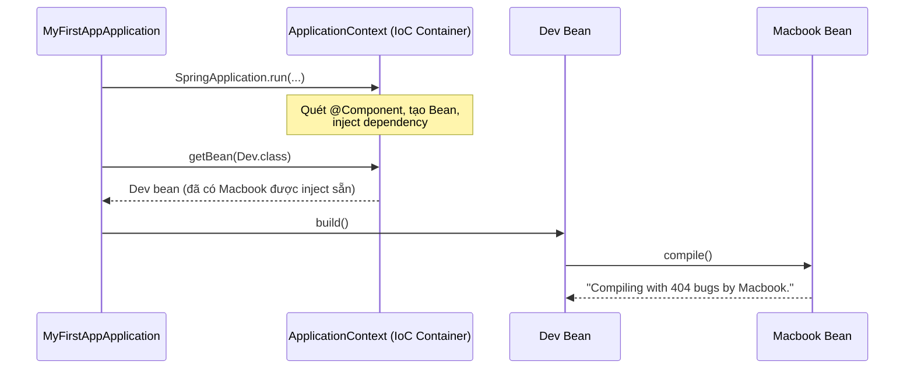

# Java Spring Boot Fundamentals

Repo học và luyện tập **Java Spring Framework + Spring Boot** theo kiểu mono-repo — mỗi sub-project tập trung vào một chủ đề cụ thể, được xây dựng từng bước theo tiến độ học thực tế.

---

## Tech Stack

| Thành phần | Version |
|---|---|
| Java | 21 (LTS) |
| Spring Boot | 4.0.7 |
| Build tool | Maven (Maven Wrapper — không cần cài global) |
| IDE | VS Code + Extension Pack for Java |

---

## Cấu Trúc Mono-repo

```
java-spring-boot-fundamentals/
├── DemoApp/          # Spring MVC — REST Controller cơ bản
├── myFirstApp/       # Spring Core — IoC, DI, Bean lifecycle
└── ...               # Sub-project mới thêm theo tiến độ
```

---

## Sub-projects

### 01 · DemoApp — Spring MVC & REST Controller

**Mục tiêu:** Hiểu cách Spring Boot xử lý HTTP request, sự khác biệt giữa `@Controller` và `@RestController`, và các HTTP mapping annotation.

**Concepts đã học:**
- `@RestController` vs `@Controller` — khi nào dùng cái nào
- `@RequestMapping` — map URL vào method
- `@GetMapping`, `@PostMapping`, v.v. — shortcut cho từng HTTP method
- `SpringApplication.run()` — vai trò khởi động toàn bộ Spring context

**Chạy:**
```bash
cd DemoApp
./mvnw spring-boot:run
# Truy cập: http://localhost:8081
```

---

### 02 · myFirstApp — Spring Core: IoC & Dependency Injection

**Mục tiêu:** Nắm vững cơ chế IoC Container, 3 loại Dependency Injection, Loose Coupling qua Interface, và cách Spring resolve Bean khi có conflict.

**Concepts đã học:**

#### IoC — Inversion of Control
> *"Đảo ngược quyền kiểm soát trong việc tạo và quản lý vòng đời của Object."*

Thay vì bạn tự `new Object()`, bạn nhường quyền đó cho Spring. Spring tạo, quản lý và inject dependency giữa các Bean.

```java
// Không IoC — bạn tự kiểm soát
Dev dev = new Dev();

// Có IoC — Spring kiểm soát
Dev dev = context.getBean(Dev.class);
```

#### DI — 3 loại Dependency Injection

```java
// 1. Field Injection — viết ngắn nhưng tránh dùng trong production
@Autowired
private Computer comp;

// 2. Setter Injection — dùng khi dependency là optional
@Autowired
public void setComputer(Computer comp) { this.comp = comp; }

// 3. Constructor Injection — KHUYẾN NGHỊ
public Dev(Computer comp) { this.comp = comp; }
```

| | Field | Setter | Constructor |
|---|---|---|---|
| `@Autowired` cần thiết | Bắt buộc | Bắt buộc | Không cần |
| Dependency sẵn sàng | Sau khi tạo object | Sau khi tạo object | Ngay khi tạo object |
| Có thể `null`? | Có | Có | Không — compile bắt lỗi |
| Dễ test? | Khó | Trung bình | Dễ nhất |

#### Loose Coupling với Interface

```
Tight:   Dev → Macbook          (gắn chặt, khó thay thế)
Loose:   Dev → Computer ← Macbook / Desktop   (dễ swap)
```

```java
public interface Computer { void compile(); }

@Component public class Macbook implements Computer { ... }
@Component public class Desktop implements Computer { ... }

@Component
public class Dev {
    private final Computer comp;  // không biết cụ thể là Macbook hay Desktop
    public Dev(Computer comp) { this.comp = comp; }
}
```

#### Resolve Bean conflict — `@Primary` và `@Qualifier`

Khi có nhiều Bean cùng kiểu, Spring không tự biết chọn cái nào:

```java
// Cách 1: @Primary — đánh dấu Bean mặc định được ưu tiên
@Component @Primary
public class Desktop implements Computer { ... }

// Cách 2: @Qualifier — chỉ đích danh Bean muốn dùng (ưu tiên cao hơn @Primary)
@Autowired
@Qualifier("macbook")
private Computer comp;
```

**Thứ tự ưu tiên:** `@Qualifier` > `@Primary` > tên biến khớp tên Bean

#### Luồng hoạt động IoC



**Chạy:**
```bash
cd myFirstApp
./mvnw spring-boot:run
```

---

## Concepts Tổng Quan

### JVM — Java Virtual Machine

```
┌─────────────────────────────────────┐
│  Spring Application (code của bạn)  │
│  ┌─────────────────────────────┐    │
│  │       IoC Container         │    │  ← tầng ứng dụng (Spring quản lý)
│  │   (quản lý bean, DI...)     │    │
│  └─────────────────────────────┘    │
└─────────────────────────────────────┘
              chạy TRÊN
┌─────────────────────────────────────┐
│              JVM                    │  ← tầng runtime
│  (Heap, Stack, Garbage Collector,   │
│   Class Loader, Bytecode Execution) │
└─────────────────────────────────────┘
              chạy TRÊN
┌─────────────────────────────────────┐
│      Hệ điều hành                   │
│      (Windows / Linux / macOS)      │
└─────────────────────────────────────┘
```

### CoC — Convention over Configuration

Spring Boot áp dụng nguyên tắc "quy ước hơn cấu hình" — không config thì dùng mặc định thông minh, chỉ cần config khi muốn override. Không cần XML như Spring thuần.

---

## Chạy Bất Kỳ Sub-project

```bash
cd [tên-sub-project]

./mvnw spring-boot:run          # Chạy app
./mvnw test                     # Chạy tất cả tests
./mvnw clean package            # Build JAR
./mvnw clean package -DskipTests  # Build, bỏ qua tests
```

---

## Git Conventions

Branch theo chủ đề: `feature/my-first-app`, `feature/spring-data-jpa`...

Commit message theo [Conventional Commits](https://www.conventionalcommits.org/) — được enforce bởi Husky `commit-msg` hook:

```
feat(myfirstapp): add Dev bean and demo ioc with getbean
refactor(myfirstapp): introduce Computer interface for loose coupling
docs: expand notes on IoC and DI concepts
```

---

## Roadmap

- [x] Spring MVC — REST Controller cơ bản
- [x] Spring Core — IoC Container, DI, Bean lifecycle, Loose Coupling
- [ ] Spring Data JPA — Repository pattern, Entity mapping, JPQL
- [ ] Spring Security — Authentication, Authorization, JWT
- [ ] Spring Boot Testing — JUnit 5, Mockito, `@SpringBootTest`
