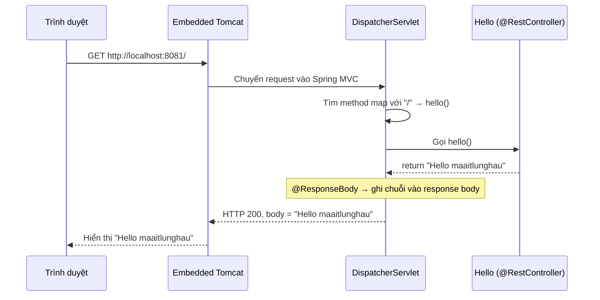

# 01 — Spring MVC & REST Controller

Hướng dẫn từng bước tạo một ứng dụng Spring Boot đầu tiên: nhận HTTP request và trả về dữ liệu trực tiếp qua `@RestController`. Đây là "Hello World" của Spring Web — bước nền tảng trước khi học mọi thứ khác.

> Đọc doc này khi bạn quên cách khởi tạo một project Spring Boot mới và cách một request đi từ trình duyệt vào tới method Java. Làm theo đúng thứ tự từng bước là chạy được.

---

## Mục tiêu

- Khởi tạo một project Spring Boot mới từ số 0 (qua [start.spring.io](https://start.spring.io))
- Hiểu `@SpringBootApplication` và `SpringApplication.run()` làm gì khi app khởi động
- Phân biệt `@Controller` và `@RestController` — khi nào dùng cái nào
- Map một URL vào một method Java bằng `@RequestMapping` và các shortcut (`@GetMapping`, ...)
- Chạy app, mở trình duyệt và thấy kết quả trả về

---

## Tech Stack

| Thành phần | Lựa chọn |
|---|---|
| Java | 21 (LTS) |
| Spring Boot | 4.0.7 |
| Web starter | `spring-boot-starter-webmvc` (Spring MVC + embedded Tomcat) |
| Build tool | Maven (Maven Wrapper — không cần cài Maven global) |
| Server | Embedded Tomcat (đóng gói sẵn, không cần cài riêng) |

> **Lưu ý về tên starter:** Từ Spring Boot 4.x, starter web servlet đổi tên thành `spring-boot-starter-webmvc` (Boot 3.x tên là `spring-boot-starter-web`). Trên trang start.spring.io bạn vẫn chọn dependency **"Spring Web"** như bình thường — Boot 4 sẽ tự thêm đúng artifact `spring-boot-starter-webmvc`.

---

## Kiến thức nền — hiểu trước khi code

### 1. `@SpringBootApplication` là gì?

Là một annotation gộp 3 annotation lại làm một, đặt trên class `main`:

| Annotation con | Nhiệm vụ |
|---|---|
| `@Configuration` | Đánh dấu class là nguồn định nghĩa Bean (cấu hình) |
| `@EnableAutoConfiguration` | Bật **auto-configuration** — Spring Boot tự cấu hình dựa trên các thư viện có trong classpath (thấy `spring-boot-starter-webmvc` → tự dựng Tomcat, DispatcherServlet, Jackson...) |
| `@ComponentScan` | Quét các class trong package hiện tại + sub-package để tìm `@Component`, `@Controller`, `@Service`, `@Repository`... rồi tạo Bean |

> **Quan trọng — vị trí của class `main`:** `@ComponentScan` chỉ quét từ package chứa class `@SpringBootApplication` trở xuống. Vì vậy class `main` phải nằm ở **package gốc**, các class khác (controller, service...) nằm trong **sub-package**. Nếu để controller ra ngoài package gốc, Spring sẽ không "nhìn thấy" nó → request trả về 404.

### 2. `SpringApplication.run()` làm gì?

Đây là dòng khởi động toàn bộ ứng dụng. Khi chạy, nó thực hiện tuần tự:

```
1. Tạo ApplicationContext (chính là IoC Container)
2. Quét @Component/@Controller/... → tạo và quản lý các Bean
3. Chạy auto-configuration (dựng DispatcherServlet, Jackson, ...)
4. Khởi động embedded Tomcat, lắng nghe ở cổng đã cấu hình (mặc định 8080)
5. App sẵn sàng nhận HTTP request
```

### 3. `@Controller` vs `@RestController`

| | `@Controller` | `@RestController` |
|---|---|---|
| Bản chất | Annotation gốc, đánh dấu class là web controller | `@Controller` + `@ResponseBody` |
| Method trả về gì | **Tên của một View** (HTML template: Thymeleaf, JSP...) | **Dữ liệu trực tiếp** ghi vào HTTP response body (JSON, text, XML) |
| Dùng khi | Render trang HTML từ server (xem project 05) | Xây REST API trả JSON/text (project này + 03, 04) |

`@ResponseBody` là điểm mấu chốt: nó bảo Spring *"đừng coi chuỗi trả về là tên view, hãy ghi thẳng chuỗi đó vào response body gửi về client"*.

### 4. `@RequestMapping` và các shortcut

`@RequestMapping("/path")` nói với Spring: *"khi có request đến URL `/path`, hãy gọi method này."*

Các shortcut chuyên biệt theo HTTP method (nên dùng thay cho `@RequestMapping` cho gọn):

| Shortcut | Tương đương | Dùng cho |
|---|---|---|
| `@GetMapping("/path")` | `@RequestMapping(value="/path", method=GET)` | Lấy dữ liệu |
| `@PostMapping("/path")` | `... method=POST` | Tạo mới |
| `@PutMapping("/path")` | `... method=PUT` | Cập nhật |
| `@DeleteMapping("/path")` | `... method=DELETE` | Xóa |

---

## Cấu trúc thư mục cuối cùng

Sau khi hoàn thành, project sẽ có cấu trúc:

```
01-rest-controller/
├── pom.xml                              ← Khai báo dependency, version
├── mvnw, mvnw.cmd                       ← Maven Wrapper (start.spring.io tạo sẵn)
├── .mvn/wrapper/...                     ← Cấu hình Maven Wrapper
└── src/
    ├── main/
    │   ├── java/com/maaitlunghau/DemoApp/
    │   │   ├── DemoAppApplication.java  ← Class main (@SpringBootApplication)
    │   │   └── Hello.java               ← REST controller
    │   └── resources/
    │       └── application.properties   ← Cấu hình app (tên, cổng)
    └── test/
        └── java/com/maaitlunghau/DemoApp/
            └── DemoAppApplicationTests.java
```

---

## Bước 1 — Khởi tạo project trên start.spring.io

1. Mở [start.spring.io](https://start.spring.io)
2. Điền các thông tin sau:

| Trường | Giá trị |
|---|---|
| Project | **Maven** |
| Language | **Java** |
| Spring Boot | **4.0.7** (hoặc bản 4.x mới nhất) |
| Group | `com.maaitlunghau` |
| Artifact | `DemoApp` |
| Name | `DemoApp` |
| Packaging | **Jar** |
| Java | **21** |

3. Bấm **ADD DEPENDENCIES** → chọn **Spring Web**
4. Bấm **GENERATE** → tải file `.zip` về
5. Giải nén, đặt thư mục vào `projects/01-rest-controller/` trong repo này
6. Mở bằng VS Code (hoặc IntelliJ)

> Kết quả: bạn đã có sẵn `pom.xml`, class `main`, `application.properties` và Maven Wrapper. Các bước sau chỉ là chỉnh lại cho khớp và thêm controller.

---

## Bước 2 — Kiểm tra `pom.xml`

Mở `pom.xml`, đảm bảo nội dung khớp như dưới. Phần quan trọng là `parent` (version Spring Boot), `java.version`, và 2 dependency web.

```xml
<?xml version="1.0" encoding="UTF-8"?>
<project xmlns="http://maven.apache.org/POM/4.0.0" xmlns:xsi="http://www.w3.org/2001/XMLSchema-instance"
	xsi:schemaLocation="http://maven.apache.org/POM/4.0.0 https://maven.apache.org/xsd/maven-4.0.0.xsd">
	<modelVersion>4.0.0</modelVersion>
	<parent>
		<groupId>org.springframework.boot</groupId>
		<artifactId>spring-boot-starter-parent</artifactId>
		<version>4.0.7</version>
		<relativePath/> <!-- lookup parent from repository -->
	</parent>
	<groupId>com.maaitlunghau</groupId>
	<artifactId>DemoApp</artifactId>
	<version>0.0.1-SNAPSHOT</version>
	<name/>
	<description/>
	<properties>
		<java.version>21</java.version>
	</properties>
	<dependencies>
		<dependency>
			<groupId>org.springframework.boot</groupId>
			<artifactId>spring-boot-starter-webmvc</artifactId>
		</dependency>

		<dependency>
			<groupId>org.springframework.boot</groupId>
			<artifactId>spring-boot-starter-webmvc-test</artifactId>
			<scope>test</scope>
		</dependency>
	</dependencies>

	<build>
		<plugins>
			<plugin>
				<groupId>org.springframework.boot</groupId>
				<artifactId>spring-boot-maven-plugin</artifactId>
			</plugin>
		</plugins>
	</build>

</project>
```

**Giải thích 3 phần cốt lõi:**
- `spring-boot-starter-parent` version `4.0.7` — POM cha, quản lý version của **mọi** dependency phía dưới (BOM). Nhờ nó, bạn không cần ghi `<version>` cho từng starter.
- `spring-boot-starter-webmvc` — kéo về Spring MVC + Jackson (chuyển object ↔ JSON) + **embedded Tomcat**. Chỉ cần dependency này là có sẵn web server.
- `spring-boot-maven-plugin` — cho phép chạy lệnh `./mvnw spring-boot:run` và đóng gói JAR chạy độc lập được.

---

## Bước 3 — Cấu hình `application.properties`

Mở `src/main/resources/application.properties`, ghi:

```properties
spring.application.name=DemoApp
server.port=8081
```

- `spring.application.name` — tên logic của app (hiện trong log, dùng khi tích hợp hệ thống lớn).
- `server.port=8081` — đổi cổng từ mặc định `8080` sang `8081`. Toàn bộ các project trong repo này đều dùng `8081` cho nhất quán.

---

## Bước 4 — Class `main`: `DemoAppApplication.java`

File `src/main/java/com/maaitlunghau/DemoApp/DemoAppApplication.java` (start.spring.io đã tạo sẵn, chỉ cần kiểm tra):

```java
package com.maaitlunghau.DemoApp;

import org.springframework.boot.SpringApplication;
import org.springframework.boot.autoconfigure.SpringBootApplication;

@SpringBootApplication
public class DemoAppApplication {

	public static void main(String[] args) {
		SpringApplication.run(DemoAppApplication.class, args);
	}

}
```

- `@SpringBootApplication` — như đã giải thích ở phần nền: gộp `@Configuration` + `@EnableAutoConfiguration` + `@ComponentScan`.
- `SpringApplication.run(DemoAppApplication.class, args)` — khởi động IoC Container, quét Bean, dựng Tomcat, mở cổng lắng nghe.
- **Class này phải nằm ở package gốc** `com.maaitlunghau.DemoApp` để `@ComponentScan` quét thấy controller ở bước sau.

---

## Bước 5 — Tạo REST Controller: `Hello.java`

Tạo file mới `src/main/java/com/maaitlunghau/DemoApp/Hello.java` (cùng package với class main):

```java
package com.maaitlunghau.DemoApp;

import org.springframework.web.bind.annotation.RequestMapping;
import org.springframework.web.bind.annotation.RestController;

@RestController
public class Hello {

    @RequestMapping("/")
    public String hello() {
        return "Hello maaitlunghau";
    }
}
```

**Giải thích từng dòng:**
- `@RestController` — đánh dấu class này là REST controller. Vì đã có `@RestController` nên chuỗi `"Hello maaitlunghau"` được ghi **thẳng vào response body**, client nhận đúng chuỗi đó (không phải tên view).
- `@RequestMapping("/")` — map URL gốc `/` vào method `hello()`. Khi truy cập `http://localhost:8081/`, Spring gọi method này.
- `public String hello()` — trả về chuỗi. Với `@RestController`, chuỗi này chính là nội dung response.

> **Thử nghiệm để hiểu sâu:** Đổi `@RestController` thành `@Controller` rồi chạy lại → truy cập `/` sẽ báo lỗi (Spring đi tìm một view tên `Hello maaitlunghau` không tồn tại). Đây là cách trực quan nhất để thấy khác biệt giữa `@Controller` và `@RestController`.

---

## Bước 6 — Chạy project

Mở terminal tại thư mục project:

```bash
cd projects/01-rest-controller
./mvnw spring-boot:run
```

Chờ tới khi log hiện dòng kiểu:

```
Tomcat started on port 8081 (http)
Started DemoAppApplication in 1.xxx seconds
```

Mở trình duyệt truy cập:

```
http://localhost:8081/
```

Kết quả hiển thị:

```
Hello maaitlunghau
```

> Dừng app: bấm `Ctrl + C` trong terminal.

---

## Bước 7 — Mở rộng: thêm nhiều endpoint (tùy chọn, để luyện tập)

Thêm vài method vào `Hello.java` để làm quen với các HTTP mapping. Đây là code đầy đủ, thêm vào trong class `Hello`:

```java
package com.maaitlunghau.DemoApp;

import org.springframework.web.bind.annotation.GetMapping;
import org.springframework.web.bind.annotation.RequestMapping;
import org.springframework.web.bind.annotation.RestController;

@RestController
public class Hello {

    @RequestMapping("/")
    public String hello() {
        return "Hello maaitlunghau";
    }

    // Truy cập: http://localhost:8081/ping
    @GetMapping("/ping")
    public String ping() {
        return "pong";
    }

    // Truy cập: http://localhost:8081/about
    @GetMapping("/about")
    public String about() {
        return "This is my first Spring Boot app — project 01";
    }
}
```

Chạy lại app, thử lần lượt `http://localhost:8081/ping` và `http://localhost:8081/about` để thấy mỗi URL map vào một method riêng.

---

## Tóm tắt luồng hoạt động



---

## Checklist tự kiểm tra

- [ ] Giải thích được `@SpringBootApplication` gộp 3 annotation nào và mỗi cái làm gì
- [ ] Nói được vì sao class `main` phải nằm ở package gốc
- [ ] Phân biệt được `@Controller` (trả tên view) và `@RestController` (trả data trực tiếp)
- [ ] Biết `@RequestMapping` map URL vào method như thế nào và các shortcut `@GetMapping`, `@PostMapping`...
- [ ] Tự khởi tạo lại được project từ start.spring.io mà không cần nhìn hướng dẫn
