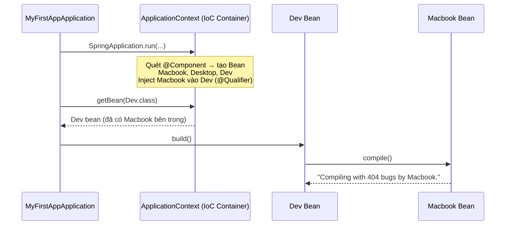

# 02 — Spring Core: IoC & Dependency Injection

Hướng dẫn từng bước xây dựng một app console nhỏ để hiểu **trái tim của Spring**: IoC Container tạo và quản lý object thay bạn, rồi tự động "tiêm" (inject) dependency vào nơi cần. Đây là kiến thức nền quan trọng nhất — mọi thứ trong Spring (Web, JPA, Security) đều đứng trên nó.

> Đọc doc này khi bạn quên IoC/DI thực sự là gì, khác nhau giữa 3 kiểu inject, và cách Spring chọn Bean khi có nhiều lựa chọn (`@Primary` vs `@Qualifier`). Project này **không có web** — chạy thẳng ra console để nhìn rõ cơ chế.

---

## Mục tiêu

- Hiểu **IoC (Inversion of Control)** — vì sao "nhường quyền tạo object cho Spring" lại quan trọng
- Nắm 3 kiểu **Dependency Injection**: Field, Setter, Constructor — và vì sao Constructor là chuẩn
- Áp dụng **Loose Coupling** qua Interface — code phụ thuộc vào `interface`, không phụ thuộc class cụ thể
- Xử lý **Bean conflict** khi có nhiều Bean cùng kiểu: `@Primary` và `@Qualifier`, biết thứ tự ưu tiên
- Lấy Bean ra khỏi IoC Container bằng `context.getBean(...)`

---

## Tech Stack

| Thành phần | Lựa chọn |
|---|---|
| Java | 21 (LTS) |
| Spring Boot | 4.0.7 |
| Starter | `spring-boot-starter` (lõi Spring — **không có web server**) |
| Build tool | Maven (Maven Wrapper) |
| Loại app | Console — chạy `main()`, in ra terminal, không mở cổng HTTP |

> **Khác project 01 ở điểm nào?** Project 01 dùng `spring-boot-starter-webmvc` (có Tomcat, chạy mãi để nhận request). Project 02 chỉ dùng `spring-boot-starter` — không có web, app chạy `main()` xong là tự thoát. Mục đích là tập trung 100% vào IoC/DI, không phân tâm vì HTTP.

---

## Kiến thức nền — hiểu trước khi code

### 1. IoC — Inversion of Control (Đảo ngược quyền điều khiển)

> *"Đảo ngược quyền kiểm soát trong việc tạo và quản lý vòng đời của Object."*

Bình thường **bạn** tự tạo object bằng `new`. Với IoC, bạn **nhường** quyền đó cho Spring: Spring tạo, giữ trong kho, và đưa cho bạn khi cần.

```java
// KHÔNG IoC — bạn tự kiểm soát việc tạo object
Dev dev = new Dev();

// CÓ IoC — Spring tạo và giữ object, bạn chỉ "xin" lại
Dev dev = context.getBean(Dev.class);
```

- **Bean** = object do Spring tạo và quản lý (nằm trong IoC Container).
- **IoC Container** = "kho" chứa Bean, chính là `ApplicationContext`. Nó là một object chạy bên trong JVM.
- **Cách Spring tìm Bean:** khi `SpringApplication.run()` chạy → Spring quét mọi class có `@Component` (và họ hàng: `@Service`, `@Repository`, `@Controller`) → tạo object → cất vào Container.

### 2. DI — Dependency Injection (Tiêm phụ thuộc)

DI là **cách cụ thể** Spring hiện thực IoC: khi tạo Bean A cần Bean B, Spring tự lấy B trong Container "tiêm" vào A — bạn không phải tự `new B()`.

Có **3 kiểu inject**:

| | Field Injection | Setter Injection | Constructor Injection |
|---|---|---|---|
| Cú pháp | `@Autowired` trên field | `@Autowired` trên setter | Tham số constructor |
| Cần `@Autowired`? | Bắt buộc | Bắt buộc | Không cần (Spring tự hiểu) |
| Dependency sẵn sàng khi | Sau khi object tạo xong | Sau khi object tạo xong | **Ngay lúc tạo object** |
| Có thể `null`? | Có (nếu quên `@Autowired`) | Có | **Không** — compiler bắt lỗi |
| Dễ test (unit test)? | Khó | Trung bình | **Dễ nhất** |
| Khuyến nghị | Tránh | Hiếm dùng | **Dùng cái này** |

> **Thực tế đi làm:** Constructor Injection chiếm ~95% code production. Field injection (`@Autowired` trên field) hay gặp trong tutorial vì viết ngắn, nhưng khó test và dễ để dependency ở trạng thái `null`. Project này sẽ demo cả field injection (để bạn *thấy* `@Autowired`) lẫn phiên bản constructor được khuyến nghị.

### 3. Loose Coupling qua Interface

Nếu `Dev` phụ thuộc trực tiếp vào class `Macbook`, muốn đổi sang `Desktop` phải sửa code `Dev` → **tight coupling** (gắn chặt, khó thay). Giải pháp: `Dev` chỉ phụ thuộc vào **interface** `Computer`, không quan tâm bên dưới là `Macbook` hay `Desktop`.

```
Tight:   Dev ──────────────► Macbook            (khó thay thế)

Loose:   Dev ──► Computer ◄── Macbook            (dễ swap: chỉ cần đổi Bean)
                    ▲
                    └──────── Desktop
```

Lợi ích: muốn đổi máy, chỉ cần đổi Bean nào được inject — **không sửa một dòng nào trong `Dev`**.

### 4. Bean conflict — `@Primary` và `@Qualifier`

Khi có **2 Bean cùng implement `Computer`** (`Macbook` và `Desktop`), Spring bối rối không biết inject cái nào → báo lỗi `NoUniqueBeanDefinitionException`. Hai cách giải quyết:

| Cách | Ý nghĩa | Đặt ở đâu |
|---|---|---|
| `@Primary` | Đánh dấu Bean **mặc định** được ưu tiên khi có nhiều lựa chọn | Trên class Bean (vd `Desktop`) |
| `@Qualifier("tên")` | Chỉ **đích danh** Bean muốn dùng theo tên | Tại nơi inject (field/constructor) |

**Thứ tự ưu tiên khi resolve Bean:**

```
@Qualifier  >  @Primary  >  tên biến trùng tên Bean
(cụ thể nhất)                              (yếu nhất)
```

Nghĩa là: nếu chỗ inject có `@Qualifier("macbook")`, Spring chọn `Macbook` **kể cả khi** `Desktop` được đánh `@Primary`. `@Qualifier` luôn thắng.

---

## Cấu trúc thư mục cuối cùng

```
02-ioc-and-di/
├── pom.xml
└── src/main/
    ├── java/com/maaitlunghau/myFirstApp/
    │   ├── MyFirstAppApplication.java   ← Class main — lấy Bean Dev ra và chạy
    │   ├── Computer.java                ← Interface (trừu tượng)
    │   ├── Macbook.java                 ← @Component implements Computer
    │   ├── Desktop.java                 ← @Component @Primary implements Computer
    │   └── Dev.java                     ← @Component — cần một Computer (được inject)
    └── resources/
        └── application.properties
```

---

## Bước 1 — Khởi tạo project trên start.spring.io

1. Mở [start.spring.io](https://start.spring.io)
2. Điền:

| Trường | Giá trị |
|---|---|
| Project | **Maven** |
| Language | **Java** |
| Spring Boot | **4.0.7** |
| Group | `com.maaitlunghau` |
| Artifact | `myFirstApp` |
| Java | **21** |

3. **KHÔNG thêm dependency nào cả** — để trống. Project này chỉ cần lõi Spring, không cần web/db.
4. **GENERATE** → tải zip → giải nén vào `projects/02-ioc-and-di/`

> Khi không chọn dependency nào, start.spring.io tự thêm sẵn `spring-boot-starter` (lõi) + `spring-boot-starter-test`. Đúng những gì ta cần.

---

## Bước 2 — Kiểm tra `pom.xml`

```xml
<?xml version="1.0" encoding="UTF-8"?>
<project xmlns="http://maven.apache.org/POM/4.0.0" xmlns:xsi="http://www.w3.org/2001/XMLSchema-instance"
	xsi:schemaLocation="http://maven.apache.org/POM/4.0.0 https://maven.apache.org/xsd/maven-4.0.0.xsd">
	<modelVersion>4.0.0</modelVersion>
	<parent>
		<groupId>org.springframework.boot</groupId>
		<artifactId>spring-boot-starter-parent</artifactId>
		<version>4.0.7</version>
		<relativePath/>
	</parent>
	<groupId>com.maaitlunghau</groupId>
	<artifactId>myFirstApp</artifactId>
	<version>0.0.1-SNAPSHOT</version>
	<properties>
		<java.version>21</java.version>
	</properties>
	<dependencies>
		<dependency>
			<groupId>org.springframework.boot</groupId>
			<artifactId>spring-boot-starter</artifactId>
		</dependency>

		<dependency>
			<groupId>org.springframework.boot</groupId>
			<artifactId>spring-boot-starter-test</artifactId>
			<scope>test</scope>
		</dependency>
	</dependencies>

	<build>
		<plugins>
			<plugin>
				<groupId>org.springframework.boot</groupId>
				<artifactId>spring-boot-maven-plugin</artifactId>
			</plugin>
		</plugins>
	</build>

</project>
```

Điểm khác project 01: dependency chính là `spring-boot-starter` (lõi) thay vì `spring-boot-starter-webmvc`. Không có Tomcat, không có web.

---

## Bước 3 — `application.properties`

`src/main/resources/application.properties` chỉ cần đúng 1 dòng:

```properties
spring.application.name=myFirstApp
```

> Không cần `server.port` vì app này không mở cổng HTTP.

---

## Bước 4 — Interface `Computer.java`

Tạo `src/main/java/com/maaitlunghau/myFirstApp/Computer.java`:

```java
package com.maaitlunghau.myFirstApp;

public interface Computer {
    void compile();
}
```

Đây là "hợp đồng": bất cứ class nào là `Computer` đều phải có method `compile()`. `Dev` sẽ phụ thuộc vào interface này — không quan tâm bên dưới là máy gì.

---

## Bước 5 — Hai implementation: `Macbook` và `Desktop`

### `Macbook.java`

```java
package com.maaitlunghau.myFirstApp;

import org.springframework.stereotype.Component;

@Component
public class Macbook implements Computer {

    public void compile() {
        System.out.println("Compiling with 404 bugs by Macbook.");
    }
}
```

- `@Component` — nói với Spring: *"tạo và quản lý class này giúp tao"*. Nhờ vậy `Macbook` trở thành một Bean trong IoC Container.
- Tên Bean mặc định = tên class viết thường chữ đầu → Bean này tên `macbook`.

### `Desktop.java`

```java
package com.maaitlunghau.myFirstApp;

import org.springframework.context.annotation.Primary;
import org.springframework.stereotype.Component;

@Component
@Primary
public class Desktop implements Computer {

    public void compile() {
        System.out.println("Compiling with 404 bugs by Desktop.");
    }
}
```

- Cũng là một `Computer` Bean (tên `desktop`).
- `@Primary` — đánh dấu: *"khi có nhiều `Computer`, nếu không chỉ định gì khác thì ưu tiên chọn tao (`Desktop`)"*.

> Giờ Container có **2 Bean cùng kiểu `Computer`**. Bước sau ta sẽ chỉ định inject cái nào.

---

## Bước 6 — Class `Dev.java` (nơi diễn ra Dependency Injection)

`Dev` cần một `Computer` để `build()`. Ta có 2 phiên bản: bản demo (field injection — đúng như code trong project) và bản khuyến nghị (constructor injection).

### Phiên bản trong project — Field Injection + `@Qualifier`

```java
package com.maaitlunghau.myFirstApp;

import org.springframework.beans.factory.annotation.Autowired;
import org.springframework.beans.factory.annotation.Qualifier;
import org.springframework.stereotype.Component;

@Component
public class Dev {

    // Field injection: @Autowired tiêm thẳng vào field
    // @Qualifier("macbook") chỉ đích danh Bean tên "macbook" — thắng cả @Primary của Desktop
    @Autowired
    @Qualifier("macbook")
    private Computer comp;

    public void build() {
        System.out.println("DEV: Building the application...");
        comp.compile();
    }
}
```

**Giải thích:**
- `@Component` — `Dev` cũng là một Bean.
- `@Autowired` — bảo Spring tiêm một `Computer` vào field `comp`.
- `@Qualifier("macbook")` — trong 2 Bean `Computer`, chọn đúng Bean tên `macbook`. **Dù `Desktop` là `@Primary`, `@Qualifier` vẫn thắng** → `comp` sẽ là `Macbook`.
- `build()` gọi `comp.compile()` — `Dev` không biết (và không cần biết) đó là Macbook hay Desktop → đó chính là loose coupling.

### Phiên bản khuyến nghị production — Constructor Injection

Đây mới là cách nên dùng thực tế (theo `coding-standards.md` của repo). Kết quả chạy y hệt, nhưng an toàn và dễ test hơn:

```java
package com.maaitlunghau.myFirstApp;

import org.springframework.beans.factory.annotation.Qualifier;
import org.springframework.stereotype.Component;

@Component
public class Dev {

    private final Computer comp;  // final — không thể null, không thể đổi sau khi tạo

    // Constructor injection: không cần @Autowired (Spring tự hiểu khi chỉ có 1 constructor)
    // @Qualifier đặt ngay trên tham số
    public Dev(@Qualifier("macbook") Computer comp) {
        this.comp = comp;
    }

    public void build() {
        System.out.println("DEV: Building the application...");
        comp.compile();
    }
}
```

> **Vì sao Constructor tốt hơn?** `comp` là `final` → chắc chắn có giá trị ngay khi `Dev` được tạo, compiler bảo vệ khỏi `null`. Khi viết unit test, chỉ cần `new Dev(mockComputer)` là xong — không cần Spring, không cần reflection.

---

## Bước 7 — Class `main`: `MyFirstAppApplication.java`

```java
package com.maaitlunghau.myFirstApp;

import org.springframework.boot.SpringApplication;
import org.springframework.boot.autoconfigure.SpringBootApplication;
import org.springframework.context.ApplicationContext;

@SpringBootApplication
public class MyFirstAppApplication {

	public static void main(String[] args) {

		// NO IoC — cách cũ, tự tạo object (chỉ để so sánh, KHÔNG dùng):
		// Dev dev = new Dev();
		// dev.build();

		// CÓ IoC — run() trả về ApplicationContext (chính là IoC Container)
		ApplicationContext context = SpringApplication.run(MyFirstAppApplication.class, args);

		// Xin Bean Dev từ Container — Dev đã được Spring tạo sẵn và inject Computer vào
		Dev obj = context.getBean(Dev.class);
		obj.build();
	}
}
```

**Giải thích:**
- `SpringApplication.run(...)` trả về `ApplicationContext` — ta giữ lại vào biến `context` để lấy Bean.
- `context.getBean(Dev.class)` — xin Container đưa ra Bean kiểu `Dev`. Lúc này `Dev` đã có sẵn `Computer` (Macbook) được inject từ trước.
- `obj.build()` — chạy logic, in ra console.

---

## Bước 8 — Chạy project

```bash
cd projects/02-ioc-and-di
./mvnw spring-boot:run
```

Trong đống log khởi động, tìm 2 dòng kết quả:

```
DEV: Building the application...
Compiling with 404 bugs by Macbook.
```

App in xong rồi tự thoát (vì không có web server giữ tiến trình sống).

> Vì sao là **Macbook** chứ không phải Desktop? Vì `@Qualifier("macbook")` thắng `@Primary` của Desktop.

---

## Bước 9 — 3 thí nghiệm để hiểu sâu (rất nên làm)

Cách nhanh nhất để "thấm" cơ chế resolve Bean là tự tay phá và quan sát:

### Thí nghiệm 1 — Bỏ `@Qualifier`, để `@Primary` quyết định

Trong `Dev.java`, xóa dòng `@Qualifier("macbook")` (giữ lại `@Autowired`). Chạy lại:

```
DEV: Building the application...
Compiling with 404 bugs by Desktop.
```

→ Không còn `@Qualifier`, Spring rơi xuống dùng `@Primary` → chọn **Desktop**.

### Thí nghiệm 2 — Bỏ cả `@Qualifier` lẫn `@Primary` → lỗi conflict

Xóa luôn `@Primary` trên `Desktop`. Chạy lại → app **crash** khi khởi động với lỗi:

```
NoUniqueBeanDefinitionException: expected single matching bean but found 2: desktop,macbook
```

→ Spring thấy 2 `Computer` mà không có manh mối nào để chọn → từ chối khởi động. Đây chính là lý do tồn tại của `@Primary`/`@Qualifier`.

### Thí nghiệm 3 — Đổi tên trong `@Qualifier` sang `"desktop"`

Sửa `@Qualifier("macbook")` thành `@Qualifier("desktop")`, chạy lại → in ra dòng của **Desktop**. Chứng minh `@Qualifier` chọn Bean theo tên.

> Nhớ trả code về trạng thái ban đầu (`@Qualifier("macbook")`) sau khi thí nghiệm.

---

## Tóm tắt luồng hoạt động



---

## Checklist tự kiểm tra

- [ ] Giải thích được IoC bằng 1 câu và cho ví dụ `new Dev()` vs `context.getBean(Dev.class)`
- [ ] Kể được 3 kiểu DI và vì sao Constructor Injection là chuẩn production
- [ ] Hiểu vì sao phụ thuộc vào `interface Computer` giúp dễ thay đổi (loose coupling)
- [ ] Nói được thứ tự ưu tiên: `@Qualifier` > `@Primary` > tên biến
- [ ] Dự đoán đúng output của cả 3 thí nghiệm ở Bước 9 mà không cần chạy
- [ ] Tự viết lại được project từ start.spring.io mà không nhìn hướng dẫn
