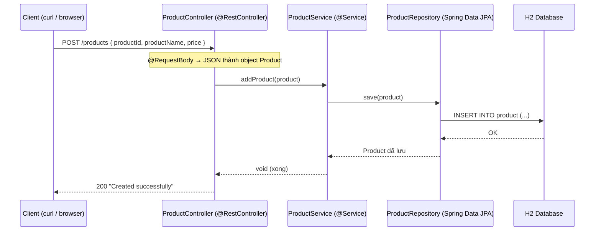

# 03 — CRUD REST API với Spring Data JPA

Hướng dẫn từng bước xây một REST API CRUD hoàn chỉnh cho `Product`, theo **layered architecture** chuẩn (Controller → Service → Repository → Database), dùng Spring Data JPA + H2 in-memory database. Đây là project đầu tiên gộp cả 3 mảng: web, business logic, và lưu trữ dữ liệu.

> Đọc doc này khi bạn quên cách dựng một REST API 3 tầng, cách Spring Data JPA tự sinh CRUD, và cách cấu hình H2. Làm theo đúng thứ tự là chạy được và test được ngay bằng trình duyệt/curl.

---

## Mục tiêu

- Hiểu **layered architecture**: mỗi tầng một trách nhiệm, request đi xuyên qua từng tầng
- Dùng **Spring Data JPA** — chỉ khai báo `interface`, Spring tự sinh code CRUD (không viết SQL)
- Map class Java thành bảng DB bằng `@Entity`, `@Id`
- Dùng **H2 in-memory database** — không cần cài đặt DB, có console xem dữ liệu trong trình duyệt
- Nhận dữ liệu từ request bằng `@RequestBody` (JSON body) và `@PathVariable` (biến trên URL)
- Giảm boilerplate với **Lombok** (`@Data`, `@AllArgsConstructor`, `@NoArgsConstructor`)

---

## Tech Stack

| Thành phần | Lựa chọn |
|---|---|
| Java | 21 (LTS) |
| Spring Boot | 4.0.7 |
| Web | `spring-boot-starter-web` |
| Persistence | `spring-boot-starter-data-jpa` (Spring Data JPA + Hibernate) |
| Database | H2 (in-memory, `runtime`) |
| Boilerplate | Lombok |
| Hot reload | Spring Boot DevTools |
| Build tool | Maven |

---

## Kiến thức nền — hiểu trước khi code

### 1. Layered Architecture — kiến trúc phân tầng

Mỗi request đi qua 3 tầng, **mỗi tầng một nhiệm vụ duy nhất**:

```
HTTP Request (JSON)
      │
      ▼
┌──────────────────────┐
│  @RestController     │  ← Nhận request, lấy tham số, gọi Service, trả response
│  (ProductController) │     KHÔNG chứa business logic
└──────────┬───────────┘
           ▼
┌──────────────────────┐
│  @Service            │  ← Business logic (xử lý nghiệp vụ)
│  (ProductService)    │     Gọi Repository để đọc/ghi dữ liệu
└──────────┬───────────┘
           ▼
┌──────────────────────┐
│  @Repository         │  ← Truy cập dữ liệu (CRUD), do Spring Data JPA sinh sẵn
│  (ProductRepository) │
└──────────┬───────────┘
           ▼
     Database (H2)
```

**Vì sao phải chia tầng?** Mỗi tầng thay đổi độc lập: đổi DB không ảnh hưởng Controller; đổi cách trả response không ảnh hưởng logic. Dễ đọc, dễ test, dễ bảo trì.

### 2. Spring Data JPA — không viết SQL

Bạn chỉ cần khai báo một `interface` kế thừa `JpaRepository<Entity, KiểuKhóaChính>`, **Spring tự sinh toàn bộ code** cho các method CRUD phổ biến:

| Method có sẵn | Tác dụng |
|---|---|
| `findAll()` | Lấy tất cả bản ghi |
| `findById(id)` | Tìm theo khóa chính → trả `Optional<T>` |
| `save(entity)` | Thêm mới **hoặc** cập nhật (upsert) |
| `deleteById(id)` | Xóa theo khóa chính |
| `existsById(id)` | Kiểm tra tồn tại |

Không cần viết class implement — Spring tạo Bean cho interface này lúc chạy.

### 3. `@Entity` — map class thành bảng DB

`@Entity` bảo Hibernate: *"class này tương ứng với một bảng trong DB"*. `@Id` đánh dấu field làm khóa chính.

> **Lưu ý project này:** `@Id` **không** kèm `@GeneratedValue`, nghĩa là DB **không tự sinh** id — client phải tự gửi `productId` khi tạo product. (Project 04 sẽ dùng `@GeneratedValue` để DB tự tăng id.)

### 4. `@RequestBody` vs `@PathVariable`

| Annotation | Lấy dữ liệu từ đâu | Ví dụ |
|---|---|---|
| `@RequestBody` | JSON trong **body** của request → convert thành object Java | `POST /products` với body `{"productId":1,...}` |
| `@PathVariable` | Biến nằm **trên URL** | `GET /products/1` → `productId = 1` |

### 5. Lombok — bớt code lặp

Lombok sinh code lúc compile qua annotation:

| Annotation | Sinh ra |
|---|---|
| `@Data` | getter + setter + `toString` + `equals` + `hashCode` |
| `@AllArgsConstructor` | Constructor đủ tham số |
| `@NoArgsConstructor` | Constructor rỗng (JPA bắt buộc phải có) |

> **Lưu ý:** `@Data` tiện cho learning nhưng repo khuyến cáo **tránh `@Data` trên Entity** trong dự án thật (gây vấn đề với `equals`/`hashCode` và JPA lazy loading). Project 04 trở đi sẽ chuyển sang viết entity thủ công + DTO bằng Java Records.

---

## Cấu trúc thư mục cuối cùng

```
03-crud-rest-api/
├── pom.xml
└── src/main/
    ├── java/com/maaitlunghau/simpleWebApp/
    │   ├── SimpleWebAppApplication.java     ← Class main
    │   ├── controller/
    │   │   ├── ProductController.java       ← REST API CRUD cho Product
    │   │   ├── HomeController.java           ← Trang chào "/" và "/about"
    │   │   └── LoginController.java          ← "/login" (demo)
    │   ├── service/
    │   │   └── ProductService.java           ← Business logic
    │   ├── repository/
    │   │   └── ProductRepository.java        ← Spring Data JPA
    │   └── model/
    │       └── Product.java                  ← @Entity
    └── resources/
        └── application.properties            ← Cấu hình H2 + JPA
```

---

## Bước 1 — Khởi tạo project trên start.spring.io

1. Mở [start.spring.io](https://start.spring.io), điền Group `com.maaitlunghau`, Artifact `simpleWebApp`, Java **21**, Spring Boot **4.0.7**.
2. **ADD DEPENDENCIES** → chọn 5 cái:

| Dependency | Vai trò |
|---|---|
| **Spring Web** | REST API, embedded Tomcat |
| **Spring Data JPA** | Repository pattern + Hibernate |
| **H2 Database** | DB in-memory cho học |
| **Lombok** | Giảm boilerplate |
| **Spring Boot DevTools** | Hot reload khi sửa code |

3. **GENERATE** → giải nén vào `projects/03-crud-rest-api/`

---

## Bước 2 — Kiểm tra `pom.xml`

```xml
<?xml version="1.0" encoding="UTF-8"?>
<project xmlns="http://maven.apache.org/POM/4.0.0" xmlns:xsi="http://www.w3.org/2001/XMLSchema-instance"
	xsi:schemaLocation="http://maven.apache.org/POM/4.0.0 https://maven.apache.org/xsd/maven-4.0.0.xsd">
	<modelVersion>4.0.0</modelVersion>
	<parent>
		<groupId>org.springframework.boot</groupId>
		<artifactId>spring-boot-starter-parent</artifactId>
		<version>4.0.7</version>
		<relativePath/>
	</parent>
	<groupId>com.maaitlunghau</groupId>
	<artifactId>simpleWebApp</artifactId>
	<version>0.0.1-SNAPSHOT</version>
	<properties>
		<java.version>21</java.version>
	</properties>
	<dependencies>
		<!-- Spring Boot Web -->
		<dependency>
			<groupId>org.springframework.boot</groupId>
			<artifactId>spring-boot-starter-web</artifactId>
		</dependency>

		<!-- Spring Boot DevTools -->
		<dependency>
			<groupId>org.springframework.boot</groupId>
			<artifactId>spring-boot-devtools</artifactId>
			<scope>runtime</scope>
			<optional>true</optional>
		</dependency>

		<!-- Spring Boot Test -->
		<dependency>
			<groupId>org.springframework.boot</groupId>
			<artifactId>spring-boot-starter-webmvc-test</artifactId>
			<scope>test</scope>
		</dependency>

		<!-- Lombok -->
		<dependency>
			<groupId>org.projectlombok</groupId>
			<artifactId>lombok</artifactId>
			<optional>true</optional>
		</dependency>

		<!-- JPA -->
		<dependency>
			<groupId>org.springframework.boot</groupId>
			<artifactId>spring-boot-starter-data-jpa</artifactId>
		</dependency>
		<dependency>
			<groupId>org.springframework.boot</groupId>
			<artifactId>spring-boot-starter-data-jpa-test</artifactId>
			<scope>test</scope>
		</dependency>

		<!-- H2 Database -->
		<dependency>
			<groupId>com.h2database</groupId>
			<artifactId>h2</artifactId>
			<scope>runtime</scope>
		</dependency>
	</dependencies>

	<build>
		<plugins>
			<plugin>
				<groupId>org.apache.maven.plugins</groupId>
				<artifactId>maven-compiler-plugin</artifactId>
				<configuration>
					<annotationProcessorPaths>
						<path>
							<groupId>org.projectlombok</groupId>
							<artifactId>lombok</artifactId>
						</path>
					</annotationProcessorPaths>
				</configuration>
			</plugin>
			<plugin>
				<groupId>org.springframework.boot</groupId>
				<artifactId>spring-boot-maven-plugin</artifactId>
				<configuration>
					<excludes>
						<exclude>
							<groupId>org.projectlombok</groupId>
							<artifactId>lombok</artifactId>
						</exclude>
					</excludes>
				</configuration>
			</plugin>
		</plugins>
	</build>

</project>
```

> Phần `maven-compiler-plugin` khai báo `annotationProcessorPaths` cho Lombok — bắt buộc để Lombok sinh code lúc compile. `spring-boot-maven-plugin` loại Lombok khỏi JAR cuối (Lombok chỉ cần lúc compile, không cần lúc chạy).

---

## Bước 3 — Cấu hình `application.properties`

`src/main/resources/application.properties`:

```properties
spring.application.name=simpleWebApp
server.port=8081

# Datasource — H2 in-memory
spring.datasource.url=jdbc:h2:mem:maaitlunghau
spring.datasource.driver-class-name=org.h2.Driver
spring.datasource.username=sa
spring.datasource.password=

# H2 Console — http://localhost:8081/h2-console
spring.h2.console.enabled=true

# JPA
spring.jpa.hibernate.ddl-auto=create-drop
spring.jpa.show-sql=true
spring.jpa.open-in-view=false
```

**Giải thích từng nhóm:**
- `jdbc:h2:mem:maaitlunghau` — DB nằm **trong RAM**, tên `maaitlunghau`. Mất hết khi tắt app.
- `spring.h2.console.enabled=true` — bật giao diện web xem/chạy SQL tại `/h2-console`.
- `ddl-auto=create-drop` — Hibernate **tạo bảng lúc app start, xóa lúc app stop**. Phù hợp học/test.
- `show-sql=true` — in câu SQL Hibernate sinh ra vào console (rất hữu ích để học).
- `open-in-view=false` — tắt anti-pattern Open Session In View (best practice).

---

## Bước 4 — Entity `Product.java`

Tạo `src/main/java/com/maaitlunghau/simpleWebApp/model/Product.java`:

```java
package com.maaitlunghau.simpleWebApp.model;

import jakarta.persistence.Entity;
import jakarta.persistence.Id;
import lombok.AllArgsConstructor;
import lombok.Data;
import lombok.NoArgsConstructor;

@Entity
@Data
@AllArgsConstructor
@NoArgsConstructor
public class Product {
    @Id
    private int productId;
    private String productName;
    private int price;
}
```

**Giải thích:**
- `@Entity` — map class thành bảng `PRODUCT` trong H2.
- `@Id` trên `productId` — khóa chính. **Không** có `@GeneratedValue` → client phải tự cung cấp `productId` khi tạo.
- `@Data` — Lombok sinh getter/setter/toString/equals/hashCode.
- `@NoArgsConstructor` — JPA **bắt buộc** entity có constructor rỗng để Hibernate tạo object.
- `@AllArgsConstructor` — tiện tạo object đủ field (dùng ở Service cho fallback).

---

## Bước 5 — Repository `ProductRepository.java`

Tạo `src/main/java/com/maaitlunghau/simpleWebApp/repository/ProductRepository.java`:

```java
package com.maaitlunghau.simpleWebApp.repository;

import org.springframework.data.jpa.repository.JpaRepository;

import com.maaitlunghau.simpleWebApp.model.Product;

public interface ProductRepository extends JpaRepository<Product, Integer> {

}
```

Chỉ cần thế này! `JpaRepository<Product, Integer>` — `Product` là entity, `Integer` là kiểu khóa chính (`productId` kiểu `int`). Spring tự sinh `findAll()`, `findById()`, `save()`, `deleteById()`... — bạn không viết dòng nào.

---

## Bước 6 — Service `ProductService.java`

Tạo `src/main/java/com/maaitlunghau/simpleWebApp/service/ProductService.java`:

```java
package com.maaitlunghau.simpleWebApp.service;

import java.util.List;

import org.springframework.beans.factory.annotation.Autowired;
import org.springframework.stereotype.Service;

import com.maaitlunghau.simpleWebApp.model.Product;
import com.maaitlunghau.simpleWebApp.repository.ProductRepository;

@Service
public class ProductService {

    @Autowired
    ProductRepository productRepository;

    public List<Product> getProducts() {
        return productRepository.findAll();
    }

    public Product getProductById(int productId) {
        return productRepository
            .findById(productId)
            .orElse(new Product(0, "No Item", 0));
    }

    public void addProduct(Product pro) {
        productRepository.save(pro);
    }

    public void updateProduct(Product pro) {
        productRepository.save(pro);
    }

    public void deleteProduct(int productId) {
        productRepository.deleteById(productId);
    }
}
```

**Giải thích:**
- `@Service` — đánh dấu tầng business logic, Spring tạo Bean.
- `@Autowired ProductRepository` — field injection tiêm repository vào.
- `getProductById` dùng `findById(...)` (trả `Optional`) rồi `.orElse(...)` trả về product "No Item" nếu không tìm thấy.
- `addProduct` và `updateProduct` đều gọi `save()` — vì `save()` là upsert (id chưa có → insert, id đã có → update).

> **Lưu ý cải tiến (project 04):** Ở đây dùng **field injection** và trả về **fallback object** khi không tìm thấy. Chuẩn production nên dùng **constructor injection** và **ném `ResourceNotFoundException` → trả HTTP 404**. Project 04 làm đúng cách này.

---

## Bước 7 — Controllers

### `ProductController.java` — REST API CRUD

Tạo `src/main/java/com/maaitlunghau/simpleWebApp/controller/ProductController.java`:

```java
package com.maaitlunghau.simpleWebApp.controller;

import java.util.List;

import org.springframework.beans.factory.annotation.Autowired;
import org.springframework.web.bind.annotation.DeleteMapping;
import org.springframework.web.bind.annotation.GetMapping;
import org.springframework.web.bind.annotation.PathVariable;
import org.springframework.web.bind.annotation.PostMapping;
import org.springframework.web.bind.annotation.PutMapping;
import org.springframework.web.bind.annotation.RequestBody;
import org.springframework.web.bind.annotation.RestController;

import com.maaitlunghau.simpleWebApp.model.Product;
import com.maaitlunghau.simpleWebApp.service.ProductService;

@RestController
public class ProductController {

    @Autowired
    ProductService productService;

    @GetMapping("/products")
    public List<Product> getProducts() {
        return productService.getProducts();
    }

    @GetMapping("/products/{productId}")
    public Product getProductById(@PathVariable int productId) {
        return productService.getProductById(productId);
    }

    @PostMapping("/products")
    public String addProduct(@RequestBody Product pro) {
        productService.addProduct(pro);
        return "Created successfully";
    }

    @PutMapping("/products")
    public String updateProduct(@RequestBody Product pro) {
        productService.updateProduct(pro);
        return "Updated successfully";
    }

    @DeleteMapping("/products/{productId}")
    public void deleteProduct(@PathVariable int productId) {
        productService.deleteProduct(productId);
    }
}
```

**Giải thích:**
- `@RestController` — mọi giá trị trả về được ghi thẳng vào response body. `List<Product>` tự động thành JSON (Jackson lo việc convert).
- `@GetMapping("/products/{productId}")` + `@PathVariable int productId` — `{productId}` trên URL được gán vào tham số method.
- `@PostMapping` + `@RequestBody Product pro` — đọc JSON body, convert thành `Product`.
- `@PutMapping` — cập nhật (gửi cả object có `productId`).
- `@DeleteMapping("/products/{productId}")` — xóa theo id trên URL.

### `HomeController.java` — trang chào

```java
package com.maaitlunghau.simpleWebApp.controller;

import org.springframework.web.bind.annotation.RequestMapping;
import org.springframework.web.bind.annotation.ResponseBody;
import org.springframework.web.bind.annotation.RestController;

@RestController
public class HomeController {

    @RequestMapping("/")
    @ResponseBody
    public String greet() {
        return "Welcome to my simple web application!";
    }

    @RequestMapping("/about")
    public String about() {
        return "This is a simple web application built with Spring Boot.";
    }
}
```

> `@ResponseBody` ở đây thừa vì class đã có `@RestController` (vốn = `@Controller` + `@ResponseBody`) — giữ lại để bạn thấy annotation này tồn tại.

### `LoginController.java` — demo route

```java
package com.maaitlunghau.simpleWebApp.controller;

import org.springframework.web.bind.annotation.RequestMapping;
import org.springframework.web.bind.annotation.RestController;

@RestController
public class LoginController {

    @RequestMapping("/login")
    public String login() {
        return "Login page...";
    }
}
```

---

## Bước 8 — Chạy và test

```bash
cd projects/03-crud-rest-api
./mvnw spring-boot:run
```

App chạy tại `http://localhost:8081`.

### Danh sách endpoint

| Method | URL | Mô tả | Body |
|---|---|---|---|
| GET | `/products` | Lấy tất cả product | — |
| GET | `/products/{id}` | Lấy product theo id | — |
| POST | `/products` | Tạo product mới | JSON |
| PUT | `/products` | Cập nhật product | JSON |
| DELETE | `/products/{id}` | Xóa product | — |

### Test bằng curl

```bash
# 1. Tạo product (phải tự cung cấp productId vì không auto-generate)
curl -X POST http://localhost:8081/products \
  -H "Content-Type: application/json" \
  -d '{"productId": 1, "productName": "Macbook Pro", "price": 2500}'
# → Created successfully

# 2. Tạo thêm cái nữa
curl -X POST http://localhost:8081/products \
  -H "Content-Type: application/json" \
  -d '{"productId": 2, "productName": "iPhone 15", "price": 999}'

# 3. Lấy tất cả
curl http://localhost:8081/products
# → [{"productId":1,"productName":"Macbook Pro","price":2500}, ...]

# 4. Lấy 1 product theo id
curl http://localhost:8081/products/1

# 5. Cập nhật (gửi productId đã tồn tại → save() sẽ update)
curl -X PUT http://localhost:8081/products \
  -H "Content-Type: application/json" \
  -d '{"productId": 1, "productName": "Macbook Pro M4", "price": 2800}'
# → Updated successfully

# 6. Xóa
curl -X DELETE http://localhost:8081/products/2
```

### Xem dữ liệu qua H2 Console

1. Mở `http://localhost:8081/h2-console`
2. Điền:
   - **JDBC URL:** `jdbc:h2:mem:maaitlunghau` (phải khớp `application.properties`)
   - **User Name:** `sa`
   - **Password:** (để trống)
3. **Connect** → chạy `SELECT * FROM PRODUCT;` để xem bảng dữ liệu.

> Bật `show-sql=true` nên mỗi thao tác API sẽ in câu SQL Hibernate sinh ra trong terminal — theo dõi để hiểu JPA làm gì bên dưới.

---

## Tóm tắt luồng hoạt động

Ví dụ một request `POST /products` đi xuyên qua 3 tầng rồi xuống DB:



Luồng đọc `GET /products/{id}` cũng tương tự nhưng ngược chiều dữ liệu: `findById()` → `SELECT` → trả `Product` (hoặc fallback "No Item") về client dưới dạng JSON.

---

## Những điểm project 04 sẽ cải tiến

Project này cố tình giữ đơn giản để học nhanh. Project 04 nâng cấp lên chuẩn production:

| Chủ đề | Project 03 (đây) | Project 04 |
|---|---|---|
| Injection | Field injection (`@Autowired`) | Constructor injection |
| Không tìm thấy | Trả fallback `Product(0, "No Item", 0)` | Ném `ResourceNotFoundException` → 404 |
| Khóa chính | Client tự cấp (`@Id`) | DB tự sinh (`@GeneratedValue`) |
| Entity | Lombok `@Data` | Viết thủ công, không expose entity ra API |
| Request/Response | Dùng thẳng Entity | DTO (Java Records) + Bean Validation |
| Xử lý lỗi | Không có | `@RestControllerAdvice` tập trung |
| Database | H2 in-memory | MySQL thật |

---

## Checklist tự kiểm tra

- [ ] Vẽ lại được sơ đồ 3 tầng và nói trách nhiệm từng tầng
- [ ] Giải thích vì sao chỉ khai báo `interface ProductRepository` mà đã có đủ CRUD
- [ ] Phân biệt `@RequestBody` (JSON body) và `@PathVariable` (biến trên URL)
- [ ] Hiểu `save()` là upsert, và vì sao project này phải tự gửi `productId`
- [ ] Cấu hình và kết nối được H2 Console để xem dữ liệu
- [ ] Kể được ít nhất 3 điểm project 04 cải tiến so với project 03
