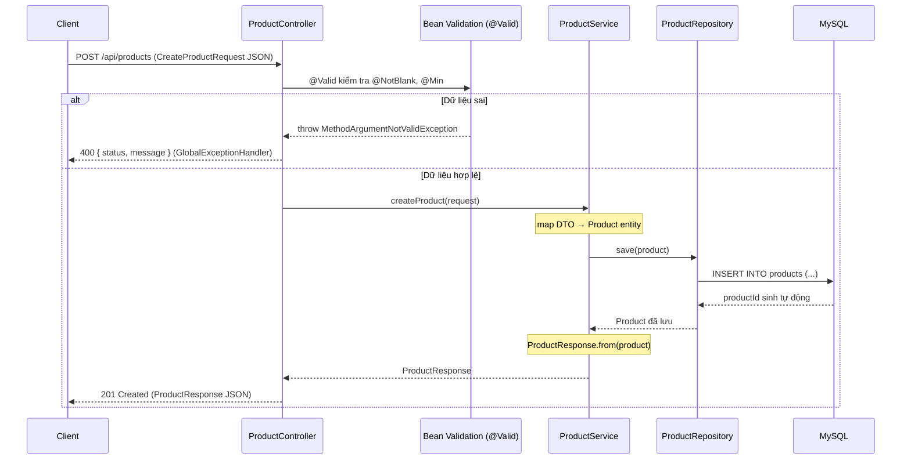

# 04 — REST API chuẩn production với Spring Data JPA + MySQL

Hướng dẫn từng bước nâng cấp REST API CRUD từ mức "học nhanh" (project 03) lên **chuẩn production**: MySQL thật, **DTO pattern**, **Bean Validation**, **constructor injection**, `@Transactional` + Hibernate dirty checking, và **global exception handling** trả lỗi JSON nhất quán.

> Đọc doc này khi bạn quên cách tách DTO khỏi Entity, validate dữ liệu đầu vào, xử lý lỗi tập trung, và trả đúng HTTP status code. So sánh trực tiếp với project 03 để thấy "code học" khác "code đi làm" ở đâu.

---

## Mục tiêu

- Kết nối **MySQL thật** thay cho H2 in-memory
- Áp dụng **DTO pattern**: không bao giờ expose Entity ra API — dùng Java Records làm request/response
- **Bean Validation** (`@Valid`, `@NotBlank`, `@Min`) đặt trên DTO, không phải Entity
- **Constructor injection** thay cho field injection
- `@Transactional(readOnly = true)` ở class level, override cho method ghi
- Hiểu **Hibernate dirty checking** — update entity không cần gọi `save()` tường minh
- **Global exception handling** với `@RestControllerAdvice` — trả lỗi JSON nhất quán (404, 400, 500)
- Trả đúng HTTP status: `201 Created`, `204 No Content`, `404 Not Found`, `400 Bad Request`

---

## Tech Stack

| Thành phần | Lựa chọn |
|---|---|
| Java | 21 (LTS) |
| Spring Boot | 4.0.7 |
| Web | `spring-boot-starter-webmvc` |
| Persistence | `spring-boot-starter-data-jpa` |
| Validation | `spring-boot-starter-validation` (Jakarta Bean Validation) |
| Database | **MySQL** (`mysql-connector-j`, `runtime`) |
| Hot reload | Spring Boot DevTools |
| Build tool | Maven |

---

## Kiến thức nền — hiểu trước khi code

### 1. Vì sao dùng DTO thay vì trả thẳng Entity?

Project 03 trả thẳng `Product` (Entity) ra API. Cách này có 3 vấn đề:

| Vấn đề | Hậu quả |
|---|---|
| **Lộ cấu trúc DB** | Client thấy đúng shape bảng DB → đổi DB là vỡ API |
| **Lộ field nhạy cảm** | Sau này thêm field (vd `costPrice`, `internalNote`) vào Entity → tự động lộ ra ngoài |
| **Không kiểm soát input** | Client có thể gửi cả `productId` khi tạo mới, gây nhầm lẫn |

**Giải pháp — DTO (Data Transfer Object):** dùng object riêng cho từng chiều dữ liệu:

| DTO | Chiều | Đặc điểm |
|---|---|---|
| `CreateProductRequest` | Client → Server (tạo) | Không có `productId` (DB tự sinh) |
| `UpdateProductRequest` | Client → Server (sửa) | `id` lấy từ URL, body chỉ chứa field sửa được |
| `ProductResponse` | Server → Client | Chứa cả `productId`, là shape API cam kết |

Dùng **Java Records** cho DTO: immutable, tự sinh constructor/getter/`equals`/`hashCode` — gọn hơn cả Lombok.

### 2. Bean Validation — validate ở ranh giới hệ thống

Đặt annotation validation **trên DTO request**, không trên Entity. Lý do: DTO là nơi dữ liệu bên ngoài *đi vào* hệ thống — phải chặn dữ liệu sai ngay tại cửa.

| Annotation | Ý nghĩa |
|---|---|
| `@NotBlank` | String không null và không rỗng/toàn khoảng trắng |
| `@Min(0)` | Số >= 0 |
| `@Valid` (ở controller) | Kích hoạt validate DTO trước khi vào method |

Khi validate fail → Spring ném `MethodArgumentNotValidException` → handler bắt và trả `400`.

### 3. `@Transactional` + Hibernate dirty checking

- `@Transactional(readOnly = true)` ở **class level** — mặc định mọi method chỉ đọc (tối ưu, không mở transaction ghi).
- `@Transactional` (không tham số) override trên method ghi (`create`, `update`, `delete`) — cho phép ghi DB.
- **Dirty checking** (điểm hay nhất): trong một transaction, khi bạn `findById()` lấy entity ra, entity đó ở trạng thái **managed**. Bạn chỉ cần gọi setter đổi field — Hibernate **tự phát hiện thay đổi** và tự chạy `UPDATE` khi transaction commit. **Không cần gọi `save()`**.

### 4. Global Exception Handling với `@RestControllerAdvice`

Thay vì `try-catch` trong từng controller, gom toàn bộ xử lý lỗi vào một class `@RestControllerAdvice`. Mỗi loại exception → một method `@ExceptionHandler` → trả JSON + status code phù hợp.

```
Controller/Service throw exception
          │
          ▼
@RestControllerAdvice bắt được
          │
          ▼
Trả JSON { status, message } + đúng HTTP status
```

### 5. `ResponseEntity` — kiểm soát status code

Project 03 trả `String`/object thô (luôn là 200). Project 04 dùng `ResponseEntity<T>` để chủ động chọn status:

| Thao tác | Status trả về | Cách viết |
|---|---|---|
| Lấy dữ liệu OK | `200 OK` | `ResponseEntity.ok(data)` |
| Tạo mới thành công | `201 Created` | `ResponseEntity.status(HttpStatus.CREATED).body(data)` |
| Xóa thành công | `204 No Content` | `ResponseEntity.noContent().build()` |

---

## Cấu trúc thư mục cuối cùng

```
04-rest-api-jpa-mysql/
├── pom.xml
└── src/main/
    ├── java/com/maaitlunghau/__rest_api_jpa_mysql/
    │   ├── Application.java
    │   ├── controller/
    │   │   ├── ProductController.java
    │   │   └── HomeController.java
    │   ├── service/
    │   │   └── ProductService.java
    │   ├── repository/
    │   │   └── ProductRepository.java
    │   ├── model/
    │   │   └── Product.java              ← Entity
    │   ├── dto/
    │   │   ├── CreateProductRequest.java  ← Request DTO (tạo)
    │   │   ├── UpdateProductRequest.java  ← Request DTO (sửa)
    │   │   └── ProductResponse.java       ← Response DTO
    │   └── exception/
    │       ├── ResourceNotFoundException.java
    │       └── GlobalExceptionHandler.java
    └── resources/
        └── application.properties
```

> **Về tên package `__rest_api_jpa_mysql`:** Tên artifact bắt đầu bằng số (`04-...`) khiến start.spring.io sinh package có tiền tố `__` cho hợp lệ trong Java. Không đẹp nhưng không ảnh hưởng chạy — giữ nguyên theo project thật.

---

## Bước 1 — Chuẩn bị MySQL và tạo database

App kết nối tới MySQL ở `localhost:3306`, database tên `rest-api-jpa-mysql`, user `root`, password `112233`. Database này **phải tồn tại trước** khi chạy app.

**Cách A — Dùng MySQL đã cài sẵn trên máy:**

```bash
mysql -u root -p
# nhập password
```

```sql
CREATE DATABASE `rest-api-jpa-mysql`;
```

**Cách B — Chạy MySQL bằng Docker (không cần cài):**

```bash
docker run --name mysql-04 \
  -e MYSQL_ROOT_PASSWORD=112233 \
  -e MYSQL_DATABASE=rest-api-jpa-mysql \
  -p 3306:3306 \
  -d mysql:8
```

> `MYSQL_DATABASE=rest-api-jpa-mysql` giúp Docker tự tạo sẵn database khi container khởi động.

> **Mẹo:** Nếu muốn app tự tạo DB khi chưa có, thêm `&createDatabaseIfNotExist=true` vào cuối JDBC URL (project 07 dùng cách này). Project 04 giữ nguyên cách tạo DB thủ công để bạn hiểu rõ bước setup.

---

## Bước 2 — Khởi tạo project trên start.spring.io

Điền Group `com.maaitlunghau`, Artifact `04-rest-api-jpa-mysql`, Java **21**, Spring Boot **4.0.7**. Thêm dependencies:

| Dependency | Vai trò |
|---|---|
| **Spring Web** | REST API |
| **Spring Data JPA** | Repository + Hibernate |
| **Validation** | Bean Validation |
| **MySQL Driver** | Kết nối MySQL |
| **Spring Boot DevTools** | Hot reload |

---

## Bước 3 — `pom.xml`

```xml
<?xml version="1.0" encoding="UTF-8"?>
<project xmlns="http://maven.apache.org/POM/4.0.0" xmlns:xsi="http://www.w3.org/2001/XMLSchema-instance"
	xsi:schemaLocation="http://maven.apache.org/POM/4.0.0 https://maven.apache.org/xsd/maven-4.0.0.xsd">
	<modelVersion>4.0.0</modelVersion>
	<parent>
		<groupId>org.springframework.boot</groupId>
		<artifactId>spring-boot-starter-parent</artifactId>
		<version>4.0.7</version>
		<relativePath/>
	</parent>
	<groupId>com.maaitlunghau</groupId>
	<artifactId>04-rest-api-jpa-mysql</artifactId>
	<version>0.0.1-SNAPSHOT</version>
	<properties>
		<java.version>21</java.version>
	</properties>
	<dependencies>
		<dependency>
			<groupId>org.springframework.boot</groupId>
			<artifactId>spring-boot-starter-data-jpa</artifactId>
		</dependency>
		<dependency>
			<groupId>org.springframework.boot</groupId>
			<artifactId>spring-boot-starter-validation</artifactId>
		</dependency>
		<dependency>
			<groupId>org.springframework.boot</groupId>
			<artifactId>spring-boot-starter-webmvc</artifactId>
		</dependency>

		<dependency>
			<groupId>org.springframework.boot</groupId>
			<artifactId>spring-boot-devtools</artifactId>
			<scope>runtime</scope>
			<optional>true</optional>
		</dependency>
		<dependency>
			<groupId>com.mysql</groupId>
			<artifactId>mysql-connector-j</artifactId>
			<scope>runtime</scope>
		</dependency>

		<dependency>
			<groupId>org.springframework.boot</groupId>
			<artifactId>spring-boot-starter-data-jpa-test</artifactId>
			<scope>test</scope>
		</dependency>
		<dependency>
			<groupId>org.springframework.boot</groupId>
			<artifactId>spring-boot-starter-validation-test</artifactId>
			<scope>test</scope>
		</dependency>
		<dependency>
			<groupId>org.springframework.boot</groupId>
			<artifactId>spring-boot-starter-webmvc-test</artifactId>
			<scope>test</scope>
		</dependency>
	</dependencies>

	<build>
		<plugins>
			<plugin>
				<groupId>org.springframework.boot</groupId>
				<artifactId>spring-boot-maven-plugin</artifactId>
			</plugin>
		</plugins>
	</build>

</project>
```

---

## Bước 4 — `application.properties`

`src/main/resources/application.properties`:

```properties
spring.application.name=04-rest-api-jpa-mysql
server.port=8081

# Connection
spring.jpa.hibernate.ddl-auto=update
spring.datasource.url=jdbc:mysql://${MYSQL_HOST:localhost}:3306/rest-api-jpa-mysql?useSSL=false&serverTimezone=UTC
spring.datasource.username=root
spring.datasource.password=112233
spring.datasource.driver-class-name=com.mysql.cj.jdbc.Driver
spring.jpa.show-sql=true
spring.jpa.open-in-view=false
```

**Giải thích các điểm khác project 03:**
- `ddl-auto=update` — với MySQL (DB thật, giữ data), dùng `update`: Hibernate chỉ `ALTER TABLE` thêm cột mới, **không xóa data** (khác `create-drop` của H2).
- `${MYSQL_HOST:localhost}` — đọc biến môi trường `MYSQL_HOST`, nếu không có thì mặc định `localhost`. Tiện khi chạy trong Docker.
- `com.mysql.cj.jdbc.Driver` — driver MySQL 8.

---

## Bước 5 — Entity `Product.java`

Tạo `model/Product.java`. Khác project 03: **viết thủ công** getter/setter (không Lombok `@Data`), có `@GeneratedValue`, `equals`/`hashCode` dựa trên id:

```java
package com.maaitlunghau.__rest_api_jpa_mysql.model;

import jakarta.persistence.Column;
import jakarta.persistence.Entity;
import jakarta.persistence.GeneratedValue;
import jakarta.persistence.GenerationType;
import jakarta.persistence.Id;
import jakarta.persistence.Table;

@Entity
@Table(name = "products")
public class Product {

    @Id
    @GeneratedValue(strategy = GenerationType.IDENTITY)
    private Long productId;

    @Column(nullable = false, length = 100)
    private String productName;

    @Column(nullable = false)
    private double productPrice;

    @Column(nullable = false)
    private int quantity;

    protected Product() {}

    public Product(String productName, double productPrice, int quantity) {
        this.productName = productName;
        this.productPrice = productPrice;
        this.quantity = quantity;
    }

    public Long getProductId() {
        return productId;
    }

    public String getProductName() {
        return productName;
    }

    public void setProductName(String productName) {
        this.productName = productName;
    }

    public double getProductPrice() {
        return productPrice;
    }

    public void setProductPrice(double productPrice) {
        this.productPrice = productPrice;
    }

    public int getQuantity() {
        return quantity;
    }

    public void setQuantity(int quantity) {
        this.quantity = quantity;
    }

    @Override
    public boolean equals(Object obj) {
        if (this == obj) return true;
        if (!(obj instanceof Product other)) return false;
        return productId != null && productId.equals(other.productId);
    }

    @Override
    public int hashCode() {
        return getClass().hashCode();
    }

    @Override
    public String toString() {
        return "Product [productId=" + productId + ", productName=" + productName
                + ", productPrice=" + productPrice + ", quantity=" + quantity + "]";
    }
}
```

**Giải thích các điểm mấu chốt:**
- `@GeneratedValue(strategy = GenerationType.IDENTITY)` — DB **tự tăng** `productId` (AUTO_INCREMENT). Client không cần gửi id.
- `@Table(name = "products")` — đặt tên bảng rõ ràng.
- `@Column(nullable = false, length = 100)` — ràng buộc ở tầng DB (NOT NULL, độ dài).
- `protected Product()` — constructor rỗng cho JPA (không để `public` để tránh code khác lỡ tạo entity rỗng).
- Constructor public đủ tham số (không có id) — dùng khi tạo product mới.
- **Chỉ có setter cho field cần sửa**, không có `setProductId` — id là bất biến sau khi tạo.
- `equals`/`hashCode` dựa trên `productId` — chuẩn cho JPA entity (tránh bug với Lombok `@Data`).

---

## Bước 6 — Repository `ProductRepository.java`

Tạo `repository/ProductRepository.java`:

```java
package com.maaitlunghau.__rest_api_jpa_mysql.repository;

import org.springframework.data.jpa.repository.JpaRepository;
import org.springframework.stereotype.Repository;

import com.maaitlunghau.__rest_api_jpa_mysql.model.Product;

@Repository
public interface ProductRepository extends JpaRepository<Product, Long> {

}
```

`JpaRepository<Product, Long>` — `Long` là kiểu khóa chính. `@Repository` optional (Spring Data tự detect) nhưng thêm cho rõ ý.

---

## Bước 7 — Các DTO (Java Records)

Tạo 3 file trong package `dto/`.

### `CreateProductRequest.java` — nhận khi tạo mới

```java
package com.maaitlunghau.__rest_api_jpa_mysql.dto;

import jakarta.validation.constraints.Min;
import jakarta.validation.constraints.NotBlank;

public record CreateProductRequest(

        @NotBlank(message = "Product name is required")
        String productName,

        @Min(value = 0, message = "Price must be greater than or equal to 0")
        double productPrice,

        @Min(value = 0, message = "Quantity must be greater than or equal to 0")
        int quantity
) {}
```

Không có `productId` (DB tự sinh). Validation đặt ngay tại đây — ranh giới dữ liệu vào.

### `UpdateProductRequest.java` — nhận khi sửa

```java
package com.maaitlunghau.__rest_api_jpa_mysql.dto;

import jakarta.validation.constraints.Min;
import jakarta.validation.constraints.NotBlank;

public record UpdateProductRequest(

        @NotBlank(message = "Product name is required")
        String productName,

        @Min(value = 0, message = "Price must be greater than or equal to 0")
        double productPrice,

        @Min(value = 0, message = "Quantity must be greater than or equal to 0")
        int quantity
) {}
```

> Vì sao tách `Create` và `Update` dù hiện giống nhau? Vì về sau chúng thường khác: Update có thể cho partial update, Create có thể có field chỉ set 1 lần. Tách sẵn để không phải refactor lớn về sau. `id` update lấy từ URL path, không nhận trong body.

### `ProductResponse.java` — trả về client

```java
package com.maaitlunghau.__rest_api_jpa_mysql.dto;

import com.maaitlunghau.__rest_api_jpa_mysql.model.Product;

public record ProductResponse(
        Long productId,
        String productName,
        double productPrice,
        int quantity
) {
    public static ProductResponse from(Product product) {
        return new ProductResponse(
                product.getProductId(),
                product.getProductName(),
                product.getProductPrice(),
                product.getQuantity()
        );
    }
}
```

`from(Product)` là **static factory method** — chỗ duy nhất map `Entity → DTO`, tránh lặp mapping ở nhiều nơi.

---

## Bước 8 — Exception handling

Tạo 2 file trong package `exception/`.

### `ResourceNotFoundException.java`

```java
package com.maaitlunghau.__rest_api_jpa_mysql.exception;

public class ResourceNotFoundException extends RuntimeException {

    public ResourceNotFoundException(String resource, Object id) {
        super(resource + " not found with id: " + id);
    }
}
```

Extends **`RuntimeException`** (unchecked): Spring tự rollback `@Transactional` khi gặp unchecked exception, và không phải khai báo `throws` khắp nơi. Constructor tạo message chuẩn: `"Product not found with id: 5"`.

### `GlobalExceptionHandler.java`

```java
package com.maaitlunghau.__rest_api_jpa_mysql.exception;

import java.util.Map;
import java.util.stream.Collectors;

import org.springframework.http.HttpStatus;
import org.springframework.http.ResponseEntity;
import org.springframework.web.bind.MethodArgumentNotValidException;
import org.springframework.web.bind.annotation.ExceptionHandler;
import org.springframework.web.bind.annotation.RestControllerAdvice;
import org.springframework.web.servlet.resource.NoResourceFoundException;

@RestControllerAdvice
public class GlobalExceptionHandler {

    // 404 — khi Service throw ResourceNotFoundException
    @ExceptionHandler(ResourceNotFoundException.class)
    public ResponseEntity<Map<String, Object>> handleNotFound(ResourceNotFoundException ex) {
        return ResponseEntity
                .status(HttpStatus.NOT_FOUND)
                .body(Map.of(
                        "status", 404,
                        "message", ex.getMessage()
                ));
    }

    // 400 — khi @Valid fail (vi phạm @NotBlank, @Min...)
    @ExceptionHandler(MethodArgumentNotValidException.class)
    public ResponseEntity<Map<String, Object>> handleValidation(MethodArgumentNotValidException ex) {
        String errors = ex.getBindingResult().getFieldErrors()
                .stream()
                .map(e -> e.getField() + ": " + e.getDefaultMessage())
                .collect(Collectors.joining(", "));
        return ResponseEntity
                .status(HttpStatus.BAD_REQUEST)
                .body(Map.of(
                        "status", 400,
                        "message", errors
                ));
    }

    // 404 — khi gọi URL không tồn tại (nếu không xử lý sẽ bị fallback 500 bắt nhầm)
    @ExceptionHandler(NoResourceFoundException.class)
    public ResponseEntity<Map<String, Object>> handleNoResource(NoResourceFoundException ex) {
        return ResponseEntity
                .status(HttpStatus.NOT_FOUND)
                .body(Map.of(
                        "status", 404,
                        "message", ex.getMessage()
                ));
    }

    // 500 — fallback, bắt mọi exception còn lại
    @ExceptionHandler(Exception.class)
    public ResponseEntity<Map<String, Object>> handleGeneral(Exception ex) {
        String detail = ex.getClass().getSimpleName()
                + ": "
                + (ex.getMessage() != null ? ex.getMessage() : "no message");
        return ResponseEntity
                .status(HttpStatus.INTERNAL_SERVER_ERROR)
                .body(Map.of(
                        "status", 500,
                        "message", "Internal server error",
                        "detail", detail
                ));
    }
}
```

**Giải thích:**
- `@RestControllerAdvice` = `@ControllerAdvice` + `@ResponseBody` — interceptor toàn cục, bắt exception từ **mọi** `@RestController`, tự convert kết quả sang JSON.
- Mỗi `@ExceptionHandler` xử lý một loại exception → status code + JSON riêng.
- Handler `Exception.class` là fallback cuối — bắt mọi thứ chưa được xử lý, trả 500 với `detail` (tên class + message) để debug. **Production thật nên bỏ field `detail`** (tránh lộ thông tin nội bộ) — giữ ở đây cho môi trường học.
- Thứ tự: Spring luôn ưu tiên handler khớp **cụ thể nhất** trước fallback `Exception.class`.

---

## Bước 9 — Service `ProductService.java`

Tạo `service/ProductService.java`:

```java
package com.maaitlunghau.__rest_api_jpa_mysql.service;

import java.util.List;

import org.springframework.stereotype.Service;
import org.springframework.transaction.annotation.Transactional;

import com.maaitlunghau.__rest_api_jpa_mysql.dto.CreateProductRequest;
import com.maaitlunghau.__rest_api_jpa_mysql.dto.ProductResponse;
import com.maaitlunghau.__rest_api_jpa_mysql.dto.UpdateProductRequest;
import com.maaitlunghau.__rest_api_jpa_mysql.exception.ResourceNotFoundException;
import com.maaitlunghau.__rest_api_jpa_mysql.model.Product;
import com.maaitlunghau.__rest_api_jpa_mysql.repository.ProductRepository;

@Service
@Transactional(readOnly = true)
public class ProductService {

    private final ProductRepository productRepository;

    public ProductService(ProductRepository productRepository) {
        this.productRepository = productRepository;
    }

    public List<ProductResponse> getAllProducts() {
        return productRepository.findAll()
                .stream()
                .map(ProductResponse::from)
                .toList();
    }

    public ProductResponse getProductById(Long id) {
        return productRepository.findById(id)
                .map(ProductResponse::from)
                .orElseThrow(() -> new ResourceNotFoundException("Product", id));
    }

    @Transactional
    public ProductResponse createProduct(CreateProductRequest request) {
        Product product = new Product(
                request.productName(),
                request.productPrice(),
                request.quantity()
        );
        return ProductResponse.from(productRepository.save(product));
    }

    @Transactional
    public ProductResponse updateProduct(Long id, UpdateProductRequest request) {
        Product product = productRepository.findById(id)
                .orElseThrow(() -> new ResourceNotFoundException("Product", id));

        // Dirty checking: chỉ set field, KHÔNG gọi save() — Hibernate tự UPDATE khi commit
        product.setProductName(request.productName());
        product.setProductPrice(request.productPrice());
        product.setQuantity(request.quantity());

        return ProductResponse.from(product);
    }

    @Transactional
    public void deleteProduct(Long id) {
        if (!productRepository.existsById(id)) {
            throw new ResourceNotFoundException("Product", id);
        }
        productRepository.deleteById(id);
    }
}
```

**Giải thích các điểm quan trọng:**
- **Constructor injection** (`private final` + constructor) — chuẩn production, dễ test.
- `@Transactional(readOnly = true)` class level → 2 method đọc kế thừa; 3 method ghi override bằng `@Transactional`.
- `getProductById` — không tìm thấy thì `orElseThrow` → `GlobalExceptionHandler` trả 404. Controller không cần xử lý `Optional` hay lỗi.
- `createProduct` — map DTO → Entity thủ công (Entity không biết gì về DTO), rồi `save()`.
- `updateProduct` — **dirty checking**: lấy managed entity, set field, không gọi `save()`. Hibernate tự flush `UPDATE` lúc commit.
- `deleteProduct` — kiểm tra tồn tại trước, không có thì 404; có thì xóa.

---

## Bước 10 — Controllers

### `ProductController.java`

Tạo `controller/ProductController.java`:

```java
package com.maaitlunghau.__rest_api_jpa_mysql.controller;

import java.util.List;

import org.springframework.http.HttpStatus;
import org.springframework.http.ResponseEntity;
import org.springframework.web.bind.annotation.DeleteMapping;
import org.springframework.web.bind.annotation.GetMapping;
import org.springframework.web.bind.annotation.PathVariable;
import org.springframework.web.bind.annotation.PostMapping;
import org.springframework.web.bind.annotation.PutMapping;
import org.springframework.web.bind.annotation.RequestBody;
import org.springframework.web.bind.annotation.RequestMapping;
import org.springframework.web.bind.annotation.RestController;

import com.maaitlunghau.__rest_api_jpa_mysql.dto.CreateProductRequest;
import com.maaitlunghau.__rest_api_jpa_mysql.dto.ProductResponse;
import com.maaitlunghau.__rest_api_jpa_mysql.dto.UpdateProductRequest;
import com.maaitlunghau.__rest_api_jpa_mysql.service.ProductService;

import jakarta.validation.Valid;

@RestController
@RequestMapping("/api/products")
public class ProductController {

    private final ProductService productService;

    public ProductController(ProductService productService) {
        this.productService = productService;
    }

    @GetMapping
    public ResponseEntity<List<ProductResponse>> getAllProducts() {
        return ResponseEntity.ok(productService.getAllProducts());
    }

    @GetMapping("/{productId}")
    public ResponseEntity<ProductResponse> getProductById(@PathVariable Long productId) {
        return ResponseEntity.ok(productService.getProductById(productId));
    }

    @PostMapping
    public ResponseEntity<ProductResponse> createProduct(@Valid @RequestBody CreateProductRequest request) {
        ProductResponse created = productService.createProduct(request);
        return ResponseEntity.status(HttpStatus.CREATED).body(created);
    }

    @PutMapping("/{productId}")
    public ResponseEntity<ProductResponse> updateProduct(
            @PathVariable Long productId,
            @Valid @RequestBody UpdateProductRequest request) {
        return ResponseEntity.ok(productService.updateProduct(productId, request));
    }

    @DeleteMapping("/{productId}")
    public ResponseEntity<Void> deleteProduct(@PathVariable Long productId) {
        productService.deleteProduct(productId);
        return ResponseEntity.noContent().build();
    }
}
```

**Giải thích:**
- `@RequestMapping("/api/products")` ở class level — tiền tố chung, các method chỉ ghi phần còn lại.
- `@Valid @RequestBody` — kích hoạt Bean Validation trên DTO trước khi vào method. Fail → 400 (do handler xử lý).
- Trả `ResponseEntity` với đúng status: `ok` (200), `CREATED` (201), `noContent` (204).
- Controller **mỏng**: chỉ nhận request, gọi service, trả response — không có business logic.

### `HomeController.java`

```java
package com.maaitlunghau.__rest_api_jpa_mysql.controller;

import org.springframework.web.bind.annotation.GetMapping;
import org.springframework.web.bind.annotation.RestController;

@RestController
public class HomeController {

    @GetMapping("/")
    public String home() {
        return "04-rest-api-jpa-mysql";
    }
}
```

---

## Bước 11 — Chạy và test

```bash
cd projects/04-rest-api-jpa-mysql
# Đảm bảo MySQL đang chạy và database rest-api-jpa-mysql đã tồn tại (Bước 1)
./mvnw spring-boot:run
```

App chạy tại `http://localhost:8081`.

### Danh sách endpoint

| Method | URL | Mô tả | Status thành công |
|---|---|---|---|
| GET | `/api/products` | Lấy tất cả | 200 |
| GET | `/api/products/{id}` | Lấy theo id | 200 (hoặc 404) |
| POST | `/api/products` | Tạo mới | 201 |
| PUT | `/api/products/{id}` | Cập nhật | 200 (hoặc 404) |
| DELETE | `/api/products/{id}` | Xóa | 204 (hoặc 404) |

### Test bằng curl

```bash
# 1. Tạo product — KHÔNG gửi productId (DB tự sinh) → trả 201
curl -i -X POST http://localhost:8081/api/products \
  -H "Content-Type: application/json" \
  -d '{"productName": "Macbook Pro", "productPrice": 2500, "quantity": 10}'
# → HTTP 201, body: {"productId":1,"productName":"Macbook Pro","productPrice":2500.0,"quantity":10}

# 2. Lấy tất cả
curl http://localhost:8081/api/products

# 3. Lấy theo id
curl http://localhost:8081/api/products/1

# 4. Cập nhật
curl -X PUT http://localhost:8081/api/products/1 \
  -H "Content-Type: application/json" \
  -d '{"productName": "Macbook Pro M4", "productPrice": 2800, "quantity": 8}'

# 5. Xóa → trả 204 No Content
curl -i -X DELETE http://localhost:8081/api/products/1
```

### Test các nhánh lỗi (điểm mới so với project 03)

```bash
# Không tìm thấy → 404 JSON
curl -i http://localhost:8081/api/products/999
# → HTTP 404, {"status":404,"message":"Product not found with id: 999"}

# Vi phạm validation (tên rỗng, giá âm) → 400 JSON
curl -i -X POST http://localhost:8081/api/products \
  -H "Content-Type: application/json" \
  -d '{"productName": "", "productPrice": -5, "quantity": 1}'
# → HTTP 400, {"status":400,"message":"productName: Product name is required, productPrice: Price must be..."}
```

---

## Tóm tắt luồng hoạt động

Ví dụ `POST /api/products` với validation + mapping DTO ↔ Entity:



---

## So sánh project 03 vs 04

| Chủ đề | Project 03 | Project 04 |
|---|---|---|
| Database | H2 in-memory | MySQL thật |
| ddl-auto | `create-drop` | `update` |
| Injection | Field (`@Autowired`) | Constructor |
| Request/Response | Dùng thẳng Entity | DTO (Java Records) |
| Validation | Không có | `@Valid` + `@NotBlank`/`@Min` |
| Khóa chính | Client tự cấp (`@Id`) | DB tự sinh (`@GeneratedValue`) |
| Không tìm thấy | Fallback object | `ResourceNotFoundException` → 404 |
| Xử lý lỗi | Không có | `@RestControllerAdvice` (404/400/500) |
| Status code | Luôn 200 | 200/201/204/400/404/500 |
| Update | `save()` tường minh | Dirty checking (không `save()`) |
| Entity | Lombok `@Data` | Viết thủ công, `equals`/`hashCode` theo id |

---

## Checklist tự kiểm tra

- [ ] Nêu được 3 lý do không trả thẳng Entity ra API
- [ ] Giải thích vì sao validation đặt trên DTO chứ không trên Entity
- [ ] Hiểu dirty checking: vì sao `updateProduct` không cần gọi `save()`
- [ ] Biết `@Transactional(readOnly=true)` class level + override trên method ghi hoạt động thế nào
- [ ] Vẽ được luồng một request lỗi validation đi tới `GlobalExceptionHandler` → 400
- [ ] Nhớ khi nào trả 200 / 201 / 204 / 400 / 404
- [ ] Setup được MySQL (local hoặc Docker) và tạo database trước khi chạy
