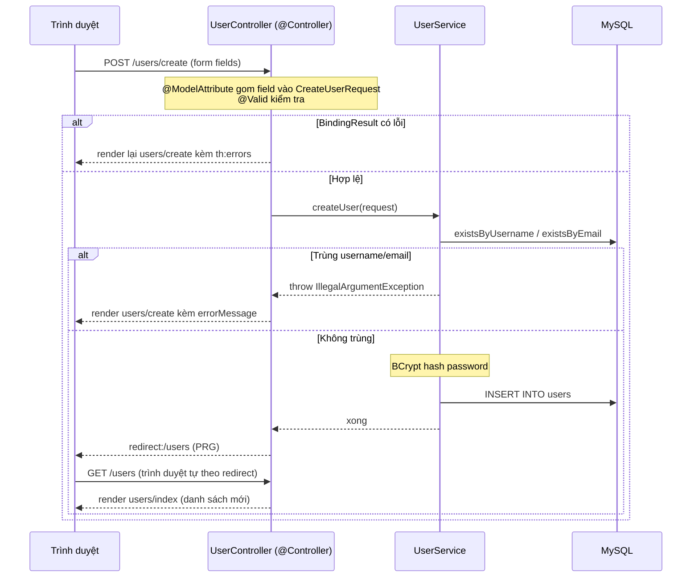

# 05 — Spring MVC + Thymeleaf (Server-side Rendering)

Hướng dẫn từng bước xây một web app quản lý User với giao diện HTML render từ server, dùng `@Controller` + **Thymeleaf** thay vì trả JSON. Đây là mảnh ghép còn thiếu: project 04 làm REST API (cho mobile/SPA), project này làm web truyền thống (trình duyệt hiển thị trang HTML hoàn chỉnh).

> Đọc doc này khi bạn quên sự khác biệt giữa REST API và server-side rendering, cách bind form vào object, cách hiển thị lỗi validation ngay trên form, và cú pháp Thymeleaf. Có đầy đủ code Java lẫn HTML template.

---

## Mục tiêu

- Phân biệt **server-side rendering** (`@Controller` trả HTML) với **REST API** (`@RestController` trả JSON)
- Truyền dữ liệu từ controller vào template bằng `Model`
- Bind dữ liệu form vào DTO bằng `@ModelAttribute`, hiển thị lỗi validation bằng `BindingResult`
- Nắm cú pháp Thymeleaf cơ bản: `th:each`, `th:text`, `th:field`, `th:object`, `th:errors`, `@{...}`
- Áp dụng **PRG pattern** (Post/Redirect/Get) tránh submit trùng
- Xử lý giới hạn của HTML: không có method DELETE → dùng POST form
- Hash password bằng **BCrypt** trước khi lưu DB

---

## Tech Stack

| Thành phần | Lựa chọn |
|---|---|
| Java | 21 (LTS) |
| Spring Boot | 4.0.7 |
| Web | `spring-boot-starter-webmvc` |
| Template engine | `spring-boot-starter-thymeleaf` |
| Persistence | `spring-boot-starter-data-jpa` |
| Validation | `spring-boot-starter-validation` |
| Password hashing | `spring-security-crypto` (chỉ phần crypto, **không** cần cả Spring Security) |
| Database | MySQL |
| Build tool | Maven |

---

## Kiến thức nền — hiểu trước khi code

### 1. Server-side rendering vs REST API

Đây là điểm cốt lõi. So sánh trực tiếp với project 04:

| | REST API (project 04) | Thymeleaf (project 05) |
|---|---|---|
| Annotation | `@RestController` | `@Controller` |
| Method trả về | `ResponseEntity<DTO>` (JSON) | `String` — **tên view template** |
| Nhận form data | `@RequestBody` (JSON body) | `@ModelAttribute` (form fields) |
| Lỗi validation | Ném exception → 400 JSON | `BindingResult` → render lại form kèm lỗi |
| Sau khi tạo/sửa/xóa | Trả 200/201/204 | `redirect:/users` (PRG) |
| Client | Mobile app, SPA (React...) | Trình duyệt (hiển thị HTML) |

Với `@Controller`, khi method `return "users/index"` → Spring hiểu đó là **tên file template** `templates/users/index.html`, Thymeleaf render nó thành HTML rồi gửi về trình duyệt.

### 2. `Model` — cầu nối controller → template

`Model` là "túi dữ liệu" bạn nhét vào để template dùng:

```java
model.addAttribute("users", userService.getAllUsers());
return "users/index";
```

Trong template, truy cập bằng `${users}`.

### 3. `@ModelAttribute` + `BindingResult` — xử lý form

- `@ModelAttribute CreateUserRequest request` — Spring tự gom các field trên form (`username`, `email`...) đổ vào object DTO.
- `@Valid` — kích hoạt validation.
- `BindingResult` — **phải đứng ngay sau** tham số `@Valid`. Nó chứa kết quả validation. Nếu `bindingResult.hasErrors()` → render lại form (kèm lỗi) thay vì tiếp tục.

> **Quan trọng:** Với web form, khi validation fail ta **không** ném exception (như REST API) mà render lại chính trang form để user sửa. Đó là lý do dùng `BindingResult`.

### 4. PRG pattern — Post/Redirect/Get

Sau khi xử lý POST (tạo/sửa/xóa), **không** trả HTML trực tiếp mà `redirect:` sang trang GET khác:

```java
return "redirect:/users";
```

**Vì sao?** Nếu trả HTML trực tiếp sau POST, user bấm F5 (refresh) → trình duyệt gửi lại POST → tạo trùng bản ghi. Redirect biến trạng thái cuối thành một GET → F5 chỉ load lại trang danh sách, an toàn.

### 5. HTML không hỗ trợ method DELETE/PUT

Form HTML chỉ hỗ trợ `GET` và `POST`. Muốn xóa → dùng **POST form** tới URL riêng (`/users/{id}/delete`), không dùng `<a href>` (GET) vì GET không nên gây thay đổi dữ liệu.

### 6. Cú pháp Thymeleaf cần nhớ

| Cú pháp | Ý nghĩa |
|---|---|
| `${...}` | Biểu thức lấy biến từ Model — vd `${user.username}` |
| `*{...}` | Biểu thức trên object đang bind (`th:object`) — vd `*{username}` |
| `@{...}` | Tạo URL — vd `@{/users/{id}/edit(id=${user.id})}` |
| `th:text` | Đặt nội dung text cho thẻ |
| `th:each` | Vòng lặp — `th:each="user : ${users}"` |
| `th:if` | Render có điều kiện |
| `th:object` | Object để bind form (dùng với `*{...}`) |
| `th:field` | Bind input với field — tự sinh `name`, `id`, `value` |
| `th:errors` | Hiển thị lỗi validation của field |
| `#fields.hasErrors('x')` | Kiểm tra field `x` có lỗi không |
| `#lists.isEmpty(list)` | Kiểm tra list rỗng |

### 7. BCrypt — hash password

Không bao giờ lưu password dạng plain text. `BCryptPasswordEncoder` băm password một chiều (không thể giải ngược), có "salt" ngẫu nhiên chống rainbow table. Project chỉ cần thư viện `spring-security-crypto` (nhẹ, không kéo cả Spring Security).

---

## Cấu trúc thư mục cuối cùng

```
05-mvc-thymeleaf/
├── pom.xml
└── src/main/
    ├── java/com/maaitlunghau/__mvc_thymeleaf/
    │   ├── Application.java
    │   ├── config/
    │   │   └── PasswordEncoderConfig.java   ← Bean BCryptPasswordEncoder
    │   ├── controller/
    │   │   └── UserController.java           ← @Controller (trả view name)
    │   ├── service/
    │   │   └── UserService.java
    │   ├── repository/
    │   │   └── UserRepository.java
    │   ├── model/
    │   │   └── User.java                     ← Entity (có password đã hash)
    │   ├── dto/
    │   │   ├── CreateUserRequest.java
    │   │   ├── UpdateUserRequest.java
    │   │   └── UserResponse.java
    │   └── exception/
    │       ├── ResourceNotFoundException.java
    │       └── GlobalExceptionHandler.java   ← @ControllerAdvice (trả view "error")
    └── resources/
        ├── application.properties
        └── templates/                        ← Thymeleaf tìm template ở đây
            ├── error.html
            └── users/
                ├── index.html                ← Danh sách user
                ├── create.html               ← Form tạo
                └── edit.html                 ← Form sửa
```

> Thymeleaf mặc định tìm template trong `src/main/resources/templates/`. Method `return "users/index"` → file `templates/users/index.html`.

---

## Bước 1 — Chuẩn bị MySQL

App dùng database `mvc-thymeleaf` (khác project 04). Tạo trước:

```sql
CREATE DATABASE `mvc-thymeleaf`;
```

Hoặc Docker:

```bash
docker run --name mysql-05 \
  -e MYSQL_ROOT_PASSWORD=112233 \
  -e MYSQL_DATABASE=mvc-thymeleaf \
  -p 3306:3306 \
  -d mysql:8
```

---

## Bước 2 — Khởi tạo project trên start.spring.io

Group `com.maaitlunghau`, Artifact `05-mvc-thymeleaf`, Java **21**, Spring Boot **4.0.7**. Dependencies:

| Dependency | Vai trò |
|---|---|
| **Spring Web** | MVC |
| **Thymeleaf** | Template engine |
| **Spring Data JPA** | Persistence |
| **Validation** | Bean Validation |
| **MySQL Driver** | Kết nối MySQL |
| **Spring Boot DevTools** | Hot reload |

> `spring-security-crypto` **không** có sẵn trên start.spring.io — ta sẽ thêm thủ công vào `pom.xml` ở bước sau (để có BCrypt mà không cần cả Spring Security).

---

## Bước 3 — `pom.xml`

```xml
<?xml version="1.0" encoding="UTF-8"?>
<project xmlns="http://maven.apache.org/POM/4.0.0" xmlns:xsi="http://www.w3.org/2001/XMLSchema-instance"
	xsi:schemaLocation="http://maven.apache.org/POM/4.0.0 https://maven.apache.org/xsd/maven-4.0.0.xsd">
	<modelVersion>4.0.0</modelVersion>
	<parent>
		<groupId>org.springframework.boot</groupId>
		<artifactId>spring-boot-starter-parent</artifactId>
		<version>4.0.7</version>
		<relativePath/>
	</parent>
	<groupId>com.maaitlunghau</groupId>
	<artifactId>05-mvc-thymeleaf</artifactId>
	<version>0.0.1-SNAPSHOT</version>

	<properties>
		<java.version>21</java.version>
	</properties>

	<dependencies>
		<!-- Web MVC -->
		<dependency>
			<groupId>org.springframework.boot</groupId>
			<artifactId>spring-boot-starter-webmvc</artifactId>
		</dependency>

		<!-- Thymeleaf template engine -->
		<dependency>
			<groupId>org.springframework.boot</groupId>
			<artifactId>spring-boot-starter-thymeleaf</artifactId>
		</dependency>

		<!-- Spring Data JPA + Hibernate -->
		<dependency>
			<groupId>org.springframework.boot</groupId>
			<artifactId>spring-boot-starter-data-jpa</artifactId>
		</dependency>

		<!-- Bean Validation -->
		<dependency>
			<groupId>org.springframework.boot</groupId>
			<artifactId>spring-boot-starter-validation</artifactId>
		</dependency>

		<!-- BCrypt password hashing — chỉ lấy phần crypto, không cần toàn bộ Spring Security -->
		<dependency>
			<groupId>org.springframework.security</groupId>
			<artifactId>spring-security-crypto</artifactId>
		</dependency>

		<!-- MySQL JDBC driver -->
		<dependency>
			<groupId>com.mysql</groupId>
			<artifactId>mysql-connector-j</artifactId>
			<scope>runtime</scope>
		</dependency>

		<!-- Hot reload -->
		<dependency>
			<groupId>org.springframework.boot</groupId>
			<artifactId>spring-boot-devtools</artifactId>
			<scope>runtime</scope>
			<optional>true</optional>
		</dependency>

		<!-- Testing -->
		<dependency>
			<groupId>org.springframework.boot</groupId>
			<artifactId>spring-boot-starter-test</artifactId>
			<scope>test</scope>
		</dependency>
	</dependencies>

	<build>
		<plugins>
			<plugin>
				<groupId>org.springframework.boot</groupId>
				<artifactId>spring-boot-maven-plugin</artifactId>
			</plugin>
		</plugins>
	</build>

</project>
```

> `spring-security-crypto` không có `<version>` vì Spring Boot parent POM đã quản lý version giúp.

---

## Bước 4 — `application.properties`

```properties
spring.application.name=05-mvc-thymeleaf
server.port=8081

# MySQL
spring.datasource.url=jdbc:mysql://${MYSQL_HOST:localhost}:3306/mvc-thymeleaf?useSSL=false&serverTimezone=UTC
spring.datasource.username=root
spring.datasource.password=112233
spring.datasource.driver-class-name=com.mysql.cj.jdbc.Driver

# JPA
spring.jpa.hibernate.ddl-auto=update
spring.jpa.show-sql=true
spring.jpa.open-in-view=false
```

---

## Bước 5 — Entity `User.java`

Tạo `model/User.java`:

```java
package com.maaitlunghau.__mvc_thymeleaf.model;

import jakarta.persistence.Column;
import jakarta.persistence.Entity;
import jakarta.persistence.GeneratedValue;
import jakarta.persistence.GenerationType;
import jakarta.persistence.Id;
import jakarta.persistence.Table;

@Entity
@Table(name = "users")
public class User {

    @Id
    @GeneratedValue(strategy = GenerationType.IDENTITY)
    private Long id;

    @Column(nullable = false, unique = true, length = 50)
    private String username;

    @Column(nullable = false, unique = true, length = 100)
    private String email;

    @Column(nullable = false, length = 60)
    private String password;

    @Column(nullable = false)
    private int age;

    protected User() {}

    public User(String username, String email, String password, int age) {
        this.username = username;
        this.email = email;
        this.password = password;
        this.age = age;
    }

    public Long getId() { return id; }
    public String getUsername() { return username; }
    public String getEmail() { return email; }
    public String getPassword() { return password; }
    public int getAge() { return age; }

    public void setUsername(String username) { this.username = username; }
    public void setEmail(String email) { this.email = email; }
    public void setPassword(String password) { this.password = password; }
    public void setAge(int age) { this.age = age; }

    @Override
    public boolean equals(Object obj) {
        if (this == obj) return true;
        if (!(obj instanceof User other)) return false;
        return id != null && id.equals(other.id);
    }

    @Override
    public int hashCode() {
        return getClass().hashCode();
    }

    @Override
    public String toString() {
        return "User [id=" + id + ", username=" + username + ", email=" + email + ", age=" + age + "]";
    }
}
```

**Giải thích:**
- `username` và `email` đều `unique = true` — không cho trùng (kiểm tra sẽ làm ở Service).
- `password` `length = 60` — vừa đủ chứa chuỗi BCrypt (luôn 60 ký tự).
- Không có setter cho `id` — id bất biến.

---

## Bước 6 — Repository `UserRepository.java`

Tạo `repository/UserRepository.java`:

```java
package com.maaitlunghau.__mvc_thymeleaf.repository;

import java.util.Optional;

import org.springframework.data.jpa.repository.JpaRepository;
import org.springframework.stereotype.Repository;

import com.maaitlunghau.__mvc_thymeleaf.model.User;

@Repository
public interface UserRepository extends JpaRepository<User, Long> {

    Optional<User> findByUsername(String username);
    boolean existsByUsername(String username);
    boolean existsByEmail(String email);
}
```

`existsByUsername` / `existsByEmail` là **derived query** — Spring Data tự sinh câu SQL từ tên method. Dùng để check trùng khi tạo user.

---

## Bước 7 — Các DTO

Tạo 3 file trong `dto/`.

### `CreateUserRequest.java`

```java
package com.maaitlunghau.__mvc_thymeleaf.dto;

import jakarta.validation.constraints.Email;
import jakarta.validation.constraints.Max;
import jakarta.validation.constraints.Min;
import jakarta.validation.constraints.NotBlank;
import jakarta.validation.constraints.Size;

public record CreateUserRequest(

        @NotBlank(message = "Username is required")
        @Size(min = 3, max = 50, message = "Username must be between 3 and 50 characters")
        String username,

        @NotBlank(message = "Email is required")
        @Email(message = "Invalid email format")
        String email,

        @NotBlank(message = "Password is required")
        @Size(min = 6, message = "Password must be at least 6 characters")
        String password,

        @Min(value = 1, message = "Age must be at least 1")
        @Max(value = 150, message = "Age must be at most 150")
        int age
) {}
```

### `UpdateUserRequest.java`

```java
package com.maaitlunghau.__mvc_thymeleaf.dto;

import jakarta.validation.constraints.Email;
import jakarta.validation.constraints.Max;
import jakarta.validation.constraints.Min;
import jakarta.validation.constraints.NotBlank;
import jakarta.validation.constraints.Size;

public record UpdateUserRequest(

        @NotBlank(message = "Username is required")
        @Size(min = 3, max = 50, message = "Username must be between 3 and 50 characters")
        String username,

        @NotBlank(message = "Email is required")
        @Email(message = "Invalid email format")
        String email,

        String password,

        @Min(value = 1, message = "Age must be at least 1")
        @Max(value = 150, message = "Age must be at most 150")
        int age
) {}
```

> Khác `CreateUserRequest`: `password` **không** có `@NotBlank` — khi sửa, để trống nghĩa là "giữ nguyên password cũ". Việc kiểm tra độ dài password mới (nếu có nhập) được xử lý trong Service.

### `UserResponse.java`

```java
package com.maaitlunghau.__mvc_thymeleaf.dto;

import com.maaitlunghau.__mvc_thymeleaf.model.User;

public record UserResponse(Long id, String username, String email, int age) {

    public static UserResponse from(User user) {
        return new UserResponse(user.getId(), user.getUsername(), user.getEmail(), user.getAge());
    }
}
```

> `UserResponse` **không có** field `password` — không bao giờ đưa password (dù đã hash) ra view.

---

## Bước 8 — `PasswordEncoderConfig.java`

Tạo `config/PasswordEncoderConfig.java` — khai báo Bean `PasswordEncoder` để inject vào Service:

```java
package com.maaitlunghau.__mvc_thymeleaf.config;

import org.springframework.context.annotation.Bean;
import org.springframework.context.annotation.Configuration;
import org.springframework.security.crypto.bcrypt.BCryptPasswordEncoder;
import org.springframework.security.crypto.password.PasswordEncoder;

@Configuration
public class PasswordEncoderConfig {

    @Bean
    public PasswordEncoder passwordEncoder() {
        return new BCryptPasswordEncoder(12);
    }
}
```

**Giải thích:**
- `@Configuration` + `@Bean` — cách khai báo Bean thủ công (khi object không phải class của mình để gắn `@Component`).
- `BCryptPasswordEncoder(12)` — số `12` là "strength" (số vòng lặp băm = 2^12). Cao hơn = an toàn hơn nhưng chậm hơn.

---

## Bước 9 — Exception handling

Tạo 2 file trong `exception/`.

### `ResourceNotFoundException.java`

```java
package com.maaitlunghau.__mvc_thymeleaf.exception;

public class ResourceNotFoundException extends RuntimeException {

    public ResourceNotFoundException(String resource, Object id) {
        super(resource + " not found with id: " + id);
    }
}
```

### `GlobalExceptionHandler.java`

```java
package com.maaitlunghau.__mvc_thymeleaf.exception;

import org.springframework.ui.Model;
import org.springframework.web.bind.annotation.ControllerAdvice;
import org.springframework.web.bind.annotation.ExceptionHandler;

@ControllerAdvice
public class GlobalExceptionHandler {

    @ExceptionHandler(ResourceNotFoundException.class)
    public String handleNotFound(ResourceNotFoundException ex, Model model) {
        model.addAttribute("errorMessage", ex.getMessage());
        return "error";
    }

    @ExceptionHandler(Exception.class)
    public String handleGeneral(Exception ex, Model model) {
        model.addAttribute("errorMessage", "An unexpected error occurred: " + ex.getMessage());
        return "error";
    }
}
```

> **Khác project 04:** Ở đây dùng `@ControllerAdvice` (không phải `@RestControllerAdvice`) và method trả về **tên view** `"error"` — vì đây là web app, lỗi cần hiển thị thành trang HTML đẹp, không phải JSON. `model.addAttribute("errorMessage", ...)` đưa thông báo lỗi vào trang `error.html`.

---

## Bước 10 — Service `UserService.java`

Tạo `service/UserService.java`:

```java
package com.maaitlunghau.__mvc_thymeleaf.service;

import java.util.List;

import org.springframework.security.crypto.password.PasswordEncoder;
import org.springframework.stereotype.Service;
import org.springframework.transaction.annotation.Transactional;
import org.springframework.util.StringUtils;

import com.maaitlunghau.__mvc_thymeleaf.dto.CreateUserRequest;
import com.maaitlunghau.__mvc_thymeleaf.dto.UpdateUserRequest;
import com.maaitlunghau.__mvc_thymeleaf.dto.UserResponse;
import com.maaitlunghau.__mvc_thymeleaf.exception.ResourceNotFoundException;
import com.maaitlunghau.__mvc_thymeleaf.model.User;
import com.maaitlunghau.__mvc_thymeleaf.repository.UserRepository;

@Service
@Transactional(readOnly = true)
public class UserService {

    private final UserRepository userRepository;
    private final PasswordEncoder passwordEncoder;

    public UserService(UserRepository userRepository, PasswordEncoder passwordEncoder) {
        this.userRepository = userRepository;
        this.passwordEncoder = passwordEncoder;
    }

    public List<UserResponse> getAllUsers() {
        return userRepository.findAll()
                .stream()
                .map(UserResponse::from)
                .toList();
    }

    public UserResponse getUserById(Long id) {
        return userRepository.findById(id)
                .map(UserResponse::from)
                .orElseThrow(() -> new ResourceNotFoundException("User", id));
    }

    // Trả về Entity (không phải DTO) — dùng cho form edit cần dữ liệu gốc
    public User getUserEntityById(Long id) {
        return userRepository.findById(id)
                .orElseThrow(() -> new ResourceNotFoundException("User", id));
    }

    @Transactional
    public void createUser(CreateUserRequest request) {
        if (userRepository.existsByUsername(request.username())) {
            throw new IllegalArgumentException("Username already exists: " + request.username());
        }
        if (userRepository.existsByEmail(request.email())) {
            throw new IllegalArgumentException("Email already exists: " + request.email());
        }

        String hashedPassword = passwordEncoder.encode(request.password());

        User user = new User(request.username(), request.email(), hashedPassword, request.age());
        userRepository.save(user);
    }

    @Transactional
    public void updateUser(Long id, UpdateUserRequest request) {
        User user = userRepository.findById(id)
                .orElseThrow(() -> new ResourceNotFoundException("User", id));

        user.setUsername(request.username());
        user.setEmail(request.email());
        user.setAge(request.age());

        // Chỉ đổi password khi user thực sự nhập password mới (không để trống)
        if (StringUtils.hasText(request.password())) {
            if (request.password().length() < 6) {
                throw new IllegalArgumentException("New password must be at least 6 characters");
            }
            user.setPassword(passwordEncoder.encode(request.password()));
        }
    }

    @Transactional
    public void deleteUser(Long id) {
        if (!userRepository.existsById(id)) {
            throw new ResourceNotFoundException("User", id);
        }
        userRepository.deleteById(id);
    }
}
```

**Giải thích các điểm mấu chốt:**
- Inject cả `UserRepository` lẫn `PasswordEncoder` qua constructor.
- `createUser` — check trùng username/email (ném `IllegalArgumentException` để controller hiển thị lỗi trên form), **hash password** trước khi lưu.
- `updateUser` — dùng dirty checking (set field, không `save()`). Password chỉ đổi khi user nhập mới (`StringUtils.hasText`) — để trống = giữ nguyên.
- `getUserEntityById` — trả về Entity gốc để controller đổ dữ liệu hiện tại vào form edit.

---

## Bước 11 — Controller `UserController.java`

Tạo `controller/UserController.java`:

```java
package com.maaitlunghau.__mvc_thymeleaf.controller;

import org.springframework.stereotype.Controller;
import org.springframework.ui.Model;
import org.springframework.validation.BindingResult;
import org.springframework.web.bind.annotation.GetMapping;
import org.springframework.web.bind.annotation.ModelAttribute;
import org.springframework.web.bind.annotation.PathVariable;
import org.springframework.web.bind.annotation.PostMapping;
import org.springframework.web.bind.annotation.RequestMapping;

import com.maaitlunghau.__mvc_thymeleaf.dto.CreateUserRequest;
import com.maaitlunghau.__mvc_thymeleaf.dto.UpdateUserRequest;
import com.maaitlunghau.__mvc_thymeleaf.model.User;
import com.maaitlunghau.__mvc_thymeleaf.service.UserService;

import jakarta.validation.Valid;

@Controller
@RequestMapping("/users")
public class UserController {

    private final UserService userService;

    public UserController(UserService userService) {
        this.userService = userService;
    }

    @GetMapping
    public String listUsers(Model model) {
        model.addAttribute("users", userService.getAllUsers());
        return "users/index";
    }

    @GetMapping("/create")
    public String showCreateForm(Model model) {
        model.addAttribute("createUserRequest", new CreateUserRequest("", "", "", 0));
        return "users/create";
    }

    @PostMapping("/create")
    public String createUser(@Valid @ModelAttribute CreateUserRequest createUserRequest,
                             BindingResult bindingResult,
                             Model model) {
        if (bindingResult.hasErrors()) {
            return "users/create";
        }
        try {
            userService.createUser(createUserRequest);
        } catch (IllegalArgumentException ex) {
            model.addAttribute("errorMessage", ex.getMessage());
            return "users/create";
        }

        return "redirect:/users";
    }

    @GetMapping("/{id}/edit")
    public String showEditForm(@PathVariable Long id, Model model) {
        User user = userService.getUserEntityById(id);

        model.addAttribute("updateUserRequest",
                new UpdateUserRequest(user.getUsername(), user.getEmail(), "", user.getAge()));
        model.addAttribute("userId", id);
        return "users/edit";
    }

    @PostMapping("/{id}/edit")
    public String updateUser(@PathVariable Long id,
                             @Valid @ModelAttribute UpdateUserRequest updateUserRequest,
                             BindingResult bindingResult,
                             Model model) {
        if (bindingResult.hasErrors()) {
            model.addAttribute("userId", id);
            return "users/edit";
        }
        try {
            userService.updateUser(id, updateUserRequest);
        } catch (IllegalArgumentException ex) {
            model.addAttribute("errorMessage", ex.getMessage());
            model.addAttribute("userId", id);
            return "users/edit";
        }
        return "redirect:/users";
    }

    @PostMapping("/{id}/delete")
    public String deleteUser(@PathVariable Long id) {
        userService.deleteUser(id);
        return "redirect:/users";
    }
}
```

**Giải thích luồng từng action:**
- `listUsers` (`GET /users`) — nhét danh sách vào model, render `users/index`.
- `showCreateForm` (`GET /users/create`) — tạo DTO rỗng để form bind (Thymeleaf cần object sẵn để `th:object`), render form.
- `createUser` (`POST /users/create`) — validate; nếu lỗi validation → render lại form; nếu trùng username/email (Service ném `IllegalArgumentException`) → hiển thị `errorMessage`; thành công → `redirect:/users` (PRG).
- `showEditForm` (`GET /users/{id}/edit`) — lấy user hiện tại, đổ vào DTO (password để trống), truyền `userId` cho form biết submit về đâu.
- `updateUser` (`POST /users/{id}/edit`) — tương tự create, nhớ đưa lại `userId` khi render lại form lỗi.
- `deleteUser` (`POST /users/{id}/delete`) — xóa rồi redirect. Dùng POST vì HTML không có DELETE.

---

## Bước 12 — Templates Thymeleaf

Tạo các file trong `src/main/resources/templates/`.

### `users/index.html` — danh sách user

```html
<!DOCTYPE html>
<html xmlns:th="http://www.thymeleaf.org">
<head>
    <meta charset="UTF-8">
    <title>Users</title>
    <style>
        body { font-family: sans-serif; max-width: 900px; margin: 40px auto; padding: 0 20px; }
        table { width: 100%; border-collapse: collapse; }
        th, td { padding: 10px 14px; border: 1px solid #ddd; text-align: left; }
        th { background: #f5f5f5; }
        tr:hover { background: #fafafa; }
        .btn { padding: 6px 14px; border: none; border-radius: 4px; cursor: pointer; text-decoration: none; font-size: 13px; }
        .btn-primary { background: #3b82f6; color: white; }
        .btn-warning { background: #f59e0b; color: white; }
        .btn-danger { background: #ef4444; color: white; }
        .header { display: flex; justify-content: space-between; align-items: center; margin-bottom: 20px; }
    </style>
</head>
<body>

<div class="header">
    <h1>User Management</h1>
    <a href="/users/create" class="btn btn-primary">+ Add User</a>
</div>

<table>
    <thead>
        <tr>
            <th>ID</th>
            <th>Username</th>
            <th>Email</th>
            <th>Age</th>
            <th>Actions</th>
        </tr>
    </thead>
    <tbody>
        <!-- th:each lặp qua danh sách users từ model, tương tự for-each -->
        <tr th:each="user : ${users}">
            <td th:text="${user.id}"></td>
            <td th:text="${user.username}"></td>
            <td th:text="${user.email}"></td>
            <td th:text="${user.age}"></td>
            <td>
                <a th:href="@{/users/{id}/edit(id=${user.id})}" class="btn btn-warning">Edit</a>
                <!-- Form POST để delete vì HTML không hỗ trợ DELETE method -->
                <form th:action="@{/users/{id}/delete(id=${user.id})}" method="post" style="display:inline"
                      onsubmit="return confirm('Delete this user?')">
                    <button type="submit" class="btn btn-danger">Delete</button>
                </form>
            </td>
        </tr>
        <tr th:if="${#lists.isEmpty(users)}">
            <td colspan="5" style="text-align:center; color:#888;">No users found.</td>
        </tr>
    </tbody>
</table>

</body>
</html>
```

### `users/create.html` — form tạo

```html
<!DOCTYPE html>
<html xmlns:th="http://www.thymeleaf.org">
<head>
    <meta charset="UTF-8">
    <title>Create User</title>
    <style>
        body { font-family: sans-serif; max-width: 500px; margin: 40px auto; padding: 0 20px; }
        .form-group { margin-bottom: 16px; }
        label { display: block; margin-bottom: 4px; font-weight: 500; }
        input { width: 100%; padding: 8px 10px; border: 1px solid #ddd; border-radius: 4px; box-sizing: border-box; }
        .error { color: #ef4444; font-size: 13px; margin-top: 4px; }
        .alert { background: #fee2e2; border: 1px solid #fca5a5; padding: 10px 14px; border-radius: 4px; margin-bottom: 16px; color: #b91c1c; }
        .btn { padding: 8px 20px; border: none; border-radius: 4px; cursor: pointer; }
        .btn-primary { background: #3b82f6; color: white; }
        .btn-secondary { background: #e5e7eb; color: #374151; text-decoration: none; padding: 8px 20px; border-radius: 4px; }
        .actions { display: flex; gap: 10px; margin-top: 8px; }
    </style>
</head>
<body>

<h1>Create User</h1>

<!-- Hiển thị lỗi duplicate username/email từ service -->
<div class="alert" th:if="${errorMessage}" th:text="${errorMessage}"></div>

<!--
    th:action: URL submit form
    th:object: bind form với object CreateUserRequest từ model
    method="post": gửi data qua POST request
-->
<form th:action="@{/users/create}" th:object="${createUserRequest}" method="post">

    <div class="form-group">
        <label>Username</label>
        <!-- th:field bind input với field của object, tự điền name, id, value -->
        <input type="text" th:field="*{username}" placeholder="Enter username">
        <!-- th:errors hiển thị validation error của field nếu có -->
        <span class="error" th:if="${#fields.hasErrors('username')}" th:errors="*{username}"></span>
    </div>

    <div class="form-group">
        <label>Email</label>
        <input type="email" th:field="*{email}" placeholder="Enter email">
        <span class="error" th:if="${#fields.hasErrors('email')}" th:errors="*{email}"></span>
    </div>

    <div class="form-group">
        <label>Password</label>
        <input type="password" th:field="*{password}" placeholder="Min 6 characters">
        <span class="error" th:if="${#fields.hasErrors('password')}" th:errors="*{password}"></span>
    </div>

    <div class="form-group">
        <label>Age</label>
        <input type="number" th:field="*{age}" placeholder="Enter age">
        <span class="error" th:if="${#fields.hasErrors('age')}" th:errors="*{age}"></span>
    </div>

    <div class="actions">
        <button type="submit" class="btn btn-primary">Create</button>
        <a href="/users" class="btn-secondary">Cancel</a>
    </div>

</form>

</body>
</html>
```

### `users/edit.html` — form sửa

```html
<!DOCTYPE html>
<html xmlns:th="http://www.thymeleaf.org">
<head>
    <meta charset="UTF-8">
    <title>Edit User</title>
    <style>
        body { font-family: sans-serif; max-width: 500px; margin: 40px auto; padding: 0 20px; }
        .form-group { margin-bottom: 16px; }
        label { display: block; margin-bottom: 4px; font-weight: 500; }
        input { width: 100%; padding: 8px 10px; border: 1px solid #ddd; border-radius: 4px; box-sizing: border-box; }
        .error { color: #ef4444; font-size: 13px; margin-top: 4px; }
        .hint { color: #6b7280; font-size: 12px; margin-top: 4px; }
        .btn { padding: 8px 20px; border: none; border-radius: 4px; cursor: pointer; }
        .btn-primary { background: #3b82f6; color: white; }
        .btn-secondary { background: #e5e7eb; color: #374151; text-decoration: none; padding: 8px 20px; border-radius: 4px; }
        .actions { display: flex; gap: 10px; margin-top: 8px; }
    </style>
</head>
<body>

<h1>Edit User</h1>

<!-- URL submit chứa userId — Thymeleaf thay {id} bằng giá trị userId từ model -->
<form th:action="@{/users/{id}/edit(id=${userId})}" th:object="${updateUserRequest}" method="post">

    <div class="form-group">
        <label>Username</label>
        <input type="text" th:field="*{username}">
        <span class="error" th:if="${#fields.hasErrors('username')}" th:errors="*{username}"></span>
    </div>

    <div class="form-group">
        <label>Email</label>
        <input type="email" th:field="*{email}">
        <span class="error" th:if="${#fields.hasErrors('email')}" th:errors="*{email}"></span>
    </div>

    <div class="form-group">
        <label>New Password</label>
        <input type="password" th:field="*{password}" placeholder="Leave blank to keep current password">
        <!-- Gợi ý để trống nếu không muốn đổi password -->
        <span class="hint">Leave blank to keep your current password</span>
        <span class="error" th:if="${#fields.hasErrors('password')}" th:errors="*{password}"></span>
    </div>

    <div class="form-group">
        <label>Age</label>
        <input type="number" th:field="*{age}">
        <span class="error" th:if="${#fields.hasErrors('age')}" th:errors="*{age}"></span>
    </div>

    <div class="actions">
        <button type="submit" class="btn btn-primary">Save Changes</button>
        <a href="/users" class="btn-secondary">Cancel</a>
    </div>

</form>

</body>
</html>
```

### `error.html` — trang lỗi chung

```html
<!DOCTYPE html>
<html xmlns:th="http://www.thymeleaf.org">
<head>
    <meta charset="UTF-8">
    <title>Error</title>
    <style>
        body { font-family: sans-serif; max-width: 500px; margin: 40px auto; padding: 0 20px; }
        .alert { background: #fee2e2; border: 1px solid #fca5a5; padding: 16px 20px; border-radius: 4px; color: #b91c1c; }
    </style>
</head>
<body>

<h1>Something went wrong</h1>
<div class="alert" th:text="${errorMessage}">An error occurred.</div>
<br>
<a href="/users">← Back to Users</a>

</body>
</html>
```

---

## Bước 13 — Chạy và test

```bash
cd projects/05-mvc-thymeleaf
# Đảm bảo MySQL đang chạy, database mvc-thymeleaf đã tồn tại
./mvnw spring-boot:run
```

Mở trình duyệt: `http://localhost:8081/users`

### Các trang và thao tác

| Method | URL | Mô tả |
|---|---|---|
| GET | `/users` | Danh sách user |
| GET | `/users/create` | Form tạo user mới |
| POST | `/users/create` | Submit form tạo |
| GET | `/users/{id}/edit` | Form chỉnh sửa |
| POST | `/users/{id}/edit` | Submit form chỉnh sửa |
| POST | `/users/{id}/delete` | Xóa user |

### Kịch bản test trên trình duyệt

1. Vào `/users` → thấy bảng rỗng ("No users found").
2. Bấm **+ Add User** → điền form → **Create** → quay về danh sách (PRG), thấy user mới.
3. Thử tạo user với **username trùng** → form hiển thị "Username already exists".
4. Thử để **email sai định dạng** hoặc **password < 6 ký tự** → form hiển thị lỗi validation ngay dưới field.
5. Bấm **Edit** một user → sửa → để trống password (giữ nguyên) → **Save Changes**.
6. Bấm **Delete** → hộp confirm → xác nhận → user biến mất.

> Kiểm tra password đã hash: vào MySQL chạy `SELECT username, password FROM users;` — cột `password` là chuỗi BCrypt dạng `$2a$12$...` chứ không phải plain text.

---

## Tóm tắt luồng hoạt động

Ví dụ submit form tạo user (có nhánh lỗi validation và PRG):



---

## So sánh project 04 (REST) vs 05 (Thymeleaf)

| | Project 04 (REST API) | Project 05 (Thymeleaf) |
|---|---|---|
| Controller | `@RestController` | `@Controller` |
| Trả về | `ResponseEntity<DTO>` (JSON) | `String` (tên view) |
| Nhận input | `@RequestBody` | `@ModelAttribute` |
| Validation fail | Ném exception → 400 JSON | `BindingResult` → render lại form |
| Advice | `@RestControllerAdvice` (JSON) | `@ControllerAdvice` (view "error") |
| Sau mutation | 201/204 | `redirect:` (PRG) |
| DELETE | Có method DELETE | POST form (HTML không có DELETE) |
| Password | (không có) | BCrypt hash |
| Client | Mobile/SPA | Trình duyệt |

---

## Checklist tự kiểm tra

- [ ] Phân biệt được `@Controller` (trả view) và `@RestController` (trả JSON)
- [ ] Giải thích `@ModelAttribute` + `BindingResult` xử lý form validation thế nào
- [ ] Hiểu PRG pattern và vì sao cần `redirect:` sau POST
- [ ] Biết vì sao delete phải dùng POST form thay vì `<a href>`
- [ ] Đọc hiểu được `th:each`, `th:field`, `th:object`, `*{...}`, `@{...}`, `th:errors`
- [ ] Giải thích vì sao `password` trong `UpdateUserRequest` không có `@NotBlank`
- [ ] Xác nhận được password lưu trong DB là chuỗi BCrypt, không phải plain text
