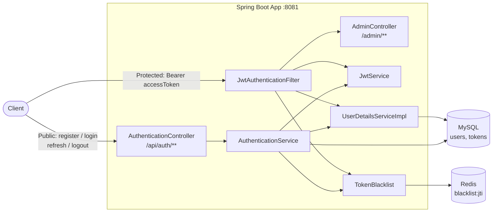
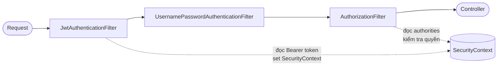
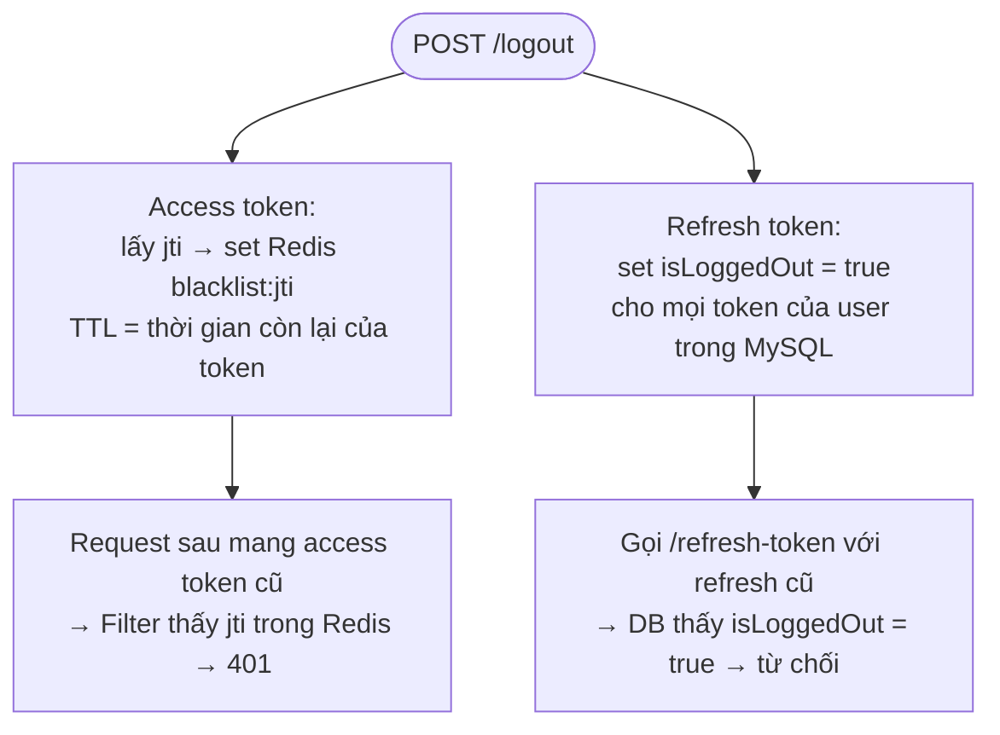
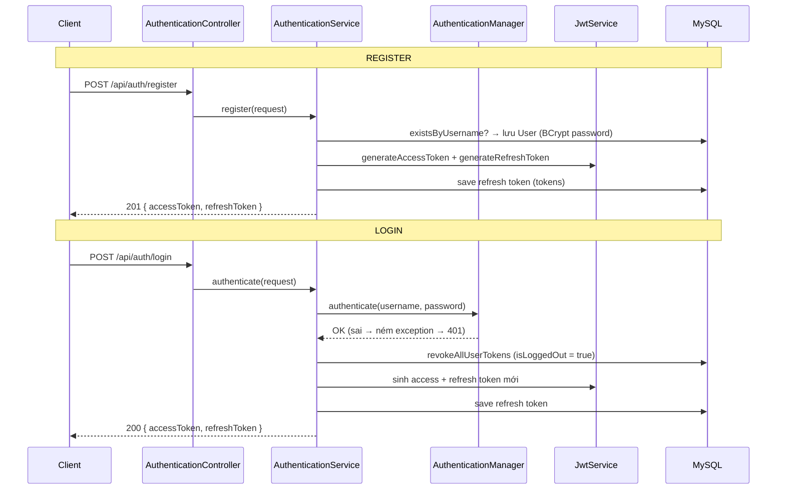
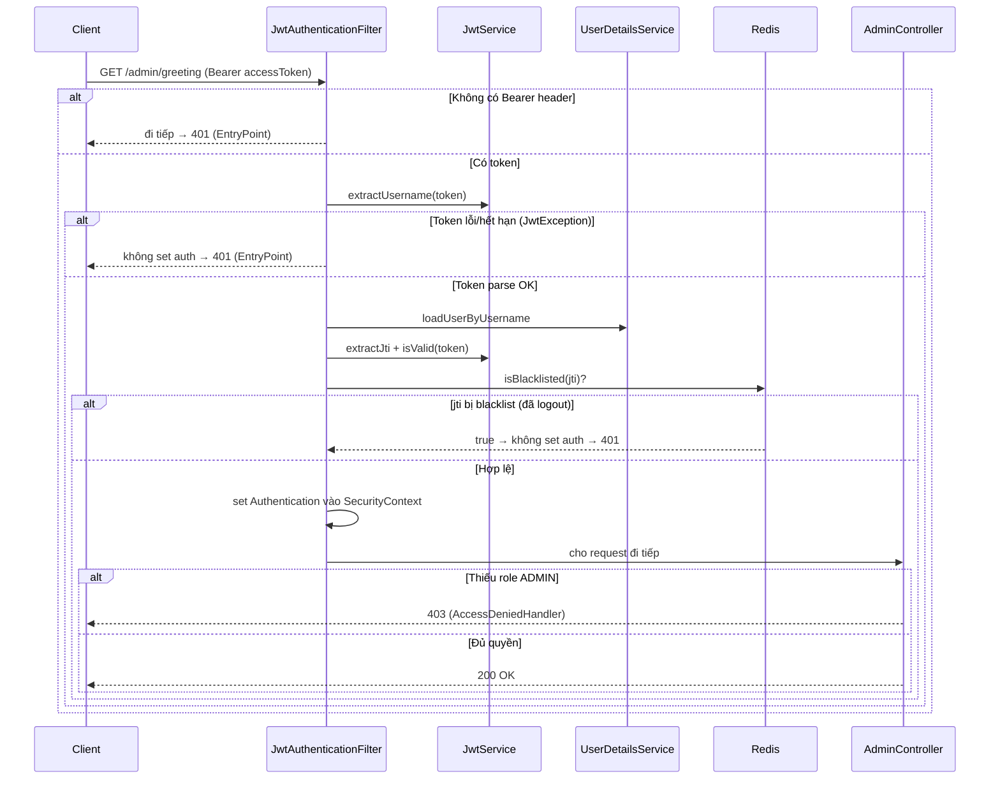
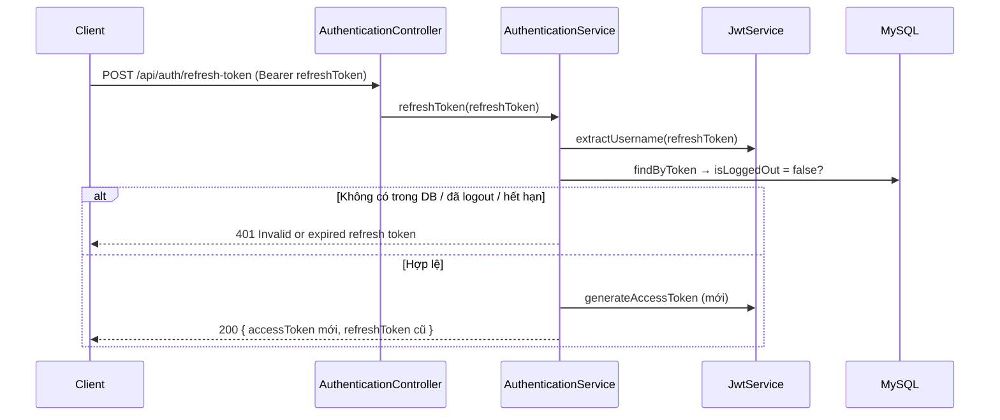
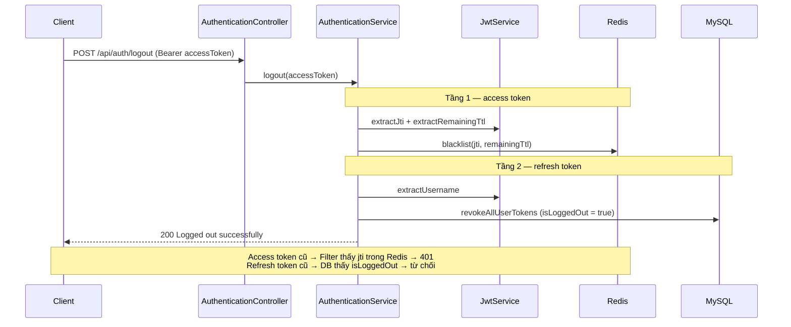

# 06 — Spring Security + JWT Authentication

Hướng dẫn từng bước xây một hệ thống xác thực & phân quyền hoàn chỉnh, chuẩn production: **JWT stateless authentication**, **access token + refresh token**, và **chiến lược thu hồi token 2 tầng** (refresh token lưu MySQL + access token blacklist bằng Redis). Đây là project phức tạp nhất trong nhóm nền tảng — gộp Spring Security, JWT, MySQL và Redis.

> Đọc doc này khi bạn quên cách Spring Security xử lý một request có token, tại sao cần cả access lẫn refresh token, và làm sao logout mà access token (vốn stateless) bị vô hiệu ngay lập tức. Doc có nhiều sơ đồ để nhìn toàn cảnh trước khi đọc code.

---

## Mục tiêu

- Hiểu **Spring Security filter chain** và vị trí của một custom JWT filter
- Tích hợp `UserDetails` / `UserDetailsService` với User entity
- Sinh và xác thực **JWT** bằng thư viện JJWT
- Hiểu **stateless session** — không dùng HTTP Session, mỗi request tự mang token
- Phân biệt **access token** (ngắn hạn, 15 phút) và **refresh token** (dài hạn, 7 ngày)
- **Thu hồi token 2 tầng**: refresh token đánh dấu `isLoggedOut` trong MySQL; access token blacklist theo `jti` trong Redis (hết hạn tự động theo TTL)
- Trả lỗi 401 / 403 dưới dạng JSON nhất quán bằng custom `AuthenticationEntryPoint` và `AccessDeniedHandler`
- Chuẩn hóa mọi response bằng `ApiResponse<T>` wrapper

---

## Tech Stack

| Thành phần | Lựa chọn |
|---|---|
| Java | 21 (LTS) |
| Spring Boot | 4.0.7 |
| Security | `spring-boot-starter-security` |
| Web | `spring-boot-starter-web` |
| Persistence | `spring-boot-starter-data-jpa` + MySQL |
| Cache/Blacklist | `spring-boot-starter-data-redis` + Redis |
| JWT | JJWT (`jjwt-api`, `jjwt-impl`, `jjwt-jackson`) 0.13.0 |
| Validation | `spring-boot-starter-validation` |
| Hạ tầng | Docker Compose (MySQL + Redis + phpMyAdmin) |

---

## Kiến trúc tổng quan



**Vì sao cần cả MySQL lẫn Redis?**

| Kho | Lưu gì | Mục đích |
|---|---|---|
| **MySQL** | `users`, `tokens` (refresh token + cờ `isLoggedOut`) | Dữ liệu bền vững; kiểm tra refresh token còn hiệu lực khi cấp access token mới |
| **Redis** | `blacklist:<jti>` với TTL | Vô hiệu access token **ngay lập tức** khi logout; key tự hết hạn khi token hết hạn (không rác) |

---

## Kiến thức nền — hiểu trước khi code

### 1. JWT là gì?

JWT (JSON Web Token) là một chuỗi 3 phần ngăn cách bởi dấu chấm: `header.payload.signature`

```
eyJhbGciOiJIUzI1NiJ9  .  eyJzdWIiOiJqb2huIiwiZXhwIjoxNzAwfQ  .  SflKxwRJSMeKKF2QT4fwpMeJf36...
     Header (base64)            Payload / Claims (base64)              Signature (HMAC-SHA)
```

- **Header** — thuật toán ký (vd HS256).
- **Payload (claims)** — dữ liệu: `sub` (username), `exp` (hết hạn), `iat` (thời điểm tạo), `jti` (id token, chỉ access token có).
- **Signature** — chữ ký HMAC-SHA dùng **secret key** phía server. Client sửa payload → chữ ký sai → server từ chối. Đây là điều khiến JWT không giả mạo được.

> JWT **không mã hóa** — ai cũng đọc được payload (chỉ là base64). Nó chỉ **chống giả mạo** bằng chữ ký. Vì thế đừng nhét thông tin nhạy cảm vào payload.

### 2. Access token vs Refresh token

| | Access Token | Refresh Token |
|---|---|---|
| Thời hạn | Ngắn — **15 phút** (900000 ms) | Dài — **7 ngày** (604800000 ms) |
| Dùng để | Đính kèm mọi request để truy cập tài nguyên | Xin cấp access token mới khi hết hạn |
| Có `jti`? | **Có** (để blacklist được từng token) | Không |
| Lưu ở server? | Không (stateless) — chỉ blacklist khi logout | **Có** — lưu trong bảng `tokens` (MySQL) |

**Vì sao tách 2 token?** Access token ngắn hạn để nếu bị lộ thì thiệt hại giới hạn. Thay vì bắt user login lại mỗi 15 phút, refresh token (sống lâu, lưu DB, có thể thu hồi) cho phép lấy access token mới êm ái.

### 3. Stateless authentication

Không dùng HTTP Session. Server **không nhớ** ai đã login. Mỗi request phải tự mang access token trong header:

```
Authorization: Bearer <accessToken>
```

Server xác thực token trên từng request rồi "quên" ngay. Ưu điểm: dễ scale ngang (không cần chia sẻ session giữa nhiều server).

### 4. `UserDetails` / `UserDetailsService`

Spring Security không biết gì về `User` entity của bạn. Nó làm việc qua 2 abstraction:
- **`UserDetails`** — interface mô tả "một user" đối với Security (username, password, authorities). Project này cho `User` entity **implement thẳng** `UserDetails`.
- **`UserDetailsService`** — interface có 1 method `loadUserByUsername(username)`. Spring gọi nó để nạp user từ DB.

### 5. Security Filter Chain và vị trí JWT filter

Mỗi request đi qua một chuỗi filter của Spring Security trước khi tới controller. Ta chèn `JwtAuthenticationFilter` **trước** `UsernamePasswordAuthenticationFilter`:



`JwtAuthenticationFilter` đọc token, xác thực, rồi **đặt Authentication vào `SecurityContext`**. Filter phân quyền phía sau đọc `SecurityContext` để quyết định cho qua (200) hay chặn (403).

### 6. Chiến lược thu hồi token 2 tầng (điểm khó nhất)

Vấn đề: JWT stateless nghĩa là **không thể "xóa" một token đã cấp**. Vậy logout thì access token vẫn hợp lệ tới khi hết hạn? Giải pháp 2 tầng:



- **Access token** → blacklist `jti` trong Redis với TTL = thời gian còn lại. Key tự biến mất khi token hết hạn → Redis không phình to.
- **Refresh token** → đánh dấu `isLoggedOut = true` trong MySQL. Lần refresh sau bị chặn.

---

## Cấu trúc thư mục cuối cùng

```
06-spring-security-jwt/
├── docker-compose.yml                    ← MySQL + Redis + phpMyAdmin
├── pom.xml
└── src/main/
    ├── java/com/maaitlunghau/__spring_security_jwt/
    │   ├── Application.java
    │   ├── config/
    │   │   ├── SecurityConfig.java             ← Filter chain, rules, beans
    │   │   ├── CustomAuthenticationEntryPoint.java  ← 401 JSON
    │   │   └── CustomAccessDeniedHandler.java       ← 403 JSON
    │   ├── controller/
    │   │   ├── AuthenticationController.java   ← /api/auth/**
    │   │   └── AdminController.java            ← /admin/** (ADMIN)
    │   ├── service/
    │   │   ├── AuthenticationService.java      ← register/login/refresh/logout
    │   │   ├── JwtService.java                 ← sinh & đọc JWT
    │   │   ├── TokenBlacklist.java             ← Redis blacklist
    │   │   └── UserDetailsServiceImpl.java     ← nạp user cho Security
    │   ├── filter/
    │   │   └── JwtAuthenticationFilter.java    ← chặn mọi request, validate token
    │   ├── model/
    │   │   ├── User.java                       ← Entity implements UserDetails
    │   │   ├── Token.java                      ← Refresh token trong DB
    │   │   └── Role.java                       ← enum USER / ADMIN
    │   ├── repository/
    │   │   ├── UserRepository.java
    │   │   └── TokenRepository.java
    │   └── dto/
    │       ├── ApiResponse.java               ← Wrapper response chuẩn
    │       ├── AuthenticationResponse.java     ← { accessToken, refreshToken }
    │       ├── LoginRequest.java
    │       └── RegisterRequest.java
    └── resources/
        └── application.properties
```

---

## Bước 1 — Khởi động hạ tầng bằng Docker

Tạo `docker-compose.yml` ở thư mục project:

```yaml
services:
  mysql:
    image: mysql:8
    ports:
      - "3306:3306"
    environment:
      MYSQL_ROOT_PASSWORD: 112233
      MYSQL_DATABASE: spring-security-jwt
    volumes:
      - mysql_data:/var/lib/mysql

  redis:
    image: redis:latest
    ports:
      - "6379:6379"

  phpmyadmin:
    image: phpmyadmin:latest
    ports:
      - "8080:80"
    environment:
      PMA_HOST: mysql
      MYSQL_ROOT_PASSWORD: 112233
    depends_on:
      - mysql

volumes:
  mysql_data:
```

Khởi động:

```bash
cd projects/06-spring-security-jwt
docker compose up -d
```

| Service | URL / Port | Ghi chú |
|---|---|---|
| MySQL | `localhost:3306` | database `spring-security-jwt` tự tạo |
| Redis | `localhost:6379` | dùng cho blacklist |
| phpMyAdmin | `http://localhost:8080` | user `root`, password `112233` |

---

## Bước 2 — Khởi tạo project + thêm JJWT

Trên start.spring.io, chọn dependencies: **Spring Web**, **Spring Security**, **Spring Data JPA**, **Validation**, **Spring Data Redis**, **MySQL Driver**, **Spring Boot DevTools**.

JJWT không có trên start.spring.io — thêm thủ công vào `pom.xml` (3 artifact, version `0.13.0`) ở bước sau.

---

## Bước 3 — `pom.xml`

```xml
<?xml version="1.0" encoding="UTF-8"?>
<project xmlns="http://maven.apache.org/POM/4.0.0" xmlns:xsi="http://www.w3.org/2001/XMLSchema-instance"
	xsi:schemaLocation="http://maven.apache.org/POM/4.0.0 https://maven.apache.org/xsd/maven-4.0.0.xsd">
	<modelVersion>4.0.0</modelVersion>
	<parent>
		<groupId>org.springframework.boot</groupId>
		<artifactId>spring-boot-starter-parent</artifactId>
		<version>4.0.7</version>
		<relativePath/>
	</parent>
	<groupId>com.maaitlunghau</groupId>
	<artifactId>06-spring-security-jwt</artifactId>
	<version>0.0.1-SNAPSHOT</version>
	<properties>
		<java.version>21</java.version>
	</properties>
	<dependencies>
		<dependency>
			<groupId>org.springframework.boot</groupId>
			<artifactId>spring-boot-starter-data-jpa</artifactId>
		</dependency>
		<dependency>
			<groupId>org.springframework.boot</groupId>
			<artifactId>spring-boot-starter-security</artifactId>
		</dependency>
		<dependency>
			<groupId>org.springframework.boot</groupId>
			<artifactId>spring-boot-starter-validation</artifactId>
		</dependency>
		<dependency>
			<groupId>org.springframework.boot</groupId>
			<artifactId>spring-boot-starter-web</artifactId>
		</dependency>

		<dependency>
			<groupId>org.springframework.boot</groupId>
			<artifactId>spring-boot-devtools</artifactId>
			<scope>runtime</scope>
			<optional>true</optional>
		</dependency>
		<dependency>
			<groupId>com.mysql</groupId>
			<artifactId>mysql-connector-j</artifactId>
			<scope>runtime</scope>
		</dependency>
		<dependency>
			<groupId>org.springframework.boot</groupId>
			<artifactId>spring-boot-starter-test</artifactId>
			<scope>test</scope>
		</dependency>

		<dependency>
			<groupId>org.springframework.boot</groupId>
			<artifactId>spring-boot-starter-data-redis</artifactId>
		</dependency>

		<!-- JJWT — JSON Web Token -->
		<dependency>
			<groupId>io.jsonwebtoken</groupId>
			<artifactId>jjwt-api</artifactId>
			<version>0.13.0</version>
			<scope>compile</scope>
		</dependency>
		<dependency>
			<groupId>io.jsonwebtoken</groupId>
			<artifactId>jjwt-impl</artifactId>
			<version>0.13.0</version>
			<scope>runtime</scope>
		</dependency>
		<dependency>
			<groupId>io.jsonwebtoken</groupId>
			<artifactId>jjwt-jackson</artifactId>
			<version>0.13.0</version>
			<scope>runtime</scope>
		</dependency>
	</dependencies>

	<build>
		<plugins>
			<plugin>
				<groupId>org.springframework.boot</groupId>
				<artifactId>spring-boot-maven-plugin</artifactId>
			</plugin>
		</plugins>
	</build>

</project>
```

> JJWT tách 3 artifact: `jjwt-api` (interface, compile-time), `jjwt-impl` và `jjwt-jackson` (runtime — phần implement + serialize JSON). Đây là pattern chuẩn của JJWT.

---

## Bước 4 — `application.properties`

```properties
spring.application.name=06-spring-security-jwt
server.port=8081

# MySQL
spring.datasource.url=jdbc:mysql://${MYSQL_HOST:localhost}:3306/spring-security-jwt?useSSL=false&serverTimezone=UTC
spring.datasource.username=root
spring.datasource.password=112233
spring.datasource.driver-class-name=com.mysql.cj.jdbc.Driver

# JPA
spring.jpa.hibernate.ddl-auto=update
spring.jpa.show-sql=true
spring.jpa.open-in-view=false

# Redis
spring.data.redis.host=localhost
spring.data.redis.port=6379

# JWT
jwt.secret-key=dZ7L5h3q3j7sW9n4M2Qv0sYb6JfP8aTxV2uN9cKr1Le4mHxG5aRf7YwD8zEcB3iKsQnWp6LmXv2YtH9eFsJ0Rg
jwt.access-token-expiration=900000
jwt.refresh-token-expiration=604800000
```

**Giải thích JWT config:**
- `jwt.secret-key` — chuỗi bí mật (BASE64URL) dùng ký/verify token. **Production phải để trong biến môi trường**, không hardcode.
- `jwt.access-token-expiration=900000` — 900000 ms = **15 phút**.
- `jwt.refresh-token-expiration=604800000` — 604800000 ms = **7 ngày**.

---

## Bước 5 — Enum `Role.java`

```java
package com.maaitlunghau.__spring_security_jwt.model;

public enum Role {
    USER,
    ADMIN
}
```

---

## Bước 6 — Entity `User.java` (implements `UserDetails`)

Tạo `model/User.java`. Điểm đặc biệt: entity này **implement `UserDetails`** để Spring Security dùng trực tiếp.

```java
package com.maaitlunghau.__spring_security_jwt.model;

import java.util.Collection;
import java.util.List;

import org.springframework.security.core.GrantedAuthority;
import org.springframework.security.core.authority.SimpleGrantedAuthority;
import org.springframework.security.core.userdetails.UserDetails;

import jakarta.persistence.Column;
import jakarta.persistence.Entity;
import jakarta.persistence.EnumType;
import jakarta.persistence.Enumerated;
import jakarta.persistence.GeneratedValue;
import jakarta.persistence.GenerationType;
import jakarta.persistence.Id;
import jakarta.persistence.Table;

@Entity
@Table(name = "users")
public class User implements UserDetails {

    @Id
    @GeneratedValue(strategy = GenerationType.IDENTITY)
    @Column(name = "id")
    private Long id;

    @Column(name = "first_name", nullable = false, length = 50)
    private String firstName;

    @Column(name = "last_name", nullable = false, length = 50)
    private String lastName;

    @Column(name = "username", nullable = false, unique = true, length = 50)
    private String username;

    @Column(name = "password", nullable = false, length = 60)
    private String password;

    @Enumerated(EnumType.STRING)
    @Column(name = "role", nullable = false)
    private Role role;

    protected User() {}

    public User(String firstName, String lastName, String username, String password, Role role) {
        this.firstName = firstName;
        this.lastName = lastName;
        this.username = username;
        this.password = password;
        this.role = role;
    }

    public Long getId() { return id; }
    public String getFirstName() { return firstName; }
    public String getLastName() { return lastName; }
    public String getUsername() { return username; }
    public String getPassword() { return password; }
    public Role getRole() { return role; }

    public void setFirstName(String firstName) { this.firstName = firstName; }
    public void setLastName(String lastName) { this.lastName = lastName; }
    public void setUsername(String username) { this.username = username; }
    public void setPassword(String password) { this.password = password; }
    public void setRole(Role role) { this.role = role; }

    @Override
    public boolean equals(Object o) {
        if (this == o) return true;
        if (!(o instanceof User other)) return false;
        return id != null && id.equals(other.id);
    }

    @Override
    public int hashCode() {
        return getClass().hashCode();
    }

    @Override
    public String toString() {
        return "User [id=" + id + ", firstName=" + firstName + ", lastName=" + lastName
                + ", username=" + username + ", role=" + role + "]";
    }

    // ===== Các method của UserDetails =====

    @Override
    public Collection<? extends GrantedAuthority> getAuthorities() {
        return List.of(new SimpleGrantedAuthority("ROLE_" + role.name()));
    }

    @Override
    public boolean isAccountNonExpired() { return UserDetails.super.isAccountNonExpired(); }

    @Override
    public boolean isAccountNonLocked() { return UserDetails.super.isAccountNonLocked(); }

    @Override
    public boolean isCredentialsNonExpired() { return UserDetails.super.isCredentialsNonExpired(); }

    @Override
    public boolean isEnabled() { return UserDetails.super.isEnabled(); }
}
```

**Giải thích các điểm mấu chốt:**
- `implements UserDetails` — Security dùng trực tiếp entity làm principal (không cần class trung gian).
- `getAuthorities()` — trả về quyền của user dưới dạng `ROLE_ADMIN` / `ROLE_USER`. **Tiền tố `ROLE_` là bắt buộc** để `hasRole("ADMIN")` trong SecurityConfig hoạt động.
- `@Enumerated(EnumType.STRING)` — lưu role dạng chữ (`"ADMIN"`) trong DB, không phải số thứ tự (an toàn khi thêm role mới).
- Các method `isAccountNonExpired`... dùng default `true` — user luôn active (chưa làm tính năng khóa tài khoản).

---

## Bước 7 — Entity `Token.java` (refresh token trong DB)

Tạo `model/Token.java`:

```java
package com.maaitlunghau.__spring_security_jwt.model;

import jakarta.persistence.Column;
import jakarta.persistence.Entity;
import jakarta.persistence.GeneratedValue;
import jakarta.persistence.GenerationType;
import jakarta.persistence.Id;
import jakarta.persistence.JoinColumn;
import jakarta.persistence.ManyToOne;
import jakarta.persistence.Table;

@Entity
@Table(name = "tokens")
public class Token {

    @Id
    @GeneratedValue(strategy = GenerationType.IDENTITY)
    private Long id;

    @Column(nullable = false, unique = true, length = 512)
    private String token;

    @Column(nullable = false)
    private boolean isLoggedOut = false;

    @ManyToOne
    @JoinColumn(name = "user_id", nullable = false)
    private User user;

    protected Token() {}

    public Token(String token, User user) {
        this.token = token;
        this.user = user;
    }

    public Long getId() { return id; }
    public String getToken() { return token; }
    public boolean isLoggedOut() { return isLoggedOut; }
    public User getUser() { return user; }

    public void setLoggedOut(boolean loggedOut) {
        isLoggedOut = loggedOut;
    }

    @Override
    public boolean equals(Object o) {
        if (this == o) return true;
        if (!(o instanceof Token other)) return false;
        return id != null && id.equals(other.id);
    }

    @Override
    public int hashCode() {
        return getClass().hashCode();
    }
}
```

**Giải thích:**
- Lưu chuỗi refresh token (`length = 512` vì JWT dài).
- `isLoggedOut` — cờ thu hồi. Logout set `true`, refresh sẽ bị từ chối.
- `@ManyToOne User` — nhiều token thuộc về một user (login nhiều lần).

---

## Bước 8 — Repositories

### `UserRepository.java`

```java
package com.maaitlunghau.__spring_security_jwt.repository;

import java.util.Optional;

import org.springframework.data.jpa.repository.JpaRepository;
import org.springframework.stereotype.Repository;

import com.maaitlunghau.__spring_security_jwt.model.User;

@Repository
public interface UserRepository extends JpaRepository<User, Long> {

    Optional<User> findByUsername(String username);

    boolean existsByUsername(String username);
}
```

### `TokenRepository.java`

```java
package com.maaitlunghau.__spring_security_jwt.repository;

import java.util.List;
import java.util.Optional;

import org.springframework.data.jpa.repository.JpaRepository;

import com.maaitlunghau.__spring_security_jwt.model.Token;

public interface TokenRepository extends JpaRepository<Token, Long> {

    List<Token> findAllByUserIdAndIsLoggedOutFalse(Long userId);

    Optional<Token> findByToken(String token);
}
```

`findAllByUserIdAndIsLoggedOutFalse` — derived query lấy mọi refresh token còn hiệu lực của user (để thu hồi khi login/logout).

---

## Bước 9 — DTOs

### `ApiResponse.java` — wrapper response chuẩn

```java
package com.maaitlunghau.__spring_security_jwt.dto;

public record ApiResponse<T>(int status, String message, T data) {

    public static <T> ApiResponse<T> of(int status, String message, T data) {
        return new ApiResponse<>(status, message, data);
    }

    public static <T> ApiResponse<T> ok(String message, T data) {
        return new ApiResponse<>(200, message, data);
    }

    public static <T> ApiResponse<T> created(String message, T data) {
        return new ApiResponse<>(201, message, data);
    }

    public static ApiResponse<Void> ok(String message) {
        return new ApiResponse<>(200, message, null);
    }

    public static ApiResponse<Void> error(int status, String message) {
        return new ApiResponse<>(status, message, null);
    }
}
```

Generic `<T>` — bọc mọi kiểu data. Mọi response của app đều có shape `{ status, message, data }` → client xử lý nhất quán.

### `AuthenticationResponse.java`

```java
package com.maaitlunghau.__spring_security_jwt.dto;

public record AuthenticationResponse(String accessToken, String refreshToken) {}
```

### `LoginRequest.java`

```java
package com.maaitlunghau.__spring_security_jwt.dto;

import jakarta.validation.constraints.NotBlank;

public record LoginRequest(
        @NotBlank(message = "Username is required") String username,
        @NotBlank(message = "Password is required") String password
) {}
```

### `RegisterRequest.java`

```java
package com.maaitlunghau.__spring_security_jwt.dto;

import com.maaitlunghau.__spring_security_jwt.model.Role;

import jakarta.validation.constraints.NotBlank;
import jakarta.validation.constraints.NotNull;
import jakarta.validation.constraints.Size;

public record RegisterRequest(
        @NotBlank(message = "First name is required") String firstName,
        @NotBlank(message = "Last name is required") String lastName,
        @NotBlank(message = "Username is required")
        @Size(min = 3, max = 50, message = "Username must be between 3 and 50 characters") String username,
        @NotBlank(message = "Password is required")
        @Size(min = 6, message = "Password must be at least 6 characters") String password,
        @NotNull(message = "Role is required") Role role
) {}
```

---

## Bước 10 — `JwtService.java` (sinh & đọc JWT)

Tạo `service/JwtService.java` — trái tim của JWT:

```java
package com.maaitlunghau.__spring_security_jwt.service;

import java.time.Duration;
import java.util.Date;
import java.util.UUID;
import java.util.function.Function;

import javax.crypto.SecretKey;

import org.springframework.beans.factory.annotation.Value;
import org.springframework.security.core.userdetails.UserDetails;
import org.springframework.stereotype.Service;

import io.jsonwebtoken.Claims;
import io.jsonwebtoken.Jwts;
import io.jsonwebtoken.io.Decoders;
import io.jsonwebtoken.security.Keys;

@Service
public class JwtService {

    @Value("${jwt.secret-key}")
    private String SECRET_KEY;

    @Value("${jwt.access-token-expiration}")
    private long accessTokenExpiration;

    @Value("${jwt.refresh-token-expiration}")
    private long refreshTokenExpiration;

    // ===== ĐỌC token =====

    public String extractUsername(String token) {
        return extractClaim(token, Claims::getSubject);
    }

    public String extractJti(String token) {
        return extractClaim(token, Claims::getId);
    }

    public Duration extractRemainingTtl(String token) {
        Date expiration = extractExpiration(token);
        long remaining = expiration.getTime() - System.currentTimeMillis();
        return Duration.ofMillis(Math.max(remaining, 0));
    }

    public boolean isValid(String token, UserDetails user) {
        String username = extractUsername(token);
        return (username.equals(user.getUsername()) && !isTokenExpired(token));
    }

    private boolean isTokenExpired(String token) {
        return extractExpiration(token).before(new Date());
    }

    private Date extractExpiration(String token) {
        return extractClaim(token, Claims::getExpiration);
    }

    public <T> T extractClaim(String token, Function<Claims, T> resolver) {
        Claims claims = extractAllClaims(token);
        return resolver.apply(claims);
    }

    private Claims extractAllClaims(String token) {
        return Jwts
            .parser()
            .verifyWith(getSigningKey())
            .build()
            .parseSignedClaims(token)
            .getPayload();
    }

    // ===== SINH token =====

    public String generateAccessToken(UserDetails user) {
        return buildToken(user, accessTokenExpiration, true);
    }

    public String generateRefreshToken(UserDetails user) {
        return buildToken(user, refreshTokenExpiration, false);
    }

    private String buildToken(UserDetails user, long expiration, boolean includeJti) {
        var builder = Jwts.builder()
            .subject(user.getUsername())
            .issuedAt(new Date(System.currentTimeMillis()))
            .expiration(new Date(System.currentTimeMillis() + expiration));

        if (includeJti) {
            builder.id(UUID.randomUUID().toString());
        }

        return builder.signWith(getSigningKey()).compact();
    }

    private SecretKey getSigningKey() {
        byte[] keyBytes = Decoders.BASE64URL.decode(SECRET_KEY);
        return Keys.hmacShaKeyFor(keyBytes);
    }
}
```

**Giải thích các điểm quan trọng:**
- `@Value("${jwt.secret-key}")` — inject giá trị từ `application.properties`.
- `extractClaim` + `Function<Claims, T>` — pattern tổng quát: truyền vào cách lấy claim (vd `Claims::getSubject`), tránh lặp code parse.
- `extractAllClaims` — `Jwts.parser().verifyWith(key)...parseSignedClaims(token)` **vừa parse vừa verify chữ ký**. Token bị sửa/hết hạn → ném `JwtException`.
- `generateAccessToken` truyền `includeJti = true` → access token **có `jti`** (để blacklist). `generateRefreshToken` thì không.
- `buildToken` — dựng token với `subject` (username), `issuedAt`, `expiration`, ký bằng `signWith`.
- `getSigningKey` — giải mã secret BASE64URL thành bytes rồi tạo khóa HMAC-SHA.

---

## Bước 11 — `TokenBlacklist.java` (Redis)

Tạo `service/TokenBlacklist.java`:

```java
package com.maaitlunghau.__spring_security_jwt.service;

import java.time.Duration;

import org.springframework.data.redis.core.StringRedisTemplate;
import org.springframework.stereotype.Service;

@Service
public class TokenBlacklist {

    private static final String PREFIX = "blacklist:";

    private final StringRedisTemplate redisTemplate;

    public TokenBlacklist(StringRedisTemplate redisTemplate) {
        this.redisTemplate = redisTemplate;
    }

    public void blacklist(String jti, Duration ttl) {
        redisTemplate.opsForValue().set(PREFIX + jti, "1", ttl);
    }

    public boolean isBlacklisted(String jti) {
        return Boolean.TRUE.equals(redisTemplate.hasKey(PREFIX + jti));
    }
}
```

**Giải thích:**
- `StringRedisTemplate` — Spring tự cấu hình từ `spring-boot-starter-data-redis` + config Redis.
- `blacklist(jti, ttl)` — lưu key `blacklist:<jti>` = `"1"` với **TTL = thời gian còn lại của token**. Redis tự xóa key khi TTL hết → không rác.
- `isBlacklisted(jti)` — kiểm tra key còn tồn tại không.

---

## Bước 12 — `UserDetailsServiceImpl.java`

Tạo `service/UserDetailsServiceImpl.java`:

```java
package com.maaitlunghau.__spring_security_jwt.service;

import org.springframework.security.core.userdetails.UserDetails;
import org.springframework.security.core.userdetails.UserDetailsService;
import org.springframework.security.core.userdetails.UsernameNotFoundException;
import org.springframework.stereotype.Service;

import com.maaitlunghau.__spring_security_jwt.repository.UserRepository;

@Service
public class UserDetailsServiceImpl implements UserDetailsService {

    private final UserRepository userRepository;

    public UserDetailsServiceImpl(UserRepository userRepository) {
        this.userRepository = userRepository;
    }

    @Override
    public UserDetails loadUserByUsername(String username) throws UsernameNotFoundException {
        return userRepository.findByUsername(username)
            .orElseThrow(() -> new UsernameNotFoundException("User not found!"));
    }
}
```

Spring Security gọi `loadUserByUsername` để nạp user (khi login qua `AuthenticationManager`, và trong filter). Vì `User` đã implement `UserDetails` nên trả thẳng entity.

---

## Bước 13 — `JwtAuthenticationFilter.java`

Tạo `filter/JwtAuthenticationFilter.java` — chặn mọi request, xác thực token:

```java
package com.maaitlunghau.__spring_security_jwt.filter;

import java.io.IOException;

import org.springframework.security.authentication.UsernamePasswordAuthenticationToken;
import org.springframework.security.core.context.SecurityContextHolder;
import org.springframework.security.core.userdetails.UserDetails;
import org.springframework.security.web.authentication.WebAuthenticationDetailsSource;
import org.springframework.stereotype.Component;
import org.springframework.web.filter.OncePerRequestFilter;

import com.maaitlunghau.__spring_security_jwt.service.JwtService;
import com.maaitlunghau.__spring_security_jwt.service.TokenBlacklist;
import com.maaitlunghau.__spring_security_jwt.service.UserDetailsServiceImpl;

import io.jsonwebtoken.JwtException;
import jakarta.annotation.Nonnull;
import jakarta.servlet.FilterChain;
import jakarta.servlet.ServletException;
import jakarta.servlet.http.HttpServletRequest;
import jakarta.servlet.http.HttpServletResponse;

@Component
public class JwtAuthenticationFilter extends OncePerRequestFilter {

    private final JwtService jwtService;
    private final UserDetailsServiceImpl userDetailsServiceImpl;
    private final TokenBlacklist tokenBlacklist;

    public JwtAuthenticationFilter(JwtService jwtService, UserDetailsServiceImpl userDetailsServiceImpl,
                                   TokenBlacklist tokenBlacklist) {
        this.jwtService = jwtService;
        this.userDetailsServiceImpl = userDetailsServiceImpl;
        this.tokenBlacklist = tokenBlacklist;
    }

    @Override
    protected void doFilterInternal(
        @Nonnull HttpServletRequest request,
        @Nonnull HttpServletResponse response,
        @Nonnull FilterChain filterChain)
            throws ServletException, IOException {

        String authHeader = request.getHeader("Authorization");
        if (authHeader == null || !authHeader.startsWith("Bearer ")) {
            filterChain.doFilter(request, response);
            return;
        }

        String token = authHeader.substring(7);

        try {
            String username = jwtService.extractUsername(token);

            if (username != null && SecurityContextHolder.getContext().getAuthentication() == null) {
                UserDetails userDetails = userDetailsServiceImpl.loadUserByUsername(username);

                String jti = jwtService.extractJti(token);
                if (jwtService.isValid(token, userDetails) && !tokenBlacklist.isBlacklisted(jti)) {
                    UsernamePasswordAuthenticationToken authToken = new UsernamePasswordAuthenticationToken(
                        userDetails, null, userDetails.getAuthorities()
                    );
                    authToken.setDetails(new WebAuthenticationDetailsSource().buildDetails(request));
                    SecurityContextHolder.getContext().setAuthentication(authToken);
                }
            }
        } catch (JwtException e) {
            // token hết hạn hoặc không hợp lệ → không set Authentication
            // → request đi tiếp mà chưa xác thực → Spring Security trả 401
        }

        filterChain.doFilter(request, response);
    }
}
```

**Giải thích luồng trong filter:**
1. `extends OncePerRequestFilter` — đảm bảo filter chạy **đúng 1 lần/request**.
2. Không có header `Bearer ` → cho qua luôn (request công khai, hoặc sẽ bị chặn ở sau nếu cần auth).
3. Cắt `"Bearer "` (7 ký tự) lấy token.
4. `extractUsername` → nếu chưa có Authentication trong context:
   - Nạp `UserDetails` từ DB.
   - Lấy `jti`, kiểm tra **`isValid(token)` AND `!isBlacklisted(jti)`**.
   - Hợp lệ → tạo `UsernamePasswordAuthenticationToken` (đã xác thực) và đặt vào `SecurityContext`.
5. Token lỗi/hết hạn → `JwtException` → **không** set Authentication → filter phân quyền phía sau trả 401.

---

## Bước 14 — Custom 401 / 403 handlers

Khi chưa xác thực (401) hoặc thiếu quyền (403), mặc định Spring trả HTML. Ta override để trả JSON nhất quán.

### `CustomAuthenticationEntryPoint.java` — 401

```java
package com.maaitlunghau.__spring_security_jwt.config;

import java.io.IOException;

import org.springframework.security.core.AuthenticationException;
import org.springframework.security.web.AuthenticationEntryPoint;
import org.springframework.stereotype.Component;

import tools.jackson.databind.ObjectMapper;
import com.maaitlunghau.__spring_security_jwt.dto.ApiResponse;

import jakarta.servlet.http.HttpServletRequest;
import jakarta.servlet.http.HttpServletResponse;

@Component
public class CustomAuthenticationEntryPoint implements AuthenticationEntryPoint {

    private final ObjectMapper objectMapper;

    public CustomAuthenticationEntryPoint(ObjectMapper objectMapper) {
        this.objectMapper = objectMapper;
    }

    @Override
    public void commence(HttpServletRequest request, HttpServletResponse response,
                         AuthenticationException ex) throws IOException {
        response.setContentType("application/json");
        response.setStatus(HttpServletResponse.SC_UNAUTHORIZED);
        response.getWriter().write(
            objectMapper.writeValueAsString(ApiResponse.error(401, "Authentication required"))
        );
    }
}
```

### `CustomAccessDeniedHandler.java` — 403

```java
package com.maaitlunghau.__spring_security_jwt.config;

import java.io.IOException;

import org.springframework.security.access.AccessDeniedException;
import org.springframework.security.web.access.AccessDeniedHandler;
import org.springframework.stereotype.Component;

import tools.jackson.databind.ObjectMapper;
import com.maaitlunghau.__spring_security_jwt.dto.ApiResponse;

import jakarta.servlet.http.HttpServletRequest;
import jakarta.servlet.http.HttpServletResponse;

@Component
public class CustomAccessDeniedHandler implements AccessDeniedHandler {

    private final ObjectMapper objectMapper;

    public CustomAccessDeniedHandler(ObjectMapper objectMapper) {
        this.objectMapper = objectMapper;
    }

    @Override
    public void handle(HttpServletRequest request, HttpServletResponse response,
                       AccessDeniedException ex) throws IOException {
        response.setContentType("application/json");
        response.setStatus(HttpServletResponse.SC_FORBIDDEN);
        response.getWriter().write(
            objectMapper.writeValueAsString(ApiResponse.error(403, "Access denied: insufficient permissions"))
        );
    }
}
```

- **401 (`AuthenticationEntryPoint`)** — chưa đăng nhập / token không hợp lệ.
- **403 (`AccessDeniedHandler`)** — đã đăng nhập nhưng **thiếu quyền** (vd `USER` gọi `/admin/**`).

> **Lưu ý Spring Boot 4:** import là `tools.jackson.databind.ObjectMapper` — Spring Boot 4 dùng **Jackson 3**, đổi package gốc từ `com.fasterxml.jackson` sang `tools.jackson`. Nếu bạn copy tutorial cũ dùng `com.fasterxml.jackson.databind.ObjectMapper` sẽ báo lỗi không tìm thấy class.

---

## Bước 15 — `SecurityConfig.java`

Tạo `config/SecurityConfig.java` — nơi ráp mọi thứ lại:

```java
package com.maaitlunghau.__spring_security_jwt.config;

import org.springframework.context.annotation.Bean;
import org.springframework.context.annotation.Configuration;
import org.springframework.security.authentication.AuthenticationManager;
import org.springframework.security.config.annotation.authentication.configuration.AuthenticationConfiguration;
import org.springframework.security.config.annotation.web.builders.HttpSecurity;
import org.springframework.security.config.annotation.web.configurers.AbstractHttpConfigurer;
import org.springframework.security.config.http.SessionCreationPolicy;
import org.springframework.security.crypto.bcrypt.BCryptPasswordEncoder;
import org.springframework.security.crypto.password.PasswordEncoder;
import org.springframework.security.web.SecurityFilterChain;
import org.springframework.security.web.authentication.UsernamePasswordAuthenticationFilter;

import com.maaitlunghau.__spring_security_jwt.filter.JwtAuthenticationFilter;
import com.maaitlunghau.__spring_security_jwt.service.UserDetailsServiceImpl;

@Configuration
public class SecurityConfig {

    private final UserDetailsServiceImpl userDetailsServiceImpl;
    private final JwtAuthenticationFilter jwtAuthenticationFilter;
    private final CustomAuthenticationEntryPoint authenticationEntryPoint;
    private final CustomAccessDeniedHandler accessDeniedHandler;

    public SecurityConfig(UserDetailsServiceImpl userDetailsServiceImpl,
                          JwtAuthenticationFilter jwtAuthenticationFilter,
                          CustomAuthenticationEntryPoint authenticationEntryPoint,
                          CustomAccessDeniedHandler accessDeniedHandler) {
        this.userDetailsServiceImpl = userDetailsServiceImpl;
        this.jwtAuthenticationFilter = jwtAuthenticationFilter;
        this.authenticationEntryPoint = authenticationEntryPoint;
        this.accessDeniedHandler = accessDeniedHandler;
    }

    @Bean
    public SecurityFilterChain securityFilterChain(HttpSecurity http) throws Exception {

        return http
            .csrf(AbstractHttpConfigurer::disable)
            .authorizeHttpRequests(
                req -> req
                    .requestMatchers("/api/auth/**").permitAll()
                    .requestMatchers("/admin/**").hasRole("ADMIN")
                    .anyRequest().authenticated()
            )
            .userDetailsService(userDetailsServiceImpl)
            .sessionManagement(session -> session.sessionCreationPolicy(SessionCreationPolicy.STATELESS))
            .exceptionHandling(ex -> ex
                .authenticationEntryPoint(authenticationEntryPoint)
                .accessDeniedHandler(accessDeniedHandler)
            )
            .addFilterBefore(jwtAuthenticationFilter, UsernamePasswordAuthenticationFilter.class)
            .build();
    }

    @Bean
    public PasswordEncoder passwordEncoder() {
        return new BCryptPasswordEncoder();
    }

    @Bean
    public AuthenticationManager authenticationManager(AuthenticationConfiguration configuration) throws Exception {
        return configuration.getAuthenticationManager();
    }
}
```

**Giải thích từng phần:**
- `.csrf(...disable)` — tắt CSRF vì API stateless dùng token (không dùng cookie/session nên không có nguy cơ CSRF).
- `authorizeHttpRequests` — luật phân quyền: `/api/auth/**` công khai; `/admin/**` cần role `ADMIN`; còn lại phải đăng nhập.
- `.userDetailsService(...)` — chỉ định service nạp user.
- `SessionCreationPolicy.STATELESS` — **không tạo HTTP Session**. Mỗi request tự mang token.
- `exceptionHandling` — gắn custom 401/403 handler.
- `.addFilterBefore(jwtAuthenticationFilter, UsernamePasswordAuthenticationFilter.class)` — chèn JWT filter **trước** filter username/password (đúng như filter-chain diagram ở trên).
- `PasswordEncoder` (BCrypt) và `AuthenticationManager` — 2 Bean cần cho login.

---

## Bước 16 — `AuthenticationService.java`

Tạo `service/AuthenticationService.java` — logic register / login / refresh / logout:

```java
package com.maaitlunghau.__spring_security_jwt.service;

import java.util.List;

import org.springframework.security.authentication.AuthenticationManager;
import org.springframework.security.authentication.UsernamePasswordAuthenticationToken;
import org.springframework.security.crypto.password.PasswordEncoder;
import org.springframework.stereotype.Service;

import com.maaitlunghau.__spring_security_jwt.dto.AuthenticationResponse;
import com.maaitlunghau.__spring_security_jwt.dto.LoginRequest;
import com.maaitlunghau.__spring_security_jwt.dto.RegisterRequest;
import com.maaitlunghau.__spring_security_jwt.model.Token;
import com.maaitlunghau.__spring_security_jwt.model.User;
import com.maaitlunghau.__spring_security_jwt.repository.TokenRepository;
import com.maaitlunghau.__spring_security_jwt.repository.UserRepository;

@Service
public class AuthenticationService {

    private final UserRepository userRepository;
    private final TokenRepository tokenRepository;
    private final PasswordEncoder passwordEncoder;
    private final JwtService jwtService;
    private final AuthenticationManager authenticationManager;
    private final TokenBlacklist tokenBlacklist;

    public AuthenticationService(
        UserRepository userRepository,
        TokenRepository tokenRepository,
        PasswordEncoder passwordEncoder,
        JwtService jwtService,
        AuthenticationManager authenticationManager,
        TokenBlacklist tokenBlacklist
    ) {
        this.userRepository = userRepository;
        this.tokenRepository = tokenRepository;
        this.passwordEncoder = passwordEncoder;
        this.jwtService = jwtService;
        this.authenticationManager = authenticationManager;
        this.tokenBlacklist = tokenBlacklist;
    }

    public AuthenticationResponse register(RegisterRequest request) {
        if (userRepository.existsByUsername(request.username())) {
            throw new IllegalArgumentException("Username already exists: " + request.username());
        }

        User user = new User(
            request.firstName(),
            request.lastName(),
            request.username(),
            passwordEncoder.encode(request.password()),
            request.role()
        );
        user = userRepository.save(user);

        String accessToken = jwtService.generateAccessToken(user);
        String refreshToken = jwtService.generateRefreshToken(user);
        saveToken(user, refreshToken);

        return new AuthenticationResponse(accessToken, refreshToken);
    }

    public AuthenticationResponse authenticate(LoginRequest request) {
        // Xác thực username/password — sai sẽ ném exception ở đây
        authenticationManager.authenticate(
            new UsernamePasswordAuthenticationToken(request.username(), request.password())
        );

        User user = userRepository.findByUsername(request.username()).orElseThrow();
        revokeAllUserTokens(user);   // thu hồi refresh token cũ (login mới → phiên mới)

        String accessToken = jwtService.generateAccessToken(user);
        String refreshToken = jwtService.generateRefreshToken(user);
        saveToken(user, refreshToken);

        return new AuthenticationResponse(accessToken, refreshToken);
    }

    public AuthenticationResponse refreshToken(String refreshToken) {
        String username = jwtService.extractUsername(refreshToken);
        User user = userRepository.findByUsername(username).orElseThrow();

        // Refresh token phải: tồn tại trong DB VÀ chưa bị logout
        boolean isValid = tokenRepository.findByToken(refreshToken)
            .map(t -> !t.isLoggedOut())
            .orElse(false);

        if (!isValid || !jwtService.isValid(refreshToken, user)) {
            throw new RuntimeException("Invalid or expired refresh token");
        }

        String newAccessToken = jwtService.generateAccessToken(user);
        return new AuthenticationResponse(newAccessToken, refreshToken);
    }

    public void logout(String accessToken) {
        // Tầng 1: blacklist jti của access token trong Redis (vô hiệu ngay)
        String jti = jwtService.extractJti(accessToken);
        tokenBlacklist.blacklist(jti, jwtService.extractRemainingTtl(accessToken));

        // Tầng 2: thu hồi mọi refresh token trong DB
        String username = jwtService.extractUsername(accessToken);
        User user = userRepository.findByUsername(username).orElseThrow();
        revokeAllUserTokens(user);
    }

    private void saveToken(User user, String refreshToken) {
        tokenRepository.save(new Token(refreshToken, user));
    }

    private void revokeAllUserTokens(User user) {
        List<Token> validTokens = tokenRepository.findAllByUserIdAndIsLoggedOutFalse(user.getId());
        validTokens.forEach(t -> t.setLoggedOut(true));
        tokenRepository.saveAll(validTokens);
    }
}
```

**Giải thích 4 method chính:**
- **`register`** — check trùng username → tạo user (hash password) → sinh cả 2 token → lưu refresh token → trả về.
- **`authenticate` (login)** — `authenticationManager.authenticate(...)` kiểm tra username/password (sai → ném exception). Đúng → thu hồi refresh token cũ (mỗi login là 1 phiên mới) → sinh token mới → lưu → trả về.
- **`refreshToken`** — kiểm tra refresh token **có trong DB và chưa `isLoggedOut`** + còn hạn → cấp access token mới (giữ nguyên refresh token).
- **`logout`** — blacklist `jti` access token trong Redis (tầng 1) + thu hồi refresh token trong DB (tầng 2).

---

## Bước 17 — Controllers

### `AuthenticationController.java`

```java
package com.maaitlunghau.__spring_security_jwt.controller;

import org.springframework.http.HttpStatus;
import org.springframework.http.ResponseEntity;
import org.springframework.web.bind.annotation.PostMapping;
import org.springframework.web.bind.annotation.RequestBody;
import org.springframework.web.bind.annotation.RequestHeader;
import org.springframework.web.bind.annotation.RequestMapping;
import org.springframework.web.bind.annotation.RestController;

import jakarta.validation.Valid;

import com.maaitlunghau.__spring_security_jwt.dto.ApiResponse;
import com.maaitlunghau.__spring_security_jwt.dto.AuthenticationResponse;
import com.maaitlunghau.__spring_security_jwt.dto.LoginRequest;
import com.maaitlunghau.__spring_security_jwt.dto.RegisterRequest;
import com.maaitlunghau.__spring_security_jwt.service.AuthenticationService;

@RestController
@RequestMapping("/api/auth")
public class AuthenticationController {

    private final AuthenticationService authService;

    public AuthenticationController(AuthenticationService authService) {
        this.authService = authService;
    }

    @PostMapping("/register")
    public ResponseEntity<ApiResponse<AuthenticationResponse>> register(@Valid @RequestBody RegisterRequest request) {
        return ResponseEntity.status(HttpStatus.CREATED)
            .body(ApiResponse.created("Registration successful", authService.register(request)));
    }

    @PostMapping("/login")
    public ResponseEntity<ApiResponse<AuthenticationResponse>> login(@Valid @RequestBody LoginRequest request) {
        return ResponseEntity.ok(ApiResponse.ok("Login successful", authService.authenticate(request)));
    }

    @PostMapping("/refresh-token")
    public ResponseEntity<ApiResponse<AuthenticationResponse>> refreshToken(
            @RequestHeader("Authorization") String authHeader) {
        String refreshToken = authHeader.substring(7);
        return ResponseEntity.ok(ApiResponse.ok("Token refreshed successfully", authService.refreshToken(refreshToken)));
    }

    @PostMapping("/logout")
    public ResponseEntity<ApiResponse<Void>> logout(
            @RequestHeader("Authorization") String authHeader) {
        String accessToken = authHeader.substring(7);
        authService.logout(accessToken);
        return ResponseEntity.ok(ApiResponse.ok("Logged out successfully"));
    }
}
```

> `refresh-token` và `logout` nhận token qua header `Authorization: Bearer ...`, cắt 7 ký tự đầu để lấy chuỗi token.

### `AdminController.java` — endpoint bảo vệ theo role

```java
package com.maaitlunghau.__spring_security_jwt.controller;

import org.springframework.web.bind.annotation.GetMapping;
import org.springframework.web.bind.annotation.RequestMapping;
import org.springframework.web.bind.annotation.RestController;

@RestController
@RequestMapping("/admin")
public class AdminController {

    @GetMapping({"/", "/dashboard"})
    public String dashboard() {
        return "Welcome to the Admin Dashboard";
    }

    @GetMapping("/greeting")
    public String greeting() {
        return "Hello dev from secure URL";
    }
}
```

Mọi endpoint `/admin/**` chỉ user có role `ADMIN` truy cập được (quy định trong SecurityConfig). `USER` gọi vào → 403.

---

## Bước 18 — `GlobalExceptionHandler.java`

Tạo `exception/GlobalExceptionHandler.java`:

```java
package com.maaitlunghau.__spring_security_jwt.exception;

import org.springframework.http.HttpStatus;
import org.springframework.http.ResponseEntity;
import org.springframework.web.bind.annotation.ExceptionHandler;
import org.springframework.web.bind.annotation.RestControllerAdvice;

import com.maaitlunghau.__spring_security_jwt.dto.ApiResponse;

@RestControllerAdvice
public class GlobalExceptionHandler {

    @ExceptionHandler(IllegalArgumentException.class)
    public ResponseEntity<ApiResponse<Void>> handleIllegalArgument(IllegalArgumentException ex) {
        return ResponseEntity.status(HttpStatus.CONFLICT)
            .body(ApiResponse.error(409, ex.getMessage()));
    }

    @ExceptionHandler(RuntimeException.class)
    public ResponseEntity<ApiResponse<Void>> handleRuntime(RuntimeException ex) {
        return ResponseEntity.status(HttpStatus.UNAUTHORIZED)
            .body(ApiResponse.error(401, ex.getMessage()));
    }

    @ExceptionHandler(Exception.class)
    public ResponseEntity<ApiResponse<Void>> handleGeneral(Exception ex) {
        return ResponseEntity.status(HttpStatus.INTERNAL_SERVER_ERROR)
            .body(ApiResponse.error(500, "Internal server error"));
    }
}
```

- `IllegalArgumentException` (vd username đã tồn tại) → **409 Conflict**.
- `RuntimeException` (vd refresh token không hợp lệ) → **401 Unauthorized**.
- Còn lại → **500**.

> Lưu ý: handler này bắt exception từ **controller/service**. Còn lỗi 401/403 do Spring Security phát sinh (chưa auth / thiếu quyền) được xử lý bởi custom EntryPoint/AccessDeniedHandler ở Bước 14 — hai cơ chế khác nhau.

---

## Bước 19 — Chạy & test toàn bộ luồng

```bash
cd projects/06-spring-security-jwt
docker compose up -d       # MySQL + Redis + phpMyAdmin
./mvnw spring-boot:run      # App tại http://localhost:8081
```

### Bảng endpoint

| Method | URL | Auth | Mô tả |
|---|---|---|---|
| POST | `/api/auth/register` | Public | Đăng ký, nhận token |
| POST | `/api/auth/login` | Public | Đăng nhập, nhận token |
| POST | `/api/auth/refresh-token` | Bearer refresh token | Lấy access token mới |
| POST | `/api/auth/logout` | Bearer access token | Đăng xuất, thu hồi token |
| GET | `/admin/greeting` | Bearer access token (ADMIN) | Endpoint bảo vệ theo role |

### Test bằng curl

```bash
# 1. Đăng ký (role ADMIN để test được /admin)
curl -X POST http://localhost:8081/api/auth/register \
  -H "Content-Type: application/json" \
  -d '{"firstName":"John","lastName":"Doe","username":"john","password":"secret123","role":"ADMIN"}'
# → { "status":201, "message":"Registration successful", "data":{ "accessToken":"...", "refreshToken":"..." } }

# 2. Đăng nhập
curl -X POST http://localhost:8081/api/auth/login \
  -H "Content-Type: application/json" \
  -d '{"username":"john","password":"secret123"}'

# 3. Gọi endpoint bảo vệ (thay <ACCESS> bằng accessToken nhận được)
curl http://localhost:8081/admin/greeting \
  -H "Authorization: Bearer <ACCESS>"
# → Hello dev from secure URL

# 4. Không có token → 401 JSON
curl -i http://localhost:8081/admin/greeting
# → { "status":401, "message":"Authentication required" }

# 5. Refresh (thay <REFRESH>)
curl -X POST http://localhost:8081/api/auth/refresh-token \
  -H "Authorization: Bearer <REFRESH>"

# 6. Logout (thay <ACCESS>)
curl -X POST http://localhost:8081/api/auth/logout \
  -H "Authorization: Bearer <ACCESS>"

# 7. Dùng lại access token cũ sau logout → 401 (jti đã bị blacklist trong Redis)
curl -i http://localhost:8081/admin/greeting \
  -H "Authorization: Bearer <ACCESS>"
```

---

## Các luồng hoạt động (sequence diagrams)

### Luồng 1 — Register / Login



### Luồng 2 — Request tới endpoint bảo vệ (`/admin/**`)



### Luồng 3 — Refresh token



### Luồng 4 — Logout (thu hồi 2 tầng)



---

## Bảng tổng hợp mã lỗi

| Tình huống | Cơ chế xử lý | HTTP status |
|---|---|---|
| Chưa đăng nhập / token sai | `CustomAuthenticationEntryPoint` | 401 |
| Đã đăng nhập, thiếu quyền | `CustomAccessDeniedHandler` | 403 |
| Username đã tồn tại (register) | `GlobalExceptionHandler` (IllegalArgument) | 409 |
| Refresh token không hợp lệ | `GlobalExceptionHandler` (RuntimeException) | 401 |
| Lỗi không lường trước | `GlobalExceptionHandler` (Exception) | 500 |

---

## Checklist tự kiểm tra

- [ ] Vẽ lại được architecture diagram (App + MySQL + Redis) và nói vai trò từng kho
- [ ] Giải thích cấu trúc JWT (header.payload.signature) và vì sao không giả mạo được
- [ ] Phân biệt access token và refresh token: thời hạn, mục đích, có `jti` hay không
- [ ] Nói được STATELESS nghĩa là gì và vì sao API dùng token thì tắt CSRF
- [ ] Giải thích `JwtAuthenticationFilter` set `SecurityContext` như thế nào và đứng ở đâu trong filter chain
- [ ] Trình bày chiến lược thu hồi 2 tầng: Redis blacklist (access) + `isLoggedOut` DB (refresh)
- [ ] Phân biệt 401 (EntryPoint) và 403 (AccessDeniedHandler)
- [ ] Nhớ Spring Boot 4 dùng Jackson 3 (`tools.jackson.databind.ObjectMapper`)
- [ ] Chạy được toàn bộ luồng register → login → gọi /admin → logout → 401 bằng curl
