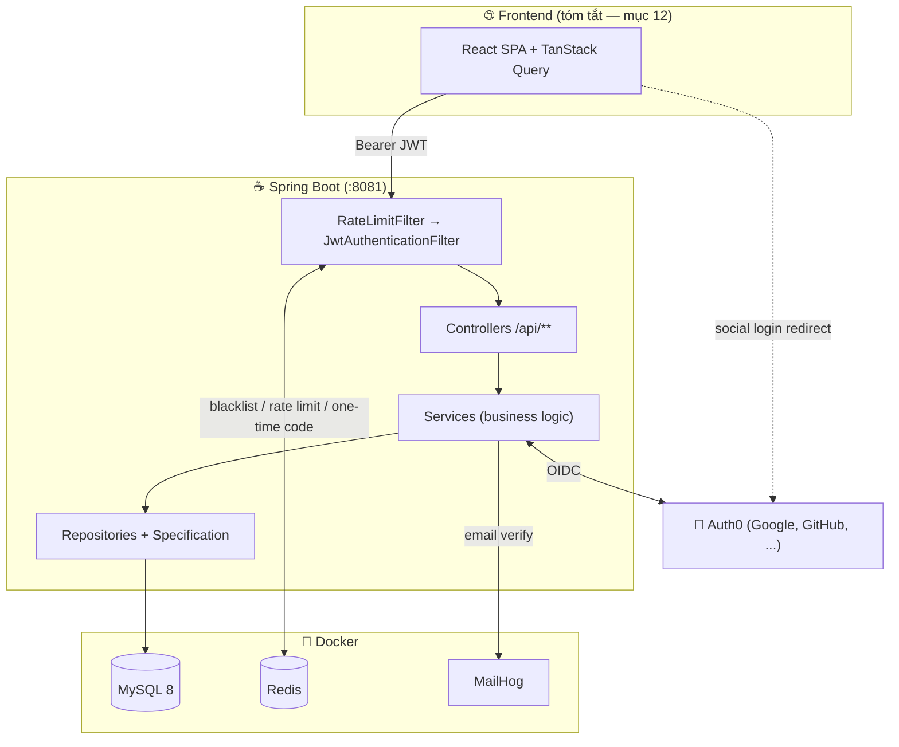
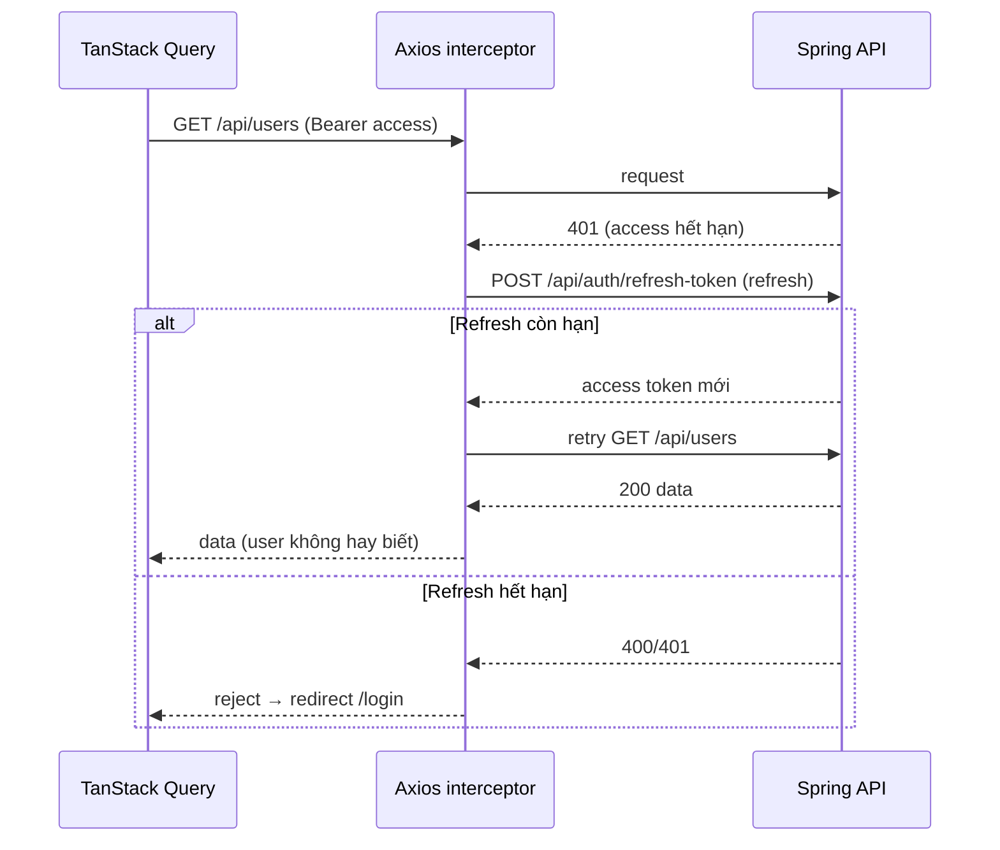
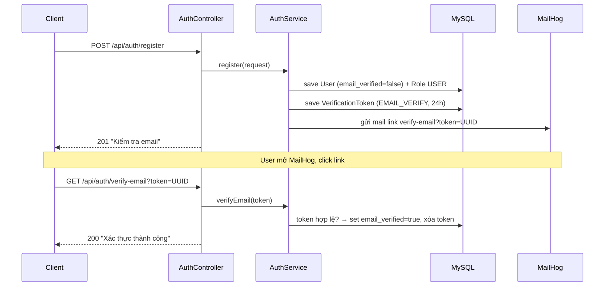
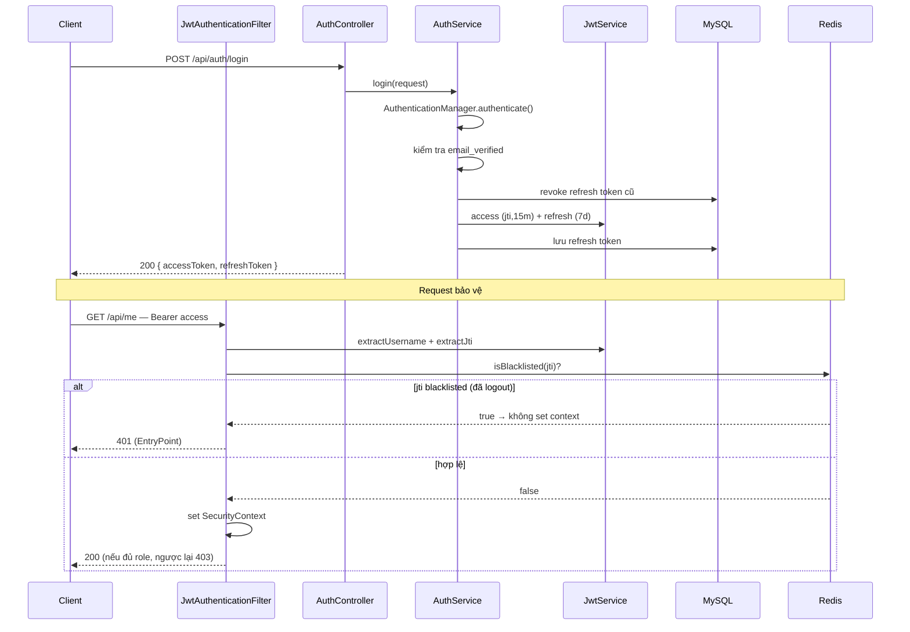
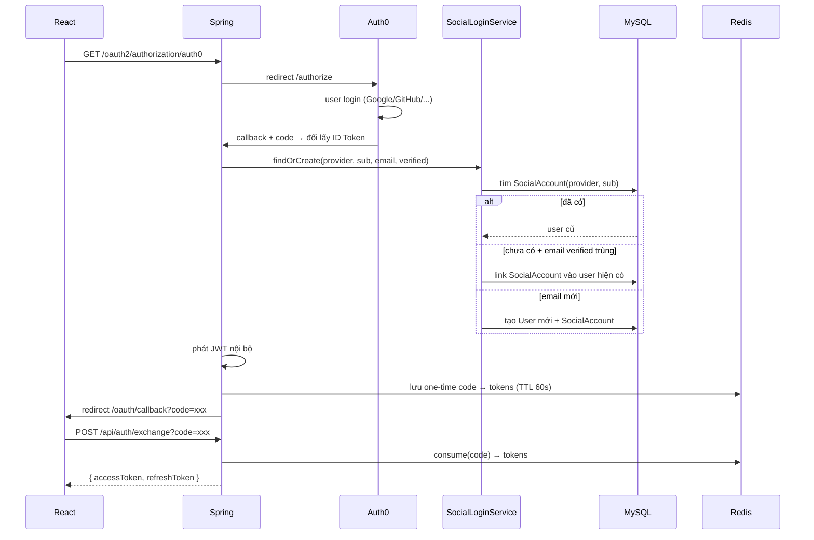
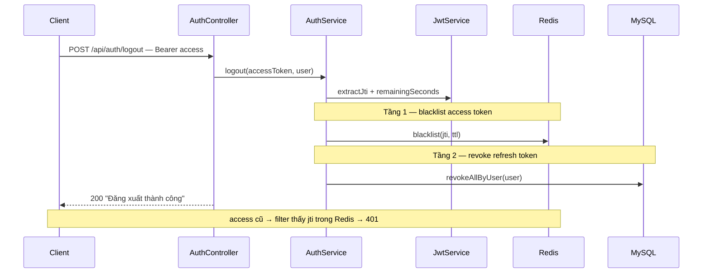

# 09 — Fullstack User Management (Spring Data + Security + JWT + Auth0)

> **Loại tài liệu:** Guide implement từng bước — làm lại project từ số 0.
> Trọng tâm: **Backend** (đầy đủ code từng bước). **Frontend** chỉ tóm tắt việc cần làm ở cuối (mục 12) — sẽ vibe code riêng.
> Đây là project tổng hợp: ôn lại Spring Data JPA + Spring Security + JWT + Auth0, và bổ sung các kỹ thuật production: search/filter/pagination, soft delete, email verification, rate limiting, CORS/CSRF.
>
> Kế hoạch tổng quan (kiến trúc, data model, quyết định thiết kế): xem `docs/plans/09-fullstack-user-management.md`.

---

## Mục tiêu

Xây dựng backend quản lý User hoàn chỉnh như sản phẩm thật, chia làm **4 phase** — làm xong phase nào chạy được phase đó rồi mới sang tiếp:

| Phase | Nội dung | Kết quả |
|---|---|---|
| **1 — Core API** | CRUD User + search + filter + pagination + soft delete | `GET /api/users?keyword=...&page=0&size=20` trả dữ liệu phân trang |
| **2 — Auth** | JWT (access + refresh) + RBAC + email verification | Đăng ký → verify email → login → gọi API có token |
| **3 — Social login** | Auth0 OIDC + account linking + phát JWT nội bộ | Login Google qua Auth0 → nhận JWT của Spring |
| **4 — Hardening** | Rate limit + CORS + CSRF policy + Swagger | Brute-force bị chặn 429, FE gọi cross-origin được |

**Kiến trúc auth (Hướng B):** Spring **tự phát JWT** làm token dùng trong toàn hệ thống. Auth0 chỉ là **Identity Provider** cho social login — sau khi Auth0 xác thực, Spring nhận danh tính, link/tạo account nội bộ, rồi phát JWT của chính mình. Email/password login và social login **hội tụ về cùng một loại token**.

---

## Tech Stack

| Thành phần | Lựa chọn | Ghi chú |
|---|---|---|
| Spring Boot | Latest stable (4.x) | Web MVC servlet, blocking |
| Java | 21 | |
| Web | `spring-boot-starter-webmvc` | Boot 4 đổi tên từ `-web` |
| Security | `spring-boot-starter-security` + `oauth2-client` | JWT filter + Auth0 OIDC |
| JWT | JJWT 0.13.0 (`api` + `impl` + `jackson`) | Tái dùng từ project 06 |
| Persistence | `spring-boot-starter-data-jpa` | Hibernate + Specification API |
| Validation | `spring-boot-starter-validation` | Bean Validation |
| Database | MySQL 8 (Docker) | User store, refresh/verification token |
| Store | Redis (Docker) | JTI blacklist + one-time code + rate limit |
| Email | `spring-boot-starter-mail` | Gửi link verify |
| Mail dev | MailHog (Docker) | Bắt email local, không gửi thật |
| Rate limit | Bucket4j (`bucket4j-core`) | Token bucket |
| API docs | `springdoc-openapi-starter-webmvc-ui` | Swagger UI |

> **Lưu ý Spring Boot 4 / Jackson 3:** package Jackson đổi từ `com.fasterxml.jackson` → `tools.jackson`. Khi tự serialize JSON trong handler, import `tools.jackson.databind.ObjectMapper`.

---

## Kiến trúc tổng quan



---

## Kiến thức nền — hiểu trước khi code

### 1. JPA Specification — filter động

Khi cần lọc theo nhiều điều kiện *tùy chọn* (có thể có, có thể không), viết `@Query` cứng sẽ bùng nổ tổ hợp. **Specification API** cho phép ghép điều kiện lúc runtime: mỗi tiêu chí là một `Specification<T>`, `null` nghĩa là "bỏ qua tiêu chí này". Repository chỉ cần thêm `JpaSpecificationExecutor<T>`.

### 2. Pagination với `Pageable` / `Page<T>`

Spring MVC tự parse `?page=0&size=20&sort=createdAt,desc` thành `Pageable`. Repository trả `Page<T>` — object này chứa sẵn `content`, `totalElements`, `totalPages`, `number`. Không cần tự tính offset/limit.

### 3. Soft delete

Không xóa vật lý — đánh dấu cột `deleted_at`. Hibernate 6.4+ có annotation `@SoftDelete`: `repository.delete(user)` sẽ chạy `UPDATE ... SET deleted_at = now()` và mọi query tự thêm `WHERE deleted_at IS NULL`. Dữ liệu vẫn còn để audit/khôi phục.

### 4. JWT stateless + thu hồi 2 tầng

- **Access token** (15 phút, có `jti`) đi kèm mỗi request. **Refresh token** (7 ngày) chỉ dùng để xin access token mới.
- Thu hồi tầng 1: blacklist `jti` của access token trong **Redis** (TTL tự hết khi token expire).
- Thu hồi tầng 2: cột `revoked` trên refresh token trong **MySQL**.

### 5. RBAC — Role-Based Access Control

User có nhiều `Role` (many-to-many). `getAuthorities()` trả về authority có prefix `ROLE_` để `hasRole('ADMIN')` hoạt động. Bật `@EnableMethodSecurity` để dùng `@PreAuthorize` trên từng method.

### 6. Account linking (Hướng B) — điểm khó nhất

Sau khi Auth0 xác thực social, Spring phải quyết định: user này là ai trong DB nội bộ?
1. Tìm `SocialAccount` theo `(provider, providerUserId)` → đã từng login social này → dùng user đó.
2. Chưa có → tìm `User` theo email. Nếu email trùng **và đã verified** → link social vào user đó (tránh tạo trùng).
3. Không tìm thấy → tạo `User` mới (password null, email_verified = true vì provider đã xác thực).

Chỉ link theo email khi provider khẳng định email đã verified — nếu không, kẻ xấu có thể chiếm account bằng cách tạo social account với email người khác.

---

## Cấu trúc thư mục cuối cùng (backend)

```
projects/09-fullstack-user-management/
├── backend/
│   ├── docker-compose.yml
│   ├── pom.xml
│   └── src/main/
│       ├── java/com/maaitlunghau/__fullstack_user_management/
│       │   ├── FullstackUserManagementApplication.java
│       │   ├── config/
│       │   │   ├── SecurityConfig.java
│       │   │   ├── CorsConfig.java
│       │   │   ├── RedisConfig.java
│       │   │   └── DataSeeder.java
│       │   ├── controller/
│       │   │   ├── AuthController.java
│       │   │   ├── OAuth2ExchangeController.java
│       │   │   ├── MeController.java
│       │   │   └── UserController.java
│       │   ├── service/
│       │   │   ├── UserService.java
│       │   │   ├── AuthService.java
│       │   │   ├── JwtService.java
│       │   │   ├── TokenBlacklist.java
│       │   │   ├── EmailService.java
│       │   │   ├── OneTimeCodeStore.java
│       │   │   └── SocialLoginService.java
│       │   ├── security/
│       │   │   ├── JwtAuthenticationFilter.java
│       │   │   ├── RateLimitFilter.java
│       │   │   ├── CustomAuthenticationEntryPoint.java
│       │   │   ├── CustomAccessDeniedHandler.java
│       │   │   └── OAuth2LoginSuccessHandler.java
│       │   ├── repository/
│       │   │   ├── UserRepository.java
│       │   │   ├── RoleRepository.java
│       │   │   ├── RefreshTokenRepository.java
│       │   │   ├── SocialAccountRepository.java
│       │   │   └── VerificationTokenRepository.java
│       │   ├── entity/
│       │   │   ├── User.java
│       │   │   ├── Role.java
│       │   │   ├── SocialAccount.java
│       │   │   ├── RefreshToken.java
│       │   │   └── VerificationToken.java
│       │   ├── dto/
│       │   │   ├── ApiResponse.java
│       │   │   ├── request/ (CreateUserRequest, UpdateUserRequest, RegisterRequest, LoginRequest, ...)
│       │   │   └── response/ (UserResponse, AuthResponse)
│       │   ├── spec/
│       │   │   └── UserSpecs.java
│       │   └── exception/
│       │       ├── ResourceNotFoundException.java
│       │       ├── DuplicateResourceException.java
│       │       ├── BadRequestException.java
│       │       └── GlobalExceptionHandler.java
│       └── resources/
│           ├── application.properties
│           └── application-local.properties   (gitignored — Auth0 secret)
└── frontend/   (tóm tắt ở mục 12)
```

---

## Bước 1 — Khởi động hạ tầng bằng Docker

Tạo `backend/docker-compose.yml`:

```yaml
services:
  mysql:
    image: mysql:8
    container_name: umgmt-mysql
    ports:
      - "3306:3306"
    environment:
      MYSQL_ROOT_PASSWORD: 112233
      MYSQL_DATABASE: user_management
    volumes:
      - umgmt_mysql:/var/lib/mysql

  redis:
    image: redis:7
    container_name: umgmt-redis
    ports:
      - "6379:6379"

  mailhog:
    image: mailhog/mailhog
    container_name: umgmt-mailhog
    ports:
      - "1025:1025"   # SMTP
      - "8025:8025"   # Web UI

  phpmyadmin:
    image: phpmyadmin
    container_name: umgmt-phpmyadmin
    ports:
      - "8080:80"
    environment:
      PMA_HOST: mysql
      PMA_USER: root
      PMA_PASSWORD: 112233

volumes:
  umgmt_mysql:
```

Khởi động:

```bash
cd projects/09-fullstack-user-management/backend
docker compose up -d
```

| Service | URL |
|---|---|
| MySQL | `localhost:3306` (db `user_management`) |
| Redis | `localhost:6379` |
| MailHog UI | `http://localhost:8025` |
| phpMyAdmin | `http://localhost:8080` (root / 112233) |

---

## Bước 2 — Khởi tạo project trên start.spring.io

Vào [start.spring.io](https://start.spring.io):

- **Project:** Maven, **Language:** Java, **Spring Boot:** latest stable
- **Group:** `com.maaitlunghau`, **Artifact:** `09-fullstack-user-management`
- **Java:** 21
- **Dependencies:** Spring Web, Spring Security, OAuth2 Client, Spring Data JPA, Validation, Java Mail Sender, Spring Data Redis, MySQL Driver, Lombok

Giải nén vào `projects/09-fullstack-user-management/backend/`. JJWT, Bucket4j, springdoc sẽ thêm tay ở Bước 3.

---

## Bước 3 — `pom.xml`

Phần `<dependencies>` đầy đủ:

```xml
<dependencies>
    <!-- Web MVC (Boot 4: -webmvc, không phải -web) -->
    <dependency>
        <groupId>org.springframework.boot</groupId>
        <artifactId>spring-boot-starter-webmvc</artifactId>
    </dependency>

    <!-- Security + OAuth2 Client (Auth0) -->
    <dependency>
        <groupId>org.springframework.boot</groupId>
        <artifactId>spring-boot-starter-security</artifactId>
    </dependency>
    <dependency>
        <groupId>org.springframework.boot</groupId>
        <artifactId>spring-boot-starter-oauth2-client</artifactId>
    </dependency>

    <!-- JPA + Validation -->
    <dependency>
        <groupId>org.springframework.boot</groupId>
        <artifactId>spring-boot-starter-data-jpa</artifactId>
    </dependency>
    <dependency>
        <groupId>org.springframework.boot</groupId>
        <artifactId>spring-boot-starter-validation</artifactId>
    </dependency>

    <!-- Redis + Mail -->
    <dependency>
        <groupId>org.springframework.boot</groupId>
        <artifactId>spring-boot-starter-data-redis</artifactId>
    </dependency>
    <dependency>
        <groupId>org.springframework.boot</groupId>
        <artifactId>spring-boot-starter-mail</artifactId>
    </dependency>

    <!-- MySQL driver -->
    <dependency>
        <groupId>com.mysql</groupId>
        <artifactId>mysql-connector-j</artifactId>
        <scope>runtime</scope>
    </dependency>

    <!-- Lombok -->
    <dependency>
        <groupId>org.projectlombok</groupId>
        <artifactId>lombok</artifactId>
        <optional>true</optional>
    </dependency>

    <!-- JJWT 0.13.0 -->
    <dependency>
        <groupId>io.jsonwebtoken</groupId>
        <artifactId>jjwt-api</artifactId>
        <version>0.13.0</version>
    </dependency>
    <dependency>
        <groupId>io.jsonwebtoken</groupId>
        <artifactId>jjwt-impl</artifactId>
        <version>0.13.0</version>
        <scope>runtime</scope>
    </dependency>
    <dependency>
        <groupId>io.jsonwebtoken</groupId>
        <artifactId>jjwt-jackson</artifactId>
        <version>0.13.0</version>
        <scope>runtime</scope>
    </dependency>

    <!-- Bucket4j — rate limiting -->
    <dependency>
        <groupId>com.bucket4j</groupId>
        <artifactId>bucket4j-core</artifactId>
        <version>8.10.1</version>
    </dependency>

    <!-- Swagger / OpenAPI -->
    <dependency>
        <groupId>org.springdoc</groupId>
        <artifactId>springdoc-openapi-starter-webmvc-ui</artifactId>
        <version>2.6.0</version>
    </dependency>

    <!-- Test -->
    <dependency>
        <groupId>org.springframework.boot</groupId>
        <artifactId>spring-boot-starter-test</artifactId>
        <scope>test</scope>
    </dependency>
    <dependency>
        <groupId>org.springframework.security</groupId>
        <artifactId>spring-security-test</artifactId>
        <scope>test</scope>
    </dependency>
</dependencies>
```

> Version JJWT/Bucket4j/springdoc có thể chỉnh theo bản mới nhất lúc bạn làm. Nếu Boot BOM đã quản version springdoc thì bỏ `<version>`.

---

## Bước 4 — `application.properties`

`src/main/resources/application.properties`:

```properties
spring.application.name=fullstack-user-management
server.port=8081

# ===== MySQL =====
spring.datasource.url=jdbc:mysql://${MYSQL_HOST:localhost}:3306/user_management?useSSL=false&serverTimezone=UTC&createDatabaseIfNotExist=true
spring.datasource.username=root
spring.datasource.password=112233
spring.datasource.driver-class-name=com.mysql.cj.jdbc.Driver

# ===== JPA =====
spring.jpa.hibernate.ddl-auto=update
spring.jpa.show-sql=true
spring.jpa.open-in-view=false
spring.jpa.properties.hibernate.format_sql=true

# ===== Redis =====
spring.data.redis.host=localhost
spring.data.redis.port=6379

# ===== Mail (MailHog) =====
spring.mail.host=localhost
spring.mail.port=1025
spring.mail.properties.mail.smtp.auth=false
spring.mail.properties.mail.smtp.starttls.enable=false

# ===== App config =====
app.frontend-url=http://localhost:5173
app.mail.from=no-reply@usermgmt.local

# ===== JWT =====
app.jwt.secret=aVeryLongSecretKeyForHmacSha256ThatIsAtLeast32Bytes!!
app.jwt.access-token-expiration=900000
app.jwt.refresh-token-expiration=604800000

# ===== Auth0 (giá trị thật để trong application-local.properties, gitignored) =====
spring.security.oauth2.client.registration.auth0.client-id=${AUTH0_CLIENT_ID}
spring.security.oauth2.client.registration.auth0.client-secret=${AUTH0_CLIENT_SECRET}
spring.security.oauth2.client.registration.auth0.scope=openid,profile,email
spring.security.oauth2.client.registration.auth0.authorization-grant-type=authorization_code
spring.security.oauth2.client.registration.auth0.redirect-uri={baseUrl}/login/oauth2/code/auth0
spring.security.oauth2.client.provider.auth0.issuer-uri=https://${AUTH0_DOMAIN}/

# Load file local (nếu có)
spring.config.import=optional:application-local.properties
```

`application-local.properties` (thêm vào `.gitignore`):

```properties
AUTH0_DOMAIN=your-tenant.us.auth0.com
AUTH0_CLIENT_ID=xxxxxxxxxxxx
AUTH0_CLIENT_SECRET=yyyyyyyyyyyy
```

> Phase 1–2 chưa cần Auth0. Nếu chưa có tài khoản Auth0, tạm comment 6 dòng `spring.security.oauth2.*` để app khởi động được, mở lại ở Phase 3.

---

## Bước 5 — Main class

`FullstackUserManagementApplication.java`:

```java
package com.maaitlunghau.__fullstack_user_management;

import org.springframework.boot.SpringApplication;
import org.springframework.boot.autoconfigure.SpringBootApplication;

@SpringBootApplication
public class FullstackUserManagementApplication {
    public static void main(String[] args) {
        SpringApplication.run(FullstackUserManagementApplication.class, args);
    }
}
```

---

# PHASE 1 — Core API (CRUD + search/filter/pagination + soft delete)

## Bước 6 — Entity `Role.java`

```java
package com.maaitlunghau.__fullstack_user_management.entity;

import jakarta.persistence.*;

@Entity
@Table(name = "roles")
public class Role {

    @Id
    @GeneratedValue(strategy = GenerationType.IDENTITY)
    private Long id;

    @Column(nullable = false, unique = true, length = 50)
    private String name;   // ROLE_USER, ROLE_ADMIN

    protected Role() {}

    public Role(String name) {
        this.name = name;
    }

    public Long getId() { return id; }
    public String getName() { return name; }
}
```

## Bước 7 — Entity `User.java` (Phase 1 — chưa `UserDetails`)

Ở Phase 1 chỉ cần các field cơ bản + quan hệ Role + soft delete. Phase 2 sẽ cho `implements UserDetails`.

```java
package com.maaitlunghau.__fullstack_user_management.entity;

import jakarta.persistence.*;
import org.hibernate.annotations.CreationTimestamp;
import org.hibernate.annotations.SoftDelete;
import org.hibernate.annotations.SoftDeleteType;
import org.hibernate.annotations.UpdateTimestamp;

import java.time.LocalDateTime;
import java.util.HashSet;
import java.util.Set;

@Entity
@Table(name = "users")
@SoftDelete(columnName = "deleted_at", strategy = SoftDeleteType.TIMESTAMP)
public class User {

    @Id
    @GeneratedValue(strategy = GenerationType.IDENTITY)
    private Long id;

    @Column(nullable = false, unique = true, length = 255)
    private String email;

    @Column(length = 255)
    private String password;          // null nếu chỉ social login

    @Column(name = "full_name", length = 150)
    private String fullName;

    @Column(name = "avatar_url", length = 500)
    private String avatarUrl;

    @Column(name = "email_verified", nullable = false)
    private boolean emailVerified = false;

    @Column(nullable = false)
    private boolean enabled = true;

    @ManyToMany(fetch = FetchType.EAGER)
    @JoinTable(
        name = "user_roles",
        joinColumns = @JoinColumn(name = "user_id"),
        inverseJoinColumns = @JoinColumn(name = "role_id")
    )
    private Set<Role> roles = new HashSet<>();

    @CreationTimestamp
    @Column(name = "created_at", updatable = false)
    private LocalDateTime createdAt;

    @UpdateTimestamp
    @Column(name = "updated_at")
    private LocalDateTime updatedAt;

    protected User() {}

    public User(String email, String password, String fullName) {
        this.email = email;
        this.password = password;
        this.fullName = fullName;
    }

    // ===== domain methods =====
    public void addRole(Role role) { this.roles.add(role); }
    public void updateProfile(String fullName, String avatarUrl) {
        this.fullName = fullName;
        this.avatarUrl = avatarUrl;
    }
    public void markEmailVerified() { this.emailVerified = true; }
    public void changePassword(String encodedPassword) { this.password = encodedPassword; }

    // ===== getters/setters =====
    public Long getId() { return id; }
    public String getEmail() { return email; }
    public void setEmail(String email) { this.email = email; }
    public String getPassword() { return password; }
    public String getFullName() { return fullName; }
    public String getAvatarUrl() { return avatarUrl; }
    public boolean isEmailVerified() { return emailVerified; }
    public boolean isEnabled() { return enabled; }
    public void setEnabled(boolean enabled) { this.enabled = enabled; }
    public Set<Role> getRoles() { return roles; }
    public void setRoles(Set<Role> roles) { this.roles = roles; }
    public LocalDateTime getCreatedAt() { return createdAt; }
}
```

> `@SoftDelete` tự thêm cột `deleted_at`. Mọi `find*`/`delete` của Hibernate tự lọc `deleted_at IS NULL`. Không cần viết gì thêm.

## Bước 8 — Repositories (Phase 1)

`RoleRepository.java`:

```java
package com.maaitlunghau.__fullstack_user_management.repository;

import com.maaitlunghau.__fullstack_user_management.entity.Role;
import org.springframework.data.jpa.repository.JpaRepository;

import java.util.Optional;

public interface RoleRepository extends JpaRepository<Role, Long> {
    Optional<Role> findByName(String name);
}
```

`UserRepository.java` — thêm `JpaSpecificationExecutor` để filter động:

```java
package com.maaitlunghau.__fullstack_user_management.repository;

import com.maaitlunghau.__fullstack_user_management.entity.User;
import org.springframework.data.jpa.repository.JpaRepository;
import org.springframework.data.jpa.repository.JpaSpecificationExecutor;

import java.util.Optional;

public interface UserRepository
        extends JpaRepository<User, Long>, JpaSpecificationExecutor<User> {

    Optional<User> findByEmail(String email);
    boolean existsByEmail(String email);
}
```

## Bước 9 — `UserSpecs.java` (Specification động)

```java
package com.maaitlunghau.__fullstack_user_management.spec;

import com.maaitlunghau.__fullstack_user_management.entity.User;
import org.springframework.data.jpa.domain.Specification;

public final class UserSpecs {

    private UserSpecs() {}

    /** LIKE trên email + fullName; null nếu không có keyword. */
    public static Specification<User> search(String keyword) {
        return (root, query, cb) -> {
            if (keyword == null || keyword.isBlank()) return null;
            String pattern = "%" + keyword.toLowerCase() + "%";
            return cb.or(
                cb.like(cb.lower(root.get("email")), pattern),
                cb.like(cb.lower(root.get("fullName")), pattern)
            );
        };
    }

    /** Lọc theo tên role (join bảng roles). */
    public static Specification<User> hasRole(String roleName) {
        return (root, query, cb) -> {
            if (roleName == null || roleName.isBlank()) return null;
            if (query != null) query.distinct(true);   // tránh nhân dòng khi join many-to-many
            return cb.equal(root.join("roles").get("name"), roleName);
        };
    }

    /** Lọc enabled true/false; null nếu không truyền. */
    public static Specification<User> enabled(Boolean enabled) {
        return (root, query, cb) ->
            enabled == null ? null : cb.equal(root.get("enabled"), enabled);
    }

    public static Specification<User> emailVerified(Boolean verified) {
        return (root, query, cb) ->
            verified == null ? null : cb.equal(root.get("emailVerified"), verified);
    }
}
```

## Bước 10 — DTOs (Phase 1)

`dto/ApiResponse.java` — wrapper chuẩn cho mọi response:

```java
package com.maaitlunghau.__fullstack_user_management.dto;

import java.time.LocalDateTime;

public record ApiResponse<T>(int status, String message, T data, LocalDateTime timestamp) {

    public static <T> ApiResponse<T> ok(T data) {
        return new ApiResponse<>(200, "Success", data, LocalDateTime.now());
    }

    public static <T> ApiResponse<T> ok(String message, T data) {
        return new ApiResponse<>(200, message, data, LocalDateTime.now());
    }

    public static <T> ApiResponse<T> created(String message, T data) {
        return new ApiResponse<>(201, message, data, LocalDateTime.now());
    }

    public static ApiResponse<Void> message(int status, String message) {
        return new ApiResponse<>(status, message, null, LocalDateTime.now());
    }
}
```

`dto/response/UserResponse.java`:

```java
package com.maaitlunghau.__fullstack_user_management.dto.response;

import com.maaitlunghau.__fullstack_user_management.entity.Role;
import com.maaitlunghau.__fullstack_user_management.entity.User;

import java.time.LocalDateTime;
import java.util.Set;
import java.util.stream.Collectors;

public record UserResponse(
        Long id,
        String email,
        String fullName,
        String avatarUrl,
        boolean emailVerified,
        boolean enabled,
        Set<String> roles,
        LocalDateTime createdAt
) {
    public static UserResponse from(User user) {
        return new UserResponse(
            user.getId(),
            user.getEmail(),
            user.getFullName(),
            user.getAvatarUrl(),
            user.isEmailVerified(),
            user.isEnabled(),
            user.getRoles().stream().map(Role::getName).collect(Collectors.toSet()),
            user.getCreatedAt()
        );
    }
}
```

`dto/request/CreateUserRequest.java`:

```java
package com.maaitlunghau.__fullstack_user_management.dto.request;

import jakarta.validation.constraints.Email;
import jakarta.validation.constraints.NotBlank;
import jakarta.validation.constraints.Size;

public record CreateUserRequest(
        @NotBlank @Email String email,
        @NotBlank @Size(min = 6, message = "Password tối thiểu 6 ký tự") String password,
        @NotBlank String fullName
) {}
```

`dto/request/UpdateUserRequest.java`:

```java
package com.maaitlunghau.__fullstack_user_management.dto.request;

import jakarta.validation.constraints.NotBlank;

public record UpdateUserRequest(
        @NotBlank String fullName,
        String avatarUrl
) {}
```

## Bước 11 — Exception handling

`exception/ResourceNotFoundException.java`:

```java
package com.maaitlunghau.__fullstack_user_management.exception;

public class ResourceNotFoundException extends RuntimeException {
    public ResourceNotFoundException(String resource, Object id) {
        super(resource + " not found with id: " + id);
    }
    public ResourceNotFoundException(String message) {
        super(message);
    }
}
```

`exception/DuplicateResourceException.java`:

```java
package com.maaitlunghau.__fullstack_user_management.exception;

public class DuplicateResourceException extends RuntimeException {
    public DuplicateResourceException(String message) {
        super(message);
    }
}
```

`exception/BadRequestException.java`:

```java
package com.maaitlunghau.__fullstack_user_management.exception;

public class BadRequestException extends RuntimeException {
    public BadRequestException(String message) {
        super(message);
    }
}
```

`exception/GlobalExceptionHandler.java`:

```java
package com.maaitlunghau.__fullstack_user_management.exception;

import com.maaitlunghau.__fullstack_user_management.dto.ApiResponse;
import org.springframework.http.HttpStatus;
import org.springframework.http.ResponseEntity;
import org.springframework.web.bind.MethodArgumentNotValidException;
import org.springframework.web.bind.annotation.ExceptionHandler;
import org.springframework.web.bind.annotation.RestControllerAdvice;

import java.util.stream.Collectors;

@RestControllerAdvice
public class GlobalExceptionHandler {

    @ExceptionHandler(ResourceNotFoundException.class)
    public ResponseEntity<ApiResponse<Void>> handleNotFound(ResourceNotFoundException ex) {
        return ResponseEntity.status(HttpStatus.NOT_FOUND)
            .body(ApiResponse.message(404, ex.getMessage()));
    }

    @ExceptionHandler(DuplicateResourceException.class)
    public ResponseEntity<ApiResponse<Void>> handleDuplicate(DuplicateResourceException ex) {
        return ResponseEntity.status(HttpStatus.CONFLICT)
            .body(ApiResponse.message(409, ex.getMessage()));
    }

    @ExceptionHandler(BadRequestException.class)
    public ResponseEntity<ApiResponse<Void>> handleBadRequest(BadRequestException ex) {
        return ResponseEntity.badRequest()
            .body(ApiResponse.message(400, ex.getMessage()));
    }

    @ExceptionHandler(MethodArgumentNotValidException.class)
    public ResponseEntity<ApiResponse<Void>> handleValidation(MethodArgumentNotValidException ex) {
        String errors = ex.getBindingResult().getFieldErrors().stream()
            .map(e -> e.getField() + ": " + e.getDefaultMessage())
            .collect(Collectors.joining("; "));
        return ResponseEntity.badRequest()
            .body(ApiResponse.message(400, errors));
    }

    @ExceptionHandler(Exception.class)
    public ResponseEntity<ApiResponse<Void>> handleGeneral(Exception ex) {
        return ResponseEntity.internalServerError()
            .body(ApiResponse.message(500, "Internal server error: " + ex.getMessage()));
    }
}
```

## Bước 12 — `DataSeeder.java` (seed roles)

```java
package com.maaitlunghau.__fullstack_user_management.config;

import com.maaitlunghau.__fullstack_user_management.entity.Role;
import com.maaitlunghau.__fullstack_user_management.repository.RoleRepository;
import org.springframework.boot.CommandLineRunner;
import org.springframework.stereotype.Component;

@Component
public class DataSeeder implements CommandLineRunner {

    private final RoleRepository roleRepository;

    public DataSeeder(RoleRepository roleRepository) {
        this.roleRepository = roleRepository;
    }

    @Override
    public void run(String... args) {
        seedRole("ROLE_USER");
        seedRole("ROLE_ADMIN");
    }

    private void seedRole(String name) {
        roleRepository.findByName(name)
            .orElseGet(() -> roleRepository.save(new Role(name)));
    }
}
```

## Bước 13 — `UserService.java` (Phase 1)

```java
package com.maaitlunghau.__fullstack_user_management.service;

import com.maaitlunghau.__fullstack_user_management.dto.request.CreateUserRequest;
import com.maaitlunghau.__fullstack_user_management.dto.request.UpdateUserRequest;
import com.maaitlunghau.__fullstack_user_management.entity.Role;
import com.maaitlunghau.__fullstack_user_management.entity.User;
import com.maaitlunghau.__fullstack_user_management.exception.DuplicateResourceException;
import com.maaitlunghau.__fullstack_user_management.exception.ResourceNotFoundException;
import com.maaitlunghau.__fullstack_user_management.repository.RoleRepository;
import com.maaitlunghau.__fullstack_user_management.repository.UserRepository;
import com.maaitlunghau.__fullstack_user_management.spec.UserSpecs;
import org.springframework.data.domain.Page;
import org.springframework.data.domain.Pageable;
import org.springframework.data.jpa.domain.Specification;
import org.springframework.security.crypto.password.PasswordEncoder;
import org.springframework.stereotype.Service;
import org.springframework.transaction.annotation.Transactional;

@Service
@Transactional(readOnly = true)
public class UserService {

    private final UserRepository userRepository;
    private final RoleRepository roleRepository;
    private final PasswordEncoder passwordEncoder;

    public UserService(UserRepository userRepository,
                       RoleRepository roleRepository,
                       PasswordEncoder passwordEncoder) {
        this.userRepository = userRepository;
        this.roleRepository = roleRepository;
        this.passwordEncoder = passwordEncoder;
    }

    /** List + search + filter + pagination — trả Page<User>, controller map sang DTO. */
    public Page<User> search(String keyword, String role, Boolean enabled, Pageable pageable) {
        Specification<User> spec = Specification
            .allOf(
                UserSpecs.search(keyword),
                UserSpecs.hasRole(role),
                UserSpecs.enabled(enabled)
            );
        return userRepository.findAll(spec, pageable);
    }

    public User findById(Long id) {
        return userRepository.findById(id)
            .orElseThrow(() -> new ResourceNotFoundException("User", id));
    }

    @Transactional
    public User create(CreateUserRequest request) {
        if (userRepository.existsByEmail(request.email())) {
            throw new DuplicateResourceException("Email đã tồn tại: " + request.email());
        }
        User user = new User(request.email(), passwordEncoder.encode(request.password()), request.fullName());
        Role userRole = roleRepository.findByName("ROLE_USER")
            .orElseThrow(() -> new ResourceNotFoundException("Role ROLE_USER chưa được seed"));
        user.addRole(userRole);
        return userRepository.save(user);
    }

    @Transactional
    public User update(Long id, UpdateUserRequest request) {
        User user = findById(id);
        user.updateProfile(request.fullName(), request.avatarUrl());
        return user;   // dirty checking tự flush
    }

    /** Soft delete — Hibernate chạy UPDATE deleted_at, không DELETE thật. */
    @Transactional
    public void delete(Long id) {
        User user = findById(id);
        userRepository.delete(user);
    }
}
```

> `Specification.allOf(...)` (Spring Data JPA 3.4+) ghép nhiều spec, tự bỏ qua phần tử `null`. Nếu bản Spring của bạn cũ hơn, dùng `Specification.where(a).and(b).and(c)`.

## Bước 14 — `UserController.java` (Phase 1)

```java
package com.maaitlunghau.__fullstack_user_management.controller;

import com.maaitlunghau.__fullstack_user_management.dto.ApiResponse;
import com.maaitlunghau.__fullstack_user_management.dto.request.CreateUserRequest;
import com.maaitlunghau.__fullstack_user_management.dto.request.UpdateUserRequest;
import com.maaitlunghau.__fullstack_user_management.dto.response.UserResponse;
import com.maaitlunghau.__fullstack_user_management.service.UserService;
import jakarta.validation.Valid;
import org.springframework.data.domain.Page;
import org.springframework.data.domain.Pageable;
import org.springframework.data.domain.Sort;
import org.springframework.data.web.PageableDefault;
import org.springframework.http.HttpStatus;
import org.springframework.http.ResponseEntity;
import org.springframework.web.bind.annotation.*;

@RestController
@RequestMapping("/api/users")
public class UserController {

    private final UserService userService;

    public UserController(UserService userService) {
        this.userService = userService;
    }

    @GetMapping
    public ApiResponse<Page<UserResponse>> list(
            @RequestParam(required = false) String keyword,
            @RequestParam(required = false) String role,
            @RequestParam(required = false) Boolean enabled,
            @PageableDefault(size = 20, sort = "createdAt", direction = Sort.Direction.DESC) Pageable pageable) {

        Page<UserResponse> page = userService.search(keyword, role, enabled, pageable)
            .map(UserResponse::from);
        return ApiResponse.ok(page);
    }

    @GetMapping("/{id}")
    public ApiResponse<UserResponse> getById(@PathVariable Long id) {
        return ApiResponse.ok(UserResponse.from(userService.findById(id)));
    }

    @PostMapping
    public ResponseEntity<ApiResponse<UserResponse>> create(@Valid @RequestBody CreateUserRequest request) {
        UserResponse created = UserResponse.from(userService.create(request));
        return ResponseEntity.status(HttpStatus.CREATED)
            .body(ApiResponse.created("User created", created));
    }

    @PutMapping("/{id}")
    public ApiResponse<UserResponse> update(@PathVariable Long id,
                                            @Valid @RequestBody UpdateUserRequest request) {
        return ApiResponse.ok("User updated", UserResponse.from(userService.update(id, request)));
    }

    @DeleteMapping("/{id}")
    public ApiResponse<Void> delete(@PathVariable Long id) {
        userService.delete(id);
        return ApiResponse.message(200, "User soft-deleted");
    }
}
```

## Bước 15 — Cần `PasswordEncoder` bean (tạm thời cho Phase 1)

Phase 1 chưa có `SecurityConfig` đầy đủ, nhưng `UserService` cần `PasswordEncoder`. Tạo tạm `config/PasswordConfig.java` (Phase 2 sẽ gộp vào `SecurityConfig`):

```java
package com.maaitlunghau.__fullstack_user_management.config;

import org.springframework.context.annotation.Bean;
import org.springframework.context.annotation.Configuration;
import org.springframework.security.crypto.bcrypt.BCryptPasswordEncoder;
import org.springframework.security.crypto.password.PasswordEncoder;

@Configuration
public class PasswordConfig {
    @Bean
    public PasswordEncoder passwordEncoder() {
        return new BCryptPasswordEncoder();
    }
}
```

> Vì đã có `spring-boot-starter-security` trong classpath, Spring Security sẽ tự bật form login mặc định. Ở Phase 1 để test API nhanh, có thể tạm thêm class permit-all:
>
> ```java
> @Configuration
> class TempSecurityConfig {
>     @Bean SecurityFilterChain chain(HttpSecurity http) throws Exception {
>         return http.csrf(c -> c.disable())
>             .authorizeHttpRequests(a -> a.anyRequest().permitAll())
>             .build();
>     }
> }
> ```
> Phase 2 sẽ thay bằng `SecurityConfig` thật. Xóa class tạm này khi qua Phase 2.

## Bước 16 — Chạy & test Phase 1

```bash
docker compose up -d
./mvnw spring-boot:run
```

```bash
# 1. Tạo user
curl -X POST http://localhost:8081/api/users \
  -H "Content-Type: application/json" \
  -d '{"email":"alice@example.com","password":"secret123","fullName":"Alice"}'
# → 201 { "status":201, "message":"User created", "data":{ "id":1, "roles":["ROLE_USER"], ... } }

# 2. List (mặc định page 0, size 20, sort createdAt desc)
curl "http://localhost:8081/api/users"

# 3. Search + filter + pagination
curl "http://localhost:8081/api/users?keyword=alice&role=ROLE_USER&enabled=true&page=0&size=10&sort=email,asc"
# → data.content = [...], data.totalElements, data.totalPages, data.number

# 4. Chi tiết
curl http://localhost:8081/api/users/1

# 5. Update
curl -X PUT http://localhost:8081/api/users/1 \
  -H "Content-Type: application/json" \
  -d '{"fullName":"Alice Updated","avatarUrl":"https://img/a.png"}'

# 6. Soft delete → user biến mất khỏi list nhưng vẫn còn row trong DB (deleted_at != null)
curl -X DELETE http://localhost:8081/api/users/1

# 7. Validation lỗi → 400
curl -X POST http://localhost:8081/api/users \
  -H "Content-Type: application/json" \
  -d '{"email":"not-an-email","password":"123","fullName":""}'
# → 400 { "message":"email: ...; password: Password tối thiểu 6 ký tự; fullName: ..." }
```

Kiểm tra soft delete trong phpMyAdmin (`http://localhost:8080`): bảng `users` vẫn còn row của Alice nhưng cột `deleted_at` đã có timestamp.

✅ **Hết Phase 1.** Commit: `feat(user-management): core user CRUD with search, filter, pagination, soft delete`.

---

# PHASE 2 — Auth (JWT access + refresh, RBAC, email verification)

Phase 2 biến app thành hệ thống có xác thực. Việc chính:
1. Cho `User implements UserDetails`.
2. Thêm entity `RefreshToken`, `VerificationToken`.
3. `JwtService` (sinh/đọc token), `TokenBlacklist` (Redis).
4. `JwtAuthenticationFilter` + custom 401/403 + `SecurityConfig` thật.
5. `EmailService` gửi link verify (MailHog).
6. `AuthService` + `AuthController` + `MeController`.

## Bước 17 — Cho `User implements UserDetails`

Sửa `User.java`: thêm `implements UserDetails` và các method bắt buộc. Chỉ cần bổ sung phần dưới vào class đã có ở Bước 7.

```java
// ... giữ nguyên import cũ, THÊM:
import org.springframework.security.core.GrantedAuthority;
import org.springframework.security.core.authority.SimpleGrantedAuthority;
import org.springframework.security.core.userdetails.UserDetails;
import java.util.Collection;
import java.util.stream.Collectors;

// đổi khai báo class:
public class User implements UserDetails {

    // ... giữ nguyên toàn bộ field + constructor + domain methods + getters ở Bước 7 ...

    // ===== UserDetails =====
    @Override
    public Collection<? extends GrantedAuthority> getAuthorities() {
        // role đã có prefix ROLE_ nên hasRole('ADMIN') hoạt động
        return roles.stream()
            .map(r -> new SimpleGrantedAuthority(r.getName()))
            .collect(Collectors.toSet());
    }

    @Override
    public String getUsername() { return email; }   // dùng email làm username

    @Override
    public boolean isAccountNonExpired() { return true; }

    @Override
    public boolean isAccountNonLocked() { return true; }

    @Override
    public boolean isCredentialsNonExpired() { return true; }

    @Override
    public boolean isEnabled() { return enabled; }
    // getPassword() đã có sẵn ở Bước 7
}
```

## Bước 18 — Entity `RefreshToken.java`

```java
package com.maaitlunghau.__fullstack_user_management.entity;

import jakarta.persistence.*;
import java.time.Instant;

@Entity
@Table(name = "refresh_tokens")
public class RefreshToken {

    @Id
    @GeneratedValue(strategy = GenerationType.IDENTITY)
    private Long id;

    @Column(nullable = false, unique = true, length = 1000)
    private String token;

    @ManyToOne(fetch = FetchType.LAZY)
    @JoinColumn(name = "user_id", nullable = false)
    private User user;

    @Column(nullable = false)
    private boolean revoked = false;

    @Column(name = "expires_at", nullable = false)
    private Instant expiresAt;

    protected RefreshToken() {}

    public RefreshToken(String token, User user, Instant expiresAt) {
        this.token = token;
        this.user = user;
        this.expiresAt = expiresAt;
    }

    public void revoke() { this.revoked = true; }

    public Long getId() { return id; }
    public String getToken() { return token; }
    public User getUser() { return user; }
    public boolean isRevoked() { return revoked; }
    public Instant getExpiresAt() { return expiresAt; }
}
```

## Bước 19 — Entity `VerificationToken.java`

Dùng chung cho **email verify** và **password reset** (phân biệt bằng `type`).

```java
package com.maaitlunghau.__fullstack_user_management.entity;

import jakarta.persistence.*;
import java.time.Instant;

@Entity
@Table(name = "verification_tokens")
public class VerificationToken {

    public enum Type { EMAIL_VERIFY, PASSWORD_RESET }

    @Id
    @GeneratedValue(strategy = GenerationType.IDENTITY)
    private Long id;

    @Column(nullable = false, unique = true, length = 100)
    private String token;

    @ManyToOne(fetch = FetchType.LAZY)
    @JoinColumn(name = "user_id", nullable = false)
    private User user;

    @Enumerated(EnumType.STRING)
    @Column(nullable = false, length = 30)
    private Type type;

    @Column(name = "expires_at", nullable = false)
    private Instant expiresAt;

    protected VerificationToken() {}

    public VerificationToken(String token, User user, Type type, Instant expiresAt) {
        this.token = token;
        this.user = user;
        this.type = type;
        this.expiresAt = expiresAt;
    }

    public boolean isExpired() { return Instant.now().isAfter(expiresAt); }

    public Long getId() { return id; }
    public String getToken() { return token; }
    public User getUser() { return user; }
    public Type getType() { return type; }
}
```

## Bước 20 — Repositories mới

`RefreshTokenRepository.java`:

```java
package com.maaitlunghau.__fullstack_user_management.repository;

import com.maaitlunghau.__fullstack_user_management.entity.RefreshToken;
import com.maaitlunghau.__fullstack_user_management.entity.User;
import org.springframework.data.jpa.repository.JpaRepository;
import org.springframework.data.jpa.repository.Modifying;
import org.springframework.data.jpa.repository.Query;
import org.springframework.data.repository.query.Param;

import java.util.Optional;

public interface RefreshTokenRepository extends JpaRepository<RefreshToken, Long> {

    Optional<RefreshToken> findByToken(String token);

    @Modifying
    @Query("UPDATE RefreshToken rt SET rt.revoked = true WHERE rt.user = :user AND rt.revoked = false")
    void revokeAllByUser(@Param("user") User user);
}
```

`VerificationTokenRepository.java`:

```java
package com.maaitlunghau.__fullstack_user_management.repository;

import com.maaitlunghau.__fullstack_user_management.entity.VerificationToken;
import org.springframework.data.jpa.repository.JpaRepository;

import java.util.Optional;

public interface VerificationTokenRepository extends JpaRepository<VerificationToken, Long> {
    Optional<VerificationToken> findByToken(String token);
}
```

## Bước 21 — `JwtService.java`

Sinh access token (có `jti`) + refresh token, và các hàm đọc claim. Dựa trên project 06, JJWT 0.13.0.

```java
package com.maaitlunghau.__fullstack_user_management.service;

import com.maaitlunghau.__fullstack_user_management.entity.User;
import io.jsonwebtoken.Claims;
import io.jsonwebtoken.Jwts;
import io.jsonwebtoken.security.Keys;
import org.springframework.beans.factory.annotation.Value;
import org.springframework.stereotype.Service;

import javax.crypto.SecretKey;
import java.nio.charset.StandardCharsets;
import java.time.Duration;
import java.util.Date;
import java.util.UUID;
import java.util.function.Function;

@Service
public class JwtService {

    private final SecretKey key;
    private final long accessExpiration;
    private final long refreshExpiration;

    public JwtService(
            @Value("${app.jwt.secret}") String secret,
            @Value("${app.jwt.access-token-expiration}") long accessExpiration,
            @Value("${app.jwt.refresh-token-expiration}") long refreshExpiration) {
        this.key = Keys.hmacShaKeyFor(secret.getBytes(StandardCharsets.UTF_8));
        this.accessExpiration = accessExpiration;
        this.refreshExpiration = refreshExpiration;
    }

    public String generateAccessToken(User user) {
        Date now = new Date();
        return Jwts.builder()
            .subject(user.getEmail())
            .id(UUID.randomUUID().toString())          // jti — dùng để blacklist
            .claim("roles", user.getRoles().stream().map(r -> r.getName()).toList())
            .issuedAt(now)
            .expiration(new Date(now.getTime() + accessExpiration))
            .signWith(key)
            .compact();
    }

    public String generateRefreshToken(User user) {
        Date now = new Date();
        return Jwts.builder()
            .subject(user.getEmail())
            .issuedAt(now)
            .expiration(new Date(now.getTime() + refreshExpiration))
            .signWith(key)
            .compact();
    }

    public String extractUsername(String token) {
        return extractClaim(token, Claims::getSubject);
    }

    public String extractJti(String token) {
        return extractClaim(token, Claims::getId);
    }

    public Date extractExpiration(String token) {
        return extractClaim(token, Claims::getExpiration);
    }

    /** TTL còn lại (giây) của access token — để set TTL blacklist trong Redis. */
    public long remainingSeconds(String token) {
        long millis = extractExpiration(token).getTime() - System.currentTimeMillis();
        return Math.max(0, Duration.ofMillis(millis).toSeconds());
    }

    public boolean isValid(String token, String username) {
        return extractUsername(token).equals(username) && !isExpired(token);
    }

    private boolean isExpired(String token) {
        return extractExpiration(token).before(new Date());
    }

    private <T> T extractClaim(String token, Function<Claims, T> resolver) {
        Claims claims = Jwts.parser()
            .verifyWith(key)
            .build()
            .parseSignedClaims(token)
            .getPayload();
        return resolver.apply(claims);
    }
}
```

## Bước 22 — `TokenBlacklist.java` (Redis — thu hồi tầng 1)

```java
package com.maaitlunghau.__fullstack_user_management.service;

import org.springframework.data.redis.core.StringRedisTemplate;
import org.springframework.stereotype.Service;

import java.time.Duration;

@Service
public class TokenBlacklist {

    private static final String PREFIX = "blacklist:jti:";

    private final StringRedisTemplate redis;

    public TokenBlacklist(StringRedisTemplate redis) {
        this.redis = redis;
    }

    /** Blacklist jti với TTL = thời gian còn lại của access token → Redis tự dọn. */
    public void blacklist(String jti, long ttlSeconds) {
        if (ttlSeconds > 0) {
            redis.opsForValue().set(PREFIX + jti, "1", Duration.ofSeconds(ttlSeconds));
        }
    }

    public boolean isBlacklisted(String jti) {
        return jti != null && Boolean.TRUE.equals(redis.hasKey(PREFIX + jti));
    }
}
```

## Bước 23 — `UserDetailsServiceImpl.java`

```java
package com.maaitlunghau.__fullstack_user_management.service;

import com.maaitlunghau.__fullstack_user_management.repository.UserRepository;
import org.springframework.security.core.userdetails.UserDetails;
import org.springframework.security.core.userdetails.UserDetailsService;
import org.springframework.security.core.userdetails.UsernameNotFoundException;
import org.springframework.stereotype.Service;

@Service
public class UserDetailsServiceImpl implements UserDetailsService {

    private final UserRepository userRepository;

    public UserDetailsServiceImpl(UserRepository userRepository) {
        this.userRepository = userRepository;
    }

    @Override
    public UserDetails loadUserByUsername(String email) throws UsernameNotFoundException {
        return userRepository.findByEmail(email)
            .orElseThrow(() -> new UsernameNotFoundException("User not found: " + email));
    }
}
```

## Bước 24 — `JwtAuthenticationFilter.java`

Intercept mỗi request: đọc `Authorization: Bearer <token>`, validate, check blacklist, set `SecurityContext`.

```java
package com.maaitlunghau.__fullstack_user_management.security;

import com.maaitlunghau.__fullstack_user_management.service.JwtService;
import com.maaitlunghau.__fullstack_user_management.service.TokenBlacklist;
import io.jsonwebtoken.JwtException;
import jakarta.servlet.FilterChain;
import jakarta.servlet.ServletException;
import jakarta.servlet.http.HttpServletRequest;
import jakarta.servlet.http.HttpServletResponse;
import org.springframework.lang.NonNull;
import org.springframework.security.authentication.UsernamePasswordAuthenticationToken;
import org.springframework.security.core.context.SecurityContextHolder;
import org.springframework.security.core.userdetails.UserDetails;
import org.springframework.security.core.userdetails.UserDetailsService;
import org.springframework.security.web.authentication.WebAuthenticationDetailsSource;
import org.springframework.stereotype.Component;
import org.springframework.web.filter.OncePerRequestFilter;

import java.io.IOException;

@Component
public class JwtAuthenticationFilter extends OncePerRequestFilter {

    private final JwtService jwtService;
    private final TokenBlacklist tokenBlacklist;
    private final UserDetailsService userDetailsService;

    public JwtAuthenticationFilter(JwtService jwtService,
                                   TokenBlacklist tokenBlacklist,
                                   UserDetailsService userDetailsService) {
        this.jwtService = jwtService;
        this.tokenBlacklist = tokenBlacklist;
        this.userDetailsService = userDetailsService;
    }

    @Override
    protected void doFilterInternal(@NonNull HttpServletRequest request,
                                    @NonNull HttpServletResponse response,
                                    @NonNull FilterChain filterChain)
            throws ServletException, IOException {

        String header = request.getHeader("Authorization");
        if (header == null || !header.startsWith("Bearer ")) {
            filterChain.doFilter(request, response);   // không có token → để EntryPoint xử lý
            return;
        }

        String token = header.substring(7);
        try {
            String username = jwtService.extractUsername(token);
            String jti = jwtService.extractJti(token);

            if (username != null
                    && SecurityContextHolder.getContext().getAuthentication() == null
                    && !tokenBlacklist.isBlacklisted(jti)) {

                UserDetails userDetails = userDetailsService.loadUserByUsername(username);
                if (jwtService.isValid(token, userDetails.getUsername())) {
                    UsernamePasswordAuthenticationToken auth =
                        new UsernamePasswordAuthenticationToken(
                            userDetails, null, userDetails.getAuthorities());
                    auth.setDetails(new WebAuthenticationDetailsSource().buildDetails(request));
                    SecurityContextHolder.getContext().setAuthentication(auth);
                }
            }
        } catch (JwtException | IllegalArgumentException ex) {
            // token hỏng/hết hạn → không set context → EntryPoint trả 401
            SecurityContextHolder.clearContext();
        }

        filterChain.doFilter(request, response);
    }
}
```

## Bước 25 — Custom 401 / 403 handlers

**Lưu ý Spring Boot 4 / Jackson 3:** dùng `tools.jackson.databind.ObjectMapper`.

`security/CustomAuthenticationEntryPoint.java` — 401:

```java
package com.maaitlunghau.__fullstack_user_management.security;

import com.maaitlunghau.__fullstack_user_management.dto.ApiResponse;
import jakarta.servlet.http.HttpServletRequest;
import jakarta.servlet.http.HttpServletResponse;
import org.springframework.http.MediaType;
import org.springframework.security.core.AuthenticationException;
import org.springframework.security.web.AuthenticationEntryPoint;
import org.springframework.stereotype.Component;
import tools.jackson.databind.ObjectMapper;

import java.io.IOException;

@Component
public class CustomAuthenticationEntryPoint implements AuthenticationEntryPoint {

    private final ObjectMapper objectMapper = new ObjectMapper();

    @Override
    public void commence(HttpServletRequest request, HttpServletResponse response,
                         AuthenticationException authException) throws IOException {
        response.setStatus(HttpServletResponse.SC_UNAUTHORIZED);
        response.setContentType(MediaType.APPLICATION_JSON_VALUE);
        response.setCharacterEncoding("UTF-8");
        objectMapper.writeValue(response.getWriter(),
            ApiResponse.message(401, "Authentication required"));
    }
}
```

`security/CustomAccessDeniedHandler.java` — 403:

```java
package com.maaitlunghau.__fullstack_user_management.security;

import com.maaitlunghau.__fullstack_user_management.dto.ApiResponse;
import jakarta.servlet.http.HttpServletRequest;
import jakarta.servlet.http.HttpServletResponse;
import org.springframework.http.MediaType;
import org.springframework.security.access.AccessDeniedException;
import org.springframework.security.web.access.AccessDeniedHandler;
import org.springframework.stereotype.Component;
import tools.jackson.databind.ObjectMapper;

import java.io.IOException;

@Component
public class CustomAccessDeniedHandler implements AccessDeniedHandler {

    private final ObjectMapper objectMapper = new ObjectMapper();

    @Override
    public void handle(HttpServletRequest request, HttpServletResponse response,
                       AccessDeniedException ex) throws IOException {
        response.setStatus(HttpServletResponse.SC_FORBIDDEN);
        response.setContentType(MediaType.APPLICATION_JSON_VALUE);
        response.setCharacterEncoding("UTF-8");
        objectMapper.writeValue(response.getWriter(),
            ApiResponse.message(403, "Access denied — insufficient role"));
    }
}
```

## Bước 26 — `SecurityConfig.java`

Thay class tạm ở Phase 1. Đây là bản Phase 2 (chưa có OAuth2 — thêm ở Phase 3).

```java
package com.maaitlunghau.__fullstack_user_management.config;

import com.maaitlunghau.__fullstack_user_management.security.CustomAccessDeniedHandler;
import com.maaitlunghau.__fullstack_user_management.security.CustomAuthenticationEntryPoint;
import com.maaitlunghau.__fullstack_user_management.security.JwtAuthenticationFilter;
import org.springframework.context.annotation.Bean;
import org.springframework.context.annotation.Configuration;
import org.springframework.security.authentication.AuthenticationManager;
import org.springframework.security.config.annotation.authentication.configuration.AuthenticationConfiguration;
import org.springframework.security.config.annotation.method.configuration.EnableMethodSecurity;
import org.springframework.security.config.annotation.web.builders.HttpSecurity;
import org.springframework.security.config.annotation.web.configurers.AbstractHttpConfigurer;
import org.springframework.security.config.http.SessionCreationPolicy;
import org.springframework.security.crypto.bcrypt.BCryptPasswordEncoder;
import org.springframework.security.crypto.password.PasswordEncoder;
import org.springframework.security.web.SecurityFilterChain;
import org.springframework.security.web.authentication.UsernamePasswordAuthenticationFilter;

@Configuration
@EnableMethodSecurity   // bật @PreAuthorize
public class SecurityConfig {

    private final JwtAuthenticationFilter jwtAuthenticationFilter;
    private final CustomAuthenticationEntryPoint authenticationEntryPoint;
    private final CustomAccessDeniedHandler accessDeniedHandler;

    public SecurityConfig(JwtAuthenticationFilter jwtAuthenticationFilter,
                          CustomAuthenticationEntryPoint authenticationEntryPoint,
                          CustomAccessDeniedHandler accessDeniedHandler) {
        this.jwtAuthenticationFilter = jwtAuthenticationFilter;
        this.authenticationEntryPoint = authenticationEntryPoint;
        this.accessDeniedHandler = accessDeniedHandler;
    }

    @Bean
    public SecurityFilterChain filterChain(HttpSecurity http) throws Exception {
        return http
            .csrf(AbstractHttpConfigurer::disable)   // stateless JWT, token ở header → không cần CSRF
            .sessionManagement(s -> s.sessionCreationPolicy(SessionCreationPolicy.STATELESS))
            .authorizeHttpRequests(auth -> auth
                .requestMatchers(
                    "/api/auth/**",
                    "/swagger-ui/**", "/v3/api-docs/**"
                ).permitAll()
                .requestMatchers("/api/users/**").hasRole("ADMIN")   // quản trị
                .anyRequest().authenticated()
            )
            .exceptionHandling(e -> e
                .authenticationEntryPoint(authenticationEntryPoint)
                .accessDeniedHandler(accessDeniedHandler)
            )
            .addFilterBefore(jwtAuthenticationFilter, UsernamePasswordAuthenticationFilter.class)
            .build();
    }

    @Bean
    public PasswordEncoder passwordEncoder() {
        return new BCryptPasswordEncoder();
    }

    @Bean
    public AuthenticationManager authenticationManager(AuthenticationConfiguration config) throws Exception {
        return config.getAuthenticationManager();
    }
}
```

> Xóa `PasswordConfig.java` và class security tạm ở Phase 1 (đã gộp vào đây).

## Bước 27 — `EmailService.java`

```java
package com.maaitlunghau.__fullstack_user_management.service;

import org.springframework.beans.factory.annotation.Value;
import org.springframework.mail.SimpleMailMessage;
import org.springframework.mail.javamail.JavaMailSender;
import org.springframework.stereotype.Service;

@Service
public class EmailService {

    private final JavaMailSender mailSender;
    private final String from;
    private final String frontendUrl;

    public EmailService(JavaMailSender mailSender,
                        @Value("${app.mail.from}") String from,
                        @Value("${app.frontend-url}") String frontendUrl) {
        this.mailSender = mailSender;
        this.from = from;
        this.frontendUrl = frontendUrl;
    }

    public void sendVerificationEmail(String to, String token) {
        String link = frontendUrl + "/verify-email?token=" + token;
        SimpleMailMessage msg = new SimpleMailMessage();
        msg.setFrom(from);
        msg.setTo(to);
        msg.setSubject("Xác thực email của bạn");
        msg.setText("Chào mừng! Nhấn vào link để kích hoạt tài khoản:\n" + link
            + "\n\nLink hết hạn sau 24 giờ.");
        mailSender.send(msg);
    }

    public void sendPasswordResetEmail(String to, String token) {
        String link = frontendUrl + "/reset-password?token=" + token;
        SimpleMailMessage msg = new SimpleMailMessage();
        msg.setFrom(from);
        msg.setTo(to);
        msg.setSubject("Đặt lại mật khẩu");
        msg.setText("Nhấn vào link để đặt lại mật khẩu:\n" + link
            + "\n\nLink hết hạn sau 1 giờ. Bỏ qua nếu bạn không yêu cầu.");
        mailSender.send(msg);
    }
}
```

## Bước 28 — DTOs cho Auth

`dto/request/RegisterRequest.java`:

```java
package com.maaitlunghau.__fullstack_user_management.dto.request;

import jakarta.validation.constraints.Email;
import jakarta.validation.constraints.NotBlank;
import jakarta.validation.constraints.Size;

public record RegisterRequest(
        @NotBlank @Email String email,
        @NotBlank @Size(min = 6) String password,
        @NotBlank String fullName
) {}
```

`dto/request/LoginRequest.java`:

```java
package com.maaitlunghau.__fullstack_user_management.dto.request;

import jakarta.validation.constraints.Email;
import jakarta.validation.constraints.NotBlank;

public record LoginRequest(
        @NotBlank @Email String email,
        @NotBlank String password
) {}
```

`dto/request/RefreshRequest.java`:

```java
package com.maaitlunghau.__fullstack_user_management.dto.request;

import jakarta.validation.constraints.NotBlank;

public record RefreshRequest(@NotBlank String refreshToken) {}
```

`dto/request/ForgotPasswordRequest.java` & `ResetPasswordRequest.java`:

```java
package com.maaitlunghau.__fullstack_user_management.dto.request;

import jakarta.validation.constraints.Email;
import jakarta.validation.constraints.NotBlank;
import jakarta.validation.constraints.Size;

public record ForgotPasswordRequest(@NotBlank @Email String email) {}
```

```java
package com.maaitlunghau.__fullstack_user_management.dto.request;

import jakarta.validation.constraints.NotBlank;
import jakarta.validation.constraints.Size;

public record ResetPasswordRequest(
        @NotBlank String token,
        @NotBlank @Size(min = 6) String newPassword
) {}
```

`dto/response/AuthResponse.java`:

```java
package com.maaitlunghau.__fullstack_user_management.dto.response;

public record AuthResponse(String accessToken, String refreshToken) {}
```

## Bước 29 — `AuthService.java`

Toàn bộ logic: register → gửi mail, verify, login, refresh, logout, forgot/reset password.

```java
package com.maaitlunghau.__fullstack_user_management.service;

import com.maaitlunghau.__fullstack_user_management.dto.request.*;
import com.maaitlunghau.__fullstack_user_management.dto.response.AuthResponse;
import com.maaitlunghau.__fullstack_user_management.entity.*;
import com.maaitlunghau.__fullstack_user_management.exception.BadRequestException;
import com.maaitlunghau.__fullstack_user_management.exception.DuplicateResourceException;
import com.maaitlunghau.__fullstack_user_management.exception.ResourceNotFoundException;
import com.maaitlunghau.__fullstack_user_management.repository.*;
import org.springframework.security.authentication.AuthenticationManager;
import org.springframework.security.authentication.UsernamePasswordAuthenticationToken;
import org.springframework.security.crypto.password.PasswordEncoder;
import org.springframework.stereotype.Service;
import org.springframework.transaction.annotation.Transactional;

import java.time.Instant;
import java.time.temporal.ChronoUnit;
import java.util.UUID;

@Service
@Transactional
public class AuthService {

    private final UserRepository userRepository;
    private final RoleRepository roleRepository;
    private final RefreshTokenRepository refreshTokenRepository;
    private final VerificationTokenRepository verificationTokenRepository;
    private final PasswordEncoder passwordEncoder;
    private final AuthenticationManager authenticationManager;
    private final JwtService jwtService;
    private final TokenBlacklist tokenBlacklist;
    private final EmailService emailService;

    public AuthService(UserRepository userRepository, RoleRepository roleRepository,
                       RefreshTokenRepository refreshTokenRepository,
                       VerificationTokenRepository verificationTokenRepository,
                       PasswordEncoder passwordEncoder, AuthenticationManager authenticationManager,
                       JwtService jwtService, TokenBlacklist tokenBlacklist, EmailService emailService) {
        this.userRepository = userRepository;
        this.roleRepository = roleRepository;
        this.refreshTokenRepository = refreshTokenRepository;
        this.verificationTokenRepository = verificationTokenRepository;
        this.passwordEncoder = passwordEncoder;
        this.authenticationManager = authenticationManager;
        this.jwtService = jwtService;
        this.tokenBlacklist = tokenBlacklist;
        this.emailService = emailService;
    }

    // ===== REGISTER =====
    public void register(RegisterRequest request) {
        if (userRepository.existsByEmail(request.email())) {
            throw new DuplicateResourceException("Email đã tồn tại: " + request.email());
        }
        User user = new User(request.email(), passwordEncoder.encode(request.password()), request.fullName());
        Role userRole = roleRepository.findByName("ROLE_USER")
            .orElseThrow(() -> new ResourceNotFoundException("Role ROLE_USER chưa seed"));
        user.addRole(userRole);
        userRepository.save(user);

        String token = UUID.randomUUID().toString();
        verificationTokenRepository.save(new VerificationToken(
            token, user, VerificationToken.Type.EMAIL_VERIFY, Instant.now().plus(24, ChronoUnit.HOURS)));
        emailService.sendVerificationEmail(user.getEmail(), token);
    }

    // ===== VERIFY EMAIL =====
    public void verifyEmail(String token) {
        VerificationToken vt = verificationTokenRepository.findByToken(token)
            .orElseThrow(() -> new BadRequestException("Token không hợp lệ"));
        if (vt.getType() != VerificationToken.Type.EMAIL_VERIFY || vt.isExpired()) {
            throw new BadRequestException("Token không hợp lệ hoặc đã hết hạn");
        }
        vt.getUser().markEmailVerified();
        verificationTokenRepository.delete(vt);   // dùng một lần
    }

    // ===== LOGIN =====
    public AuthResponse login(LoginRequest request) {
        authenticationManager.authenticate(
            new UsernamePasswordAuthenticationToken(request.email(), request.password()));

        User user = userRepository.findByEmail(request.email())
            .orElseThrow(() -> new ResourceNotFoundException("User", request.email()));

        if (!user.isEmailVerified()) {
            throw new BadRequestException("Email chưa được xác thực. Kiểm tra hộp thư.");
        }

        refreshTokenRepository.revokeAllByUser(user);   // 1 phiên đăng nhập
        return issueTokens(user);
    }

    // ===== REFRESH =====
    public AuthResponse refresh(String refreshTokenValue) {
        RefreshToken stored = refreshTokenRepository.findByToken(refreshTokenValue)
            .orElseThrow(() -> new BadRequestException("Refresh token không tồn tại"));
        if (stored.isRevoked() || stored.getExpiresAt().isBefore(Instant.now())) {
            throw new BadRequestException("Refresh token đã bị thu hồi hoặc hết hạn");
        }
        User user = stored.getUser();
        if (!jwtService.isValid(refreshTokenValue, user.getEmail())) {
            throw new BadRequestException("Refresh token không hợp lệ");
        }
        // access token mới, giữ nguyên refresh token cũ
        return new AuthResponse(jwtService.generateAccessToken(user), refreshTokenValue);
    }

    // ===== LOGOUT =====
    public void logout(String accessToken, User user) {
        String jti = jwtService.extractJti(accessToken);
        tokenBlacklist.blacklist(jti, jwtService.remainingSeconds(accessToken));  // tầng 1
        refreshTokenRepository.revokeAllByUser(user);                              // tầng 2
    }

    // ===== FORGOT PASSWORD =====
    public void forgotPassword(String email) {
        userRepository.findByEmail(email).ifPresent(user -> {
            String token = UUID.randomUUID().toString();
            verificationTokenRepository.save(new VerificationToken(
                token, user, VerificationToken.Type.PASSWORD_RESET, Instant.now().plus(1, ChronoUnit.HOURS)));
            emailService.sendPasswordResetEmail(user.getEmail(), token);
        });
        // luôn trả về như nhau — không lộ email nào tồn tại
    }

    // ===== RESET PASSWORD =====
    public void resetPassword(ResetPasswordRequest request) {
        VerificationToken vt = verificationTokenRepository.findByToken(request.token())
            .orElseThrow(() -> new BadRequestException("Token không hợp lệ"));
        if (vt.getType() != VerificationToken.Type.PASSWORD_RESET || vt.isExpired()) {
            throw new BadRequestException("Token không hợp lệ hoặc đã hết hạn");
        }
        User user = vt.getUser();
        user.changePassword(passwordEncoder.encode(request.newPassword()));
        refreshTokenRepository.revokeAllByUser(user);   // buộc đăng nhập lại
        verificationTokenRepository.delete(vt);
    }

    // ===== helper — tạo access + refresh, lưu refresh vào DB =====
    private AuthResponse issueTokens(User user) {
        String access = jwtService.generateAccessToken(user);
        String refresh = jwtService.generateRefreshToken(user);
        refreshTokenRepository.save(new RefreshToken(
            refresh, user, Instant.now().plus(7, ChronoUnit.DAYS)));
        return new AuthResponse(access, refresh);
    }

    // public để SocialLoginService (Phase 3) tái dùng
    public AuthResponse issueTokensFor(User user) {
        return issueTokens(user);
    }
}
```

## Bước 30 — `AuthController.java`

```java
package com.maaitlunghau.__fullstack_user_management.controller;

import com.maaitlunghau.__fullstack_user_management.dto.ApiResponse;
import com.maaitlunghau.__fullstack_user_management.dto.request.*;
import com.maaitlunghau.__fullstack_user_management.dto.response.AuthResponse;
import com.maaitlunghau.__fullstack_user_management.entity.User;
import com.maaitlunghau.__fullstack_user_management.service.AuthService;
import jakarta.validation.Valid;
import org.springframework.http.HttpStatus;
import org.springframework.http.ResponseEntity;
import org.springframework.security.core.annotation.AuthenticationPrincipal;
import org.springframework.web.bind.annotation.*;

@RestController
@RequestMapping("/api/auth")
public class AuthController {

    private final AuthService authService;

    public AuthController(AuthService authService) {
        this.authService = authService;
    }

    @PostMapping("/register")
    public ResponseEntity<ApiResponse<Void>> register(@Valid @RequestBody RegisterRequest request) {
        authService.register(request);
        return ResponseEntity.status(HttpStatus.CREATED)
            .body(ApiResponse.message(201, "Đăng ký thành công. Kiểm tra email để kích hoạt."));
    }

    @GetMapping("/verify-email")
    public ApiResponse<Void> verifyEmail(@RequestParam String token) {
        authService.verifyEmail(token);
        return ApiResponse.message(200, "Xác thực email thành công");
    }

    @PostMapping("/login")
    public ApiResponse<AuthResponse> login(@Valid @RequestBody LoginRequest request) {
        return ApiResponse.ok("Đăng nhập thành công", authService.login(request));
    }

    @PostMapping("/refresh-token")
    public ApiResponse<AuthResponse> refresh(@Valid @RequestBody RefreshRequest request) {
        return ApiResponse.ok("Cấp access token mới", authService.refresh(request.refreshToken()));
    }

    @PostMapping("/logout")
    public ApiResponse<Void> logout(@RequestHeader("Authorization") String authHeader,
                                    @AuthenticationPrincipal User user) {
        authService.logout(authHeader.substring(7), user);
        return ApiResponse.message(200, "Đăng xuất thành công");
    }

    @PostMapping("/forgot-password")
    public ApiResponse<Void> forgotPassword(@Valid @RequestBody ForgotPasswordRequest request) {
        authService.forgotPassword(request.email());
        return ApiResponse.message(200, "Nếu email tồn tại, link đặt lại đã được gửi.");
    }

    @PostMapping("/reset-password")
    public ApiResponse<Void> resetPassword(@Valid @RequestBody ResetPasswordRequest request) {
        authService.resetPassword(request);
        return ApiResponse.message(200, "Đặt lại mật khẩu thành công");
    }
}
```

## Bước 31 — `MeController.java` (self-service, role USER)

```java
package com.maaitlunghau.__fullstack_user_management.controller;

import com.maaitlunghau.__fullstack_user_management.dto.ApiResponse;
import com.maaitlunghau.__fullstack_user_management.dto.request.UpdateUserRequest;
import com.maaitlunghau.__fullstack_user_management.dto.response.UserResponse;
import com.maaitlunghau.__fullstack_user_management.entity.User;
import com.maaitlunghau.__fullstack_user_management.service.UserService;
import jakarta.validation.Valid;
import org.springframework.security.core.annotation.AuthenticationPrincipal;
import org.springframework.web.bind.annotation.*;

@RestController
@RequestMapping("/api/me")
public class MeController {

    private final UserService userService;

    public MeController(UserService userService) {
        this.userService = userService;
    }

    @GetMapping
    public ApiResponse<UserResponse> me(@AuthenticationPrincipal User user) {
        return ApiResponse.ok(UserResponse.from(user));
    }

    @PatchMapping
    public ApiResponse<UserResponse> update(@AuthenticationPrincipal User user,
                                            @Valid @RequestBody UpdateUserRequest request) {
        return ApiResponse.ok("Cập nhật profile thành công",
            UserResponse.from(userService.update(user.getId(), request)));
    }
}
```

> `@AuthenticationPrincipal User user` inject trực tiếp entity `User` vì nó `implements UserDetails` và filter đã set nó làm principal.

## Bước 32 — RBAC bằng `@PreAuthorize` (tùy chọn, mịn hơn)

`SecurityConfig` đã chặn `/api/users/**` = `hasRole("ADMIN")` ở tầng URL. Nếu muốn phân quyền tới từng method (ví dụ vừa cho ADMIN vừa cho chủ sở hữu), dùng `@PreAuthorize` trong controller/service:

```java
// ví dụ: chỉ ADMIN mới gán role
@PreAuthorize("hasRole('ADMIN')")
@PatchMapping("/{id}/roles")
public ApiResponse<UserResponse> assignRoles(@PathVariable Long id, @RequestBody Set<String> roles) { ... }
```

## Bước 33 — Chạy & test Phase 2

```bash
./mvnw spring-boot:run
```

```bash
# 1. Đăng ký → 201, mail verify được gửi vào MailHog
curl -X POST http://localhost:8081/api/auth/register \
  -H "Content-Type: application/json" \
  -d '{"email":"bob@example.com","password":"secret123","fullName":"Bob"}'

# 2. Mở MailHog http://localhost:8025 → copy token trong link → verify
curl "http://localhost:8081/api/auth/verify-email?token=<TOKEN_TỪ_MAIL>"

# 3. Login → nhận accessToken + refreshToken
curl -X POST http://localhost:8081/api/auth/login \
  -H "Content-Type: application/json" \
  -d '{"email":"bob@example.com","password":"secret123"}'

# 4. Gọi /api/me với access token
curl http://localhost:8081/api/me -H "Authorization: Bearer <ACCESS>"

# 5. Gọi /api/users (ADMIN-only) bằng token role USER → 403 JSON
curl http://localhost:8081/api/users -H "Authorization: Bearer <ACCESS>"
# → 403 { "message":"Access denied — insufficient role" }

# 6. Không token → 401 JSON
curl http://localhost:8081/api/users
# → 401 { "message":"Authentication required" }

# 7. Refresh
curl -X POST http://localhost:8081/api/auth/refresh-token \
  -H "Content-Type: application/json" \
  -d '{"refreshToken":"<REFRESH>"}'

# 8. Logout → access token cũ vào blacklist
curl -X POST http://localhost:8081/api/auth/logout -H "Authorization: Bearer <ACCESS>"

# 9. Dùng lại access token cũ sau logout → 401 (jti đã blacklist trong Redis)
curl http://localhost:8081/api/me -H "Authorization: Bearer <ACCESS>"
```

> Muốn test endpoint ADMIN: vào phpMyAdmin thêm row `(user_id, role_id)` vào `user_roles` trỏ tới `ROLE_ADMIN`, hoặc seed sẵn 1 admin trong `DataSeeder`.

✅ **Hết Phase 2.** Commit: `feat(user-management): JWT auth, refresh token, RBAC, email verification`.

---

# PHASE 3 — Social login qua Auth0 (Hướng B) + account linking

**Mục tiêu:** user login bằng Google/GitHub/... qua Auth0, nhưng cuối cùng nhận **JWT do Spring phát** (giống hệt login thường). Auth0 chỉ xác thực danh tính.

**Luồng:** React redirect tới Spring `/oauth2/authorization/auth0` → Spring redirect Auth0 → user login → Auth0 callback về Spring → Spring link/tạo user + phát JWT → redirect về React kèm **one-time code** → React đổi code lấy JWT.

## Bước 34 — Chuẩn bị Auth0

1. Tạo tài khoản tại [auth0.com](https://auth0.com), tạo **Tenant**.
2. **Applications → Create Application** → *Regular Web Application*.
3. Trong Settings:
   - **Allowed Callback URLs:** `http://localhost:8081/login/oauth2/code/auth0`
   - **Allowed Logout URLs:** `http://localhost:5173`
4. Copy **Domain**, **Client ID**, **Client Secret** vào `application-local.properties` (Bước 4).
5. **Authentication → Social** trong Auth0 Dashboard: bật Google, GitHub, Facebook, LinkedIn, Microsoft, SMS tùy nhu cầu — **không cần code thêm gì** ở Spring.
6. Bỏ comment 6 dòng `spring.security.oauth2.*` trong `application.properties`.

## Bước 35 — Entity `SocialAccount.java`

```java
package com.maaitlunghau.__fullstack_user_management.entity;

import jakarta.persistence.*;

@Entity
@Table(
    name = "social_accounts",
    uniqueConstraints = @UniqueConstraint(columnNames = {"provider", "provider_user_id"})
)
public class SocialAccount {

    @Id
    @GeneratedValue(strategy = GenerationType.IDENTITY)
    private Long id;

    @ManyToOne(fetch = FetchType.LAZY)
    @JoinColumn(name = "user_id", nullable = false)
    private User user;

    @Column(nullable = false, length = 50)
    private String provider;          // google, github, ... (lấy từ Auth0 sub prefix)

    @Column(name = "provider_user_id", nullable = false, length = 255)
    private String providerUserId;    // sub từ Auth0

    protected SocialAccount() {}

    public SocialAccount(User user, String provider, String providerUserId) {
        this.user = user;
        this.provider = provider;
        this.providerUserId = providerUserId;
    }

    public User getUser() { return user; }
    public String getProvider() { return provider; }
    public String getProviderUserId() { return providerUserId; }
}
```

## Bước 36 — `SocialAccountRepository.java`

```java
package com.maaitlunghau.__fullstack_user_management.repository;

import com.maaitlunghau.__fullstack_user_management.entity.SocialAccount;
import org.springframework.data.jpa.repository.JpaRepository;

import java.util.Optional;

public interface SocialAccountRepository extends JpaRepository<SocialAccount, Long> {
    Optional<SocialAccount> findByProviderAndProviderUserId(String provider, String providerUserId);
}
```

## Bước 37 — `OneTimeCodeStore.java` (Redis)

Sau callback, ta không thể trả JWT thẳng cho SPA (redirect là GET của browser). Giải pháp: sinh **một code ngẫu nhiên dùng một lần**, lưu Redis (TTL 60s) map tới cặp token, redirect về FE kèm code, FE gọi API đổi lấy token.

```java
package com.maaitlunghau.__fullstack_user_management.service;

import com.maaitlunghau.__fullstack_user_management.dto.response.AuthResponse;
import org.springframework.data.redis.core.StringRedisTemplate;
import org.springframework.stereotype.Service;

import java.time.Duration;
import java.util.UUID;

@Service
public class OneTimeCodeStore {

    private static final String PREFIX = "otc:";
    private static final String SEP = "::";

    private final StringRedisTemplate redis;

    public OneTimeCodeStore(StringRedisTemplate redis) {
        this.redis = redis;
    }

    /** Lưu cặp token dưới 1 code, trả code cho FE. */
    public String store(AuthResponse tokens) {
        String code = UUID.randomUUID().toString();
        String value = tokens.accessToken() + SEP + tokens.refreshToken();
        redis.opsForValue().set(PREFIX + code, value, Duration.ofSeconds(60));
        return code;
    }

    /** Đổi code lấy token — xóa ngay (dùng một lần). Trả null nếu không hợp lệ/hết hạn. */
    public AuthResponse consume(String code) {
        String key = PREFIX + code;
        String value = redis.opsForValue().get(key);
        if (value == null) return null;
        redis.delete(key);
        String[] parts = value.split(SEP);
        return new AuthResponse(parts[0], parts[1]);
    }
}
```

## Bước 38 — `SocialLoginService.java` (account linking — điểm khó nhất)

```java
package com.maaitlunghau.__fullstack_user_management.service;

import com.maaitlunghau.__fullstack_user_management.entity.Role;
import com.maaitlunghau.__fullstack_user_management.entity.SocialAccount;
import com.maaitlunghau.__fullstack_user_management.entity.User;
import com.maaitlunghau.__fullstack_user_management.exception.ResourceNotFoundException;
import com.maaitlunghau.__fullstack_user_management.repository.RoleRepository;
import com.maaitlunghau.__fullstack_user_management.repository.SocialAccountRepository;
import com.maaitlunghau.__fullstack_user_management.repository.UserRepository;
import org.springframework.stereotype.Service;
import org.springframework.transaction.annotation.Transactional;

@Service
@Transactional
public class SocialLoginService {

    private final UserRepository userRepository;
    private final RoleRepository roleRepository;
    private final SocialAccountRepository socialAccountRepository;

    public SocialLoginService(UserRepository userRepository, RoleRepository roleRepository,
                              SocialAccountRepository socialAccountRepository) {
        this.userRepository = userRepository;
        this.roleRepository = roleRepository;
        this.socialAccountRepository = socialAccountRepository;
    }

    /**
     * Tìm hoặc tạo User từ danh tính social đã xác thực bởi Auth0.
     * @param provider       ví dụ "google", "github" (parse từ sub)
     * @param providerUserId sub của Auth0
     * @param email          email từ ID token
     * @param emailVerified  provider có xác thực email không
     * @param fullName, avatarUrl thông tin hồ sơ
     */
    public User findOrCreate(String provider, String providerUserId,
                             String email, boolean emailVerified,
                             String fullName, String avatarUrl) {

        // 1. Đã từng login social này → dùng luôn
        return socialAccountRepository.findByProviderAndProviderUserId(provider, providerUserId)
            .map(SocialAccount::getUser)
            .orElseGet(() -> {
                // 2. Thử link theo email — CHỈ khi provider đã verify email
                if (emailVerified && email != null) {
                    var existing = userRepository.findByEmail(email);
                    if (existing.isPresent()) {
                        User user = existing.get();
                        socialAccountRepository.save(new SocialAccount(user, provider, providerUserId));
                        return user;
                    }
                }
                // 3. Tạo user mới (password null vì chỉ social)
                User user = new User(email, null, fullName);
                user.updateProfile(fullName, avatarUrl);
                if (emailVerified) user.markEmailVerified();
                Role userRole = roleRepository.findByName("ROLE_USER")
                    .orElseThrow(() -> new ResourceNotFoundException("Role ROLE_USER chưa seed"));
                user.addRole(userRole);
                userRepository.save(user);
                socialAccountRepository.save(new SocialAccount(user, provider, providerUserId));
                return user;
            });
    }
}
```

## Bước 39 — `OAuth2LoginSuccessHandler.java` (phát JWT nội bộ + redirect kèm code)

Auth0 trả về `OidcUser`. Ta lấy claim, gọi `SocialLoginService`, phát JWT, lưu vào `OneTimeCodeStore`, redirect về FE.

```java
package com.maaitlunghau.__fullstack_user_management.security;

import com.maaitlunghau.__fullstack_user_management.dto.response.AuthResponse;
import com.maaitlunghau.__fullstack_user_management.entity.User;
import com.maaitlunghau.__fullstack_user_management.service.AuthService;
import com.maaitlunghau.__fullstack_user_management.service.OneTimeCodeStore;
import com.maaitlunghau.__fullstack_user_management.service.SocialLoginService;
import jakarta.servlet.http.HttpServletRequest;
import jakarta.servlet.http.HttpServletResponse;
import org.springframework.beans.factory.annotation.Value;
import org.springframework.security.core.Authentication;
import org.springframework.security.oauth2.core.oidc.user.OidcUser;
import org.springframework.security.web.authentication.SimpleUrlAuthenticationSuccessHandler;
import org.springframework.stereotype.Component;
import org.springframework.web.util.UriComponentsBuilder;

import java.io.IOException;

@Component
public class OAuth2LoginSuccessHandler extends SimpleUrlAuthenticationSuccessHandler {

    private final SocialLoginService socialLoginService;
    private final AuthService authService;
    private final OneTimeCodeStore oneTimeCodeStore;
    private final String frontendUrl;

    public OAuth2LoginSuccessHandler(SocialLoginService socialLoginService, AuthService authService,
                                     OneTimeCodeStore oneTimeCodeStore,
                                     @Value("${app.frontend-url}") String frontendUrl) {
        this.socialLoginService = socialLoginService;
        this.authService = authService;
        this.oneTimeCodeStore = oneTimeCodeStore;
        this.frontendUrl = frontendUrl;
    }

    @Override
    public void onAuthenticationSuccess(HttpServletRequest request, HttpServletResponse response,
                                        Authentication authentication) throws IOException {

        OidcUser oidc = (OidcUser) authentication.getPrincipal();

        String sub = oidc.getSubject();                 // ví dụ "google-oauth2|1234567890"
        String provider = sub.contains("|") ? sub.substring(0, sub.indexOf('|')) : "auth0";
        String email = oidc.getEmail();
        boolean emailVerified = Boolean.TRUE.equals(oidc.getEmailVerified());
        String fullName = oidc.getFullName();
        String avatar = oidc.getPicture();

        User user = socialLoginService.findOrCreate(provider, sub, email, emailVerified, fullName, avatar);
        AuthResponse tokens = authService.issueTokensFor(user);
        String code = oneTimeCodeStore.store(tokens);

        String redirect = UriComponentsBuilder.fromUriString(frontendUrl + "/oauth/callback")
            .queryParam("code", code)
            .build().toUriString();

        getRedirectStrategy().sendRedirect(request, response, redirect);
    }
}
```

## Bước 40 — `OAuth2ExchangeController.java` (FE đổi code lấy JWT)

```java
package com.maaitlunghau.__fullstack_user_management.controller;

import com.maaitlunghau.__fullstack_user_management.dto.ApiResponse;
import com.maaitlunghau.__fullstack_user_management.dto.response.AuthResponse;
import com.maaitlunghau.__fullstack_user_management.exception.BadRequestException;
import com.maaitlunghau.__fullstack_user_management.service.OneTimeCodeStore;
import org.springframework.web.bind.annotation.*;

@RestController
@RequestMapping("/api/auth")
public class OAuth2ExchangeController {

    private final OneTimeCodeStore oneTimeCodeStore;

    public OAuth2ExchangeController(OneTimeCodeStore oneTimeCodeStore) {
        this.oneTimeCodeStore = oneTimeCodeStore;
    }

    @PostMapping("/exchange")
    public ApiResponse<AuthResponse> exchange(@RequestParam String code) {
        AuthResponse tokens = oneTimeCodeStore.consume(code);
        if (tokens == null) {
            throw new BadRequestException("Code không hợp lệ hoặc đã hết hạn");
        }
        return ApiResponse.ok("Social login thành công", tokens);
    }
}
```

## Bước 41 — Cập nhật `SecurityConfig` để bật OAuth2 Login

Thêm `oauth2Login` vào filter chain đã có ở Bước 26. Inject thêm `OAuth2LoginSuccessHandler`.

```java
// Thêm field + constructor param:
private final OAuth2LoginSuccessHandler oAuth2LoginSuccessHandler;

// Trong filterChain(...), cập nhật authorizeHttpRequests + thêm oauth2Login:
return http
    .csrf(AbstractHttpConfigurer::disable)
    .sessionManagement(s -> s.sessionCreationPolicy(SessionCreationPolicy.STATELESS))
    .authorizeHttpRequests(auth -> auth
        .requestMatchers(
            "/api/auth/**",
            "/oauth2/**", "/login/**",          // cho phép flow OAuth2 khởi tạo + callback
            "/swagger-ui/**", "/v3/api-docs/**"
        ).permitAll()
        .requestMatchers("/api/users/**").hasRole("ADMIN")
        .anyRequest().authenticated()
    )
    .exceptionHandling(e -> e
        .authenticationEntryPoint(authenticationEntryPoint)
        .accessDeniedHandler(accessDeniedHandler)
    )
    .oauth2Login(oauth -> oauth
        .successHandler(oAuth2LoginSuccessHandler)   // ⭐ phát JWT nội bộ thay vì tạo session
    )
    .addFilterBefore(jwtAuthenticationFilter, UsernamePasswordAuthenticationFilter.class)
    .build();
```

> **Về SessionCreationPolicy STATELESS + oauth2Login:** flow OAuth2 authorization code cần lưu tạm `state`/`nonce` giữa các redirect. Với STATELESS, Spring dùng cookie-based repository cho phần này nên vẫn chạy. Nếu gặp lỗi "authorization_request_not_found", đổi policy sang `IF_REQUIRED` cho riêng đường dẫn OAuth2, hoặc để mặc định (không set STATELESS) — vì JWT filter vẫn tự xác thực API không phụ thuộc session.

## Bước 42 — Chạy & test Phase 3

1. Đảm bảo Auth0 đã cấu hình + `application-local.properties` có secret thật.
2. Vì SPA chưa có, test bằng browser:

```
Mở trình duyệt: http://localhost:8081/oauth2/authorization/auth0
```

- Browser redirect sang Auth0 Universal Login → đăng nhập bằng Google.
- Auth0 callback về Spring → Spring xử lý → redirect về `http://localhost:5173/oauth/callback?code=xxx`.
- Vì FE chưa chạy, copy `code` từ URL, rồi đổi lấy token:

```bash
curl -X POST "http://localhost:8081/api/auth/exchange?code=<CODE_TỪ_URL>"
# → { "data": { "accessToken":"...", "refreshToken":"..." } }

# Dùng access token gọi /api/me
curl http://localhost:8081/api/me -H "Authorization: Bearer <ACCESS>"
# → thông tin user vừa được tạo/link từ Google
```

3. Kiểm tra DB: bảng `users` có user mới (password NULL), bảng `social_accounts` có row `(provider, provider_user_id)`.
4. **Test account linking:** đăng ký thường bằng email X (verify), rồi login Google cùng email X → `social_accounts` thêm row mới nhưng **trỏ về đúng user X cũ**, không tạo user trùng.

✅ **Hết Phase 3.** Commit: `feat(user-management): Auth0 social login with account linking and internal JWT`.

---

# PHASE 4 — Hardening (rate limit + CORS + CSRF + Swagger)

## Bước 43 — Rate limiting với Bucket4j

Chặn brute-force `/api/auth/login`, `/api/auth/register`, `/api/auth/forgot-password`. Dùng token bucket: mỗi IP có 1 bucket, mỗi request tốn 1 token, hết token → **429**.

`security/RateLimitFilter.java`:

```java
package com.maaitlunghau.__fullstack_user_management.security;

import com.maaitlunghau.__fullstack_user_management.dto.ApiResponse;
import io.github.bucket4j.Bandwidth;
import io.github.bucket4j.Bucket;
import jakarta.servlet.FilterChain;
import jakarta.servlet.ServletException;
import jakarta.servlet.http.HttpServletRequest;
import jakarta.servlet.http.HttpServletResponse;
import org.springframework.core.annotation.Order;
import org.springframework.http.MediaType;
import org.springframework.lang.NonNull;
import org.springframework.stereotype.Component;
import org.springframework.web.filter.OncePerRequestFilter;
import tools.jackson.databind.ObjectMapper;

import java.io.IOException;
import java.time.Duration;
import java.util.Map;
import java.util.concurrent.ConcurrentHashMap;

@Component
@Order(1)   // chạy trước JwtAuthenticationFilter
public class RateLimitFilter extends OncePerRequestFilter {

    private final Map<String, Bucket> buckets = new ConcurrentHashMap<>();
    private final ObjectMapper objectMapper = new ObjectMapper();

    /** 5 request / phút / IP cho các endpoint auth nhạy cảm. */
    private Bucket newBucket() {
        return Bucket.builder()
            .addLimit(Bandwidth.builder().capacity(5).refillGreedy(5, Duration.ofMinutes(1)).build())
            .build();
    }

    @Override
    protected boolean shouldNotFilter(HttpServletRequest request) {
        String path = request.getServletPath();
        return !(path.equals("/api/auth/login")
              || path.equals("/api/auth/register")
              || path.equals("/api/auth/forgot-password"));
    }

    @Override
    protected void doFilterInternal(@NonNull HttpServletRequest request,
                                    @NonNull HttpServletResponse response,
                                    @NonNull FilterChain filterChain)
            throws ServletException, IOException {

        String key = request.getRemoteAddr() + ":" + request.getServletPath();
        Bucket bucket = buckets.computeIfAbsent(key, k -> newBucket());

        if (bucket.tryConsume(1)) {
            filterChain.doFilter(request, response);
        } else {
            response.setStatus(429);
            response.setContentType(MediaType.APPLICATION_JSON_VALUE);
            response.setCharacterEncoding("UTF-8");
            response.setHeader("X-Rate-Limit-Retry-After-Seconds", "60");
            objectMapper.writeValue(response.getWriter(),
                ApiResponse.message(429, "Quá nhiều yêu cầu. Thử lại sau 1 phút."));
        }
    }
}
```

> **In-memory (ConcurrentHashMap)** đủ cho learning/single instance. Chạy nhiều instance sau load balancer thì thay bằng **Bucket4j + Redis** (`bucket4j-redis` với `LettuceBasedProxyManager`) để chia sẻ bucket — kiến thức mở rộng, không bắt buộc ở đây.
>
> Đã đăng ký filter là `@Component` nên Spring auto-add vào chain. Nếu bị double-register hoặc muốn kiểm soát thứ tự chặt hơn, khai báo qua `FilterRegistrationBean` trong config.

## Bước 44 — CORS

`config/CorsConfig.java`:

```java
package com.maaitlunghau.__fullstack_user_management.config;

import org.springframework.context.annotation.Bean;
import org.springframework.context.annotation.Configuration;
import org.springframework.web.cors.CorsConfiguration;
import org.springframework.web.cors.CorsConfigurationSource;
import org.springframework.web.cors.UrlBasedCorsConfigurationSource;

import java.util.List;

@Configuration
public class CorsConfig {

    @Bean
    public CorsConfigurationSource corsConfigurationSource() {
        CorsConfiguration config = new CorsConfiguration();
        config.setAllowedOrigins(List.of("http://localhost:5173"));   // Vite dev
        config.setAllowedMethods(List.of("GET", "POST", "PUT", "PATCH", "DELETE", "OPTIONS"));
        config.setAllowedHeaders(List.of("Authorization", "Content-Type"));
        config.setAllowCredentials(true);
        config.setMaxAge(3600L);

        UrlBasedCorsConfigurationSource source = new UrlBasedCorsConfigurationSource();
        source.registerCorsConfiguration("/**", config);
        return source;
    }
}
```

Bật CORS trong `SecurityConfig` (thêm 1 dòng vào filter chain):

```java
// thêm ngay sau .csrf(...):
.cors(cors -> {})   // dùng CorsConfigurationSource bean ở trên
```

## Bước 45 — CSRF (quyết định policy)

- App này lưu JWT ở **header `Authorization`**, không dùng cookie session cho API → **disable CSRF** là đúng (đã `csrf(AbstractHttpConfigurer::disable)` ở Bước 26).
- **Nếu** sau này chuyển sang lưu token trong **httpOnly cookie** → phải **bật lại CSRF** với `CookieCsrfTokenRepository.withHttpOnlyFalse()` và FE gửi kèm header `X-XSRF-TOKEN`.

> Ghi nhớ: CSRF chỉ nguy hiểm khi trình duyệt **tự động** đính kèm credential (cookie). Token trong header do JS chủ động set → không bị CSRF → tắt hợp lý.

## Bước 46 — Swagger / OpenAPI

Đã thêm `springdoc-openapi-starter-webmvc-ui` (Bước 3) và permit `/swagger-ui/**`, `/v3/api-docs/**` (Bước 26). Chạy app rồi mở:

```
http://localhost:8081/swagger-ui.html
```

Thêm cấu hình JWT cho Swagger để "Authorize" bằng Bearer token — `config/OpenApiConfig.java`:

```java
package com.maaitlunghau.__fullstack_user_management.config;

import io.swagger.v3.oas.models.Components;
import io.swagger.v3.oas.models.OpenAPI;
import io.swagger.v3.oas.models.info.Info;
import io.swagger.v3.oas.models.security.SecurityRequirement;
import io.swagger.v3.oas.models.security.SecurityScheme;
import org.springframework.context.annotation.Bean;
import org.springframework.context.annotation.Configuration;

@Configuration
public class OpenApiConfig {

    @Bean
    public OpenAPI openAPI() {
        final String scheme = "bearerAuth";
        return new OpenAPI()
            .info(new Info().title("User Management API").version("v1"))
            .addSecurityItem(new SecurityRequirement().addList(scheme))
            .components(new Components().addSecuritySchemes(scheme,
                new SecurityScheme()
                    .type(SecurityScheme.Type.HTTP)
                    .scheme("bearer")
                    .bearerFormat("JWT")));
    }
}
```

## Bước 47 — Test Phase 4

```bash
# Rate limit — gọi /login 6 lần liên tiếp, lần thứ 6 → 429
for i in $(seq 1 6); do
  curl -s -o /dev/null -w "%{http_code}\n" -X POST http://localhost:8081/api/auth/login \
    -H "Content-Type: application/json" -d '{"email":"x@x.com","password":"wrong"}'
done
# → 401 401 401 401 401 429

# CORS — preflight từ origin FE
curl -i -X OPTIONS http://localhost:8081/api/users \
  -H "Origin: http://localhost:5173" \
  -H "Access-Control-Request-Method: GET"
# → có header Access-Control-Allow-Origin: http://localhost:5173

# Swagger
open http://localhost:8081/swagger-ui.html
```

✅ **Hết Phase 4 — Backend hoàn chỉnh.** Commit: `feat(user-management): rate limiting, CORS, CSRF policy, Swagger`.

---

# PHASE 5 — Frontend (tóm tắt việc cần làm)

> Phần này **chỉ nêu việc cần làm** — code React sẽ vibe riêng, không đưa full ở đây.

**Khởi tạo:**
```bash
cd projects/09-fullstack-user-management
npm create vite@latest frontend -- --template react-ts
cd frontend
npm install @tanstack/react-query axios react-router-dom react-hook-form zod
```

**Các việc chính:**

1. **Axios instance + interceptor** (`src/api/axios.ts`)
   - Request interceptor: đính `Authorization: Bearer <access>` từ localStorage.
   - Response interceptor: gặp **401** → gọi `POST /api/auth/refresh-token` → lưu access mới → **retry** request gốc. Nếu refresh cũng fail → clear token → redirect `/login`.
   - **Single-flight refresh:** khi nhiều request cùng 401, chỉ gọi refresh **một lần**, các request khác chờ token mới (dùng 1 promise dùng chung + hàng đợi).

2. **TanStack Query** (`src/main.tsx`) — bọc `QueryClientProvider`. Dùng `useQuery` cho list/detail, `useMutation` cho create/update/delete + `invalidateQueries` để refetch.

3. **Auth** (`src/context/AuthContext.tsx` + pages)
   - `LoginPage`, `RegisterPage`, `VerifyEmailPage` (đọc `?token=` → gọi `/api/auth/verify-email`).
   - `OAuthCallbackPage` (đọc `?code=` từ Auth0 redirect → gọi `POST /api/auth/exchange` → lưu token → vào app).
   - Nút "Login with Google" = link tới `http://localhost:8081/oauth2/authorization/auth0`.

4. **Users** (`UsersPage`) — bảng có ô search (`keyword`), dropdown filter (`role`, `enabled`), phân trang (`page`, `size`) map thẳng vào query params của `GET /api/users`. Đọc `data.totalPages`, `data.number` để dựng pagination control.

5. **ProtectedRoute** — chặn route theo trạng thái đăng nhập + role (đọc roles từ `/api/me`).

**Sequence — auto refresh khi 401:**



---

## Các luồng hoạt động (sequence diagrams)

### Luồng 1 — Đăng ký + xác thực email



### Luồng 2 — Login + gọi endpoint bảo vệ



### Luồng 3 — Social login (Auth0) + account linking



### Luồng 4 — Logout (thu hồi 2 tầng)



---

## Bảng tổng hợp endpoint

| Nhóm | Method | URL | Auth | Mô tả |
|---|---|---|---|---|
| Auth | POST | `/api/auth/register` | Public | Đăng ký + gửi mail verify |
| Auth | GET | `/api/auth/verify-email?token=` | Public | Xác thực email |
| Auth | POST | `/api/auth/login` | Public | Đăng nhập → JWT |
| Auth | POST | `/api/auth/refresh-token` | Refresh | Access token mới |
| Auth | POST | `/api/auth/logout` | Access | Thu hồi 2 tầng |
| Auth | POST | `/api/auth/forgot-password` | Public | Gửi mail reset |
| Auth | POST | `/api/auth/reset-password` | Public | Đặt lại mật khẩu |
| Social | GET | `/oauth2/authorization/auth0` | Public | Bắt đầu social login |
| Social | POST | `/api/auth/exchange?code=` | Public | Đổi one-time code lấy JWT |
| Me | GET | `/api/me` | USER | Profile bản thân |
| Me | PATCH | `/api/me` | USER | Sửa profile |
| Users | GET | `/api/users` | ADMIN | List + search/filter/paginate |
| Users | GET | `/api/users/{id}` | ADMIN | Chi tiết |
| Users | POST | `/api/users` | ADMIN | Tạo |
| Users | PUT | `/api/users/{id}` | ADMIN | Cập nhật |
| Users | DELETE | `/api/users/{id}` | ADMIN | Soft delete |

---

## So sánh project 06 (JWT thuần) vs 09

| | Project 06 | Project 09 |
|---|---|---|
| Auth | JWT email/password | JWT + Auth0 social (Hướng B hội tụ 1 token) |
| Role | Enum đơn giản | Entity `Role` + many-to-many (RBAC thật) |
| User query | findAll | Specification: search + filter + pagination |
| Xóa | Xóa cứng | Soft delete (`@SoftDelete`) |
| Email | Không | Verification + password reset (MailHog) |
| Chống lạm dụng | Không | Rate limit (Bucket4j) |
| Cross-origin | Không | CORS cho React SPA |
| API docs | Không | Swagger UI |
| Frontend | Không | React + TanStack Query (tóm tắt) |

---

## Checklist tự kiểm tra

**Phase 1 — Core API**
- [ ] Docker (MySQL) chạy, app khởi động
- [ ] CRUD `/api/users` hoạt động, validation trả 400
- [ ] `?keyword=&role=&enabled=` lọc đúng
- [ ] `?page=&size=&sort=` phân trang đúng, `data.totalPages` chính xác
- [ ] DELETE là soft delete — row vẫn còn, `deleted_at` có timestamp, biến mất khỏi list

**Phase 2 — Auth**
- [ ] Register gửi mail vào MailHog
- [ ] Verify email đổi `email_verified=true`
- [ ] Login trả access + refresh; chưa verify → chặn
- [ ] `/api/me` cần token; `/api/users` cần role ADMIN (403 nếu USER)
- [ ] Không token → 401 JSON; sai role → 403 JSON
- [ ] Refresh cấp access mới; Logout → access cũ bị 401 (blacklist Redis)
- [ ] Forgot/reset password chạy được

**Phase 3 — Social login**
- [ ] Auth0 cấu hình + secret trong `application-local.properties`
- [ ] `/oauth2/authorization/auth0` → Auth0 → callback → redirect FE kèm code
- [ ] `/api/auth/exchange` đổi code lấy JWT nội bộ
- [ ] User social được tạo (password NULL) + `social_accounts` có row
- [ ] Account linking: cùng email verified → link vào user cũ, không tạo trùng

**Phase 4 — Hardening**
- [ ] Rate limit: gọi login quá 5 lần/phút → 429
- [ ] CORS: preflight từ `localhost:5173` trả `Access-Control-Allow-Origin`
- [ ] CSRF tắt hợp lý (token ở header) — hiểu vì sao
- [ ] Swagger UI mở được, "Authorize" bằng Bearer token

**Phase 5 — Frontend (vibe riêng)**
- [ ] Axios interceptor auto refresh 401 (single-flight)
- [ ] TanStack Query cho list/detail/mutation
- [ ] Login/Register/Verify/OAuth callback pages
- [ ] Users page: search + filter + pagination
- [ ] ProtectedRoute theo role
