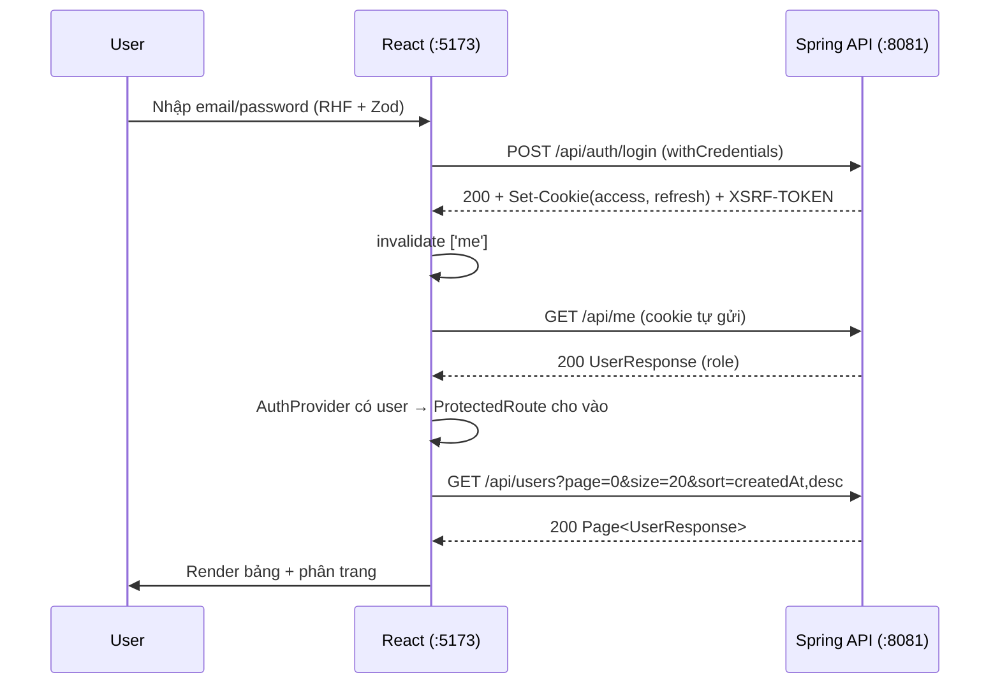

# Plan — Project 09 Frontend: React + Vite (cookie-based auth)

> **Loại tài liệu:** Kế hoạch / Setup guide chi tiết cho **phần Frontend** của Project 09.
> Mục đích: nhìn vào đây là dựng được một frontend React Vite **hoàn chỉnh, chuẩn production-lite**, tích hợp đúng với backend Spring Boot đã có.
> **Phạm vi:** Setup + kiến trúc + **một luồng mẫu đầu-cuối** (login → `/me` → danh sách users). Các trang còn lại để dạng roadmap.
> Backend đã hoàn chỉnh — tài liệu này chỉ nêu **điều chỉnh backend bắt buộc** phát sinh do chọn cơ chế httpOnly cookie.

---

## 1. Mục tiêu & Phạm vi

Dựng frontend cho hệ thống **User Management**, giao tiếp với REST API Spring Boot (`:8081`).

**Quyết định kiến trúc đã chốt:**

| Vấn đề | Lựa chọn | Lý do |
|---|---|---|
| Lưu token | **httpOnly cookie** (backend set) | An toàn nhất trước XSS — JS không đọc được token |
| Cấu trúc | Tách **`backend/`** + **`frontend/`** | Đúng plan gốc, mono-repo rõ ràng |
| UI | **Tailwind CSS v4** thuần | Học rõ, không thêm abstraction |
| Form | **React Hook Form + Zod** | Validation client khớp DTO backend |
| Server state | **TanStack Query v5** | Cache, refetch, mutation, invalidation |
| HTTP | **Axios** (`withCredentials`) | Interceptor cho CSRF + auto-refresh |
| Routing | **React Router v7** | Bản hiện tại (kế thừa v6 API) |
| React | **19** | Bản mới nhất |

**Ranh giới phạm vi (YAGNI):**
- ✅ Trong phạm vi: scaffold, kiến trúc, axios/interceptor, React Query, auth cookie-based, ProtectedRoute, luồng login→users.
- ❌ Ngoài phạm vi (làm sau theo roadmap mục 13): đặc tả chi tiết từng trang Register/Verify/OAuth/Profile, test frontend, CI/CD, dark mode.

---

## 2. Tech Stack & Lý do

```
React 19 + TypeScript
├── Vite (latest)       # build tool, dev server :5173
├── React Router v7     # routing SPA
├── TanStack Query v5   # server-state: cache / refetch / mutation
├── Axios               # HTTP client + interceptors
├── React Hook Form     # quản lý form
├── Zod                 # schema validation (client)
├── Tailwind CSS v4     # styling (@tailwindcss/vite plugin)
└── js-cookie           # CHỈ để đọc cookie XSRF-TOKEN (KHÔNG đụng token auth)
```

> **Vì sao `js-cookie` mà không đọc token?** Token auth là **httpOnly** → JS không thể đọc. `js-cookie` chỉ dùng để đọc cookie `XSRF-TOKEN` (không httpOnly) rồi gắn vào header CSRF.

---

## 3. Điều chỉnh Backend bắt buộc (do chọn httpOnly cookie)

> ⚠️ Đây là phần **chạm vào backend**. Làm phần này **trước**, kiểm tra bằng Swagger/curl, rồi mới dựng frontend.

Backend hiện: trả token trong JSON body (`AuthResponse`) + xác thực qua header `Authorization: Bearer` (`JwtAuthenticationFilter` dòng 52–58). Cần chuyển sang cookie.

### 3.1. `JwtAuthenticationFilter` — đọc token từ cookie (fallback header)

```java
// Ưu tiên đọc access token từ cookie "access_token";
// fallback về "Authorization: Bearer" để Swagger/Postman vẫn dùng được.
private String resolveToken(HttpServletRequest request) {
    if (request.getCookies() != null) {
        for (Cookie c : request.getCookies()) {
            if ("access_token".equals(c.getName())) {
                return c.getValue();
            }
        }
    }
    String header = request.getHeader("Authorization");
    if (header != null && header.startsWith("Bearer ")) {
        return header.substring(7);
    }
    return null;
}
```

### 3.2. Set cookie khi login / refresh / social-exchange

Tạo helper set cookie (dùng `ResponseCookie`), gọi trong `AuthController.login`, `refresh`, và `OAuth2ExchangeController.exchange`:

```java
// access_token: TTL 15 phút, gửi cho mọi /api/**
ResponseCookie access = ResponseCookie.from("access_token", tokens.accessToken())
    .httpOnly(true).secure(false)          // secure(true) ở production (HTTPS)
    .path("/").sameSite("Lax")
    .maxAge(Duration.ofSeconds(tokens.expiresIn()))
    .build();

// refresh_token: TTL 7 ngày, CHỈ gửi cho endpoint refresh (giảm bề mặt lộ)
ResponseCookie refresh = ResponseCookie.from("refresh_token", tokens.refreshToken())
    .httpOnly(true).secure(false)
    .path("/api/auth/refresh-token").sameSite("Lax")
    .maxAge(Duration.ofDays(7))
    .build();

response.addHeader(HttpHeaders.SET_COOKIE, access.toString());
response.addHeader(HttpHeaders.SET_COOKIE, refresh.toString());
```

> **Vẫn giữ token trong body** (không bắt buộc bỏ) để Swagger/tài liệu cũ còn dùng — nhưng frontend sẽ **bỏ qua body**, chỉ dựa vào cookie.

### 3.3. CSRF — bật lại theo pattern SPA

Vì cookie tự động gửi kèm mọi request → phải chống CSRF cho request thay đổi state. Dùng double-submit cookie của Spring:

```java
http.csrf(csrf -> csrf
    .csrfTokenRepository(CookieCsrfTokenRepository.withHttpOnlyFalse())
    .csrfTokenRequestHandler(new CsrfTokenRequestAttributeHandler())
    // /api/auth/** là public + chưa có session → miễn CSRF cho login/register/refresh
    .ignoringRequestMatchers("/api/auth/**")
);
```

- Spring set cookie `XSRF-TOKEN` (không httpOnly) → frontend đọc được.
- Frontend gửi lại header `X-XSRF-TOKEN` cho POST/PUT/PATCH/DELETE (trừ `/api/auth/**`).

### 3.4. Logout — clear cookie

Trong `AuthController.logout`, set 2 cookie cùng tên với `maxAge(0)` để xóa (đồng thời vẫn revoke token phía server như hiện tại).

### 3.5. CORS

Đã đúng: `allowCredentials=true`, origin cụ thể `http://localhost:5173`. Cần **bổ sung header cho phép**: thêm `X-XSRF-TOKEN` vào `allowedHeaders` trong `CorsConfig`.

```java
config.setAllowedHeaders(List.of("Authorization", "Content-Type", "X-XSRF-TOKEN"));
```

### 3.6. Checklist backend

- [ ] `JwtAuthenticationFilter.resolveToken` đọc cookie trước, fallback header
- [ ] Set-Cookie `access_token` + `refresh_token` ở login/refresh/exchange
- [ ] CSRF `CookieCsrfTokenRepository.withHttpOnlyFalse()` + ignore `/api/auth/**`
- [ ] Logout clear cookie (maxAge 0)
- [ ] `CorsConfig` thêm `X-XSRF-TOKEN` vào allowedHeaders
- [ ] Verify bằng curl: login → nhận `Set-Cookie` → gọi `/api/me` chỉ với cookie (không header)

---

## 4. Tách thư mục `backend/` + `frontend/`

Hiện backend nằm phẳng ở root project. Gom vào `backend/` bằng `git mv` (giữ lịch sử):

```bash
cd projects/09-fullstack-user-management
mkdir backend
git mv src pom.xml mvnw mvnw.cmd .mvn HELP.md note.txt docker-compose.yml .gitattributes backend/
# .gitignore của project: kiểm tra, có thể để lại root hoặc mv theo — tùy nội dung
```

Kết quả:

```
projects/09-fullstack-user-management/
├── backend/          # Spring Boot (đã có, chỉ đổi vị trí)
│   ├── src/  pom.xml  mvnw  .mvn/  docker-compose.yml  ...
├── frontend/         # React Vite (tạo ở mục 5)
└── README.md         # mới: mô tả fullstack + cách chạy cả 2 tầng
```

> **Lưu ý:** sau khi mv, chạy backend bằng `cd backend && ./mvnw spring-boot:run`. Cập nhật lại đường dẫn trong `docs/guides/09-*.md` nếu có tham chiếu `./mvnw` từ root project.

---

## 5. Scaffold Vite (từng lệnh)

```bash
cd projects/09-fullstack-user-management

# Tạo app React + TypeScript
npm create vite@latest frontend -- --template react-ts
cd frontend

# Dependencies runtime
npm install axios @tanstack/react-query react-router-dom react-hook-form zod @hookform/resolvers js-cookie

# Dev dependencies
npm install -D tailwindcss @tailwindcss/vite @types/js-cookie

# Chạy thử
npm run dev   # http://localhost:5173
```

---

## 6. Tailwind CSS v4 setup

Tailwind v4 dùng plugin Vite (không cần `tailwind.config.js` tối thiểu, không cần PostCSS thủ công).

**`vite.config.ts`:**
```ts
import { defineConfig } from 'vite'
import react from '@vitejs/plugin-react'
import tailwindcss from '@tailwindcss/vite'

export default defineConfig({
  plugins: [react(), tailwindcss()],
  server: { port: 5173 },
})
```

**`src/index.css`:**
```css
@import "tailwindcss";
```

Import `index.css` trong `main.tsx`. Kiểm tra bằng một class Tailwind bất kỳ (vd `className="text-2xl font-bold text-blue-600"`).

---

## 7. Cấu trúc thư mục frontend

```
frontend/src/
├── api/
│   ├── axios.ts          # instance: withCredentials + CSRF header + refresh interceptor
│   ├── auth.ts           # login, register, logout, refresh, forgotPassword...
│   └── users.ts          # list (search/filter/paginate), getById, create, update, delete
├── hooks/
│   ├── useAuth.ts        # useLogin, useLogout, useMe
│   ├── useUsers.ts       # useUsers(params) — danh sách + phân trang
│   └── useUser.ts        # useUser(id), useUpdateUser...
├── pages/
│   ├── LoginPage.tsx
│   ├── RegisterPage.tsx
│   ├── VerifyEmailPage.tsx
│   ├── OAuthCallbackPage.tsx
│   ├── UsersPage.tsx
│   ├── UserDetailPage.tsx
│   └── ProfilePage.tsx
├── components/
│   ├── ProtectedRoute.tsx  # chặn theo đăng nhập + role
│   ├── DataTable.tsx
│   ├── Pagination.tsx
│   └── SearchBar.tsx
├── context/
│   └── AuthProvider.tsx    # trạng thái đăng nhập dựa trên GET /api/me (KHÔNG giữ token)
├── lib/
│   ├── queryClient.ts      # cấu hình TanStack QueryClient
│   └── env.ts              # đọc VITE_API_URL
├── types/
│   └── api.ts              # ApiResponse<T>, UserResponse, Page<T>...
├── App.tsx                 # router
└── main.tsx                # providers (QueryClient, Auth, Router)
```

> **Nguyên tắc mô-đun:** `api/` chỉ biết HTTP + shape dữ liệu; `hooks/` bọc React Query quanh `api/`; `pages/` chỉ dùng `hooks/` (không gọi axios trực tiếp). Mỗi tầng test/hiểu độc lập.

---

## 8. Env & Config

**`frontend/.env`** (và `.env.example` để commit):
```
VITE_API_URL=http://localhost:8081
```

**`src/lib/env.ts`:**
```ts
export const API_URL = import.meta.env.VITE_API_URL ?? 'http://localhost:8081'
```

**`src/types/api.ts`** — khớp shape backend:
```ts
export interface ApiResponse<T> {
  status: number
  message: string
  data: T
  timestamp: string
}

export interface Page<T> {
  content: T[]
  totalElements: number
  totalPages: number
  number: number   // trang hiện tại (0-based)
  size: number
}

export interface UserResponse {
  id: number
  email: string
  fullName: string
  avatarUrl: string | null
  isEmailVerified: boolean
  isEnabled: boolean
  role: 'ADMIN' | 'USER'
  createdAt: string
}
```

---

## 9. Axios + Interceptor + CSRF + Auto-refresh (điểm cốt lõi)

Vì token là **httpOnly**, JS **không gắn Authorization header**. Chỉ cần `withCredentials: true` để trình duyệt tự gửi cookie.

**`src/api/axios.ts`:**
```ts
import axios from 'axios'
import Cookies from 'js-cookie'
import { API_URL } from '../lib/env'

export const api = axios.create({
  baseURL: API_URL,
  withCredentials: true,   // gửi cookie (access_token, refresh_token, XSRF-TOKEN)
})

// --- Request: gắn CSRF token cho method thay đổi state ---
api.interceptors.request.use((config) => {
  const method = config.method?.toUpperCase()
  if (method && ['POST', 'PUT', 'PATCH', 'DELETE'].includes(method)) {
    const csrf = Cookies.get('XSRF-TOKEN')
    if (csrf) config.headers['X-XSRF-TOKEN'] = csrf
  }
  return config
})

// --- Response: single-flight refresh khi 401 ---
let isRefreshing = false
let waiters: Array<() => void> = []

api.interceptors.response.use(
  (res) => res,
  async (error) => {
    const original = error.config
    const status = error.response?.status

    // Không refresh cho chính endpoint auth, hoặc request đã retry rồi
    const isAuthCall = original?.url?.includes('/api/auth/')
    if (status !== 401 || isAuthCall || original?._retry) {
      return Promise.reject(error)
    }

    original._retry = true

    if (isRefreshing) {
      // Xếp hàng: chờ refresh hiện tại xong rồi retry
      await new Promise<void>((resolve) => waiters.push(resolve))
      return api(original)
    }

    isRefreshing = true
    try {
      await api.post('/api/auth/refresh-token')  // cookie refresh tự gửi; backend set cookie mới
      waiters.forEach((w) => w())                // đánh thức hàng đợi
      waiters = []
      return api(original)                        // retry request gốc
    } catch (refreshErr) {
      waiters = []
      // Refresh cũng hỏng → đăng xuất phía client
      window.location.href = '/login'
      return Promise.reject(refreshErr)
    } finally {
      isRefreshing = false
    }
  }
)
```

**Điểm cần cẩn thận (đã xử lý ở trên):**
- Nhiều request 401 cùng lúc → **chỉ gọi refresh 1 lần**, các request khác xếp hàng (`isRefreshing` + `waiters`).
- Tránh vòng lặp vô hạn: `_retry` flag + bỏ qua `/api/auth/`.
- `/api/auth/refresh-token` không cần Authorization; cookie `refresh_token` (Path scoped) tự gửi.

---

## 10. TanStack Query setup

**`src/lib/queryClient.ts`:**
```ts
import { QueryClient } from '@tanstack/react-query'

export const queryClient = new QueryClient({
  defaultOptions: {
    queries: {
      retry: 1,               // để interceptor lo 401, không retry ồ ạt
      staleTime: 30_000,
      refetchOnWindowFocus: false,
    },
  },
})
```

**`src/main.tsx`** — bọc providers:
```tsx
import { StrictMode } from 'react'
import { createRoot } from 'react-dom/client'
import { QueryClientProvider } from '@tanstack/react-query'
import { BrowserRouter } from 'react-router-dom'
import { queryClient } from './lib/queryClient'
import { AuthProvider } from './context/AuthProvider'
import App from './App'
import './index.css'

createRoot(document.getElementById('root')!).render(
  <StrictMode>
    <QueryClientProvider client={queryClient}>
      <BrowserRouter>
        <AuthProvider>
          <App />
        </AuthProvider>
      </BrowserRouter>
    </QueryClientProvider>
  </StrictMode>
)
```

---

## 11. Auth cookie-based + ProtectedRoute

Vì không đọc được token, trạng thái đăng nhập xác định bằng **`GET /api/me`**: 200 → đã đăng nhập (kèm profile + role); 401 → chưa.

**`src/hooks/useAuth.ts`:**
```ts
import { useQuery, useMutation, useQueryClient } from '@tanstack/react-query'
import { api } from '../api/axios'
import type { ApiResponse, UserResponse } from '../types/api'

export function useMe() {
  return useQuery({
    queryKey: ['me'],
    queryFn: async () => {
      const res = await api.get<ApiResponse<UserResponse>>('/api/me')
      return res.data.data
    },
    retry: false,           // 401 nghĩa là chưa đăng nhập, đừng retry
    staleTime: 5 * 60_000,
  })
}

export function useLogin() {
  const qc = useQueryClient()
  return useMutation({
    mutationFn: (body: { email: string; password: string }) =>
      api.post('/api/auth/login', body),         // backend set cookie
    onSuccess: () => qc.invalidateQueries({ queryKey: ['me'] }),
  })
}

export function useLogout() {
  const qc = useQueryClient()
  return useMutation({
    mutationFn: () => api.post('/api/auth/logout'),
    onSuccess: () => qc.setQueryData(['me'], null),
  })
}
```

**`src/context/AuthProvider.tsx`** — expose `user`, `isLoading`, `isAuthenticated` từ `useMe()`.

**`src/components/ProtectedRoute.tsx`:**
```tsx
import { Navigate, Outlet } from 'react-router-dom'
import { useAuth } from '../context/AuthProvider'

export function ProtectedRoute({ role }: { role?: 'ADMIN' | 'USER' }) {
  const { user, isLoading } = useAuth()
  if (isLoading) return <div>Đang tải…</div>
  if (!user) return <Navigate to="/login" replace />
  if (role && user.role !== role) return <Navigate to="/" replace />
  return <Outlet />
}
```

---

## 12. Luồng mẫu đầu-cuối: Login → /me → Users (khuôn mẫu để nhân bản)



**`src/pages/LoginPage.tsx`** (RHF + Zod):
```tsx
import { useForm } from 'react-hook-form'
import { zodResolver } from '@hookform/resolvers/zod'
import { z } from 'zod'
import { useNavigate } from 'react-router-dom'
import { useLogin } from '../hooks/useAuth'

const schema = z.object({
  email: z.string().email('Email không hợp lệ'),
  password: z.string().min(1, 'Bắt buộc'),
})
type FormValues = z.infer<typeof schema>

export default function LoginPage() {
  const { register, handleSubmit, formState: { errors } } =
    useForm<FormValues>({ resolver: zodResolver(schema) })
  const login = useLogin()
  const navigate = useNavigate()

  const onSubmit = (values: FormValues) =>
    login.mutate(values, { onSuccess: () => navigate('/users') })

  return (
    <form onSubmit={handleSubmit(onSubmit)} className="max-w-sm mx-auto mt-20 space-y-4">
      <input {...register('email')} placeholder="Email"
        className="w-full border rounded px-3 py-2" />
      {errors.email && <p className="text-red-600 text-sm">{errors.email.message}</p>}
      <input {...register('password')} type="password" placeholder="Mật khẩu"
        className="w-full border rounded px-3 py-2" />
      {errors.password && <p className="text-red-600 text-sm">{errors.password.message}</p>}
      <button disabled={login.isPending}
        className="w-full bg-blue-600 text-white rounded py-2 disabled:opacity-50">
        {login.isPending ? 'Đang đăng nhập…' : 'Đăng nhập'}
      </button>
      {login.isError && <p className="text-red-600 text-sm">Sai email hoặc mật khẩu</p>}
    </form>
  )
}
```

**`src/hooks/useUsers.ts`:**
```ts
import { useQuery } from '@tanstack/react-query'
import { api } from '../api/axios'
import type { ApiResponse, Page, UserResponse } from '../types/api'

interface UsersParams {
  page?: number; size?: number; sort?: string
  keyword?: string; role?: string; enabled?: boolean
}

export function useUsers(params: UsersParams) {
  return useQuery({
    queryKey: ['users', params],
    queryFn: async () => {
      const res = await api.get<ApiResponse<Page<UserResponse>>>('/api/users', { params })
      return res.data.data
    },
    placeholderData: (prev) => prev,   // giữ dữ liệu cũ khi đổi trang (mượt)
  })
}
```

**`src/pages/UsersPage.tsx`** — dùng `useUsers`, render `DataTable` + `Pagination` + `SearchBar`. (Bảng ADMIN-only → bọc trong `<ProtectedRoute role="ADMIN">`.)

**Tài khoản test có sẵn (seeder):** `admin@usermanagement.dev` / `112233` (ADMIN).

---

## 13. Roadmap các trang còn lại

Sau khi luồng mẫu chạy, nhân bản pattern cho:

- [ ] **RegisterPage** — `POST /api/auth/register`, thông báo "kiểm tra email"
- [ ] **VerifyEmailPage** — đọc `?token=`, `GET /api/auth/verify-email`
- [ ] **OAuthCallbackPage** — đọc `?code=`, `POST /api/auth/oauth2/exchange?code=` → backend set cookie → redirect
- [ ] **ProfilePage** — `GET/PATCH /api/me` (mọi role)
- [ ] **UserDetailPage** — `GET /api/users/{id}` (owner-or-admin)
- [ ] **Users CRUD** — create (`POST`), update (`PUT`), soft-delete (`DELETE`) với mutation + invalidate `['users']`
- [ ] **Forgot/Reset password** — `POST /api/auth/forgot-password`, `/reset-password`
- [ ] Xử lý lỗi tập trung (toast từ `ApiResponse.message`)

---

## 14. Checklist chạy end-to-end

```bash
# 1. Hạ tầng
cd projects/09-fullstack-user-management/backend
docker compose up -d          # MySQL + Redis + Mailpit

# 2. Backend (sau khi làm mục 3)
./mvnw spring-boot:run        # :8081

# 3. Frontend
cd ../frontend
npm run dev                   # :5173
```

- [ ] Backend chạy, Swagger `http://localhost:8081/swagger-ui.html` OK
- [ ] Login qua frontend → DevTools > Application > Cookies thấy `access_token` (HttpOnly ✓), `refresh_token`, `XSRF-TOKEN`
- [ ] `GET /api/me` trả 200 (chỉ nhờ cookie, không header)
- [ ] Đợi access token hết hạn (hoặc xóa cookie access) → gọi API → interceptor tự refresh → request thành công, user không bị đá ra
- [ ] Logout → cookie bị xóa → `/api/me` trả 401 → redirect `/login`
- [ ] Danh sách users phân trang/search hoạt động (login bằng admin)

---

## 15. Troubleshooting

| Triệu chứng | Nguyên nhân thường gặp | Cách xử lý |
|---|---|---|
| CORS error trên browser | Origin/credentials sai | `CorsConfig`: origin đúng `http://localhost:5173`, `allowCredentials=true`; axios `withCredentials:true` |
| Cookie không được set | Thiếu `withCredentials` hoặc SameSite | Bật `withCredentials`; dev dùng `SameSite=Lax` (localhost cùng site khác port OK) |
| 403 khi POST/PUT/DELETE | Thiếu CSRF token | Kiểm tra cookie `XSRF-TOKEN` tồn tại + header `X-XSRF-TOKEN` được gắn |
| Refresh loop vô hạn | Interceptor retry chính `/api/auth/**` | Đã chặn bằng `isAuthCall` + `_retry` |
| `/api/me` luôn 401 sau login | Filter chưa đọc cookie | Kiểm tra `resolveToken` đọc cookie `access_token` |
| Cookie mất khi F5 | Đúng — httpOnly, JS không thấy | Trạng thái đăng nhập lấy từ `GET /api/me`, không từ JS |

---

## 16. Câu hỏi mở / quyết định sau

- **Production HTTPS:** đổi `secure(true)` + `SameSite=None` khi FE/BE khác domain.
- **Refresh token rotation:** backend đã rotate — đảm bảo cookie mới được set mỗi lần refresh.
- **Có bỏ token khỏi body không:** giữ lại cho Swagger; cân nhắc bỏ ở production để sạch.
