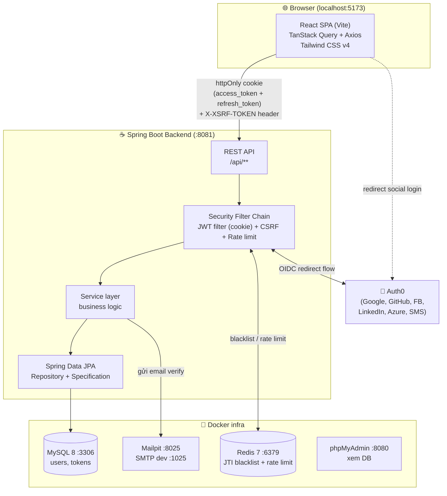
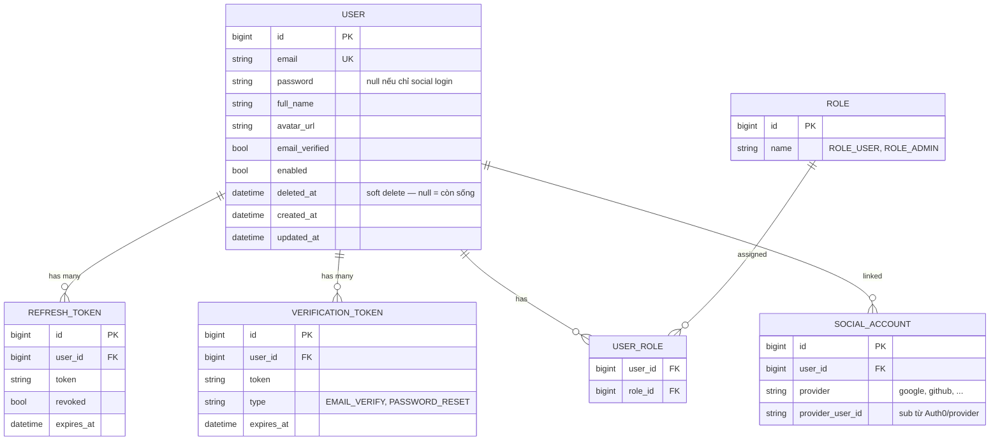
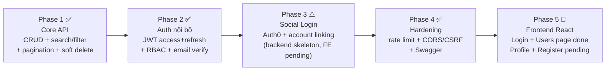
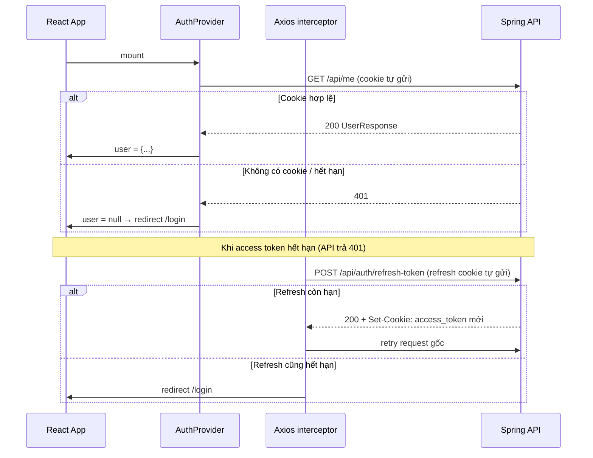

# Plan — Project 09: Fullstack User Management

> **Loại tài liệu:** Kế hoạch & Hiện trạng — phản ánh những gì **đã quyết định** và **đã implement**, cập nhật lần cuối 2026-07-15.
> Guide implement chi tiết từng bước: `docs/guides/09-fullstack-user-management.md`.

---

## 1. Mục tiêu & Tại sao

Project 09 là project **tổng hợp** — gom lại toàn bộ kiến thức từ project 01–08 và nâng lên mức gần production:

- **Ôn lại:** Spring Data JPA (03, 04), Spring Security + JWT (06), OAuth2/Auth0 social login (07, 08).
- **Nâng cao thêm:** search / filter / pagination, soft delete, rate limiting, CORS/CSRF, email verification.
- **Kỹ năng mới:** dựng **Frontend React** tích hợp **TanStack Query** để gọi API — trải nghiệm fullstack thật.

**Bài toán:** Hệ thống **quản lý User** có đăng ký/đăng nhập, phân quyền, đăng nhập mạng xã hội, xác thực email — một CRUD app hoàn chỉnh như sản phẩm thật.

**Kiến trúc auth đã chốt — Hướng B:**
> **Spring tự phát JWT** (access + refresh) là "đồng tiền" dùng trong toàn hệ thống.
> Auth0 chỉ đóng vai **nguồn cung cấp danh tính (Identity Provider)** cho social login — sau khi Auth0 xác thực xong, Spring nhận thông tin user, **link/tạo account nội bộ**, rồi **phát JWT của chính mình**.
> Nhờ vậy: email/password login và social login **hội tụ về cùng một loại token**, cùng một cơ chế phân quyền.

---

## 2. Tech Stack

### Backend (`projects/09-fullstack-user-management/backend/`)

| Concern | Lựa chọn | Ghi chú |
|---|---|---|
| Framework | Spring Boot 3.x (latest stable) | Web MVC (servlet, blocking) |
| Ngôn ngữ | Java 21 | |
| Security | `spring-boot-starter-security` | JWT filter + OAuth2 Client (Auth0) + CSRF |
| JWT | JJWT (`jjwt-api` + `impl` + `jackson`) | Tái dùng từ project 06 |
| Persistence | `spring-boot-starter-data-jpa` + Hibernate | Specification API cho filter động |
| Validation | `spring-boot-starter-validation` | Bean Validation trên DTO |
| Database | **MySQL 8** (Docker) | User store, refresh token, verification token |
| Cache / Store | **Redis 7** (Docker) | JTI blacklist + rate limit bucket |
| Rate limit | **Bucket4j** (`bucket4j-redis`) | Token bucket, distributed qua Redis |
| Email | `spring-boot-starter-mail` | Gửi link verify |
| Mail server (dev) | **Mailpit** (Docker, cổng 1025/8025) | Bắt email local, không gửi thật |
| Social IdP | **Auth0** | OIDC — Google, GitHub, Facebook, LinkedIn, Azure, SMS |
| API docs | `springdoc-openapi` (Swagger UI) | Tại `/swagger-ui.html` |

### Frontend (`projects/09-fullstack-user-management/frontend/`)

| Concern | Lựa chọn | Version |
|---|---|---|
| Build tool | **Vite** | 8.x — dev server cổng `5173` |
| Language | TypeScript | 6.x |
| Framework | **React** | 19.2.x |
| Server state | **TanStack Query** | v5 |
| HTTP client | **Axios** | 1.x — interceptor cho auto-refresh |
| Routing | **React Router** | v7 |
| Form + Validation | React Hook Form + **Zod** | RHF 7.x, Zod 4.x |
| Styling | **Tailwind CSS** | v4 |
| CSRF cookie | **js-cookie** | v3 — đọc XSRF-TOKEN, gắn vào header |

---

## 3. Kiến trúc tổng quan



**Ranh giới trách nhiệm:**
- **React** không giữ token trong bộ nhớ JS. Auth state = kết quả của `GET /api/me`. Token sống trong httpOnly cookie do backend set.
- **Spring** là source of truth: xác thực, phân quyền, phát JWT, quản lý user, set/clear cookie.
- **Auth0** chỉ xác minh danh tính social rồi trả về; Spring không phụ thuộc token của Auth0 để chạy API.
- **Redis** giữ state ngắn hạn (blacklist, rate limit); **MySQL** giữ state lâu dài (user, refresh token, verification token).

---

## 4. Data Model



**Quyết định thiết kế quan trọng:**
- `password` **nullable** — user chỉ đăng nhập bằng Google sẽ không có password.
- `SOCIAL_ACCOUNT` tách riêng khỏi `USER` → **một user link được NHIỀU provider** (Google + GitHub cùng 1 account).
- `deleted_at` cho **soft delete** — không xóa vật lý, chỉ đánh dấu.
- Role dùng bảng nối `USER_ROLE` (many-to-many) — sẵn sàng cho user có nhiều role.

---

## 5. Lộ trình theo Phase



| Phase | Trọng tâm | Trạng thái |
|---|---|---|
| **1 — Core API** | CRUD User + search + filter + pagination + soft delete | ✅ Hoàn thành |
| **2 — Auth nội bộ** | Register/Login → JWT cookie, refresh, logout, RBAC, verify email | ✅ Hoàn thành |
| **3 — Social login** | Auth0 OIDC + link/tạo account + phát JWT nội bộ | ⚠️ Backend skeleton có sẵn, FE chưa implement |
| **4 — Hardening** | Rate limit, CORS, CSRF, Swagger | ✅ Hoàn thành |
| **5 — Frontend** | React + TanStack Query, các trang UI, auto refresh 401 | 🔄 Login + Users page done; Profile, Register, Social callback pending |

---

## 6. Chi tiết từng Feature

### 6.1 · CRUD cơ bản (Phase 1) ✅

Chuẩn layered architecture:
`UserController` → `UserService` → `UserRepository (JpaRepository)` → MySQL.

- DTO Records: `CreateUserRequest`, `UpdateUserRequest`, `UserResponse`.
- Validation `@Valid` trên request DTO.
- `GlobalExceptionHandler` (`@RestControllerAdvice`) trả JSON lỗi nhất quán.
- Response bọc trong `ApiResponse<T>`.

### 6.2 · Search + Filter + Pagination (Phase 1) ✅

Dùng **JPA Specification** để ghép điều kiện động + **Pageable** để phân trang.

```java
// Repository bật Specification
public interface UserRepository
        extends JpaRepository<User, Long>, JpaSpecificationExecutor<User> { }

// Specification động — chỉ thêm điều kiện khi param có mặt
public final class UserSpecs {
    public static Specification<User> search(String keyword) {
        return (root, query, cb) -> keyword == null ? null :
            cb.or(
                cb.like(cb.lower(root.get("fullName")), "%" + keyword.toLowerCase() + "%"),
                cb.like(cb.lower(root.get("email")),    "%" + keyword.toLowerCase() + "%")
            );
    }
    public static Specification<User> hasRole(String role) { ... }
    public static Specification<User> enabled(Boolean enabled) { ... }
}
```

- **Search:** `?keyword=alice` → LIKE trên email + fullName.
- **Filter:** `?role=ROLE_ADMIN&enabled=true` → điều kiện chính xác.
- **Pagination + sort:** `?page=0&size=20&sort=createdAt,desc` — Spring tự parse vào `Pageable`.

### 6.3 · Soft Delete (Phase 1) ✅

Dùng `@SoftDelete` của Hibernate 6.4+ — Hibernate tự chuyển `DELETE` thành `UPDATE ... SET deleted_at = now()` và tự thêm `WHERE deleted_at IS NULL` vào mọi query.

### 6.4 · JWT Authentication — httpOnly Cookie (Phase 2) ✅

**Quyết định đã chốt: token lưu trong httpOnly cookie, không phải localStorage hay Authorization header.**

- Access token: httpOnly cookie tên `access_token`, TTL 15 phút, Path=`/`.
- Refresh token: httpOnly cookie tên `refresh_token`, TTL 7 ngày, Path=`/api/auth/refresh-token`.
- JS không đọc được token (httpOnly) — bảo vệ khỏi XSS.

```mermaid
sequenceDiagram
    participant C as React
    participant A as AuthController
    participant S as AuthService
    participant J as JwtService
    participant DB as MySQL

    C->>A: POST /api/auth/login {email, password}
    A->>S: authenticate(...)
    S->>S: AuthenticationManager.authenticate()
    S->>DB: revoke refresh token cũ của user
    S->>J: generate access (jti, 15m) + refresh (7d)
    S->>DB: lưu refresh token mới
    A-->>C: 200 + Set-Cookie: access_token=...; refresh_token=...
    Note over C: JS không thấy token<br/>auth state = GET /api/me
```

`JwtAuthenticationFilter` đọc token từ cookie `access_token` trước, fallback sang `Authorization: Bearer` header (Swagger UI).

**Revocation:**
- Access token: Redis JTI blacklist.
- Refresh token: cột `revoked` trong MySQL.

### 6.5 · RBAC (Phase 2) ✅

- `@EnableMethodSecurity` + `@PreAuthorize("hasRole('ADMIN')")` trên endpoint nhạy cảm.
- `DataSeeder` tự tạo user `admin@usermanagement.dev` / `112233` khi start lần đầu.

| Endpoint | Role |
|---|---|
| `GET /api/users` + CRUD | ADMIN |
| `GET /api/me`, `PATCH /api/me` | USER |

### 6.6 · Email verification (Phase 2) ✅

- Register → tạo `VerificationToken` (UUID, TTL 24h) → gửi mail qua Mailpit.
- `GET /api/auth/verify-email?token=UUID` → set `email_verified = true`.
- Chưa verify email → **chặn login**.
- Cùng cơ chế cho **password reset** (`type = PASSWORD_RESET`).

### 6.7 · Social Login qua Auth0 — Hướng B (Phase 3) ⚠️

Backend skeleton đã có đầy đủ:
- `OAuth2LoginSuccessHandler` — phát JWT nội bộ sau OIDC callback.
- `SocialLoginService` — account linking theo (provider, sub) + email verified.
- `OAuth2ExchangeController` + `OneTimeCodeStore` — one-time code exchange.
- `SocialAccount` entity + `SocialAccountRepository`.

**FE chưa implement:** chưa có trang OAuth callback, chưa có nút "Login with Google".

Cơ chế trả token về React: **one-time code** — Auth0 callback redirect về FE kèm `?code=xxx`, FE gọi `POST /api/auth/exchange` để lấy cookie.

### 6.8 · Rate Limiting (Phase 4) ✅

**Bucket4j** backed bởi Redis (distributed):
- Áp cho `/api/auth/login`, `/api/auth/register`, `/api/auth/forgot-password`.
- Key theo IP.
- Vượt ngưỡng → **429 Too Many Requests**.

### 6.9 · CORS & CSRF (Phase 4) ✅

**CORS** — cho phép origin `http://localhost:5173`:
- `allowCredentials: true` — bắt buộc để cookie được gửi cross-origin.
- Cho phép header `X-XSRF-TOKEN`.

**CSRF — BẬT** (vì token nằm trong cookie, không phải header):
- `CookieCsrfTokenRepository.withHttpOnlyFalse()` — Spring đặt cookie `XSRF-TOKEN` (JS đọc được).
- `CsrfCookieFilter` — force Spring Security 6 deferred token ghi cookie ngay (không đợi form submit).
- Frontend dùng `js-cookie` đọc `XSRF-TOKEN`, gắn vào header `X-XSRF-TOKEN` cho mọi mutating request (POST/PUT/PATCH/DELETE).
- `/api/auth/**` được exempt CSRF — tránh chicken-and-egg (login chưa có cookie).

> **Lý do CSRF phải BẬT:** Browser tự gửi httpOnly cookie kèm mọi request cross-site → CSRF attack khả thi. Nếu token nằm trong `Authorization` header thì browser không tự gửi → có thể disable CSRF.

### 6.10 · API Documentation — Swagger (Phase 4) ✅

`springdoc-openapi` → Swagger UI tại `/swagger-ui.html`.
- Bearer JWT scheme cho phép test API trực tiếp từ Swagger (gõ tay token).

---

## 7. Danh sách Endpoint

| Nhóm | Method | URL | Auth | Trạng thái |
|---|---|---|---|---|
| Auth | POST | `/api/auth/register` | Public | ✅ |
| Auth | GET | `/api/auth/verify-email` | Public | ✅ |
| Auth | POST | `/api/auth/login` | Public | ✅ |
| Auth | POST | `/api/auth/refresh-token` | Refresh cookie | ✅ |
| Auth | POST | `/api/auth/logout` | Access cookie | ✅ |
| Auth | POST | `/api/auth/forgot-password` | Public | ✅ |
| Auth | POST | `/api/auth/reset-password` | Public | ✅ |
| Social | GET | `/oauth2/authorization/auth0` | Public | ⚠️ Backend only |
| Social | POST | `/api/auth/exchange` | Public | ⚠️ Backend only |
| Me | GET | `/api/me` | USER | ✅ |
| Me | PATCH | `/api/me` | USER | ✅ |
| Users | GET | `/api/users` | ADMIN | ✅ |
| Users | GET | `/api/users/{id}` | ADMIN | ✅ |
| Users | POST | `/api/users` | ADMIN | ✅ |
| Users | PUT | `/api/users/{id}` | ADMIN | ✅ |
| Users | DELETE | `/api/users/{id}` | ADMIN | ✅ |
| Users | POST | `/api/users/{id}/restore` | ADMIN | ✅ |
| Users | PATCH | `/api/users/{id}/roles` | ADMIN | ✅ |

---

## 8. Frontend — React + TanStack Query

### Cấu trúc thư mục thực tế

```
frontend/src/
├── api/
│   ├── axios.ts          # axios instance + CSRF interceptor + auto-refresh interceptor
│   ├── auth.ts           # login, logout (gọi API, không giữ token)
│   └── users.ts          # GET /api/users (search + paginate)
├── components/
│   └── ProtectedRoute.tsx  # isLoading → spinner; !user → /login; role mismatch → /
├── context/
│   └── AuthProvider.tsx    # useMe() → user state; export useAuth()
├── hooks/
│   ├── useAuth.ts          # re-export từ AuthProvider context
│   └── useUsers.ts         # TanStack Query: useMe, useLogin, useLogout, useUsers
├── lib/
│   ├── env.ts              # VITE_API_URL từ .env
│   └── queryClient.ts      # QueryClient config (retry: false cho auth)
├── pages/
│   ├── LoginPage.tsx       # ✅ RHF + Zod, redirect nếu đã login
│   └── UsersPage.tsx       # ✅ bảng + search + pagination
├── types/
│   └── api.ts              # ApiResponse<T>, Page<T>, UserResponse
├── App.tsx                 # Routes: /login, /users (admin protected), catch-all
└── main.tsx                # QueryClientProvider > BrowserRouter > AuthProvider > App
```

**Trang chưa implement:** RegisterPage, VerifyEmailPage, OAuthCallbackPage, UserDetailPage, ProfilePage.

### Auth flow (cookie-based, không có token trong JS)



**Single-flight refresh:** khi nhiều request cùng nhận 401, chỉ gọi refresh **một lần** — các request còn lại xếp hàng chờ. Nếu refresh fail, tất cả bị reject (không bị treo promise).

**Bypass interceptor cho `/api/me`:** 401 từ `/api/me` = "chưa đăng nhập", không phải "token hết hạn" — AuthProvider tự xử lý, không trigger refresh.

---

## 9. Cấu trúc package Backend (thực tế)

```
backend/src/main/java/.../
├── Application.java
├── config/
│   ├── SecurityConfig.java          # filter chain, CORS, CSRF (CookieCsrfTokenRepository)
│   ├── CorsConfig.java              # allowedOrigins: localhost:5173
│   └── OpenApiConfig.java           # Swagger + JWT Bearer scheme
├── controller/
│   ├── AuthController.java          # register, login, refresh (cookie), logout, forgot/reset password
│   ├── MeController.java            # GET/PATCH /api/me
│   ├── OAuth2ExchangeController.java # one-time code → cookie (Phase 3)
│   └── UserController.java          # CRUD + search/filter/paginate
├── service/
│   ├── AuthService.java
│   ├── UserService.java
│   ├── JwtService.java
│   ├── EmailService.java
│   ├── TokenBlacklist.java          # Redis JTI blacklist
│   ├── SocialLoginService.java      # account linking (Phase 3)
│   ├── OneTimeCodeStore.java        # Redis store cho exchange code (Phase 3)
│   └── UserDetailsServiceImpl.java
├── security/
│   ├── JwtAuthenticationFilter.java # đọc token từ cookie, fallback header
│   ├── CsrfCookieFilter.java        # force Spring Security 6 write XSRF-TOKEN cookie
│   ├── RateLimitFilter.java         # Bucket4j + Redis
│   ├── CustomAuthenticationEntryPoint.java  # 401 JSON
│   ├── CustomAccessDeniedHandler.java       # 403 JSON
│   └── OAuth2LoginSuccessHandler.java       # phát JWT nội bộ sau Auth0 callback
├── repository/
│   ├── UserRepository.java          # + JpaSpecificationExecutor
│   ├── RefreshTokenRepository.java
│   ├── SocialAccountRepository.java
│   └── VerificationTokenRepository.java
├── entity/
│   ├── User.java  Role.java  SocialAccount.java
│   ├── RefreshToken.java  VerificationToken.java
│   └── RevokedReason.java (enum)
├── dto/
│   ├── request/  ...Request records
│   └── response/ AuthResponse.java, UserResponse.java, ApiResponse.java
├── spec/
│   └── UserSpecs.java
├── util/
│   ├── CookieUtils.java             # set/clear/read auth cookies
│   └── RequestUtils.java            # clientIp, userAgent
├── seeder/
│   └── DataSeeder.java              # tạo admin user khi start lần đầu
└── exception/
    ├── GlobalExceptionHandler.java
    ├── ResourceNotFoundException.java
    ├── DuplicateResourceException.java
    └── BadRequestException.java
```

---

## 10. Infra — Docker Compose (thực tế)

```yaml
services:
  mysql:      # :3306  — user store (DB: user_management)
  redis:      # :6379  — blacklist + rate limit
  mailhog:    # image: axllent/mailpit — :1025 SMTP, :8025 Web UI
  phpmyadmin: # :8080  — xem DB (optional)
```

| Service | Cổng | Dùng để |
|---|---|---|
| Spring API | 8081 | Backend |
| React (Vite dev) | 5173 | Frontend |
| MySQL | 3306 | Database |
| Redis | 6379 | Blacklist + rate limit |
| Mailpit SMTP | 1025 | Nhận email từ app |
| Mailpit UI | 8025 | Xem email đã gửi |
| phpMyAdmin | 8080 | Xem/quản lý DB |

---

## 11. Checklist thực thi

**Phase 1 — Core API**
- [x] Init Spring Boot backend + Docker Compose (MySQL)
- [x] Entity `User` + soft delete + `Role` + `USER_ROLE`
- [x] CRUD endpoints + DTO + validation + `GlobalExceptionHandler`
- [x] `JpaSpecificationExecutor` + `UserSpecs` (search + filter)
- [x] Pagination + sort qua `Pageable` / `Page<T>`
- [x] Soft delete + restore endpoint

**Phase 2 — Auth nội bộ**
- [x] `User implements UserDetails` + `UserDetailsService`
- [x] `JwtService` (access + refresh) + `JwtAuthenticationFilter`
- [x] Register / Login / Refresh / Logout + Redis blacklist
- [x] Token qua httpOnly cookie (`CookieUtils`)
- [x] RBAC: `@EnableMethodSecurity` + `@PreAuthorize`
- [x] Email verification (Mailpit) + forgot/reset password
- [x] `DataSeeder` tạo admin user khi start

**Phase 3 — Social login (Auth0)**
- [x] `OAuth2LoginSuccessHandler` phát JWT nội bộ (backend)
- [x] `SocialLoginService` — account linking (backend)
- [x] `OAuth2ExchangeController` + `OneTimeCodeStore` (backend)
- [ ] FE: nút "Login with Google / GitHub"
- [ ] FE: `OAuthCallbackPage` — nhận code, gọi exchange

**Phase 4 — Hardening**
- [x] Rate limit (Bucket4j + Redis) cho auth endpoints → 429
- [x] CORS cho `localhost:5173`
- [x] CSRF: `CookieCsrfTokenRepository` + `CsrfCookieFilter`
- [x] Swagger UI + JWT Bearer scheme

**Phase 5 — Frontend**
- [x] Vite + React 19 + TS + TanStack Query v5 + Axios + React Router v7
- [x] Tailwind CSS v4 + React Hook Form + Zod + js-cookie
- [x] Axios interceptor: CSRF header + auto-refresh (single-flight, reject-on-fail)
- [x] `AuthProvider` — useMe() làm nguồn auth state, không lưu token ở JS
- [x] `ProtectedRoute` theo role
- [x] `LoginPage` — RHF + Zod
- [x] `UsersPage` — bảng + search + pagination
- [ ] `RegisterPage`
- [ ] `VerifyEmailPage`
- [ ] `ProfilePage` (xem/sửa thông tin bản thân)
- [ ] `OAuthCallbackPage` (nhận code sau Auth0 redirect)

---

## 12. Quyết định đã chốt

| # | Quyết định | Đã chọn | Lý do |
|---|---|---|---|
| 1 | Trả JWT về FE sau social callback | One-time code exchange | An toàn, token không lộ trên URL |
| 2 | Lưu token ở FE | **httpOnly cookie** | Bảo vệ XSS — JS không đọc được |
| 3 | CSRF | **Bật** (`CookieCsrfTokenRepository`) | Cookie-based auth → phải chống CSRF |
| 4 | Soft delete | `@SoftDelete` (Hibernate 6.4+) | Gọn, tự động |
| 5 | Chưa verify email có được login? | **Không** — chặn login | Chặt hơn |
| 6 | Account linking | Chỉ link khi provider đã verify email | Tránh account takeover |
| 7 | Backend + Frontend | Cùng repo — `/backend` + `/frontend` | Mono-repo học tập |
| 8 | Mail server dev | Mailpit (thay MailHog) | Image nhẹ hơn, UI tốt hơn |

---

## 13. Ánh xạ kiến thức: 09 ôn lại gì từ 01–08

| Kiến thức | Từ project | Dùng lại ở đâu trong 09 |
|---|---|---|
| Layered architecture, DTO, exception handler | 03, 04 | CRUD core (Phase 1) |
| Spring Data JPA, MySQL | 04 | Toàn bộ persistence |
| JWT, refresh token, Redis blacklist | 06 | Auth nội bộ (Phase 2) |
| RBAC, `UserDetails` | 06 | Phân quyền (Phase 2) |
| OAuth2 Authorization Code Flow | 07 | Social login (Phase 3) |
| Auth0 IdP, OIDC, account linking | 07, 08 | Social login (Phase 3) |
| **Mới:** search/filter (Specification) | — | Phase 1 |
| **Mới:** pagination | — | Phase 1 |
| **Mới:** soft delete | — | Phase 1 |
| **Mới:** rate limiting | — | Phase 4 |
| **Mới:** email verification | — | Phase 2 |
| **Mới:** React + TanStack Query + cookie auth | — | Phase 5 |

---

> **Việc còn lại:** Hoàn thành Phase 5 FE (RegisterPage, VerifyEmailPage, ProfilePage) + kết nối FE với Phase 3 social login.
> **Roadmap tiếp theo:** Project 09 là MVP — một repo riêng sẽ mở rộng thêm Post / Comment / Like, tích hợp CI/CD, và deployment production.
