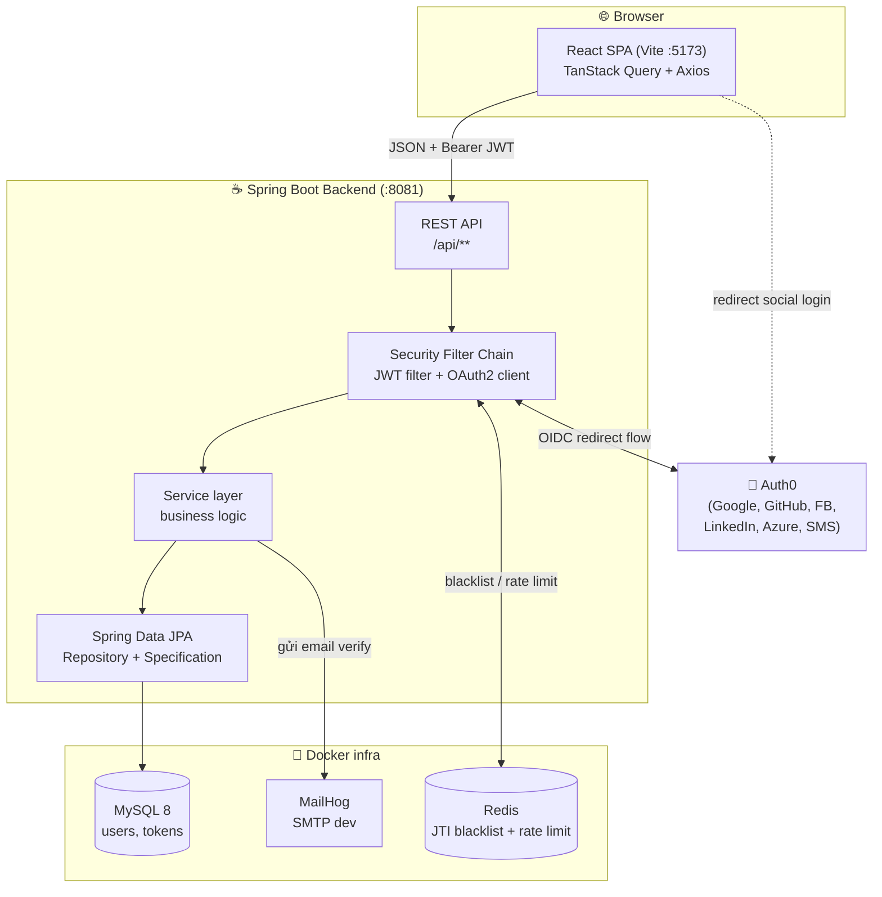
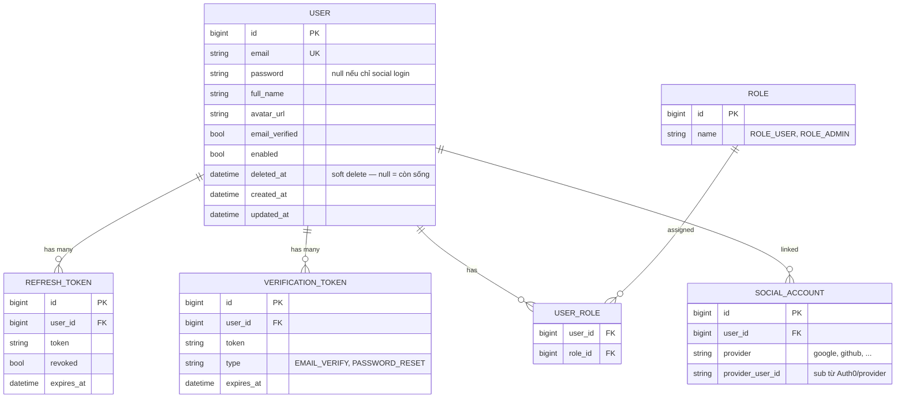
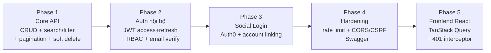
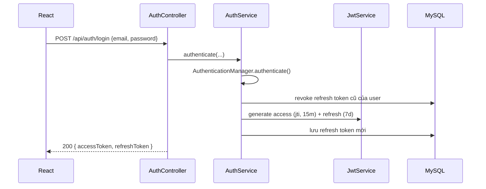
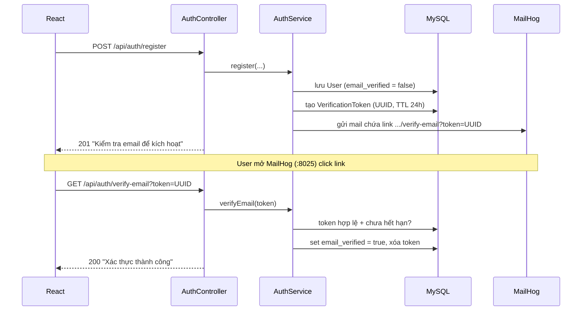
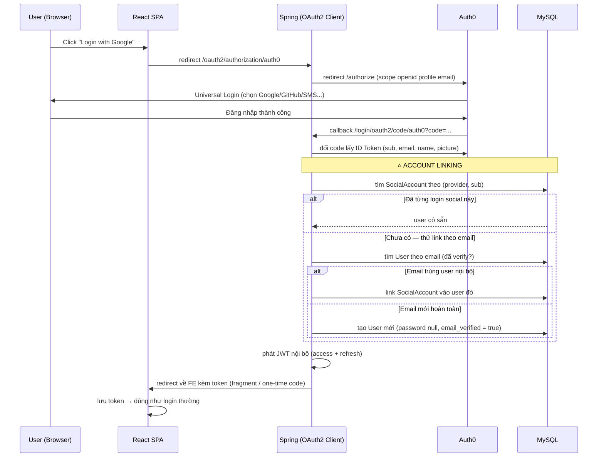
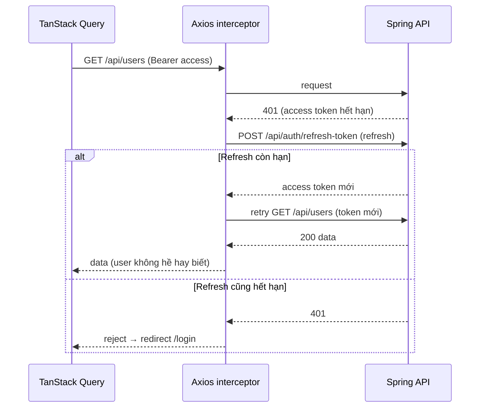

# Plan — Project 09: Fullstack User Management

> **Loại tài liệu:** Kế hoạch / Blueprint (KHÔNG phải guide implement từng dòng code).
> Mục đích: nhìn vào đây là hình dung được **cần làm gì**, **theo thứ tự nào**, và **làm sơ lược ra sao** — để không phải tưởng tượng lại từ đầu.
> Guide implement chi tiết từng bước sẽ viết riêng tại `docs/guides/09-fullstack-user-management.md` **sau khi** plan này được chốt.

---

## 1. Mục tiêu & Tại sao

Project 09 là project **tổng hợp** — gom lại toàn bộ kiến thức từ project 01–08 và nâng lên mức gần production:

- **Ôn lại:** Spring Data JPA (03, 04), Spring Security + JWT (06), OAuth2/Auth0 social login (07, 08).
- **Nâng cao thêm:** search / filter / pagination, soft delete, rate limiting, CORS/CSRF, email verification.
- **Kỹ năng mới:** dựng **Frontend React** (vibe coding) tích hợp **TanStack Query** để gọi API — trải nghiệm fullstack thật.

**Bài toán:** Hệ thống **quản lý User** có đăng ký/đăng nhập, phân quyền, đăng nhập mạng xã hội, xác thực email — một CRUD app hoàn chỉnh như sản phẩm thật.

**Kiến trúc auth đã chốt — Hướng B:**
> **Spring tự phát JWT** (access + refresh) là "đồng tiền" dùng trong toàn hệ thống.
> Auth0 chỉ đóng vai **nguồn cung cấp danh tính (Identity Provider)** cho social login — sau khi Auth0 xác thực xong, Spring nhận thông tin user, **link/tạo account nội bộ**, rồi **phát JWT của chính mình**.
> Nhờ vậy: email/password login và social login **hội tụ về cùng một loại token**, cùng một cơ chế phân quyền.

---

## 2. Tech Stack

### Backend (`projects/09-fullstack-user-management/backend/`)

| Concern | Lựa chọn | Ghi chú |
|---|---|---|
| Framework | Spring Boot (latest stable) | Web MVC (servlet, blocking) |
| Ngôn ngữ | Java 21 | |
| Security | `spring-boot-starter-security` | JWT filter + OAuth2 Client (Auth0) |
| JWT | JJWT (`jjwt-api` + `impl` + `jackson`) | Tái dùng từ project 06 |
| Persistence | `spring-boot-starter-data-jpa` + Hibernate | Specification API cho filter động |
| Validation | `spring-boot-starter-validation` | Bean Validation trên DTO |
| Database | **MySQL 8** (Docker) | User store, refresh token, verification token |
| Cache / Store | **Redis** (Docker) | JTI blacklist + rate limit bucket |
| Rate limit | **Bucket4j** (`bucket4j-redis`) | Token bucket, distributed qua Redis |
| Email | `spring-boot-starter-mail` | Gửi link verify |
| Mail server (dev) | **MailHog** (Docker) | Bắt email local, không gửi thật |
| Social IdP | **Auth0** | OIDC — Google, GitHub, Facebook, LinkedIn, Azure, SMS |
| API docs | `springdoc-openapi` (Swagger UI) | Optional nhưng nên có |

### Frontend (`projects/09-fullstack-user-management/frontend/`)

| Concern | Lựa chọn | Ghi chú |
|---|---|---|
| Build tool | **Vite** | Dev server nhanh, cổng `5173` |
| Framework | **React 18** + TypeScript | |
| Server state | **TanStack Query v5** | Cache, refetch, mutation |
| HTTP client | **Axios** | Interceptor cho JWT + auto refresh |
| Routing | **React Router v6** | |
| Form | React Hook Form + Zod | Validation phía client |
| UI | Tùy vibe (Tailwind / shadcn/ui / MUI) | Bạn tự do sáng tạo |

---

## 3. Kiến trúc tổng quan



**Ranh giới trách nhiệm:**
- **React** giữ token, gọi API, tự refresh khi 401 — không chứa business logic.
- **Spring** là source of truth: xác thực, phân quyền, phát JWT, quản lý user.
- **Auth0** chỉ xác minh danh tính social rồi trả về; Spring không phụ thuộc token của Auth0 để chạy API.
- **Redis** giữ state ngắn hạn (blacklist, rate limit); **MySQL** giữ state lâu dài (user, refresh token, verification token).

---

## 4. Data Model



**Quyết định thiết kế quan trọng:**
- `password` **nullable** — user chỉ đăng nhập bằng Google sẽ không có password.
- `SOCIAL_ACCOUNT` tách riêng khỏi `USER` → **một user link được NHIỀU provider** (Google + GitHub cùng 1 account). Đây là điểm khác project 07 (nơi cùng email khác provider = 2 account riêng).
- `deleted_at` cho **soft delete** — không xóa vật lý, chỉ đánh dấu.
- Role dùng bảng nối `USER_ROLE` (many-to-many) — sẵn sàng cho user có nhiều role.

---

## 5. Lộ trình theo Phase

> Nguyên tắc: **làm xong 1 phase, chạy được, commit, rồi mới sang phase sau.** Không ôm hết một lượt.



| Phase | Trọng tâm | Kết quả kỳ vọng |
|---|---|---|
| **1 — Core API** | CRUD User + search + filter + pagination + soft delete | Gọi được `/api/users` với query params, dữ liệu phân trang |
| **2 — Auth nội bộ** | Register/Login → JWT, refresh, logout, RBAC, verify email | Đăng ký → nhận mail verify → login → gọi API có token |
| **3 — Social login** | Auth0 OIDC + link/tạo account + phát JWT nội bộ | Login Google → nhận JWT của Spring, account được link đúng |
| **4 — Hardening** | Rate limit login/register, CORS cho FE, CSRF policy, Swagger | Brute-force bị chặn, FE gọi được cross-origin |
| **5 — Frontend** | React + TanStack Query, các trang UI, auto refresh 401 | App fullstack chạy end-to-end |

---

## 6. Chi tiết từng Feature (sơ lược cách làm)

### 6.1 · CRUD cơ bản (Phase 1)

Chuẩn layered architecture như project 04:
`UserController` → `UserService` → `UserRepository (JpaRepository)` → MySQL.

- DTO Records: `CreateUserRequest`, `UpdateUserRequest`, `UserResponse`.
- Validation `@Valid` trên request DTO.
- `GlobalExceptionHandler` (`@RestControllerAdvice`) trả JSON lỗi nhất quán.
- Response bọc trong `ApiResponse<T>` (tái dùng từ project 06).

### 6.2 · Search + Filter + Pagination (Phase 1)

Đây là phần "nâng cao" so với CRUD thường. Dùng **JPA Specification** để ghép điều kiện động + **Pageable** để phân trang.

```java
// Repository bật Specification
public interface UserRepository
        extends JpaRepository<User, Long>, JpaSpecificationExecutor<User> { }

// Specification động — chỉ thêm điều kiện khi param có mặt
public final class UserSpecs {
    public static Specification<User> search(String keyword) {
        return (root, query, cb) -> keyword == null ? null :
            cb.or(
                cb.like(cb.lower(root.get("fullName")), "%" + keyword.toLowerCase() + "%"),
                cb.like(cb.lower(root.get("email")),    "%" + keyword.toLowerCase() + "%")
            );
    }
    public static Specification<User> hasRole(String role) {
        return (root, query, cb) -> role == null ? null :
            cb.equal(root.join("roles").get("name"), role);
    }
    public static Specification<User> enabled(Boolean enabled) {
        return (root, query, cb) -> enabled == null ? null :
            cb.equal(root.get("enabled"), enabled);
    }
}
```

```java
// Controller nhận query params + Pageable
@GetMapping("/api/users")
public ApiResponse<Page<UserResponse>> list(
        @RequestParam(required = false) String keyword,
        @RequestParam(required = false) String role,
        @RequestParam(required = false) Boolean enabled,
        @PageableDefault(size = 20, sort = "createdAt", direction = DESC) Pageable pageable) {

    Specification<User> spec = Specification
        .where(UserSpecs.search(keyword))
        .and(UserSpecs.hasRole(role))
        .and(UserSpecs.enabled(enabled));

    Page<UserResponse> page = userService.search(spec, pageable).map(UserResponse::from);
    return ApiResponse.ok(page);
}
```

- **Search:** `?keyword=alice` → LIKE trên email + fullName.
- **Filter:** `?role=ROLE_ADMIN&enabled=true` → điều kiện chính xác.
- **Pagination + sort:** `?page=0&size=20&sort=createdAt,desc` — Spring tự parse vào `Pageable`.
- Response `Page<T>` tự có `content`, `totalElements`, `totalPages`, `number` — FE dùng dựng bảng.

### 6.3 · Soft Delete (Phase 1)

Không xóa vật lý — đánh dấu `deleted_at`. Hibernate 6.4+ có annotation **`@SoftDelete`** làm việc này tự động (khuyến nghị vì gọn):

```java
@Entity
@Table(name = "users")
@SoftDelete(columnName = "deleted_at", strategy = SoftDeleteType.TIMESTAMP)
public class User { ... }
```

Sau đó: `repository.delete(user)` → Hibernate chạy `UPDATE users SET deleted_at = now()` thay vì `DELETE`. Mọi truy vấn tự động thêm `WHERE deleted_at IS NULL`.

> **Phương án thủ công** (nếu muốn hiểu sâu cơ chế): `@SQLDelete("UPDATE users SET deleted_at = now() WHERE id = ?")` + `@SQLRestriction("deleted_at IS NULL")`. Cần thêm endpoint `restore` và query xem user đã xóa cho admin.

### 6.4 · JWT Authentication — access + refresh (Phase 2)

Tái dùng gần như nguyên vẹn kiến trúc project 06:

- `User implements UserDetails`, `getAuthorities()` trả role có prefix `ROLE_`.
- `JwtService` phát access token (15 phút, có `jti`) + refresh token (7 ngày).
- `JwtAuthenticationFilter extends OncePerRequestFilter` — validate token mỗi request.
- **2 tầng revoke:** Redis JTI blacklist (access) + cột `revoked` trên `refresh_token` (MySQL).
- `CustomAuthenticationEntryPoint` → 401 JSON; `CustomAccessDeniedHandler` → 403 JSON.



### 6.5 · RBAC — Role-Based Access Control (Phase 2)

- Bảng `ROLE` + `USER_ROLE` (many-to-many).
- Bật `@EnableMethodSecurity`, dùng `@PreAuthorize("hasRole('ADMIN')")` trên endpoint nhạy cảm.
- Endpoint quản trị (list all users, xóa user, đổi role) → chỉ `ROLE_ADMIN`.
- Endpoint self-service (xem/sửa profile mình) → `ROLE_USER`, kiểm tra ownership.

| Endpoint | Role | Ghi chú |
|---|---|---|
| `GET /api/users` | ADMIN | Danh sách + filter |
| `DELETE /api/users/{id}` | ADMIN | Soft delete |
| `PATCH /api/users/{id}/roles` | ADMIN | Gán/gỡ role |
| `GET /api/me` | USER | Profile của chính mình |
| `PATCH /api/me` | USER | Sửa profile mình |

### 6.6 · Email verification (Phase 2)



- Chưa verify email → chặn login (hoặc cho login nhưng giới hạn quyền — tùy chọn, nên chặn cho chặt).
- Token là UUID, TTL 24h, dùng một lần.
- Cùng cơ chế này tái dùng cho **password reset** (`type = PASSWORD_RESET`).

### 6.7 · Social Login qua Auth0 — Hướng B (Phase 3) ⭐ Phần khó nhất

**Ý tưởng cốt lõi:** Spring khởi tạo OAuth2 flow tới Auth0 (giống project 08), nhưng thay vì tạo session, **success handler tự phát JWT nội bộ** và trả về cho React.



**Các quyết định phải chốt ở Phase 3:**

1. **Cách trả JWT về React sau callback** — chọn 1:
   - `redirect FE_URL/#access=...&refresh=...` (đơn giản, hợp learning; token lộ trên URL fragment).
   - **One-time code**: redirect kèm `?code=xxx`, FE gọi `POST /api/auth/exchange` đổi lấy JWT (an toàn hơn — khuyến nghị).
   - httpOnly cookie (an toàn nhất nhưng kéo theo CSRF).
2. **Account linking theo email chỉ khi email đã verified** bởi provider — tránh account takeover (kẻ xấu tạo social account với email người khác).
3. **6 provider (Google, GitHub, Facebook, LinkedIn, Azure, SMS)** = bật trong **Auth0 Dashboard → Connections**, Spring **không cần code thêm** cho từng cái. Đây là điểm lợi lớn nhất của Auth0 so với project 07.

### 6.8 · Rate Limiting (Phase 4)

Chặn brute-force login/register. Dùng **Bucket4j** backed bởi Redis (distributed).

- Áp cho `/api/auth/login`, `/api/auth/register`, `/api/auth/verify-email`.
- Key theo IP (hoặc IP + email).
- Ví dụ: 5 request / phút / IP → vượt trả **429 Too Many Requests** kèm header `X-Rate-Limit-Retry-After-Seconds`.
- Triển khai qua một `OncePerRequestFilter` đặt trước JWT filter, hoặc `HandlerInterceptor`.

### 6.9 · CORS & CSRF (Phase 4)

**CORS** — bắt buộc vì React (`:5173`) khác origin với Spring (`:8081`):

```java
@Bean
CorsConfigurationSource corsConfigurationSource() {
    CorsConfiguration cfg = new CorsConfiguration();
    cfg.setAllowedOrigins(List.of("http://localhost:5173"));
    cfg.setAllowedMethods(List.of("GET", "POST", "PUT", "PATCH", "DELETE"));
    cfg.setAllowedHeaders(List.of("Authorization", "Content-Type"));
    cfg.setAllowCredentials(true);
    UrlBasedCorsConfigurationSource src = new UrlBasedCorsConfigurationSource();
    src.registerCorsConfiguration("/**", cfg);
    return src;
}
```

**CSRF** — phụ thuộc cách lưu token:
- **JWT trong header `Authorization`** (khuyến nghị cho SPA) → **disable CSRF** (stateless, không có cookie tự động gửi kèm).
- Nếu chọn **httpOnly cookie** cho token → **bật CSRF** với `CookieCsrfTokenRepository`.
> Ghi rõ trong doc: đây là lý do CSRF **on hay off** — không phải cứ tắt là đúng. Quyết định này đi kèm với quyết định 6.7.1.

### 6.10 · API Documentation — Swagger (Phase 4, optional)

`springdoc-openapi-starter-webmvc-ui` → Swagger UI tại `/swagger-ui.html`. Giúp test API và có tài liệu tự sinh — rất "production".

---

## 7. Danh sách Endpoint (dự kiến)

| Nhóm | Method | URL | Auth | Mô tả |
|---|---|---|---|---|
| Auth | POST | `/api/auth/register` | Public | Đăng ký, gửi mail verify |
| Auth | GET | `/api/auth/verify-email` | Public | Xác thực email qua token |
| Auth | POST | `/api/auth/login` | Public | Đăng nhập → JWT |
| Auth | POST | `/api/auth/refresh-token` | Refresh | Cấp access token mới |
| Auth | POST | `/api/auth/logout` | Access | Revoke token |
| Auth | POST | `/api/auth/forgot-password` | Public | Gửi mail reset |
| Auth | POST | `/api/auth/reset-password` | Public | Đặt lại mật khẩu qua token |
| Social | GET | `/oauth2/authorization/auth0` | Public | Bắt đầu social login |
| Social | POST | `/api/auth/exchange` | Public | Đổi one-time code lấy JWT |
| Me | GET | `/api/me` | USER | Profile bản thân |
| Me | PATCH | `/api/me` | USER | Sửa profile |
| Users | GET | `/api/users` | ADMIN | List + search/filter/paginate |
| Users | GET | `/api/users/{id}` | ADMIN | Chi tiết |
| Users | POST | `/api/users` | ADMIN | Tạo user |
| Users | PUT | `/api/users/{id}` | ADMIN | Cập nhật |
| Users | DELETE | `/api/users/{id}` | ADMIN | Soft delete |
| Users | POST | `/api/users/{id}/restore` | ADMIN | Khôi phục |
| Users | PATCH | `/api/users/{id}/roles` | ADMIN | Gán/gỡ role |

---

## 8. Frontend — React + TanStack Query (Phase 5)

### Cấu trúc thư mục dự kiến

```
frontend/
├── src/
│   ├── api/
│   │   ├── axios.ts          # instance + interceptor (JWT + auto refresh)
│   │   ├── auth.ts           # login, register, refresh, logout
│   │   └── users.ts          # CRUD + search/filter/paginate
│   ├── hooks/                # useUsers, useAuth, useUser (TanStack Query)
│   ├── pages/
│   │   ├── LoginPage.tsx
│   │   ├── RegisterPage.tsx
│   │   ├── VerifyEmailPage.tsx
│   │   ├── OAuthCallbackPage.tsx   # nhận token sau Auth0 redirect
│   │   ├── UsersPage.tsx           # bảng có search/filter/pagination
│   │   ├── UserDetailPage.tsx
│   │   └── ProfilePage.tsx
│   ├── components/           # Table, Pagination, SearchBar, ProtectedRoute
│   ├── context/AuthContext.tsx
│   └── main.tsx
```

### Auto-refresh khi 401 (phần hay nhất & dễ sai nhất)



**Điểm cần cẩn thận:** khi nhiều request cùng nhận 401 một lúc, chỉ được gọi refresh **một lần** — các request còn lại phải **xếp hàng chờ** token mới (queue + single-flight refresh), tránh gọi refresh nhiều lần song song làm revoke lẫn nhau.

TanStack Query lo phần **cache + refetch + optimistic update**; Axios interceptor lo phần **token lifecycle**. Hai lớp tách bạch.

---

## 9. Cấu trúc package Backend (dự kiến)

```
backend/src/main/java/.../usermanagement/
├── UserManagementApplication.java
├── config/
│   ├── SecurityConfig.java          # filter chain, CORS, CSRF policy
│   ├── OAuth2Config.java            # Auth0 client + success handler
│   ├── RateLimitConfig.java         # Bucket4j + Redis
│   └── RedisConfig.java
├── controller/
│   ├── AuthController.java
│   ├── OAuth2ExchangeController.java
│   ├── MeController.java
│   └── UserController.java
├── service/
│   ├── AuthService.java
│   ├── UserService.java
│   ├── JwtService.java
│   ├── EmailService.java
│   ├── TokenBlacklist.java          # Redis
│   └── SocialLoginService.java      # account linking
├── security/
│   ├── JwtAuthenticationFilter.java
│   ├── RateLimitFilter.java
│   ├── CustomAuthenticationEntryPoint.java
│   ├── CustomAccessDeniedHandler.java
│   └── OAuth2LoginSuccessHandler.java   # ⭐ phát JWT nội bộ
├── repository/
│   ├── UserRepository.java          # + JpaSpecificationExecutor
│   ├── RoleRepository.java
│   ├── RefreshTokenRepository.java
│   ├── SocialAccountRepository.java
│   └── VerificationTokenRepository.java
├── entity/
│   ├── User.java  Role.java  SocialAccount.java
│   ├── RefreshToken.java  VerificationToken.java
├── dto/
│   ├── request/  ...Request records
│   └── response/ ...Response records + ApiResponse<T>
├── spec/
│   └── UserSpecs.java
└── exception/
    ├── GlobalExceptionHandler.java
    └── ...custom exceptions
```

---

## 10. Infra — Docker Compose (dự kiến)

```yaml
services:
  mysql:      # :3306  — user store
  redis:      # :6379  — blacklist + rate limit
  mailhog:    # :1025 SMTP, :8025 Web UI — bắt email dev
  phpmyadmin: # :8080  — xem DB (optional)
```

| Service | Cổng | Dùng để |
|---|---|---|
| Spring API | 8081 | Backend |
| React (Vite) | 5173 | Frontend |
| MySQL | 3306 | Database |
| Redis | 6379 | Blacklist + rate limit |
| MailHog SMTP | 1025 | Nhận email từ app |
| MailHog UI | 8025 | Xem email đã gửi |

---

## 11. Checklist thực thi

**Phase 1 — Core API**
- [ ] Init Spring Boot backend + Docker Compose (MySQL)
- [ ] Entity `User` + soft delete + `Role` + `USER_ROLE`
- [ ] CRUD endpoints + DTO + validation + `GlobalExceptionHandler`
- [ ] `JpaSpecificationExecutor` + `UserSpecs` (search + filter)
- [ ] Pagination + sort qua `Pageable` / `Page<T>`
- [ ] Soft delete + restore endpoint

**Phase 2 — Auth nội bộ**
- [ ] `User implements UserDetails` + `UserDetailsService`
- [ ] `JwtService` (access + refresh) + `JwtAuthenticationFilter`
- [ ] Register / Login / Refresh / Logout + Redis blacklist
- [ ] RBAC: `@EnableMethodSecurity` + `@PreAuthorize`
- [ ] Email verification (MailHog) + forgot/reset password

**Phase 3 — Social login (Auth0)**
- [ ] Auth0 tenant + application + bật connections (Google, GitHub, ...)
- [ ] OAuth2 Client config tới Auth0
- [ ] `OAuth2LoginSuccessHandler` phát JWT nội bộ
- [ ] `SocialLoginService` — account linking theo (provider, sub) + email verified
- [ ] Cơ chế trả token về FE (one-time code exchange)

**Phase 4 — Hardening**
- [ ] Rate limit (Bucket4j + Redis) cho auth endpoints → 429
- [ ] CORS cho `localhost:5173`
- [ ] Chốt CSRF policy theo cách lưu token
- [ ] Swagger UI (optional)

**Phase 5 — Frontend**
- [ ] Vite + React + TS + TanStack Query + Axios + Router
- [ ] Axios interceptor: JWT + auto refresh (single-flight)
- [ ] Auth pages (login, register, verify, OAuth callback)
- [ ] Users page: bảng + search + filter + pagination
- [ ] Profile page + ProtectedRoute theo role

---

## 12. Những điều cần chốt trước khi code

| # | Quyết định | Lựa chọn đề xuất |
|---|---|---|
| 1 | Trả JWT về FE sau social callback | **One-time code exchange** (an toàn, vẫn đơn giản) |
| 2 | Lưu token ở FE | localStorage (learning) hoặc httpOnly cookie (an toàn) |
| 3 | CSRF | Off nếu token ở header; On nếu token ở cookie |
| 4 | Soft delete | `@SoftDelete` (Hibernate 6.4+) — gọn |
| 5 | Chưa verify email có được login? | **Không** — chặn cho chặt |
| 6 | Account linking | Chỉ link theo email khi provider đã verify email |
| 7 | Backend + Frontend chung repo? | Có — `projects/09-.../backend` + `/frontend` |

---

## 13. Ánh xạ kiến thức: 09 ôn lại gì từ 01–08

| Kiến thức | Từ project | Dùng lại ở đâu trong 09 |
|---|---|---|
| Layered architecture, DTO, exception handler | 03, 04 | CRUD core (Phase 1) |
| Spring Data JPA, MySQL | 04 | Toàn bộ persistence |
| JWT, refresh token, Redis blacklist | 06 | Auth nội bộ (Phase 2) |
| RBAC, `UserDetails` | 06 | Phân quyền (Phase 2) |
| OAuth2 Authorization Code Flow | 07 | Social login (Phase 3) |
| Auth0 IdP, OIDC, account linking | 07, 08 | Social login (Phase 3) |
| **Mới:** search/filter (Specification) | — | Phase 1 |
| **Mới:** pagination | — | Phase 1 |
| **Mới:** soft delete | — | Phase 1 |
| **Mới:** rate limiting | — | Phase 4 |
| **Mới:** email verification | — | Phase 2 |
| **Mới:** React + TanStack Query | — | Phase 5 |

---

> **Bước tiếp theo sau khi chốt plan:** tạo skeleton `projects/09-fullstack-user-management/`, rồi viết guide implement chi tiết `docs/guides/09-fullstack-user-management.md` theo từng phase.

> **Roadmap tiếp theo:** Project 09 là MVP — một repo riêng sẽ mở rộng thêm Post / Comment / Like, tích hợp CI/CD, GitHub Projects và deployment production.
